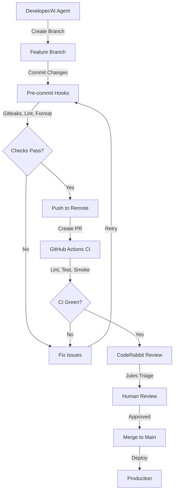

# Contributing to Summit (IntelGraph)

> **For AI Assistants:** See [CLAUDE.md](CLAUDE.md) for comprehensive codebase context, conventions, and development workflows.

## Prerequisites

- Node 20 LTS, pnpm 9 (corepack enabled)
- Docker Desktop with Compose for local services
- Git with conventional commit hooks configured
- 8GB+ RAM for full development stack

## Setup

```bash
# Enable corepack and install pnpm
corepack enable && corepack prepare pnpm@9.12.3 --activate

# Bootstrap the development environment
make bootstrap

# Verify the golden path
make up && make smoke
```

## Common Development Tasks

- **Typecheck:** `make typecheck` or `pnpm typecheck`
- **Lint:** `make lint` or `pnpm lint`
- **Test:** `make test` or `pnpm test`
- **E2E (smoke):** `make smoke` or `pnpm smoke`
- **Build all:** `make build` or `pnpm build`
- **GraphQL Codegen:** `make codegen` or `pnpm graphql:codegen`
- **Services:** `make up` / `make down`
- **AI Services:** `make up-ai` / `make down`

> **Note:** Check out the [Examples Directory](examples/) for plugins and custom pipelines.

## Branch & Pull Request Workflow

### Branch Naming

- Feature: `feature/<description>`
- Fix: `fix/<description>`
- Docs: `docs/<description>`
- AI Agent: `claude/<session-id>`, `jules/<session-id>`, `codex/<session-id>`

### Commit Messages

Follow [Conventional Commits](https://www.conventionalcommits.org/):

```
<type>(<scope>): <description>

[optional body]

[optional footer]
```

**Types:** `feat`, `fix`, `docs`, `style`, `refactor`, `perf`, `test`, `chore`, `ci`, `build`, `revert`

**Examples:**
```
feat(api): add entity search endpoint
fix(graph): resolve neo4j connection timeout
docs(readme): update quickstart instructions
chore(deps): update pnpm-lock.yaml
```

### Pull Request Requirements

- Keep changes scoped and focused
- Run `scripts/pr_guard.sh` before creating PR
- Ensure CI is green (all checks must pass)
- Include tests for new features
- Update documentation as needed
- Request review from core maintainers
- Merge queue enforces required checks

## Troubleshooting

- **Build issues:** Run `scripts/green_build.sh` to self-heal and build
- **Workspace audit:** Run `node scripts/audit_workspaces.mjs --strict`
- **Golden path fails:** Run `make down && make up && make smoke`
- **Docker issues:** `docker system prune -af` then `make up`

## AI Agent Collaboration

Summit embraces AI-augmented development through multi-agent collaboration. This section provides guidelines for AI agents (Claude, Jules, Codex, GitHub Copilot) and their human partners.

### AI Agent Types

1. **Claude (Anthropic)** - Code generation, refactoring, documentation, architectural guidance
2. **Jules (GitHub)** - Pull request reviews, issue triage, automated workflows
3. **GitHub Copilot** - In-editor code completions and suggestions
4. **GitHub Actions** - Automated CI/CD, testing, deployment pipelines
5. **CodeRabbit** - Automated PR reviews and code quality analysis

### AI Agent Workflow



### Guidelines for AI Agents

#### DO ✅

- **Always run golden path:** `make bootstrap && make up && make smoke` before claiming success
- **Follow existing patterns:** Read CLAUDE.md for codebase conventions
- **Write tests:** Include unit and integration tests for new features
- **Document changes:** Update relevant docs (README, ONBOARDING, API docs)
- **Use TypeScript types:** Avoid `any`, prefer interfaces and types
- **Handle errors gracefully:** Use try/catch, return error objects
- **Reference file paths:** Use `file_path:line_number` pattern in responses
- **Maintain security:** Check for OWASP vulnerabilities, no hardcoded secrets
- **Verify incrementally:** Test each change before moving to the next
- **Use conventional commits:** Follow commit message standards

#### DON'T ❌

- **Skip the smoke test:** Never claim completion without running `make smoke`
- **Commit secrets:** Never commit credentials, API keys, or sensitive data
- **Break golden path:** Ensure Investigation → Entities → Relationships → Copilot → Results workflow
- **Use production defaults:** Never use default passwords or localhost in production config
- **Bypass security:** Don't disable security checks or skip validation
- **Ignore test failures:** Fix all failing tests before committing
- **Use magic numbers:** Use named constants instead of hardcoded values
- **Skip documentation:** Always update docs to reflect code changes
- **Batch too much:** Keep PRs focused and reviewable (< 500 lines preferred)
- **Commit debug code:** Remove console.log, debugger statements, and .only() tests

### AI-Generated Code Review Checklist

Before submitting AI-generated code:

- [ ] Code follows TypeScript/ESLint conventions
- [ ] All imports are properly ordered and grouped
- [ ] No unused imports or variables
- [ ] Functions have clear, descriptive names
- [ ] Complex logic includes comments explaining "why"
- [ ] Error handling is comprehensive
- [ ] Tests cover new functionality (aim for 80%+ coverage)
- [ ] No security vulnerabilities introduced
- [ ] GraphQL schema changes are backward-compatible
- [ ] Database migrations are reversible
- [ ] Environment variables are documented in .env.example
- [ ] Performance implications considered (no N+1 queries, etc.)
- [ ] Accessibility requirements met (WCAG 2.1 AA)
- [ ] Documentation updated (README, API docs, inline comments)
- [ ] `make smoke` passes locally

### Multi-Agent Coordination

When multiple AI agents work on the same codebase:

1. **Branch isolation:** Each agent works on a dedicated branch (`claude/<session-id>`, etc.)
2. **Merge strategy:** Rebase on main frequently to avoid conflicts
3. **Communication:** Document decisions in PR descriptions and commit messages
4. **Handoff protocol:** Leave clear TODO comments for next agent or human
5. **State preservation:** Use git commits to checkpoint progress frequently
6. **Context sharing:** Reference related PRs, issues, and documentation

### AI Agent Best Practices

#### For Code Generation

```typescript
// ✅ Good: Typed, explicit, testable
interface EntityInput {
  type: string;
  name: string;
  properties: Record<string, unknown>;
}

async function createEntity(input: EntityInput): Promise<Entity> {
  try {
    const validated = await validateEntity(input);
    const entity = await entityRepo.create(validated);
    await auditLog.record('entity:create', entity.id);
    return entity;
  } catch (error) {
    logger.error('Failed to create entity', { input, error });
    throw new EntityCreationError('Entity creation failed', { cause: error });
  }
}

// ❌ Bad: Untyped, implicit, hard to test
async function createEntity(input: any) {
  const entity = await entityRepo.create(input);
  return entity;
}
```

#### For Documentation

- Use clear, concise language
- Include code examples with expected output
- Link to related documentation
- Keep examples up-to-date with current codebase
- Use proper markdown formatting
- Include troubleshooting sections

#### For Testing

```typescript
// ✅ Good: Descriptive, isolated, comprehensive
describe('EntityService', () => {
  describe('createEntity', () => {
    it('should create entity with valid data', async () => {
      const input = entityFactory({ type: 'Person', name: 'Test' });
      const result = await entityService.create(input);

      expect(result).toHaveProperty('id');
      expect(result.type).toBe('Person');
      expect(result.name).toBe('Test');
    });

    it('should throw error when entity type is invalid', async () => {
      const input = entityFactory({ type: 'InvalidType' });

      await expect(entityService.create(input))
        .rejects.toThrow(ValidationError);
    });

    it('should audit entity creation', async () => {
      const input = entityFactory();
      await entityService.create(input);

      expect(auditLog.record).toHaveBeenCalledWith(
        'entity:create',
        expect.any(String)
      );
    });
  });
});
```

### Multi-Agent Workflow Documentation

For detailed multi-agent collaboration patterns, see:

- **[AI Agent Workflow Guide](docs/AI_AGENT_WORKFLOW.md)** - Complete multi-agent workflow documentation
- **[Multi-Agent LLM Innovation Roadmap](docs/ai/multi-agent-llm-innovation-roadmap.md)** - Strategic multi-agent architecture
- **[Multi-Agent Frameworks 2025](docs/multi-agent-frameworks-2025.md)** - Framework comparison and recommendations

### Getting Help

- **AI Assistants:** Read [CLAUDE.md](CLAUDE.md) for complete codebase context
- **Humans:** Check existing code, tests, and documentation for patterns
- **Community:** Ask in #summit-dev or #ai-agents Slack channels
- **Documentation:** See [docs/README.md](docs/README.md) for complete doc index

## Testing Guidelines

### Overview

We maintain a comprehensive test suite with high coverage requirements to ensure code quality and reliability. All code changes should include appropriate tests.

### Test Types

#### 1. Unit Tests

Unit tests focus on testing individual functions, classes, and modules in isolation.

**Location:** `__tests__` directories next to source files
**Pattern:** `*.test.ts`, `*.test.tsx`

**Example:**
```typescript
// server/src/middleware/__tests__/auth.test.ts
import { ensureAuthenticated } from '../auth';
import { requestFactory, responseFactory, nextFactory } from '../../../tests/factories';

describe('ensureAuthenticated', () => {
  it('should authenticate a valid token', async () => {
    const req = requestFactory({ headers: { authorization: 'Bearer token' } });
    const res = responseFactory();
    const next = nextFactory();

    await ensureAuthenticated(req, res, next);

    expect(next).toHaveBeenCalled();
  });
});
```

**Best Practices:**
- Test one thing per test case
- Use descriptive test names: "should X when Y"
- Mock external dependencies
- Use test factories for consistent data
- Aim for 85%+ coverage for critical paths

#### 2. Integration Tests

Integration tests verify that multiple components work together correctly.

**Location:** `tests/integration/`
**Pattern:** `*.integration.test.ts`

**Example:**
```typescript
// tests/integration/auth.integration.test.ts
describe('Authentication Flow', () => {
  it('should complete full login workflow', async () => {
    const user = await login(email, password);
    expect(user).toBeDefined();
    expect(user.token).toBeDefined();
  });
});
```

**Best Practices:**
- Test realistic workflows
- Use actual database connections (test DB)
- Clean up test data after each test
- Test error scenarios
- Verify side effects

#### 3. E2E Tests

End-to-end tests validate complete user flows in a browser environment.

**Location:** `tests/e2e/`
**Pattern:** `*.spec.ts`
**Tool:** Playwright

**Example:**
```typescript
// tests/e2e/login-logout.spec.ts
import { test, expect } from '@playwright/test';

test('should login successfully', async ({ page }) => {
  await page.goto('/login');
  await page.fill('input[name="email"]', 'test@example.com');
  await page.fill('input[name="password"]', 'password');
  await page.click('button[type="submit"]');
  await expect(page).toHaveURL('/dashboard');
});
```

**Best Practices:**
- Test critical user journeys
- Test across different browsers
- Use data-testid attributes
- Handle async operations properly
- Take screenshots on failure

### Test Factories

Use test factories to generate consistent test data:

```typescript
import {
  userFactory,
  entityFactory,
  investigationFactory,
  graphFactory,
} from '@tests/factories';

// Create a test user
const user = userFactory({ role: 'admin' });

// Create a test entity
const entity = entityFactory({ type: 'person' });

// Create a test graph
const graph = graphFactory({ nodeCount: 10, relationshipDensity: 0.3 });
```

**Available Factories:**
- `userFactory` - Create test users
- `entityFactory` - Create graph entities
- `relationshipFactory` - Create graph relationships
- `investigationFactory` - Create investigations
- `graphFactory` - Create complete graphs
- `requestFactory` - Create HTTP requests
- `responseFactory` - Create HTTP responses
- `contextFactory` - Create GraphQL contexts

### Running Tests

```bash
# Run all tests
pnpm run test

# Run unit tests only
pnpm run test:unit

# Run integration tests
pnpm run test:integration

# Run E2E tests
pnpm run test:e2e

# Run with coverage
pnpm run test:coverage

# Run tests in watch mode
pnpm run test:watch

# Run tests for specific file
pnpm run test -- path/to/test.test.ts
```

### Coverage Requirements

**Minimum Coverage Thresholds:**
- Global: 80%
- Critical paths (middleware, resolvers): 85%

**View Coverage Reports:**
```bash
pnpm run test:coverage
open coverage/lcov-report/index.html
```

**Coverage is tracked for:**
- Lines
- Statements
- Functions
- Branches

### Writing Good Tests

#### DO:
- ✅ Write tests before or alongside code (TDD/BDD)
- ✅ Test edge cases and error scenarios
- ✅ Use descriptive test names
- ✅ Keep tests isolated and independent
- ✅ Mock external dependencies
- ✅ Clean up after tests
- ✅ Use test factories for consistency
- ✅ Test async code properly (async/await)

#### DON'T:
- ❌ Test implementation details
- ❌ Write flaky tests
- ❌ Share state between tests
- ❌ Test third-party library code
- ❌ Skip cleanup
- ❌ Use hardcoded IDs or timestamps
- ❌ Test everything in one large test

### Test Organization

```
project/
├── server/
│   └── src/
│       ├── middleware/
│       │   ├── auth.ts
│       │   └── __tests__/
│       │       └── auth.test.ts
│       └── graphql/
│           └── resolvers/
│               ├── index.ts
│               └── __tests__/
│                   └── index.test.ts
├── tests/
│   ├── factories/           # Test data factories
│   │   ├── userFactory.ts
│   │   └── entityFactory.ts
│   ├── integration/         # Integration tests
│   │   ├── auth.integration.test.ts
│   │   └── graphql.integration.test.ts
│   └── e2e/                # E2E tests
│       ├── login-logout.spec.ts
│       └── graph-visualization.spec.ts
└── jest.config.cjs
```

### Mocking

**Mock modules:**
```typescript
jest.mock('../services/AuthService');
```

**Mock functions:**
```typescript
const mockFn = jest.fn().mockReturnValue('value');
const mockAsyncFn = jest.fn().mockResolvedValue({ data: 'value' });
```

**Mock timers:**
```typescript
jest.useFakeTimers();
jest.advanceTimersByTime(1000);
jest.useRealTimers();
```

### Debugging Tests

```bash
# Run with verbose output
pnpm run test -- --verbose

# Run specific test
pnpm run test -- -t "test name"

# Debug in VS Code
# Add breakpoint and run "Jest: Debug Test" from command palette

# Show console logs
pnpm run test -- --silent=false
```

### CI/CD Integration

Tests run automatically in CI/CD:
- On every push to main/develop
- On every pull request
- Coverage reports are generated
- PRs are blocked if coverage drops below 80%

**GitHub Actions Workflow:** `.github/workflows/test-coverage.yml`

### Performance

**Test Performance Guidelines:**
- Unit tests: < 100ms each
- Integration tests: < 5s each
- E2E tests: < 30s each

**Optimize slow tests:**
- Use `beforeAll` instead of `beforeEach` where possible
- Mock expensive operations
- Use test.concurrent for parallel execution
- Reduce database operations

### Common Patterns

**Testing middleware:**
```typescript
const req = requestFactory({ headers: { 'x-tenant-id': 'test' } });
const res = responseFactory();
const next = nextFactory();

middleware(req, res, next);

expect(next).toHaveBeenCalled();
```

**Testing resolvers:**
```typescript
const context = authenticatedContextFactory();
const result = await resolver(parent, args, context);

expect(result).toBeDefined();
```

**Testing async errors:**
```typescript
await expect(asyncFunction()).rejects.toThrow('Error message');
```

### Resources

- [Jest Documentation](https://jestjs.io/)
- [Playwright Documentation](https://playwright.dev/)
- [Testing Library](https://testing-library.com/)
- Internal test factories: `tests/factories/`

### Getting Help

- Check existing tests for examples
- Ask in #engineering Slack channel
- Review test coverage reports
- Consult the testing best practices doc
