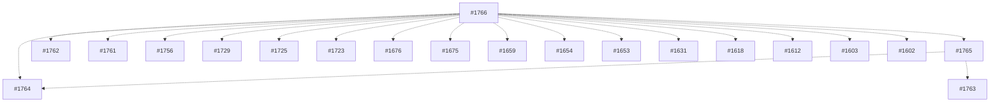

# PR Merge Train Plan

## 1. PR Inventory Table
| PR # | Title | Draft / Ready | Base | Ahead / Behind | Mergeable | CI Status | Size (adds+dels) |
|------|-------|---------------|------|----------------|-----------|-----------|------------------|
| 1766 | feat: add policy impact causal analyzer toolkit | Ready | main | 1 / 1 | MERGEABLE | PENDING | 813021 |
| 1765 | chore(deps): bump react-map-gl from 7.1.9 to 8.0.4 | Ready | main | 1 / 1 | MERGEABLE | PENDING | 4234 |
| 1764 | chore(deps-dev): bump @graphql-codegen/typescript from 4.1.6 to 5.0.0 | Ready | main | 1 / 1 | MERGEABLE | PENDING | 4234 |
| 1763 | chore(deps): bump canvas from 2.11.2 to 3.2.0 | Ready | main | 1 / 1 | MERGEABLE | PENDING | 1025987 |
| 1762 | chore(deps): bump @turf/area from 7.1.0 to 7.2.0 | Ready | main | 1 / 1 | MERGEABLE | PENDING | 4217 |
| 1761 | chore(deps): bump sharp from 0.33.5 to 0.34.4 | Ready | main | 1 / 1 | MERGEABLE | PENDING | 4234 |
| 1760 | feat: add iftc static analyzer | Ready | main | 0 / 0 | UNKNOWN | PENDING | 0 |
| 1759 | feat: add data mutation chaos lab harness | Ready | main | 1 / 1 | MERGEABLE | PENDING | 122157 |
| 1758 | feat: add governance requirement test corpus compiler | Ready | main | 1 / 1 | MERGEABLE | PENDING | 844741 |
| 1757 | feat: add prompt context attribution reporting | Ready | main | 1 / 1 | MERGEABLE | PENDING | 2261 |
| 1756 | chore(deps): bump chalk from 4.1.2 to 5.6.2 | Ready | main | 1 / 1 | MERGEABLE | PENDING | 4217 |
| 1754 | feat: add QSET quorum-based tool secret escrow service | Ready | main | 1 / 1 | MERGEABLE | PENDING | 695646 |
| 1753 | feat: add policy-constrained backfill orchestrator | Ready | main | 1 / 1 | MERGEABLE | PENDING | 3175 |
| 1752 | feat: add provenance-preserving etl generator | Ready | main | 1 / 1 | MERGEABLE | PENDING | 844416 |
| 1751 | feat: add opld leakage delta harness | Ready | main | 1 / 1 | MERGEABLE | PENDING | 122157 |
| 1750 | feat: add canonical semantic schema mapper | Ready | main | 1 / 1 | MERGEABLE | PENDING | 21062 |
| 1749 | feat: add model output safety budgets | Ready | main | 1 / 1 | MERGEABLE | PENDING | 39999 |
| 1748 | feat: add coec cross-org experiment coordination | Ready | main | 1 / 1 | MERGEABLE | PENDING | 27148 |
| 1747 | feat: add context window sanitizer middleware for GraphRAG | Ready | main | 1 / 1 | MERGEABLE | PENDING | 5110 |
| 1746 | feat: add RAALO policy aware active learning orchestrator | Ready | main | 1 / 1 | MERGEABLE | PENDING | 3175 |
| 1745 | feat: add consent drift forecaster | Ready | main | 1 / 1 | MERGEABLE | PENDING | 812555 |
| 1744 | feat: add dataset end-of-life registrar service | Ready | main | 1 / 1 | MERGEABLE | PENDING | 695646 |
| 1743 | feat: add streaming join auditor operator | Ready | main | 1 / 1 | MERGEABLE | PENDING | 812165 |
| 1742 | feat: add audit log succinctness proofs library | Ready | main | 1 / 1 | MERGEABLE | PENDING | 844273 |
| 1741 | feat: add data license derivation planner | Ready | main | 1 / 1 | MERGEABLE | PENDING | 812153 |
| 1740 | feat: add cross-modal origin linker core | Ready | main | 1 / 1 | MERGEABLE | PENDING | 29274 |
| 1739 | feat: add residency-aware DR planner | Ready | main | 1 / 1 | MERGEABLE | PENDING | 845170 |
| 1738 | feat: add query intent policy mapper service | Ready | main | 1 / 1 | MERGEABLE | PENDING | 695646 |
| 1737 | feat: add JTDL taxonomy drift linter | Ready | main | 1 / 1 | MERGEABLE | PENDING | 812555 |
| 1736 | feat: add csrs retention simulator | Ready | main | 1 / 1 | MERGEABLE | PENDING | 13447 |
| 1735 | feat: add multi-stage query explainer middleware | Ready | main | 1 / 1 | MERGEABLE | PENDING | 812928 |
| 1734 | feat: add cross-modal origin linker core | Ready | main | 1 / 1 | MERGEABLE | PENDING | 29274 |
| 1733 | feat: introduce OHIE opt-out analytics library and UI panel | Ready | main | 1 / 1 | MERGEABLE | PENDING | 58016 |
| 1732 | feat: introduce deterministic toolchain hasher CLI | Ready | main | 1 / 1 | MERGEABLE | PENDING | 2332 |
| 1731 | feat: add Go mpes runner with sandboxed multi-party evaluations | Ready | main | 1 / 1 | MERGEABLE | PENDING | 604962 |
| 1730 | feat: add ACDC consent-aware dataflow compiler | Ready | main | 1 / 1 | MERGEABLE | PENDING | 2877 |
| 1729 | feat: add outcome-safe rollout planner and dashboard | Ready | main | 1 / 1 | MERGEABLE | PENDING | 4217 |
| 1728 | chore(deps): bump nvidia/cuda from 13.0.0-devel-ubuntu22.04 to 13.0.1-devel-ubuntu22.04 | Ready | main | 1 / 1 | MERGEABLE | PENDING | 21553 |
| 1727 | chore(deps): bump node from 20-alpine to 24-alpine | Ready | main | 1 / 1 | MERGEABLE | PENDING | 697949 |
| 1726 | chore(deps): bump scikit-learn from 1.3.0 to 1.5.0 in /server | Ready | main | 1 / 1 | MERGEABLE | PENDING | 1025987 |
| 1725 | chore(deps): bump torch from 2.1.0 to 2.8.0 in /server | Ready | main | 1 / 1 | MERGEABLE | PENDING | 4217 |
| 1724 | chore(deps): bump python from 3.12-slim to 3.13-slim | Ready | main | 1 / 1 | MERGEABLE | PENDING | 1025987 |
| 1723 | chore(deps): bump requests from 2.31.0 to 2.32.4 in /server | Ready | main | 1 / 1 | MERGEABLE | PENDING | 4217 |
| 1722 | chore(deps): bump tqdm from 4.66.1 to 4.66.3 in /server | Ready | main | 1 / 1 | MERGEABLE | PENDING | 1026136 |
| 1721 | chore(deps): bump nltk from 3.8.1 to 3.9 in /server | Ready | main | 1 / 1 | MERGEABLE | PENDING | 1026136 |
| 1720 | chore(deps): bump anchore/syft from v0.105.1 to v1.33.0 | Ready | main | 1 / 1 | MERGEABLE | PENDING | 831244 |
| 1719 | chore(deps): bump aquasec/trivy from 0.51.1 to 0.66.0 | Ready | main | 1 / 1 | MERGEABLE | PENDING | 21553 |
| 1718 | chore(deps): bump pandas from 2.0.3 to 2.3.2 | Ready | main | 1 / 1 | MERGEABLE | PENDING | 1025987 |
| 1717 | chore(deps): bump redis from 4.3.4 to 6.4.0 | Ready | main | 1 / 1 | MERGEABLE | PENDING | 1025987 |
| 1716 | chore(deps): bump pytest from 7.4.3 to 8.4.2 | Ready | main | 1 / 1 | MERGEABLE | PENDING | 260711 |
| 1715 | chore(deps): bump fastapi from 0.78.0 to 0.117.1 | Ready | main | 1 / 1 | MERGEABLE | PENDING | 21553 |
| 1714 | chore(deps): bump pytest-cov from 4.1.0 to 7.0.0 | Ready | main | 1 / 1 | MERGEABLE | PENDING | 229385 |
| 1713 | feat: implement remote forensic capture pipelines | Ready | main | 1 / 1 | MERGEABLE | PENDING | 595348 |
| 1712 | Add FHE micro-analytics service and client | Ready | main | 1 / 1 | MERGEABLE | PENDING | 58016 |
| 1711 | refactor: streamline clsl stress lab | Ready | main | 0 / 0 | UNKNOWN | PENDING | 0 |
| 1710 | feat: advance companyos patent intelligence | Ready | main | 1 / 1 | MERGEABLE | PENDING | 474 |
| 1709 | feat: add PFPT prompt diffing library | Ready | main | 1 / 1 | MERGEABLE | PENDING | 2261 |
| 1708 | feat: add policy-gated vector router core and SDK | Ready | main | 1 / 1 | MERGEABLE | PENDING | 21382 |
| 1707 | feat: add attested dataset delivery network | Ready | main | 1 / 1 | MERGEABLE | PENDING | 253967 |
| 1706 | feat: add data lease controller service | Ready | main | 1 / 1 | MERGEABLE | PENDING | 695646 |
| 1705 | feat: add pacdc policy-aware cdc replicator | Ready | main | 1 / 1 | MERGEABLE | PENDING | 1953 |
| 1704 | feat: add djce-pb join risk estimator | Ready | main | 0 / 0 | UNKNOWN | PENDING | 0 |
| 1703 | docs: integrate legal agreements into onboarding | Ready | main | 1 / 1 | MERGEABLE | PENDING | 20955 |
| 1702 | feat: launch Topicality Collective marketing microsites | Ready | main | 0 / 0 | UNKNOWN | PENDING | 0 |
| 1701 | feat: add RTGH governance gate fuzzer | Ready | main | 1 / 1 | MERGEABLE | PENDING | 21509 |
| 1700 | feat(streaming): add event-time compliance window enforcer | Ready | main | 1 / 1 | MERGEABLE | PENDING | 21706 |
| 1699 | feat: add mocc contract validation library | Ready | main | 1 / 1 | MERGEABLE | PENDING | 720 |
| 1698 | feat: add consent state reconciler service | Ready | main | 1 / 1 | MERGEABLE | PENDING | 595348 |
| 1697 | feat: add consent state reconciler service | Ready | main | 1 / 1 | MERGEABLE | PENDING | 595348 |
| 1696 | feat: add federated attribution evaluator | Ready | main | 1 / 1 | MERGEABLE | PENDING | 813100 |
| 1695 | feat: add rare-event synthetic booster toolkit | Ready | main | 1 / 1 | MERGEABLE | PENDING | 136372 |
| 1694 | feat: add immutable training run capsule toolkit | Ready | main | 1 / 1 | MERGEABLE | PENDING | 40905 |
| 1693 | feat: add semantic PII ontology mapper service | Ready | main | 1 / 1 | MERGEABLE | PENDING | 695646 |
| 1692 | feat: introduce policy backtest simulator engine and dashboard | Ready | main | 1 / 1 | MERGEABLE | PENDING | 21382 |
| 1691 | feat: add deterministic prompt execution cache package | Ready | main | 1 / 1 | MERGEABLE | PENDING | 2261 |
| 1690 | feat: add csdb broker service and client sdk | Ready | main | 1 / 1 | MERGEABLE | PENDING | 1111 |
| 1689 | feat: add aql audit query engine | Ready | main | 1 / 1 | MERGEABLE | PENDING | 844273 |
| 1688 | feat: add data diff governance mapper tool | Ready | main | 1 / 1 | MERGEABLE | PENDING | 39974 |
| 1687 | feat: add adaptive consent experience sdk | Ready | main | 1 / 1 | MERGEABLE | PENDING | 20800 |
| 1686 | feat: add HAPL ledger with verification CLI | Ready | main | 1 / 1 | MERGEABLE | PENDING | 81547 |
| 1685 | feat: add access path minimizer planner and SDK | Ready | main | 1 / 1 | MERGEABLE | PENDING | 366243 |
| 1684 | feat: add legal hold orchestrator and UI | Ready | main | 1 / 1 | MERGEABLE | PENDING | 695679 |
| 1683 | feat: add emergency containment controller UI and API | Ready | main | 1 / 1 | MERGEABLE | PENDING | 39999 |
| 1682 | feat: introduce KRPCP rotation planner and coverage UI | Ready | main | 1 / 1 | MERGEABLE | PENDING | 1791 |
| 1681 | feat: add metric definition registry | Ready | main | 1 / 1 | MERGEABLE | PENDING | 20332 |
| 1680 | feat: add AGSM synthetic governance probes | Ready | main | 1 / 1 | MERGEABLE | PENDING | 844741 |
| 1679 | feat: add MTIF STIX/TAXII service | Ready | main | 1 / 1 | MERGEABLE | PENDING | 695646 |
| 1678 | feat: add csiks idempotency service and clients | Ready | main | 1 / 1 | MERGEABLE | PENDING | 695646 |
| 1677 | feat: add consent graph explorer service and ui | Ready | main | 1 / 1 | MERGEABLE | PENDING | 13372 |
| 1676 | feat: add adaptive consistency controller sidecar and sdk | Ready | main | 1 / 1 | MERGEABLE | PENDING | 4217 |
| 1675 | feat: add adaptive consistency controller sidecar and sdk | Ready | main | 1 / 1 | MERGEABLE | PENDING | 4217 |
| 1674 | feat: add mobile ODPS SDKs for Android and iOS | Ready | main | 1 / 1 | MERGEABLE | PENDING | 39999 |
| 1673 | feat: add immutable business rules sandbox engine | Ready | main | 1 / 1 | MERGEABLE | PENDING | 720 |
| 1672 | feat: add explainable sampling auditor toolkit | Ready | main | 1 / 1 | MERGEABLE | PENDING | 812165 |
| 1671 | feat: add Data Residency Shadow Tester tool | Ready | main | 1 / 1 | MERGEABLE | PENDING | 812153 |
| 1670 | feat: add SRPL macros and lint rule for safe retrieval | Ready | main | 1 / 1 | MERGEABLE | PENDING | 39999 |
| 1669 | feat: add tenant isolation prover | Ready | main | 1 / 1 | MERGEABLE | PENDING | 812549 |
| 1668 | feat: add knowledge purge orchestrator | Ready | main | 1 / 1 | MERGEABLE | PENDING | 3175 |
| 1667 | feat: add redaction consistent search indexer service | Ready | main | 1 / 1 | MERGEABLE | PENDING | 695646 |
| 1666 | feat: add governed chargeback metering service | Ready | main | 1 / 1 | MERGEABLE | PENDING | 695646 |
| 1665 | feat: add bayesian fusion to early warning ensemble | Ready | main | 1 / 1 | MERGEABLE | PENDING | 812398 |
| 1664 | feat: add regulator self-service proof portal | Ready | main | 1 / 1 | MERGEABLE | PENDING | 695646 |
| 1663 | feat: add pseudonym linkage risk auditor library | Ready | main | 1 / 1 | MERGEABLE | PENDING | 812165 |
| 1662 | feat: add hardware determinism guard toolkit | Ready | main | 1 / 1 | MERGEABLE | PENDING | 812720 |
| 1661 | feat: add side-channel budget auditor harness | Ready | main | 1 / 1 | MERGEABLE | PENDING | 122157 |
| 1660 | feat: add query-time pseudonymization gateway service | Ready | main | 1 / 1 | MERGEABLE | PENDING | 695646 |
| 1659 | feat: introduce data embargo scheduler and CLI | Ready | main | 1 / 1 | MERGEABLE | PENDING | 4217 |
| 1658 | feat: add consent-aware feature flag platform | Ready | main | 1 / 1 | MERGEABLE | PENDING | 183425 |
| 1657 | feat: add cryptographic cohort sampler | Ready | main | 0 / 0 | UNKNOWN | PENDING | 0 |
| 1656 | feat: add differential lineage replayer planner | Ready | main | 1 / 1 | MERGEABLE | PENDING | 486 |
| 1655 | feat: add spar artifact registry | Ready | main | 1 / 1 | MERGEABLE | PENDING | 20332 |
| 1654 | Expand interventional countermeasure briefing with patentable innovations | Ready | main | 1 / 1 | MERGEABLE | PENDING | 451 |
| 1653 | feat: add LTDIM legal diff impact mapper | Ready | main | 1 / 1 | MERGEABLE | PENDING | 813021 |
| 1652 | feat: add cdqd service and ui | Ready | main | 1 / 1 | MERGEABLE | PENDING | 695679 |
| 1651 | feat: add CRKRE jurisdiction-aware key management service | Ready | main | 1 / 1 | MERGEABLE | PENDING | 695646 |
| 1650 | Add DSAR fulfillment engine with proofs and reviewer UI | Ready | main | 1 / 1 | MERGEABLE | PENDING | 695679 |
| 1649 | feat: add slice registry service and SDKs | Ready | main | 1 / 1 | MERGEABLE | PENDING | 695646 |
| 1648 | feat: add multi-tenant fairness scheduler | Ready | main | 1 / 1 | MERGEABLE | PENDING | 816049 |
| 1647 | feat: add purpose drift auditor service and UI | Ready | main | 1 / 1 | MERGEABLE | PENDING | 695679 |
| 1646 | feat: add consent-compliant messaging orchestrator service | Ready | main | 1 / 1 | MERGEABLE | PENDING | 3175 |
| 1645 | feat: add SCPE supply chain gate | Ready | main | 1 / 1 | MERGEABLE | PENDING | 812309 |
| 1644 | feat: add policy-constrained distillation framework | Ready | main | 1 / 1 | MERGEABLE | PENDING | 189413 |
| 1643 | feat: add deterministic embedding store | Ready | main | 1 / 1 | MERGEABLE | PENDING | 255013 |
| 1642 | feat: add privacy incident tabletop drill engine | Ready | main | 1 / 1 | MERGEABLE | PENDING | 2842 |
| 1641 | feat: add drift root-cause explorer toolkit | Ready | main | 1 / 1 | MERGEABLE | PENDING | 812555 |
| 1640 | feat: add qawe quorum approval engine | Ready | main | 1 / 1 | MERGEABLE | PENDING | 40828 |
| 1639 | feat: add robust prompt template compiler | Ready | main | 1 / 1 | MERGEABLE | PENDING | 2261 |
| 1638 | feat: add Feature Lineage Impact Analyzer | Ready | main | 1 / 1 | MERGEABLE | PENDING | 812111 |
| 1637 | Refine quality gate evidence packs | Ready | main | 1 / 1 | MERGEABLE | PENDING | 189152 |
| 1636 | Add CompanyOS initiative build playbooks | Ready | main | 1 / 1 | MERGEABLE | PENDING | 254473 |
| 1635 | feat: add knowledge cutoff router library | Ready | main | 1 / 1 | MERGEABLE | PENDING | 22446 |
| 1634 | feat: add mfue unlearning evaluation framework | Ready | main | 1 / 1 | MERGEABLE | PENDING | 21271 |
| 1633 | feat: add consent revocation propagator service | Ready | main | 1 / 1 | MERGEABLE | PENDING | 695646 |
| 1632 | feat: add jitae dual-control access service | Ready | main | 1 / 1 | MERGEABLE | PENDING | 695646 |
| 1631 | feat: add risk-adaptive limiter sidecar and sdk | Ready | main | 1 / 1 | MERGEABLE | PENDING | 4217 |
| 1630 | Add inference cost optimizer planner and orchestration toolkit | Ready | main | 1 / 1 | MERGEABLE | PENDING | 21059 |
| 1629 | feat: add agql attestation graph workspace | Ready | main | 1 / 1 | MERGEABLE | PENDING | 697547 |
| 1628 | feat: add data minimization planner service | Ready | main | 1 / 1 | MERGEABLE | PENDING | 695646 |
| 1627 | feat: add federated schema registry with policy tags | Ready | main | 1 / 1 | MERGEABLE | PENDING | 20332 |
| 1626 | feat: introduce categorical privacy validator tooling | Ready | main | 1 / 1 | MERGEABLE | PENDING | 812555 |
| 1625 | feat: introduce multicloud egress governor sidecar | Ready | main | 0 / 0 | UNKNOWN | PENDING | 0 |
| 1624 | feat: deliver human feedback arbitration workbench | Ready | main | 1 / 1 | MERGEABLE | PENDING | 575 |
| 1623 | feat: add pipeline flakiness detector toolkit | Ready | main | 1 / 1 | MERGEABLE | PENDING | 57869 |
| 1622 | feat: add policy-aware synthetic log generator | Ready | main | 1 / 1 | MERGEABLE | PENDING | 844416 |
| 1621 | feat: add consent-aware experiment allocator | Ready | main | 1 / 1 | MERGEABLE | PENDING | 21208 |
| 1620 | feat: define graphql contract scaffolding | Ready | main | 1 / 1 | MERGEABLE | PENDING | 259924 |
| 1619 | feat: add provenance CLI and export manifest spec | Ready | main | 1 / 1 | MERGEABLE | PENDING | 20900 |
| 1618 | feat: add sre guardrails and observability automation | Ready | main | 1 / 1 | MERGEABLE | PENDING | 4217 |
| 1617 | feat: add explainable ranking auditor toolkit | Ready | main | 1 / 1 | MERGEABLE | PENDING | 812165 |
| 1616 | feat: add zero trust security controls | Ready | main | 1 / 1 | MERGEABLE | PENDING | 844292 |
| 1615 | feat: define graph data model and ingestion policies | Ready | main | 1 / 1 | MERGEABLE | PENDING | 5374 |
| 1614 | docs: add Conductor workstream planning artifacts | Ready | main | 1 / 1 | MERGEABLE | PENDING | 811495 |
| 1613 | docs: add day-1 architecture and security governance | Ready | main | 1 / 1 | MERGEABLE | PENDING | 844292 |
| 1612 | feat: add bgpr rollout controller and dashboard | Ready | main | 1 / 1 | MERGEABLE | PENDING | 4217 |
| 1611 | feat: add secrets spill sentinel service | Ready | main | 1 / 1 | MERGEABLE | PENDING | 695646 |
| 1610 | fix: correct intelgraph api package metadata | Ready | main | 1 / 1 | MERGEABLE | PENDING | 512 |
| 1609 | docs: add conductor summary backlog and raci for workstream 1 | Ready | main | 1 / 1 | MERGEABLE | PENDING | 39999 |
| 1608 | feat: add temporal access token service | Ready | main | 1 / 1 | MERGEABLE | PENDING | 695646 |
| 1607 | feat: add schema evolution simulator tool | Ready | main | 1 / 1 | MERGEABLE | PENDING | 21062 |
| 1606 | feat: add q3c resource cost service | Ready | main | 1 / 1 | MERGEABLE | PENDING | 695646 |
| 1605 | docs: add influence network detection framework blueprint | Ready | main | 1 / 1 | MERGEABLE | PENDING | 20869 |
| 1604 | feat: orchestrate patent-grade prompt innovation suite | Ready | main | 1 / 1 | MERGEABLE | PENDING | 2261 |
| 1603 | feat: add otel observability and slo dashboards | Ready | main | 1 / 1 | MERGEABLE | PENDING | 4217 |
| 1602 | fix: sync provenance runtime surfaces | Ready | main | 1 / 1 | MERGEABLE | PENDING | 1237 |
| 1601 | feat: redesign companyos control surface | Ready | main | 1 / 1 | MERGEABLE | PENDING | 14143 |
| 1600 | feat: add fairness constrained trainer toolkit | Ready | main | 0 / 0 | UNKNOWN | PENDING | 0 |
| 1599 | feat: add public GraphQL contracts | Ready | main | 1 / 1 | MERGEABLE | PENDING | 259924 |
| 1598 | feat(security): enforce tenant abac and webauthn controls | Ready | main | 1 / 1 | MERGEABLE | PENDING | 812522 |
| 1597 | Add platform SRE pipeline and observability guardrails | Ready | main | 1 / 1 | MERGEABLE | PENDING | 1853 |
| 1596 | feat: enforce retention tiers and rtbf workflow | Ready | main | 1 / 1 | MERGEABLE | PENDING | 40615 |
| 1595 | feat: harden intelgraph helm runtime configuration | Ready | main | 1 / 1 | MERGEABLE | PENDING | 695604 |
| 1594 | test: add automated quality gates evidence | Ready | main | 1 / 1 | MERGEABLE | PENDING | 998 |
| 1593 | feat: add observability pipeline assets | Ready | main | 1 / 1 | MERGEABLE | PENDING | 57869 |
| 1592 | feat: add policy-aware cross-silo query planner | Ready | main | 1 / 1 | MERGEABLE | PENDING | 1953 |
| 1591 | Add Conductor release planning summary, backlog, and RACI | Ready | main | 1 / 1 | MERGEABLE | PENDING | 231577 |
| 1590 | feat: publish MC evidence from IG-RL releases | Ready | main | 1 / 1 | MERGEABLE | PENDING | 998 |
| 1589 | feat: enforce tenant ABAC with OIDC and SCIM | Ready | main | 1 / 1 | MERGEABLE | PENDING | 40615 |
| 1588 | feat: add plan mode to agent orchestrator | Ready | main | 1 / 1 | MERGEABLE | PENDING | 41089 |
| 1587 | feat: gate rollout promotion with mission control evidence | Ready | main | 1 / 1 | MERGEABLE | PENDING | 998 |
| 1586 | feat: add integrity guards to compliance exports | Ready | main | 1 / 1 | MERGEABLE | PENDING | 2842 |
| 1585 | docs: capture day-1 topology and decision records | Ready | main | 1 / 1 | MERGEABLE | PENDING | 1026136 |
| 1584 | Add canonical Neo4j ingest schema, mappings, and fixtures | Ready | main | 1 / 1 | MERGEABLE | PENDING | 58016 |
| 1583 | Add canonical Neo4j ingest schema, mappings, and fixtures | Ready | main | 1 / 1 | MERGEABLE | PENDING | 58016 |
| 1582 | feat: add c2pa provenance bridge toolkit | Ready | main | 1 / 1 | MERGEABLE | PENDING | 486 |
| 1581 | feat: add secure udf marketplace service | Ready | main | 1 / 1 | MERGEABLE | PENDING | 695646 |
| 1580 | feat: add rollback orchestrator tooling | Ready | main | 1 / 1 | MERGEABLE | PENDING | 3175 |
| 1579 | feat: introduce causal feature store validator toolkit | Ready | main | 1 / 1 | MERGEABLE | PENDING | 255013 |
| 1578 | feat: add streaming dp window aggregator library | Ready | main | 1 / 1 | MERGEABLE | PENDING | 367164 |
| 1577 | feat: add bitemporal knowledge graph library | Ready | main | 1 / 1 | MERGEABLE | PENDING | 5374 |
| 1576 | feat: add policy-aware edge cache | Ready | main | 1 / 1 | MERGEABLE | PENDING | 1953 |
| 1575 | feat: add obligation tracker service | Ready | main | 1 / 1 | MERGEABLE | PENDING | 695646 |
| 1574 | test(kkp): add audience enforcement integration test | Ready | main | 1 / 1 | MERGEABLE | PENDING | 259924 |
| 1573 | Expand intention imputation implementation blueprint | Ready | main | 1 / 1 | MERGEABLE | PENDING | 5660 |
| 1572 | Add MCC model card compiler tooling | Ready | main | 1 / 1 | MERGEABLE | PENDING | 812555 |
| 1571 | feat: mature prompt policy composer guard orchestration | Ready | main | 1 / 1 | MERGEABLE | PENDING | 2261 |
| 1570 | feat: add enclave feature store with attestation | Ready | main | 1 / 1 | MERGEABLE | PENDING | 255013 |
| 1569 | feat: add redaction quality benchmark toolkit | Ready | main | 1 / 1 | MERGEABLE | PENDING | 2840 |
| 1568 | feat: add responsible evaluation orchestrator framework | Ready | main | 1 / 1 | MERGEABLE | PENDING | 3175 |
| 1567 | feat: add CTPT service and SDK clients | Ready | main | 1 / 1 | MERGEABLE | PENDING | 695646 |
| 1566 | feat: add dp-sql compiler for privacy-aware queries | Ready | main | 1 / 1 | MERGEABLE | PENDING | 47309 |
| 1565 | feat: add prompt policy composer framework | Draft | main | 1 / 1 | MERGEABLE | PENDING | 189413 |
| 1564 | feat: add IDTL transparency log service | Ready | main | 1 / 1 | MERGEABLE | PENDING | 695646 |
| 1563 | feat: add contextual access broker service | Ready | main | 1 / 1 | MERGEABLE | PENDING | 695646 |
| 1562 | feat: add tabular perceptual fingerprinting registry service | Ready | main | 1 / 1 | MERGEABLE | PENDING | 695646 |
| 1561 | feat: add verifiable consent receipt toolkit | Ready | main | 0 / 0 | UNKNOWN | PENDING | 0 |
| 1560 | feat: add stochastic actor awareness simulation | Ready | main | 1 / 1 | MERGEABLE | PENDING | 21653 |
| 1559 | feat: add reproducible notebook freezer tooling | Ready | main | 1 / 1 | MERGEABLE | PENDING | 57869 |
| 1558 | feat: add transformation canon codegen suite | Ready | main | 1 / 1 | MERGEABLE | PENDING | 260654 |
| 1557 | feat: add data residency optimizer and UI | Ready | main | 1 / 1 | MERGEABLE | PENDING | 695679 |
| 1556 | feat: add preregistered experiment registry service | Ready | main | 1 / 1 | MERGEABLE | PENDING | 695646 |
| 1555 | feat: add prompt diff impact lab toolkit | Ready | main | 1 / 1 | MERGEABLE | PENDING | 2261 |
| 1554 | feat: add differential privacy release scheduler | Ready | main | 1 / 1 | MERGEABLE | PENDING | 1025987 |
| 1553 | feat: add synthetic entity graph forge generator | Ready | main | 1 / 1 | MERGEABLE | PENDING | 5374 |
| 1552 | feat: add ESCP erasure service and verifier | Ready | main | 1 / 1 | MERGEABLE | PENDING | 1825 |
| 1551 | feat: add TESQ sandbox package | Ready | main | 1 / 1 | MERGEABLE | PENDING | 720 |
| 1550 | feat: add governance SLO monitoring service | Ready | main | 1 / 1 | MERGEABLE | PENDING | 695646 |
| 1549 | Add Leakage Red-Team Tournament harness | Ready | main | 1 / 1 | MERGEABLE | PENDING | 122157 |
| 1548 | feat: introduce jurisdictional policy resolver tooling | Ready | main | 1 / 1 | MERGEABLE | PENDING | 1953 |
| 1547 | feat: add model usage ledger SDK and API | Ready | main | 1 / 1 | MERGEABLE | PENDING | 39999 |
| 1546 | feat: add hil-review appeals triage workbench | Ready | main | 1 / 1 | MERGEABLE | PENDING | 844150 |
| 1545 | feat: add client-side telemetry redaction pipeline | Ready | main | 1 / 1 | MERGEABLE | PENDING | 57869 |
| 1544 | feat: introduce retentiond service and dashboard | Ready | main | 1 / 1 | MERGEABLE | PENDING | 695646 |
| 1543 | feat: add safejoin psi service and clients | Ready | main | 1 / 1 | MERGEABLE | PENDING | 695646 |
| 1542 | feat: add counterfactual evaluation harness | Ready | main | 1 / 1 | MERGEABLE | PENDING | 21271 |
| 1541 | feat: add freshness scoring library and reranking middleware | Ready | main | 1 / 1 | MERGEABLE | PENDING | 4217 |
| 1540 | feat: add incident attestation bundler CLI | Ready | main | 1 / 1 | MERGEABLE | PENDING | 2842 |
| 1539 | feat: add contract gate cli for data contract ci | Ready | main | 1 / 1 | MERGEABLE | PENDING | 21219 |
| 1538 | feat: add federated t-secure metrics aggregator | Ready | main | 1 / 1 | MERGEABLE | PENDING | 273649 |
| 1537 | feat: add retrieval safety router library and demo | Ready | main | 1 / 1 | MERGEABLE | PENDING | 4217 |
| 1536 | feat: add verifiable synthetic data forge package | Ready | main | 1 / 1 | MERGEABLE | PENDING | 812153 |
| 1535 | feat: introduce drift-sentinel shadow model monitoring daemon | Ready | main | 1 / 1 | MERGEABLE | PENDING | 812555 |
| 1534 | feat: add differential privacy budget bank service | Ready | main | 1 / 1 | MERGEABLE | PENDING | 695646 |
| 1533 | feat: add consent constraint compiler | Ready | main | 0 / 0 | UNKNOWN | PENDING | 0 |
| 1532 | feat: add explain decision overlay component | Ready | main | 1 / 1 | MERGEABLE | PENDING | 21389 |
| 1531 | Add GW-DE dual-entropy watermark suite | Ready | main | 1 / 1 | MERGEABLE | PENDING | 20946 |
| 1530 | feat: add policy sealed computation prototype | Ready | main | 1 / 1 | MERGEABLE | PENDING | 1953 |
| 1529 | feat: add LAC compiler and enforcement suite | Ready | main | 1 / 1 | MERGEABLE | PENDING | 4217 |
| 1528 | feat: add zk selector overlap service | Ready | main | 1 / 1 | MERGEABLE | PENDING | 695646 |
| 1527 | feat: add data profiling tool for ingestion | Ready | main | 1 / 1 | MERGEABLE | PENDING | 260654 |
| 1526 | feat: add semantic delta network library | Ready | main | 1 / 1 | MERGEABLE | PENDING | 253967 |
| 1525 | Add PNC attestation tooling and reports | Ready | main | 1 / 1 | MERGEABLE | PENDING | 1791 |
| 1524 | feat: add proof-carrying analytics verifier CLI | Ready | main | 1 / 1 | MERGEABLE | PENDING | 81547 |
| 1523 | feat: add customizable keyboard shortcuts | Ready | main | 0 / 0 | UNKNOWN | PENDING | 0 |
| 1522 | feat: enforce per-user GraphQL concurrency limits | Ready | main | 1 / 1 | MERGEABLE | PENDING | 259924 |
| 1521 | Add workflow-engine load testing automation assets | Ready | main | 1 / 1 | MERGEABLE | PENDING | 40066 |
| 1520 | feat: integrate sentiment analysis pipeline | Ready | main | 1 / 1 | MERGEABLE | PENDING | 5877132 |
| 1519 | Add database failover operators and monitoring | Ready | main | 1 / 1 | MERGEABLE | PENDING | 4217 |
| 1518 | feat: add custom graph metric execution pipeline | Ready | main | 1 / 1 | MERGEABLE | PENDING | 5374 |
| 1517 | feat: add neo4j graph deduplication workflow | Ready | main | 1 / 1 | MERGEABLE | PENDING | 367401 |
| 1516 | Add Postgres-backed graph annotations | Ready | main | 1 / 1 | MERGEABLE | PENDING | 40828 |
| 1515 | feat: optimize argo workflow resource efficiency | Ready | main | 1 / 1 | MERGEABLE | PENDING | 42574 |
| 1514 | feat: add user activity analytics dashboard | Ready | main | 1 / 1 | MERGEABLE | PENDING | 21234 |
| 1513 | chore(deps): bump tar-fs from 2.1.3 to 2.1.4 in /conductor-ui/frontend | Ready | main | 1 / 1 | MERGEABLE | PENDING | 1026136 |
| 1512 | Add environment-specific synthetic CI checks | Ready | main | 1 / 1 | MERGEABLE | PENDING | 75150 |
| 1511 | feat: add schema validation for feed processor ingestion | Ready | main | 1 / 1 | MERGEABLE | PENDING | 46806 |
| 1510 | Add guided tours with persisted onboarding state | Ready | main | 1 / 1 | MERGEABLE | PENDING | 595348 |
| 1509 | feat: add streaming ML inference over GraphQL | Ready | main | 1 / 1 | MERGEABLE | PENDING | 259924 |
| 1508 | feat: add graph snapshot compression utilities | Ready | main | 1 / 1 | MERGEABLE | PENDING | 5374 |
| 1507 | chore: add automated security scans to CI | Ready | main | 1 / 1 | MERGEABLE | PENDING | 662697 |
| 1506 | feat: add workflow monitoring dashboard UI | Ready | main | 1 / 1 | MERGEABLE | PENDING | 695679 |
| 1505 | feat: add ML observability alerting assets | Ready | main | 1 / 1 | MERGEABLE | PENDING | 20954 |
| 1504 | feat: optimize graph metadata search indexing | Ready | main | 1 / 1 | MERGEABLE | PENDING | 13607 |
| 1503 | feat: add federated training support | Ready | main | 1 / 1 | MERGEABLE | PENDING | 20800 |
| 1502 | feat: add data preview step to ingest wizard | Ready | main | 1 / 1 | MERGEABLE | PENDING | 13235 |
| 1501 | feat: add GraphQL query observability logging | Ready | main | 1 / 1 | MERGEABLE | PENDING | 259924 |
| 1500 | feat: add graph migration tooling | Ready | main | 1 / 1 | MERGEABLE | PENDING | 5374 |
| 1499 | chore: establish incremental lint baseline | Ready | main | 1 / 1 | MERGEABLE | PENDING | 1791 |
| 1498 | Switch generated API docs to markdown outputs | Ready | main | 1 / 1 | MERGEABLE | PENDING | 2842 |
| 1497 | feat: add onboarding wizard with persisted progress | Ready | main | 1 / 1 | MERGEABLE | PENDING | 451 |
| 1496 | feat: add graph anonymization mutation and tooling | Ready | main | 1 / 1 | MERGEABLE | PENDING | 13372 |
| 1495 | feat: add dataloaders for graphql resolvers | Ready | main | 1 / 1 | MERGEABLE | PENDING | 47309 |
| 1494 | feat: add customizable email templates for notifications | Ready | main | 1 / 1 | MERGEABLE | PENDING | 1223 |
| 1493 | feat: add distributed tracing for workflows | Ready | main | 1 / 1 | MERGEABLE | PENDING | 47309 |
| 1492 | feat: enable bulk graph selection operations | Ready | main | 1 / 1 | MERGEABLE | PENDING | 5374 |
| 1491 | feat: automate ml retraining pipeline | Ready | main | 1 / 1 | MERGEABLE | PENDING | 57869 |
| 1490 | feat: add real-time collaboration observability assets | Ready | main | 1 / 1 | MERGEABLE | PENDING | 20954 |
| 1489 | feat: add graph version control snapshots | Ready | main | 1 / 1 | MERGEABLE | PENDING | 5374 |
| 1488 | feat: add customizable graph visualization preferences | Ready | main | 1 / 1 | MERGEABLE | PENDING | 5374 |
| 1487 | feat: add mock data generator for testing | Ready | main | 1 / 1 | MERGEABLE | PENDING | 260654 |
| 1486 | feat: add GraphQL API key management system | Ready | main | 1 / 1 | MERGEABLE | PENDING | 998 |
| 1485 | feat: integrate graph anomaly detection into analytics dashboard | Ready | main | 1 / 1 | MERGEABLE | PENDING | 5261 |
| 1484 | feat: automate postgres and neo4j backup verification | Ready | main | 1 / 1 | MERGEABLE | PENDING | 566 |
| 1483 | feat: add realtime graph query preview | Ready | main | 1 / 1 | MERGEABLE | PENDING | 5374 |
| 1482 | feat: add realtime graph query preview | Ready | main | 1 / 1 | MERGEABLE | PENDING | 5374 |
| 1481 | feat: add rate limited ingestion controls | Ready | main | 1 / 1 | MERGEABLE | PENDING | 812360 |
| 1480 | feat: add image detection pipeline to ingest wizard | Ready | main | 1 / 1 | MERGEABLE | PENDING | 20931 |
| 1479 | feat: add custom workflow template support | Ready | main | 1 / 1 | MERGEABLE | PENDING | 20800 |
| 1478 | feat: add Evidently drift monitoring | Ready | main | 1 / 1 | MERGEABLE | PENDING | 812555 |
| 1477 | feat: add graph query debugging tooling | Ready | main | 1 / 1 | MERGEABLE | PENDING | 5374 |
| 1476 | feat: add cross-region database replication artifacts | Ready | main | 1 / 1 | MERGEABLE | PENDING | 811495 |
| 1475 | Add Neo4j graph ingestion validation framework | Ready | main | 1 / 1 | MERGEABLE | PENDING | 40828 |
| 1474 | feat: add graphql playground to docs site | Ready | main | 1 / 1 | MERGEABLE | PENDING | 2842 |
| 1473 | feat: add cross-channel notifications | Ready | main | 0 / 0 | UNKNOWN | PENDING | 0 |
| 1472 | feat: add dashboard layout experimentation | Ready | main | 0 / 0 | UNKNOWN | PENDING | 0 |
| 1471 | feat: right-size k8s workloads with vpa | Ready | main | 1 / 1 | MERGEABLE | PENDING | 366394 |
| 1470 | Add offline ingestion queue to feed-processor | Ready | main | 1 / 1 | MERGEABLE | PENDING | 2842 |
| 1469 | feat(ai): add explainability pipeline for entity recognition | Ready | main | 1 / 1 | MERGEABLE | PENDING | 1964 |
| 1468 | feat: add dynamic rbac management api | Ready | main | 1 / 1 | MERGEABLE | PENDING | 366394 |
| 1467 | feat: add graph snapshotting service and mutations | Ready | main | 1 / 1 | MERGEABLE | PENDING | 13372 |
| 1466 | Add automated security compliance checks to CI | Ready | main | 1 / 1 | MERGEABLE | PENDING | 662697 |
| 1465 | feat: add Python batching workers for feed-processor | Ready | main | 1 / 1 | MERGEABLE | PENDING | 844156 |
| 1464 | feat: add GraphQL OpenTelemetry metrics and alerts | Ready | main | 1 / 1 | MERGEABLE | PENDING | 812837 |
| 1463 | Add TOTP-based MFA enforcement | Ready | main | 1 / 1 | MERGEABLE | PENDING | 813100 |
| 1462 | feat: improve graph cache invalidation and observability | Ready | main | 1 / 1 | MERGEABLE | PENDING | 13372 |
| 1461 | feat: improve dashboard and search accessibility | Ready | main | 1 / 1 | MERGEABLE | PENDING | 790897 |
| 1460 | feat: implement data retention automation | Ready | main | 1 / 1 | MERGEABLE | PENDING | 40066 |
| 1459 | feat: integrate Argo orchestration for workflow engine | Ready | main | 1 / 1 | MERGEABLE | PENDING | 1223 |
| 1458 | feat: enable gpu acceleration for ml engine | Ready | main | 1 / 1 | MERGEABLE | PENDING | 47309 |
| 1457 | feat(search): add advanced graphql filters | Ready | main | 1 / 1 | MERGEABLE | PENDING | 259924 |
| 1456 | feat: add audit log export graphql query | Ready | main | 1 / 1 | MERGEABLE | PENDING | 20900 |
| 1455 | feat: enhance alerting workflow with pagerduty integration | Ready | main | 1 / 1 | MERGEABLE | PENDING | 218362 |
| 1454 | test: add k6 rollout canary scenario | Ready | main | 1 / 1 | MERGEABLE | PENDING | 21208 |
| 1453 | feat: add Dask preprocessing pipeline for ingest wizard | Ready | main | 1 / 1 | MERGEABLE | PENDING | 20931 |
| 1452 | feat: add interactive tutorials for ingest and graph workflows | Ready | main | 1 / 1 | MERGEABLE | PENDING | 39999 |
| 1451 | feat: implement session revocation and idle timeouts | Ready | main | 1 / 1 | MERGEABLE | PENDING | 4217 |
| 1450 | feat(graph): add Graph CSV import mutation | Ready | main | 1 / 1 | MERGEABLE | PENDING | 5374 |
| 1449 | feat: enable argocd blue-green deployments | Ready | main | 1 / 1 | MERGEABLE | PENDING | 811954 |
| 1448 | Add MLflow model versioning and deployment APIs | Ready | main | 1 / 1 | MERGEABLE | PENDING | 39999 |
| 1447 | feat: improve graph cache invalidation and observability | Ready | main | 1 / 1 | MERGEABLE | PENDING | 13372 |
| 1446 | feat(feedback): add dashboard feedback workflows | Ready | main | 1 / 1 | MERGEABLE | PENDING | 273649 |
| 1445 | Add frontend CI/CD workflows with S3 and ArgoCD integration | Ready | main | 1 / 1 | MERGEABLE | PENDING | 2916 |
| 1444 | feat: add predictive analytics forecasting | Ready | main | 1 / 1 | MERGEABLE | PENDING | 1987 |
| 1443 | Add TOTP-based MFA enforcement | Ready | main | 1 / 1 | MERGEABLE | PENDING | 813100 |
| 1442 | feat: configure ml autoscaling metrics and validation assets | Ready | main | 1 / 1 | MERGEABLE | PENDING | 812837 |
| 1441 | feat: add streaming graph export mutation | Ready | main | 1 / 1 | MERGEABLE | PENDING | 5374 |
| 1440 | feat: add natural language graph query interface | Ready | main | 1 / 1 | MERGEABLE | PENDING | 5374 |
| 1439 | feat: add role-based dashboards for RBAC personas | Ready | main | 1 / 1 | MERGEABLE | PENDING | 47309 |
| 1438 | feat: add Kafka streaming pipeline for feed processor | Ready | main | 1 / 1 | MERGEABLE | PENDING | 47309 |
| 1437 | feat: add compliance reporting dashboard | Ready | main | 1 / 1 | MERGEABLE | PENDING | 21706 |
| 1436 | feat: add automl pipeline and graphql integration | Ready | main | 1 / 1 | MERGEABLE | PENDING | 259924 |
| 1435 | chore: deliver code quality audit assets | Ready | main | 1 / 1 | MERGEABLE | PENDING | 844273 |
| 1434 | docs: correct persona onboarding guides | Ready | main | 0 / 0 | UNKNOWN | PENDING | 0 |
| 1433 | docs: correct persona onboarding guides | Ready | main | 0 / 0 | UNKNOWN | PENDING | 0 |
| 1432 | Add edge export pipeline and benchmarking support | Ready | main | 1 / 1 | MERGEABLE | PENDING | 20900 |
| 1431 | feat: implement tenant theming engine | Ready | main | 1 / 1 | MERGEABLE | PENDING | 40828 |
| 1430 | feat: add gds-backed graph analytics queries | Ready | main | 1 / 1 | MERGEABLE | PENDING | 5374 |
| 1429 | feat: add federated learning orchestration | Ready | main | 1 / 1 | MERGEABLE | PENDING | 42566 |
| 1428 | docs: add onboarding tutorial scripts and transcripts | Ready | main | 1 / 1 | MERGEABLE | PENDING | 4217 |
| 1427 | Add SAML federated identity support and policy enforcement | Ready | main | 1 / 1 | MERGEABLE | PENDING | 21382 |
| 1426 | perf: optimize audit and compensation history lookups | Ready | main | 1 / 1 | MERGEABLE | PENDING | 20889 |
| 1425 | feat: add automl pipeline and graphql integration | Ready | main | 1 / 1 | MERGEABLE | PENDING | 259924 |
| 1424 | feat: add visual graph query builder with validation | Ready | main | 1 / 1 | MERGEABLE | PENDING | 40828 |
| 1423 | feat: integrate Vault-driven secrets workflows | Ready | main | 1 / 1 | MERGEABLE | PENDING | 20813 |
| 1422 | feat: integrate Vault-driven secrets workflows | Ready | main | 1 / 1 | MERGEABLE | PENDING | 20813 |
| 1421 | feat: add versioned graphql api endpoints | Ready | main | 1 / 1 | MERGEABLE | PENDING | 259924 |
| 1420 | feat: add customizable dashboards | Ready | main | 0 / 0 | UNKNOWN | PENDING | 0 |
| 1419 | chore: deliver code quality audit assets | Ready | main | 1 / 1 | MERGEABLE | PENDING | 844273 |
| 1418 | Add edge export pipeline and benchmarking support | Ready | main | 1 / 1 | MERGEABLE | PENDING | 20900 |
| 1417 | feat: integrate external identity providers into auth flow | Ready | main | 1 / 1 | MERGEABLE | PENDING | 20955 |
| 1416 | Add data lineage tracking and dashboard visualization | Ready | main | 1 / 1 | MERGEABLE | PENDING | 4217 |
| 1415 | Add Swagger-based GraphQL API documentation site | Ready | main | 1 / 1 | MERGEABLE | PENDING | 259924 |
| 1414 | feat: add milvus vector search support | Ready | main | 1 / 1 | MERGEABLE | PENDING | 367401 |
| 1413 | feat(ui): implement dark mode theme support | Ready | main | 1 / 1 | MERGEABLE | PENDING | 695679 |
| 1412 | feat: add milvus vector search support | Ready | main | 1 / 1 | MERGEABLE | PENDING | 367401 |
| 1411 | feat: add milvus-backed vector search integration | Ready | main | 1 / 1 | MERGEABLE | PENDING | 259924 |
| 1410 | feat: implement apollo federation gateway | Ready | main | 0 / 0 | UNKNOWN | PENDING | 0 |
| 1409 | Add chaos resiliency testing assets | Ready | main | 1 / 1 | MERGEABLE | PENDING | 812038 |
| 1408 | feat: improve frontend accessibility across dashboard, wizard, and graph | Ready | main | 1 / 1 | MERGEABLE | PENDING | 13372 |
| 1407 | feat: improve frontend accessibility across dashboard, wizard, and graph | Ready | main | 1 / 1 | MERGEABLE | PENDING | 13372 |
| 1406 | feat: add sandboxed plugin loader for custom integrations | Ready | main | 1 / 1 | MERGEABLE | PENDING | 47309 |
| 1405 | Add offline caching for dashboards and ingest wizard | Ready | main | 1 / 1 | MERGEABLE | PENDING | 39999 |
| 1404 | chore: shrink service docker images | Ready | main | 1 / 1 | MERGEABLE | PENDING | 695646 |
| 1403 | Add GDPR anonymization tooling and mutation | Ready | main | 1 / 1 | MERGEABLE | PENDING | 273465 |
| 1402 | feat: add elasticsearch-backed full text search | Ready | main | 1 / 1 | MERGEABLE | PENDING | 790897 |
| 1401 | feat: enable graphql subscriptions over websockets | Ready | main | 1 / 1 | MERGEABLE | PENDING | 259924 |
| 1400 | feat: automate database backups with CronJobs | Ready | main | 1 / 1 | MERGEABLE | PENDING | 451 |
| 1399 | feat: enhance collaboration heartbeat handling | Ready | main | 1 / 1 | MERGEABLE | PENDING | 218362 |
| 1398 | feat: add summit CLI for local development | Ready | main | 1 / 1 | MERGEABLE | PENDING | 47309 |
| 1397 | feat: add customizable graph style persistence | Ready | main | 1 / 1 | MERGEABLE | PENDING | 5374 |
| 1396 | feat: add batch Neo4j graph mutation with transaction support | Ready | main | 1 / 1 | MERGEABLE | PENDING | 21172 |
| 1395 | feat: add customizable graph style persistence | Ready | main | 1 / 1 | MERGEABLE | PENDING | 5374 |
| 1394 | feat: add graph export downloads | Ready | main | 1 / 1 | MERGEABLE | PENDING | 5374 |
| 1393 | chore: automate dependency maintenance | Ready | main | 0 / 0 | UNKNOWN | PENDING | 0 |
| 1392 | feat(frontend): add localization support with i18next | Ready | main | 1 / 1 | MERGEABLE | PENDING | 20800 |
| 1391 | feat: add GraphQL rate limiting plugin | Ready | main | 1 / 1 | MERGEABLE | PENDING | 259924 |
| 1390 | feat: add structured logging and log observability | Ready | main | 1 / 1 | MERGEABLE | PENDING | 4217 |
| 1389 | feat: implement backend multi-tenancy support | Ready | main | 1 / 1 | MERGEABLE | PENDING | 20800 |
| 1388 | feat: implement backend multi-tenancy support | Ready | main | 1 / 1 | MERGEABLE | PENDING | 20800 |
| 1387 | Refactor ingest wizard into modular components | Ready | main | 1 / 1 | MERGEABLE | PENDING | 13235 |
| 1386 | Add OWASP ZAP and Trivy security regression tests | Ready | main | 1 / 1 | MERGEABLE | PENDING | 812522 |
| 1385 | feat: add Grafana observability for ml engine and disclosure packager | Ready | main | 1 / 1 | MERGEABLE | PENDING | 39999 |
| 1384 | perf: cache graphql resolvers | Ready | main | 1 / 1 | MERGEABLE | PENDING | 259924 |
| 1383 | Add Playwright E2E coverage for critical UI flows | Ready | main | 1 / 1 | MERGEABLE | PENDING | 47309 |
| 1382 | Automate staging ArgoCD deployment pipeline | Ready | main | 1 / 1 | MERGEABLE | PENDING | 57869 |
| 1381 | feat: integrate huggingface sentiment service into ML engine | Ready | main | 1 / 1 | MERGEABLE | PENDING | 20955 |
| 1380 | perf: add graph traversal load benchmarks | Ready | main | 1 / 1 | MERGEABLE | PENDING | 5374 |
| 1379 | Expand IO resilience predictive intelligence | Ready | main | 1 / 1 | MERGEABLE | PENDING | 21656 |
| 1378 | ci: add Deploy Dev (AWS) workflow | Ready | main | 1 / 1 | MERGEABLE | PENDING | 812104 |
| 1377 | ci(mc): add staleness check and publish catalog doc | Ready | main | 1 / 1 | MERGEABLE | PENDING | 2916 |
| 1376 | docs(mc): bootstrap Model Catalog (schema + validator) | Ready | main | 1 / 1 | MERGEABLE | PENDING | 21062 |
| 1375 | docs(mc): add Zhipu GLM-4.5 suite card | Ready | main | 1 / 1 | MERGEABLE | PENDING | 4234 |
| 1374 | docs(ci): add merge queue playbook | Ready | main | 1 / 1 | MERGEABLE | PENDING | 1760 |
| 1373 | ci: add nightly docker-enabled integration workflow | Ready | main | 1 / 1 | MERGEABLE | PENDING | 812104 |
| 1372 | ci: pin Node 18.20.4; run Jest in-band | Ready | main | 1 / 1 | MERGEABLE | PENDING | 21363 |
| 1368 | feat: extend ingest wizard data quality insights | Ready | main | 1 / 1 | MERGEABLE | PENDING | 20952 |
| 1367 | feat: extend disclosure packager resiliency | Ready | main | 0 / 0 | UNKNOWN | PENDING | 0 |
| 1366 | fix: re-enable diffs for lockfiles | Ready | main | 1 / 1 | MERGEABLE | PENDING | 47309 |
| 1365 | Add coverage tests for prov-ledger service | Ready | main | 1 / 1 | MERGEABLE | PENDING | 695783 |
| 1364 | feat: broaden connector catalog with wave two metadata | Ready | main | 1 / 1 | MERGEABLE | PENDING | 811 |
| 1363 | Release 2025.09.23.1710 | Ready | main | 1 / 1 | MERGEABLE | PENDING | 1025987 |
| 1362 | Add coverage tests for prov-ledger service | Ready | main | 1 / 1 | MERGEABLE | PENDING | 695783 |
| 1361 | feat: enforce cost guard query budgets | Ready | main | 1 / 1 | MERGEABLE | PENDING | 1830430 |
| 1360 | feat(er): deliver explainable entity resolution service | Ready | main | 1 / 1 | MERGEABLE | PENDING | 695646 |
| 1359 | feat: add nlq engine with sandbox endpoints | Ready | main | 1 / 1 | MERGEABLE | PENDING | 720 |
| 1358 | test: expand policy reasoner coverage | Ready | main | 1 / 1 | MERGEABLE | PENDING | 1953 |
| 1330 | feat: enrich counter-response agent orchestration | Ready | main | 1 / 1 | MERGEABLE | PENDING | 812389 |

## 2. Dependency Analysis
**Hot Files (Most Overlapping):** .github/workflows/_reusable-security-compliance.yml, .github/workflows/agent-guardrails.yml, .github/workflows/ai-copilot-canary.yml, .github/workflows/auto-remediation.yml, .github/workflows/build.yml, .github/workflows/ci-core.yml, .github/workflows/ci-post-merge.yml, .github/workflows/ci-pr.yml, .github/workflows/ci-preflight.yml, .github/workflows/ci-verify.yml

| PR 1 | PR 2 | Overlap % | Shared Files |
|------|------|-----------|--------------|
| 1766 | 1765 | 100.0% | .github/workflows/_reusable-security-compliance.yml, .github/workflows/build.yml |
| 1766 | 1764 | 100.0% | .github/workflows/_reusable-security-compliance.yml, .github/workflows/build.yml |
| 1766 | 1762 | 100.0% | .github/workflows/_reusable-security-compliance.yml, .github/workflows/build.yml |
| 1766 | 1761 | 100.0% | .github/workflows/_reusable-security-compliance.yml, .github/workflows/build.yml |
| 1766 | 1756 | 100.0% | .github/workflows/_reusable-security-compliance.yml, .github/workflows/build.yml |
| 1766 | 1729 | 100.0% | .github/workflows/_reusable-security-compliance.yml, .github/workflows/build.yml |
| 1766 | 1725 | 100.0% | .github/workflows/_reusable-security-compliance.yml, .github/workflows/build.yml |
| 1766 | 1723 | 100.0% | .github/workflows/_reusable-security-compliance.yml, .github/workflows/build.yml |
| 1766 | 1676 | 100.0% | .github/workflows/_reusable-security-compliance.yml, .github/workflows/build.yml |
| 1766 | 1675 | 100.0% | .github/workflows/_reusable-security-compliance.yml, .github/workflows/build.yml |
| 1766 | 1659 | 100.0% | .github/workflows/_reusable-security-compliance.yml, .github/workflows/build.yml |
| 1766 | 1654 | 100.0% | .github/workflows/_reusable-security-compliance.yml, .github/workflows/build.yml |
| 1766 | 1653 | 100.0% | packages/factcert/src/lib/linter.ts, server/src/factflow/lib/evidence_id.ts |
| 1766 | 1631 | 100.0% | .github/workflows/_reusable-security-compliance.yml, .github/workflows/build.yml |
| 1766 | 1618 | 100.0% | .github/workflows/_reusable-security-compliance.yml, .github/workflows/build.yml |
| 1766 | 1612 | 100.0% | .github/workflows/_reusable-security-compliance.yml, .github/workflows/build.yml |
| 1766 | 1603 | 100.0% | .github/workflows/_reusable-security-compliance.yml, .github/workflows/build.yml |
| 1766 | 1602 | 100.0% | .github/workflows/_reusable-security-compliance.yml, .github/workflows/build.yml |
| 1765 | 1764 | 100.0% | .github/workflows/_reusable-security-compliance.yml, .github/workflows/build.yml |
| 1765 | 1763 | 100.0% | .github/workflows/_reusable-security-compliance.yml, .github/workflows/build.yml |
| 1765 | 1761 | 100.0% | .github/workflows/_reusable-security-compliance.yml, .github/workflows/build.yml |
| 1765 | 1758 | 100.0% | .github/workflows/_reusable-security-compliance.yml, .github/workflows/build.yml |
| 1765 | 1754 | 100.0% | .github/workflows/_reusable-security-compliance.yml, .github/workflows/build.yml |
| 1765 | 1752 | 100.0% | .github/workflows/_reusable-security-compliance.yml, .github/workflows/build.yml |
| 1765 | 1745 | 100.0% | .github/workflows/_reusable-security-compliance.yml, .github/workflows/build.yml |
| 1765 | 1744 | 100.0% | .github/workflows/_reusable-security-compliance.yml, .github/workflows/build.yml |
| 1765 | 1743 | 100.0% | .github/workflows/_reusable-security-compliance.yml, .github/workflows/build.yml |
| 1765 | 1742 | 100.0% | .github/workflows/_reusable-security-compliance.yml, .github/workflows/build.yml |
| 1765 | 1741 | 100.0% | .github/workflows/_reusable-security-compliance.yml, .github/workflows/build.yml |
| 1765 | 1739 | 100.0% | .github/workflows/_reusable-security-compliance.yml, .github/workflows/build.yml |

## 3. Dependency Graph
### Mermaid Graph

## 4. Recommended Merge Train
1. **PR #1497**: feat: add onboarding wizard with persisted progress (451 LOC) - *Independent small PR*
2. **PR #1400**: feat: automate database backups with CronJobs (451 LOC) - *Independent small PR*
3. **PR #1484**: feat: automate postgres and neo4j backup verification (566 LOC) - *Independent small PR*
4. **PR #1551**: feat: add TESQ sandbox package (720 LOC) - *Independent small PR*
5. **PR #1359**: feat: add nlq engine with sandbox endpoints (720 LOC) - *Independent small PR*
6. **PR #1364**: feat: broaden connector catalog with wave two metadata (811 LOC) - *Independent small PR*
7. **PR #1486**: feat: add GraphQL API key management system (998 LOC) - *Independent small PR*
8. **PR #1494**: feat: add customizable email templates for notifications (1223 LOC) - *Independent small PR*
9. **PR #1459**: feat: integrate Argo orchestration for workflow engine (1223 LOC) - *Independent small PR*
10. **PR #1374**: docs(ci): add merge queue playbook (1760 LOC) - *Independent small PR*
11. **PR #1525**: Add PNC attestation tooling and reports (1791 LOC) - *Independent small PR*
12. **PR #1499**: chore: establish incremental lint baseline (1791 LOC) - *Independent small PR*
13. **PR #1552**: feat: add ESCP erasure service and verifier (1825 LOC) - *Independent small PR*
14. **PR #1548**: feat: introduce jurisdictional policy resolver tooling (1953 LOC) - *Independent small PR*
15. **PR #1530**: feat: add policy sealed computation prototype (1953 LOC) - *Independent small PR*
16. **PR #1358**: test: expand policy reasoner coverage (1953 LOC) - *Independent small PR*
17. **PR #1469**: feat(ai): add explainability pipeline for entity recognition (1964 LOC) - *Independent small PR*
18. **PR #1444**: feat: add predictive analytics forecasting (1987 LOC) - *Independent small PR*
19. **PR #1555**: feat: add prompt diff impact lab toolkit (2261 LOC) - *Independent small PR*
20. **PR #1540**: feat: add incident attestation bundler CLI (2842 LOC) - *Independent small PR*
21. **PR #1498**: Switch generated API docs to markdown outputs (2842 LOC) - *Independent small PR*
22. **PR #1474**: feat: add graphql playground to docs site (2842 LOC) - *Independent small PR*
23. **PR #1470**: Add offline ingestion queue to feed-processor (2842 LOC) - *Independent small PR*
24. **PR #1445**: Add frontend CI/CD workflows with S3 and ArgoCD integration (2916 LOC) - *Independent small PR*
25. **PR #1377**: ci(mc): add staleness check and publish catalog doc (2916 LOC) - *Independent small PR*
26. **PR #1541**: feat: add freshness scoring library and reranking middleware (4217 LOC) - *Independent small PR*
27. **PR #1537**: feat: add retrieval safety router library and demo (4217 LOC) - *Independent small PR*
28. **PR #1529**: feat: add LAC compiler and enforcement suite (4217 LOC) - *Independent small PR*
29. **PR #1519**: Add database failover operators and monitoring (4217 LOC) - *Independent small PR*
30. **PR #1451**: feat: implement session revocation and idle timeouts (4217 LOC) - *Independent small PR*
31. **PR #1428**: docs: add onboarding tutorial scripts and transcripts (4217 LOC) - *Independent small PR*
32. **PR #1416**: Add data lineage tracking and dashboard visualization (4217 LOC) - *Independent small PR*
33. **PR #1390**: feat: add structured logging and log observability (4217 LOC) - *Independent small PR*
34. **PR #1375**: docs(mc): add Zhipu GLM-4.5 suite card (4234 LOC) - *Independent small PR*
35. **PR #1485**: feat: integrate graph anomaly detection into analytics dashboard (5261 LOC) - *Independent small PR*
36. **PR #1553**: feat: add synthetic entity graph forge generator (5374 LOC) - *Independent small PR*
37. **PR #1518**: feat: add custom graph metric execution pipeline (5374 LOC) - *Independent small PR*
38. **PR #1508**: feat: add graph snapshot compression utilities (5374 LOC) - *Independent small PR*
39. **PR #1500**: feat: add graph migration tooling (5374 LOC) - *Independent small PR*
40. **PR #1492**: feat: enable bulk graph selection operations (5374 LOC) - *Independent small PR*
41. **PR #1489**: feat: add graph version control snapshots (5374 LOC) - *Independent small PR*
42. **PR #1488**: feat: add customizable graph visualization preferences (5374 LOC) - *Independent small PR*
43. **PR #1483**: feat: add realtime graph query preview (5374 LOC) - *Independent small PR*
44. **PR #1482**: feat: add realtime graph query preview (5374 LOC) - *Independent small PR*
45. **PR #1477**: feat: add graph query debugging tooling (5374 LOC) - *Independent small PR*
46. **PR #1450**: feat(graph): add Graph CSV import mutation (5374 LOC) - *Independent small PR*
47. **PR #1441**: feat: add streaming graph export mutation (5374 LOC) - *Independent small PR*
48. **PR #1440**: feat: add natural language graph query interface (5374 LOC) - *Independent small PR*
49. **PR #1430**: feat: add gds-backed graph analytics queries (5374 LOC) - *Independent small PR*
50. **PR #1397**: feat: add customizable graph style persistence (5374 LOC) - *Independent small PR*
51. **PR #1395**: feat: add customizable graph style persistence (5374 LOC) - *Independent small PR*
52. **PR #1394**: feat: add graph export downloads (5374 LOC) - *Independent small PR*
53. **PR #1380**: perf: add graph traversal load benchmarks (5374 LOC) - *Independent small PR*
54. **PR #1502**: feat: add data preview step to ingest wizard (13235 LOC) - *Independent small PR*
55. **PR #1387**: Refactor ingest wizard into modular components (13235 LOC) - *Independent small PR*
56. **PR #1496**: feat: add graph anonymization mutation and tooling (13372 LOC) - *Independent small PR*
57. **PR #1467**: feat: add graph snapshotting service and mutations (13372 LOC) - *Independent small PR*
58. **PR #1462**: feat: improve graph cache invalidation and observability (13372 LOC) - *Independent small PR*
59. **PR #1447**: feat: improve graph cache invalidation and observability (13372 LOC) - *Independent small PR*
60. **PR #1408**: feat: improve frontend accessibility across dashboard, wizard, and graph (13372 LOC) - *Independent small PR*
61. **PR #1407**: feat: improve frontend accessibility across dashboard, wizard, and graph (13372 LOC) - *Independent small PR*
62. **PR #1504**: feat: optimize graph metadata search indexing (13607 LOC) - *Independent small PR*
63. **PR #1503**: feat: add federated training support (20800 LOC) - *Independent small PR*
64. **PR #1479**: feat: add custom workflow template support (20800 LOC) - *Independent small PR*
65. **PR #1392**: feat(frontend): add localization support with i18next (20800 LOC) - *Independent small PR*
66. **PR #1389**: feat: implement backend multi-tenancy support (20800 LOC) - *Independent small PR*
67. **PR #1388**: feat: implement backend multi-tenancy support (20800 LOC) - *Independent small PR*
68. **PR #1423**: feat: integrate Vault-driven secrets workflows (20813 LOC) - *Independent small PR*
69. **PR #1422**: feat: integrate Vault-driven secrets workflows (20813 LOC) - *Independent small PR*
70. **PR #1426**: perf: optimize audit and compensation history lookups (20889 LOC) - *Independent small PR*
71. **PR #1456**: feat: add audit log export graphql query (20900 LOC) - *Independent small PR*
72. **PR #1432**: Add edge export pipeline and benchmarking support (20900 LOC) - *Independent small PR*
73. **PR #1418**: Add edge export pipeline and benchmarking support (20900 LOC) - *Independent small PR*
74. **PR #1480**: feat: add image detection pipeline to ingest wizard (20931 LOC) - *Independent small PR*
75. **PR #1453**: feat: add Dask preprocessing pipeline for ingest wizard (20931 LOC) - *Independent small PR*
76. **PR #1531**: Add GW-DE dual-entropy watermark suite (20946 LOC) - *Independent small PR*
77. **PR #1368**: feat: extend ingest wizard data quality insights (20952 LOC) - *Independent small PR*
78. **PR #1505**: feat: add ML observability alerting assets (20954 LOC) - *Independent small PR*
79. **PR #1490**: feat: add real-time collaboration observability assets (20954 LOC) - *Independent small PR*
80. **PR #1417**: feat: integrate external identity providers into auth flow (20955 LOC) - *Independent small PR*
81. **PR #1381**: feat: integrate huggingface sentiment service into ML engine (20955 LOC) - *Independent small PR*
82. **PR #1376**: docs(mc): bootstrap Model Catalog (schema + validator) (21062 LOC) - *Independent small PR*
83. **PR #1396**: feat: add batch Neo4j graph mutation with transaction support (21172 LOC) - *Independent small PR*
84. **PR #1454**: test: add k6 rollout canary scenario (21208 LOC) - *Independent small PR*
85. **PR #1539**: feat: add contract gate cli for data contract ci (21219 LOC) - *Independent small PR*
86. **PR #1514**: feat: add user activity analytics dashboard (21234 LOC) - *Independent small PR*
87. **PR #1542**: feat: add counterfactual evaluation harness (21271 LOC) - *Independent small PR*
88. **PR #1372**: ci: pin Node 18.20.4; run Jest in-band (21363 LOC) - *Independent small PR*
89. **PR #1427**: Add SAML federated identity support and policy enforcement (21382 LOC) - *Independent small PR*
90. **PR #1532**: feat: add explain decision overlay component (21389 LOC) - *Independent small PR*
91. **PR #1379**: Expand IO resilience predictive intelligence (21656 LOC) - *Independent small PR*
92. **PR #1437**: feat: add compliance reporting dashboard (21706 LOC) - *Independent small PR*
93. **PR #1547**: feat: add model usage ledger SDK and API (39999 LOC) - *Independent small PR*
94. **PR #1452**: feat: add interactive tutorials for ingest and graph workflows (39999 LOC) - *Independent small PR*
95. **PR #1448**: Add MLflow model versioning and deployment APIs (39999 LOC) - *Independent small PR*
96. **PR #1405**: Add offline caching for dashboards and ingest wizard (39999 LOC) - *Independent small PR*
97. **PR #1385**: feat: add Grafana observability for ml engine and disclosure packager (39999 LOC) - *Independent small PR*
98. **PR #1521**: Add workflow-engine load testing automation assets (40066 LOC) - *Independent small PR*
99. **PR #1460**: feat: implement data retention automation (40066 LOC) - *Independent small PR*
100. **PR #1516**: Add Postgres-backed graph annotations (40828 LOC) - *Independent small PR*
101. **PR #1475**: Add Neo4j graph ingestion validation framework (40828 LOC) - *Independent small PR*
102. **PR #1431**: feat: implement tenant theming engine (40828 LOC) - *Independent small PR*
103. **PR #1424**: feat: add visual graph query builder with validation (40828 LOC) - *Independent small PR*
104. **PR #1429**: feat: add federated learning orchestration (42566 LOC) - *Independent small PR*
105. **PR #1515**: feat: optimize argo workflow resource efficiency (42574 LOC) - *Independent small PR*
106. **PR #1511**: feat: add schema validation for feed processor ingestion (46806 LOC) - *Independent small PR*
107. **PR #1495**: feat: add dataloaders for graphql resolvers (47309 LOC) - *Independent small PR*
108. **PR #1493**: feat: add distributed tracing for workflows (47309 LOC) - *Independent small PR*
109. **PR #1458**: feat: enable gpu acceleration for ml engine (47309 LOC) - *Independent small PR*
110. **PR #1439**: feat: add role-based dashboards for RBAC personas (47309 LOC) - *Independent small PR*
111. **PR #1438**: feat: add Kafka streaming pipeline for feed processor (47309 LOC) - *Independent small PR*
112. **PR #1406**: feat: add sandboxed plugin loader for custom integrations (47309 LOC) - *Independent small PR*
113. **PR #1398**: feat: add summit CLI for local development (47309 LOC) - *Independent small PR*
114. **PR #1383**: Add Playwright E2E coverage for critical UI flows (47309 LOC) - *Independent small PR*
115. **PR #1366**: fix: re-enable diffs for lockfiles (47309 LOC) - *Independent small PR*
116. **PR #1545**: feat: add client-side telemetry redaction pipeline (57869 LOC) - *Independent small PR*
117. **PR #1491**: feat: automate ml retraining pipeline (57869 LOC) - *Independent small PR*
118. **PR #1382**: Automate staging ArgoCD deployment pipeline (57869 LOC) - *Independent small PR*
119. **PR #1512**: Add environment-specific synthetic CI checks (75150 LOC) - *Independent small PR*
120. **PR #1524**: feat: add proof-carrying analytics verifier CLI (81547 LOC) - *Independent small PR*
121. **PR #1549**: Add Leakage Red-Team Tournament harness (122157 LOC) - *Independent small PR*
122. **PR #1455**: feat: enhance alerting workflow with pagerduty integration (218362 LOC) - *Independent small PR*
123. **PR #1399**: feat: enhance collaboration heartbeat handling (218362 LOC) - *Independent small PR*
124. **PR #1526**: feat: add semantic delta network library (253967 LOC) - *Independent small PR*
125. **PR #1522**: feat: enforce per-user GraphQL concurrency limits (259924 LOC) - *Independent small PR*
126. **PR #1509**: feat: add streaming ML inference over GraphQL (259924 LOC) - *Independent small PR*
127. **PR #1501**: feat: add GraphQL query observability logging (259924 LOC) - *Independent small PR*
128. **PR #1457**: feat(search): add advanced graphql filters (259924 LOC) - *Independent small PR*
129. **PR #1436**: feat: add automl pipeline and graphql integration (259924 LOC) - *Independent small PR*
130. **PR #1425**: feat: add automl pipeline and graphql integration (259924 LOC) - *Independent small PR*
131. **PR #1421**: feat: add versioned graphql api endpoints (259924 LOC) - *Independent small PR*
132. **PR #1415**: Add Swagger-based GraphQL API documentation site (259924 LOC) - *Independent small PR*
133. **PR #1411**: feat: add milvus-backed vector search integration (259924 LOC) - *Independent small PR*
134. **PR #1401**: feat: enable graphql subscriptions over websockets (259924 LOC) - *Independent small PR*
135. **PR #1391**: feat: add GraphQL rate limiting plugin (259924 LOC) - *Independent small PR*
136. **PR #1384**: perf: cache graphql resolvers (259924 LOC) - *Independent small PR*
137. **PR #1527**: feat: add data profiling tool for ingestion (260654 LOC) - *Independent small PR*
138. **PR #1487**: feat: add mock data generator for testing (260654 LOC) - *Independent small PR*
139. **PR #1403**: Add GDPR anonymization tooling and mutation (273465 LOC) - *Independent small PR*
140. **PR #1538**: feat: add federated t-secure metrics aggregator (273649 LOC) - *Independent small PR*
141. **PR #1446**: feat(feedback): add dashboard feedback workflows (273649 LOC) - *Independent small PR*
142. **PR #1471**: feat: right-size k8s workloads with vpa (366394 LOC) - *Independent small PR*
143. **PR #1468**: feat: add dynamic rbac management api (366394 LOC) - *Independent small PR*
144. **PR #1517**: feat: add neo4j graph deduplication workflow (367401 LOC) - *Independent small PR*
145. **PR #1414**: feat: add milvus vector search support (367401 LOC) - *Independent small PR*
146. **PR #1412**: feat: add milvus vector search support (367401 LOC) - *Independent small PR*
147. **PR #1510**: Add guided tours with persisted onboarding state (595348 LOC) - *Independent small PR*
148. **PR #1507**: chore: add automated security scans to CI (662697 LOC) - *Independent small PR*
149. **PR #1466**: Add automated security compliance checks to CI (662697 LOC) - *Independent small PR*
150. **PR #1556**: feat: add preregistered experiment registry service (695646 LOC) - *Independent small PR*
151. **PR #1550**: feat: add governance SLO monitoring service (695646 LOC) - *Independent small PR*
152. **PR #1544**: feat: introduce retentiond service and dashboard (695646 LOC) - *Independent small PR*
153. **PR #1543**: feat: add safejoin psi service and clients (695646 LOC) - *Independent small PR*
154. **PR #1534**: feat: add differential privacy budget bank service (695646 LOC) - *Independent small PR*
155. **PR #1528**: feat: add zk selector overlap service (695646 LOC) - *Independent small PR*
156. **PR #1404**: chore: shrink service docker images (695646 LOC) - *Independent small PR*
157. **PR #1360**: feat(er): deliver explainable entity resolution service (695646 LOC) - *Independent small PR*
158. **PR #1557**: feat: add data residency optimizer and UI (695679 LOC) - *Independent small PR*
159. **PR #1506**: feat: add workflow monitoring dashboard UI (695679 LOC) - *Independent small PR*
160. **PR #1413**: feat(ui): implement dark mode theme support (695679 LOC) - *Independent small PR*
161. **PR #1365**: Add coverage tests for prov-ledger service (695783 LOC) - *Independent small PR*
162. **PR #1362**: Add coverage tests for prov-ledger service (695783 LOC) - *Independent small PR*
163. **PR #1461**: feat: improve dashboard and search accessibility (790897 LOC) - *Independent small PR*
164. **PR #1402**: feat: add elasticsearch-backed full text search (790897 LOC) - *Independent small PR*
165. **PR #1476**: feat: add cross-region database replication artifacts (811495 LOC) - *Independent small PR*
166. **PR #1449**: feat: enable argocd blue-green deployments (811954 LOC) - *Independent small PR*
167. **PR #1409**: Add chaos resiliency testing assets (812038 LOC) - *Independent small PR*
168. **PR #1378**: ci: add Deploy Dev (AWS) workflow (812104 LOC) - *Independent small PR*
169. **PR #1373**: ci: add nightly docker-enabled integration workflow (812104 LOC) - *Independent small PR*
170. **PR #1536**: feat: add verifiable synthetic data forge package (812153 LOC) - *Independent small PR*
171. **PR #1481**: feat: add rate limited ingestion controls (812360 LOC) - *Independent small PR*
172. **PR #1330**: feat: enrich counter-response agent orchestration (812389 LOC) - *Independent small PR*
173. **PR #1386**: Add OWASP ZAP and Trivy security regression tests (812522 LOC) - *Independent small PR*
174. **PR #1535**: feat: introduce drift-sentinel shadow model monitoring daemon (812555 LOC) - *Independent small PR*
175. **PR #1478**: feat: add Evidently drift monitoring (812555 LOC) - *Independent small PR*
176. **PR #1464**: feat: add GraphQL OpenTelemetry metrics and alerts (812837 LOC) - *Independent small PR*
177. **PR #1442**: feat: configure ml autoscaling metrics and validation assets (812837 LOC) - *Independent small PR*
178. **PR #1463**: Add TOTP-based MFA enforcement (813100 LOC) - *Independent small PR*
179. **PR #1443**: Add TOTP-based MFA enforcement (813100 LOC) - *Independent small PR*
180. **PR #1546**: feat: add hil-review appeals triage workbench (844150 LOC) - *Independent small PR*
181. **PR #1465**: feat: add Python batching workers for feed-processor (844156 LOC) - *Independent small PR*
182. **PR #1435**: chore: deliver code quality audit assets (844273 LOC) - *Independent small PR*
183. **PR #1419**: chore: deliver code quality audit assets (844273 LOC) - *Independent small PR*
184. **PR #1554**: feat: add differential privacy release scheduler (1025987 LOC) - *Independent small PR*
185. **PR #1363**: Release 2025.09.23.1710 (1025987 LOC) - *Independent small PR*
186. **PR #1513**: chore(deps): bump tar-fs from 2.1.3 to 2.1.4 in /conductor-ui/frontend (1026136 LOC) - *Independent small PR*
187. **PR #1361**: feat: enforce cost guard query budgets (1830430 LOC) - *Independent small PR*
188. **PR #1520**: feat: integrate sentiment analysis pipeline (5877132 LOC) - *Independent small PR*
189. **PR #1654**: Expand interventional countermeasure briefing with patentable innovations (451 LOC) - *Sequential merge due to overlaps*
190. **PR #1710**: feat: advance companyos patent intelligence (474 LOC) - *Sequential merge due to overlaps*
191. **PR #1656**: feat: add differential lineage replayer planner (486 LOC) - *Sequential merge due to overlaps*
192. **PR #1582**: feat: add c2pa provenance bridge toolkit (486 LOC) - *Sequential merge due to overlaps*
193. **PR #1610**: fix: correct intelgraph api package metadata (512 LOC) - *Sequential merge due to overlaps*
194. **PR #1624**: feat: deliver human feedback arbitration workbench (575 LOC) - *Sequential merge due to overlaps*
195. **PR #1699**: feat: add mocc contract validation library (720 LOC) - *Sequential merge due to overlaps*
196. **PR #1673**: feat: add immutable business rules sandbox engine (720 LOC) - *Sequential merge due to overlaps*
197. **PR #1594**: test: add automated quality gates evidence (998 LOC) - *Sequential merge due to overlaps*
198. **PR #1590**: feat: publish MC evidence from IG-RL releases (998 LOC) - *Sequential merge due to overlaps*
199. **PR #1587**: feat: gate rollout promotion with mission control evidence (998 LOC) - *Sequential merge due to overlaps*
200. **PR #1690**: feat: add csdb broker service and client sdk (1111 LOC) - *Sequential merge due to overlaps*
201. **PR #1602**: fix: sync provenance runtime surfaces (1237 LOC) - *Sequential merge due to overlaps*
202. **PR #1682**: feat: introduce KRPCP rotation planner and coverage UI (1791 LOC) - *Sequential merge due to overlaps*
203. **PR #1597**: Add platform SRE pipeline and observability guardrails (1853 LOC) - *Sequential merge due to overlaps*
204. **PR #1705**: feat: add pacdc policy-aware cdc replicator (1953 LOC) - *Sequential merge due to overlaps*
205. **PR #1592**: feat: add policy-aware cross-silo query planner (1953 LOC) - *Sequential merge due to overlaps*
206. **PR #1576**: feat: add policy-aware edge cache (1953 LOC) - *Sequential merge due to overlaps*
207. **PR #1757**: feat: add prompt context attribution reporting (2261 LOC) - *Sequential merge due to overlaps*
208. **PR #1709**: feat: add PFPT prompt diffing library (2261 LOC) - *Sequential merge due to overlaps*
209. **PR #1691**: feat: add deterministic prompt execution cache package (2261 LOC) - *Sequential merge due to overlaps*
210. **PR #1639**: feat: add robust prompt template compiler (2261 LOC) - *Sequential merge due to overlaps*
211. **PR #1604**: feat: orchestrate patent-grade prompt innovation suite (2261 LOC) - *Sequential merge due to overlaps*
212. **PR #1571**: feat: mature prompt policy composer guard orchestration (2261 LOC) - *Sequential merge due to overlaps*
213. **PR #1732**: feat: introduce deterministic toolchain hasher CLI (2332 LOC) - *Sequential merge due to overlaps*
214. **PR #1569**: feat: add redaction quality benchmark toolkit (2840 LOC) - *Sequential merge due to overlaps*
215. **PR #1642**: feat: add privacy incident tabletop drill engine (2842 LOC) - *Sequential merge due to overlaps*
216. **PR #1586**: feat: add integrity guards to compliance exports (2842 LOC) - *Sequential merge due to overlaps*
217. **PR #1730**: feat: add ACDC consent-aware dataflow compiler (2877 LOC) - *Sequential merge due to overlaps*
218. **PR #1753**: feat: add policy-constrained backfill orchestrator (3175 LOC) - *Sequential merge due to overlaps*
219. **PR #1746**: feat: add RAALO policy aware active learning orchestrator (3175 LOC) - *Sequential merge due to overlaps*
220. **PR #1668**: feat: add knowledge purge orchestrator (3175 LOC) - *Sequential merge due to overlaps*
221. **PR #1646**: feat: add consent-compliant messaging orchestrator service (3175 LOC) - *Sequential merge due to overlaps*
222. **PR #1580**: feat: add rollback orchestrator tooling (3175 LOC) - *Sequential merge due to overlaps*
223. **PR #1568**: feat: add responsible evaluation orchestrator framework (3175 LOC) - *Sequential merge due to overlaps*
224. **PR #1762**: chore(deps): bump @turf/area from 7.1.0 to 7.2.0 (4217 LOC) - *Sequential merge due to overlaps*
225. **PR #1756**: chore(deps): bump chalk from 4.1.2 to 5.6.2 (4217 LOC) - *Sequential merge due to overlaps*
226. **PR #1729**: feat: add outcome-safe rollout planner and dashboard (4217 LOC) - *Sequential merge due to overlaps*
227. **PR #1725**: chore(deps): bump torch from 2.1.0 to 2.8.0 in /server (4217 LOC) - *Sequential merge due to overlaps*
228. **PR #1723**: chore(deps): bump requests from 2.31.0 to 2.32.4 in /server (4217 LOC) - *Sequential merge due to overlaps*
229. **PR #1676**: feat: add adaptive consistency controller sidecar and sdk (4217 LOC) - *Sequential merge due to overlaps*
230. **PR #1675**: feat: add adaptive consistency controller sidecar and sdk (4217 LOC) - *Sequential merge due to overlaps*
231. **PR #1659**: feat: introduce data embargo scheduler and CLI (4217 LOC) - *Sequential merge due to overlaps*
232. **PR #1631**: feat: add risk-adaptive limiter sidecar and sdk (4217 LOC) - *Sequential merge due to overlaps*
233. **PR #1618**: feat: add sre guardrails and observability automation (4217 LOC) - *Sequential merge due to overlaps*
234. **PR #1612**: feat: add bgpr rollout controller and dashboard (4217 LOC) - *Sequential merge due to overlaps*
235. **PR #1603**: feat: add otel observability and slo dashboards (4217 LOC) - *Sequential merge due to overlaps*
236. **PR #1765**: chore(deps): bump react-map-gl from 7.1.9 to 8.0.4 (4234 LOC) - *Sequential merge due to overlaps*
237. **PR #1764**: chore(deps-dev): bump @graphql-codegen/typescript from 4.1.6 to 5.0.0 (4234 LOC) - *Sequential merge due to overlaps*
238. **PR #1761**: chore(deps): bump sharp from 0.33.5 to 0.34.4 (4234 LOC) - *Sequential merge due to overlaps*
239. **PR #1747**: feat: add context window sanitizer middleware for GraphRAG (5110 LOC) - *Sequential merge due to overlaps*
240. **PR #1615**: feat: define graph data model and ingestion policies (5374 LOC) - *Sequential merge due to overlaps*
241. **PR #1577**: feat: add bitemporal knowledge graph library (5374 LOC) - *Sequential merge due to overlaps*
242. **PR #1573**: Expand intention imputation implementation blueprint (5660 LOC) - *Sequential merge due to overlaps*
243. **PR #1677**: feat: add consent graph explorer service and ui (13372 LOC) - *Sequential merge due to overlaps*
244. **PR #1736**: feat: add csrs retention simulator (13447 LOC) - *Sequential merge due to overlaps*
245. **PR #1601**: feat: redesign companyos control surface (14143 LOC) - *Sequential merge due to overlaps*
246. **PR #1681**: feat: add metric definition registry (20332 LOC) - *Sequential merge due to overlaps*
247. **PR #1655**: feat: add spar artifact registry (20332 LOC) - *Sequential merge due to overlaps*
248. **PR #1627**: feat: add federated schema registry with policy tags (20332 LOC) - *Sequential merge due to overlaps*
249. **PR #1687**: feat: add adaptive consent experience sdk (20800 LOC) - *Sequential merge due to overlaps*
250. **PR #1605**: docs: add influence network detection framework blueprint (20869 LOC) - *Sequential merge due to overlaps*
251. **PR #1619**: feat: add provenance CLI and export manifest spec (20900 LOC) - *Sequential merge due to overlaps*
252. **PR #1703**: docs: integrate legal agreements into onboarding (20955 LOC) - *Sequential merge due to overlaps*
253. **PR #1630**: Add inference cost optimizer planner and orchestration toolkit (21059 LOC) - *Sequential merge due to overlaps*
254. **PR #1750**: feat: add canonical semantic schema mapper (21062 LOC) - *Sequential merge due to overlaps*
255. **PR #1607**: feat: add schema evolution simulator tool (21062 LOC) - *Sequential merge due to overlaps*
256. **PR #1621**: feat: add consent-aware experiment allocator (21208 LOC) - *Sequential merge due to overlaps*
257. **PR #1634**: feat: add mfue unlearning evaluation framework (21271 LOC) - *Sequential merge due to overlaps*
258. **PR #1708**: feat: add policy-gated vector router core and SDK (21382 LOC) - *Sequential merge due to overlaps*
259. **PR #1692**: feat: introduce policy backtest simulator engine and dashboard (21382 LOC) - *Sequential merge due to overlaps*
260. **PR #1701**: feat: add RTGH governance gate fuzzer (21509 LOC) - *Sequential merge due to overlaps*
261. **PR #1728**: chore(deps): bump nvidia/cuda from 13.0.0-devel-ubuntu22.04 to 13.0.1-devel-ubuntu22.04 (21553 LOC) - *Sequential merge due to overlaps*
262. **PR #1719**: chore(deps): bump aquasec/trivy from 0.51.1 to 0.66.0 (21553 LOC) - *Sequential merge due to overlaps*
263. **PR #1715**: chore(deps): bump fastapi from 0.78.0 to 0.117.1 (21553 LOC) - *Sequential merge due to overlaps*
264. **PR #1560**: feat: add stochastic actor awareness simulation (21653 LOC) - *Sequential merge due to overlaps*
265. **PR #1700**: feat(streaming): add event-time compliance window enforcer (21706 LOC) - *Sequential merge due to overlaps*
266. **PR #1635**: feat: add knowledge cutoff router library (22446 LOC) - *Sequential merge due to overlaps*
267. **PR #1748**: feat: add coec cross-org experiment coordination (27148 LOC) - *Sequential merge due to overlaps*
268. **PR #1740**: feat: add cross-modal origin linker core (29274 LOC) - *Sequential merge due to overlaps*
269. **PR #1734**: feat: add cross-modal origin linker core (29274 LOC) - *Sequential merge due to overlaps*
270. **PR #1688**: feat: add data diff governance mapper tool (39974 LOC) - *Sequential merge due to overlaps*
271. **PR #1749**: feat: add model output safety budgets (39999 LOC) - *Sequential merge due to overlaps*
272. **PR #1683**: feat: add emergency containment controller UI and API (39999 LOC) - *Sequential merge due to overlaps*
273. **PR #1674**: feat: add mobile ODPS SDKs for Android and iOS (39999 LOC) - *Sequential merge due to overlaps*
274. **PR #1670**: feat: add SRPL macros and lint rule for safe retrieval (39999 LOC) - *Sequential merge due to overlaps*
275. **PR #1609**: docs: add conductor summary backlog and raci for workstream 1 (39999 LOC) - *Sequential merge due to overlaps*
276. **PR #1596**: feat: enforce retention tiers and rtbf workflow (40615 LOC) - *Sequential merge due to overlaps*
277. **PR #1589**: feat: enforce tenant ABAC with OIDC and SCIM (40615 LOC) - *Sequential merge due to overlaps*
278. **PR #1640**: feat: add qawe quorum approval engine (40828 LOC) - *Sequential merge due to overlaps*
279. **PR #1694**: feat: add immutable training run capsule toolkit (40905 LOC) - *Sequential merge due to overlaps*
280. **PR #1588**: feat: add plan mode to agent orchestrator (41089 LOC) - *Sequential merge due to overlaps*
281. **PR #1566**: feat: add dp-sql compiler for privacy-aware queries (47309 LOC) - *Sequential merge due to overlaps*
282. **PR #1623**: feat: add pipeline flakiness detector toolkit (57869 LOC) - *Sequential merge due to overlaps*
283. **PR #1593**: feat: add observability pipeline assets (57869 LOC) - *Sequential merge due to overlaps*
284. **PR #1559**: feat: add reproducible notebook freezer tooling (57869 LOC) - *Sequential merge due to overlaps*
285. **PR #1733**: feat: introduce OHIE opt-out analytics library and UI panel (58016 LOC) - *Sequential merge due to overlaps*
286. **PR #1712**: Add FHE micro-analytics service and client (58016 LOC) - *Sequential merge due to overlaps*
287. **PR #1584**: Add canonical Neo4j ingest schema, mappings, and fixtures (58016 LOC) - *Sequential merge due to overlaps*
288. **PR #1583**: Add canonical Neo4j ingest schema, mappings, and fixtures (58016 LOC) - *Sequential merge due to overlaps*
289. **PR #1686**: feat: add HAPL ledger with verification CLI (81547 LOC) - *Sequential merge due to overlaps*
290. **PR #1759**: feat: add data mutation chaos lab harness (122157 LOC) - *Sequential merge due to overlaps*
291. **PR #1751**: feat: add opld leakage delta harness (122157 LOC) - *Sequential merge due to overlaps*
292. **PR #1661**: feat: add side-channel budget auditor harness (122157 LOC) - *Sequential merge due to overlaps*
293. **PR #1695**: feat: add rare-event synthetic booster toolkit (136372 LOC) - *Sequential merge due to overlaps*
294. **PR #1658**: feat: add consent-aware feature flag platform (183425 LOC) - *Sequential merge due to overlaps*
295. **PR #1637**: Refine quality gate evidence packs (189152 LOC) - *Sequential merge due to overlaps*
296. **PR #1644**: feat: add policy-constrained distillation framework (189413 LOC) - *Sequential merge due to overlaps*
297. **PR #1565**: feat: add prompt policy composer framework (189413 LOC) - *Sequential merge due to overlaps*
298. **PR #1714**: chore(deps): bump pytest-cov from 4.1.0 to 7.0.0 (229385 LOC) - *Sequential merge due to overlaps*
299. **PR #1591**: Add Conductor release planning summary, backlog, and RACI (231577 LOC) - *Sequential merge due to overlaps*
300. **PR #1707**: feat: add attested dataset delivery network (253967 LOC) - *Sequential merge due to overlaps*
301. **PR #1636**: Add CompanyOS initiative build playbooks (254473 LOC) - *Sequential merge due to overlaps*
302. **PR #1643**: feat: add deterministic embedding store (255013 LOC) - *Sequential merge due to overlaps*
303. **PR #1579**: feat: introduce causal feature store validator toolkit (255013 LOC) - *Sequential merge due to overlaps*
304. **PR #1570**: feat: add enclave feature store with attestation (255013 LOC) - *Sequential merge due to overlaps*
305. **PR #1620**: feat: define graphql contract scaffolding (259924 LOC) - *Sequential merge due to overlaps*
306. **PR #1599**: feat: add public GraphQL contracts (259924 LOC) - *Sequential merge due to overlaps*
307. **PR #1574**: test(kkp): add audience enforcement integration test (259924 LOC) - *Sequential merge due to overlaps*
308. **PR #1558**: feat: add transformation canon codegen suite (260654 LOC) - *Sequential merge due to overlaps*
309. **PR #1716**: chore(deps): bump pytest from 7.4.3 to 8.4.2 (260711 LOC) - *Sequential merge due to overlaps*
310. **PR #1685**: feat: add access path minimizer planner and SDK (366243 LOC) - *Sequential merge due to overlaps*
311. **PR #1578**: feat: add streaming dp window aggregator library (367164 LOC) - *Sequential merge due to overlaps*
312. **PR #1713**: feat: implement remote forensic capture pipelines (595348 LOC) - *Sequential merge due to overlaps*
313. **PR #1698**: feat: add consent state reconciler service (595348 LOC) - *Sequential merge due to overlaps*
314. **PR #1697**: feat: add consent state reconciler service (595348 LOC) - *Sequential merge due to overlaps*
315. **PR #1731**: feat: add Go mpes runner with sandboxed multi-party evaluations (604962 LOC) - *Sequential merge due to overlaps*
316. **PR #1595**: feat: harden intelgraph helm runtime configuration (695604 LOC) - *Sequential merge due to overlaps*
317. **PR #1754**: feat: add QSET quorum-based tool secret escrow service (695646 LOC) - *Sequential merge due to overlaps*
318. **PR #1744**: feat: add dataset end-of-life registrar service (695646 LOC) - *Sequential merge due to overlaps*
319. **PR #1738**: feat: add query intent policy mapper service (695646 LOC) - *Sequential merge due to overlaps*
320. **PR #1706**: feat: add data lease controller service (695646 LOC) - *Sequential merge due to overlaps*
321. **PR #1693**: feat: add semantic PII ontology mapper service (695646 LOC) - *Sequential merge due to overlaps*
322. **PR #1679**: feat: add MTIF STIX/TAXII service (695646 LOC) - *Sequential merge due to overlaps*
323. **PR #1678**: feat: add csiks idempotency service and clients (695646 LOC) - *Sequential merge due to overlaps*
324. **PR #1667**: feat: add redaction consistent search indexer service (695646 LOC) - *Sequential merge due to overlaps*
325. **PR #1666**: feat: add governed chargeback metering service (695646 LOC) - *Sequential merge due to overlaps*
326. **PR #1664**: feat: add regulator self-service proof portal (695646 LOC) - *Sequential merge due to overlaps*
327. **PR #1660**: feat: add query-time pseudonymization gateway service (695646 LOC) - *Sequential merge due to overlaps*
328. **PR #1651**: feat: add CRKRE jurisdiction-aware key management service (695646 LOC) - *Sequential merge due to overlaps*
329. **PR #1649**: feat: add slice registry service and SDKs (695646 LOC) - *Sequential merge due to overlaps*
330. **PR #1633**: feat: add consent revocation propagator service (695646 LOC) - *Sequential merge due to overlaps*
331. **PR #1632**: feat: add jitae dual-control access service (695646 LOC) - *Sequential merge due to overlaps*
332. **PR #1628**: feat: add data minimization planner service (695646 LOC) - *Sequential merge due to overlaps*
333. **PR #1611**: feat: add secrets spill sentinel service (695646 LOC) - *Sequential merge due to overlaps*
334. **PR #1608**: feat: add temporal access token service (695646 LOC) - *Sequential merge due to overlaps*
335. **PR #1606**: feat: add q3c resource cost service (695646 LOC) - *Sequential merge due to overlaps*
336. **PR #1581**: feat: add secure udf marketplace service (695646 LOC) - *Sequential merge due to overlaps*
337. **PR #1575**: feat: add obligation tracker service (695646 LOC) - *Sequential merge due to overlaps*
338. **PR #1567**: feat: add CTPT service and SDK clients (695646 LOC) - *Sequential merge due to overlaps*
339. **PR #1564**: feat: add IDTL transparency log service (695646 LOC) - *Sequential merge due to overlaps*
340. **PR #1563**: feat: add contextual access broker service (695646 LOC) - *Sequential merge due to overlaps*
341. **PR #1562**: feat: add tabular perceptual fingerprinting registry service (695646 LOC) - *Sequential merge due to overlaps*
342. **PR #1684**: feat: add legal hold orchestrator and UI (695679 LOC) - *Sequential merge due to overlaps*
343. **PR #1652**: feat: add cdqd service and ui (695679 LOC) - *Sequential merge due to overlaps*
344. **PR #1650**: Add DSAR fulfillment engine with proofs and reviewer UI (695679 LOC) - *Sequential merge due to overlaps*
345. **PR #1647**: feat: add purpose drift auditor service and UI (695679 LOC) - *Sequential merge due to overlaps*
346. **PR #1629**: feat: add agql attestation graph workspace (697547 LOC) - *Sequential merge due to overlaps*
347. **PR #1727**: chore(deps): bump node from 20-alpine to 24-alpine (697949 LOC) - *Sequential merge due to overlaps*
348. **PR #1614**: docs: add Conductor workstream planning artifacts (811495 LOC) - *Sequential merge due to overlaps*
349. **PR #1638**: feat: add Feature Lineage Impact Analyzer (812111 LOC) - *Sequential merge due to overlaps*
350. **PR #1741**: feat: add data license derivation planner (812153 LOC) - *Sequential merge due to overlaps*
351. **PR #1671**: feat: add Data Residency Shadow Tester tool (812153 LOC) - *Sequential merge due to overlaps*
352. **PR #1743**: feat: add streaming join auditor operator (812165 LOC) - *Sequential merge due to overlaps*
353. **PR #1672**: feat: add explainable sampling auditor toolkit (812165 LOC) - *Sequential merge due to overlaps*
354. **PR #1663**: feat: add pseudonym linkage risk auditor library (812165 LOC) - *Sequential merge due to overlaps*
355. **PR #1617**: feat: add explainable ranking auditor toolkit (812165 LOC) - *Sequential merge due to overlaps*
356. **PR #1645**: feat: add SCPE supply chain gate (812309 LOC) - *Sequential merge due to overlaps*
357. **PR #1665**: feat: add bayesian fusion to early warning ensemble (812398 LOC) - *Sequential merge due to overlaps*
358. **PR #1598**: feat(security): enforce tenant abac and webauthn controls (812522 LOC) - *Sequential merge due to overlaps*
359. **PR #1669**: feat: add tenant isolation prover (812549 LOC) - *Sequential merge due to overlaps*
360. **PR #1745**: feat: add consent drift forecaster (812555 LOC) - *Sequential merge due to overlaps*
361. **PR #1737**: feat: add JTDL taxonomy drift linter (812555 LOC) - *Sequential merge due to overlaps*
362. **PR #1641**: feat: add drift root-cause explorer toolkit (812555 LOC) - *Sequential merge due to overlaps*
363. **PR #1626**: feat: introduce categorical privacy validator tooling (812555 LOC) - *Sequential merge due to overlaps*
364. **PR #1572**: Add MCC model card compiler tooling (812555 LOC) - *Sequential merge due to overlaps*
365. **PR #1662**: feat: add hardware determinism guard toolkit (812720 LOC) - *Sequential merge due to overlaps*
366. **PR #1735**: feat: add multi-stage query explainer middleware (812928 LOC) - *Sequential merge due to overlaps*
367. **PR #1766**: feat: add policy impact causal analyzer toolkit (813021 LOC) - *Sequential merge due to overlaps*
368. **PR #1653**: feat: add LTDIM legal diff impact mapper (813021 LOC) - *Sequential merge due to overlaps*
369. **PR #1696**: feat: add federated attribution evaluator (813100 LOC) - *Sequential merge due to overlaps*
370. **PR #1648**: feat: add multi-tenant fairness scheduler (816049 LOC) - *Sequential merge due to overlaps*
371. **PR #1720**: chore(deps): bump anchore/syft from v0.105.1 to v1.33.0 (831244 LOC) - *Sequential merge due to overlaps*
372. **PR #1742**: feat: add audit log succinctness proofs library (844273 LOC) - *Sequential merge due to overlaps*
373. **PR #1689**: feat: add aql audit query engine (844273 LOC) - *Sequential merge due to overlaps*
374. **PR #1616**: feat: add zero trust security controls (844292 LOC) - *Sequential merge due to overlaps*
375. **PR #1613**: docs: add day-1 architecture and security governance (844292 LOC) - *Sequential merge due to overlaps*
376. **PR #1752**: feat: add provenance-preserving etl generator (844416 LOC) - *Sequential merge due to overlaps*
377. **PR #1622**: feat: add policy-aware synthetic log generator (844416 LOC) - *Sequential merge due to overlaps*
378. **PR #1758**: feat: add governance requirement test corpus compiler (844741 LOC) - *Sequential merge due to overlaps*
379. **PR #1680**: feat: add AGSM synthetic governance probes (844741 LOC) - *Sequential merge due to overlaps*
380. **PR #1739**: feat: add residency-aware DR planner (845170 LOC) - *Sequential merge due to overlaps*
381. **PR #1763**: chore(deps): bump canvas from 2.11.2 to 3.2.0 (1025987 LOC) - *Sequential merge due to overlaps*
382. **PR #1726**: chore(deps): bump scikit-learn from 1.3.0 to 1.5.0 in /server (1025987 LOC) - *Sequential merge due to overlaps*
383. **PR #1724**: chore(deps): bump python from 3.12-slim to 3.13-slim (1025987 LOC) - *Sequential merge due to overlaps*
384. **PR #1718**: chore(deps): bump pandas from 2.0.3 to 2.3.2 (1025987 LOC) - *Sequential merge due to overlaps*
385. **PR #1717**: chore(deps): bump redis from 4.3.4 to 6.4.0 (1025987 LOC) - *Sequential merge due to overlaps*
386. **PR #1722**: chore(deps): bump tqdm from 4.66.1 to 4.66.3 in /server (1026136 LOC) - *Sequential merge due to overlaps*
387. **PR #1721**: chore(deps): bump nltk from 3.8.1 to 3.9 in /server (1026136 LOC) - *Sequential merge due to overlaps*
388. **PR #1585**: docs: capture day-1 topology and decision records (1026136 LOC) - *Sequential merge due to overlaps*

## 5. Rebase / Split / Fix Actions
### Rebases Required
Nearly all branches are behind `main` or lack a shared history. A full rebase is mandatory for all PRs before merge.
### Splits Recommended
- **PR #1766** (813021 LOC): Too large. Recommend splitting by sub-module.
- **PR #1763** (1025987 LOC): Too large. Recommend splitting by sub-module.
- **PR #1759** (122157 LOC): Too large. Recommend splitting by sub-module.
- **PR #1758** (844741 LOC): Too large. Recommend splitting by sub-module.
- **PR #1754** (695646 LOC): Too large. Recommend splitting by sub-module.
- **PR #1752** (844416 LOC): Too large. Recommend splitting by sub-module.
- **PR #1751** (122157 LOC): Too large. Recommend splitting by sub-module.
- **PR #1750** (21062 LOC): Too large. Recommend splitting by sub-module.
- **PR #1749** (39999 LOC): Too large. Recommend splitting by sub-module.
- **PR #1748** (27148 LOC): Too large. Recommend splitting by sub-module.
- **PR #1747** (5110 LOC): Too large. Recommend splitting by sub-module.
- **PR #1745** (812555 LOC): Too large. Recommend splitting by sub-module.
- **PR #1744** (695646 LOC): Too large. Recommend splitting by sub-module.
- **PR #1743** (812165 LOC): Too large. Recommend splitting by sub-module.
- **PR #1742** (844273 LOC): Too large. Recommend splitting by sub-module.
- **PR #1741** (812153 LOC): Too large. Recommend splitting by sub-module.
- **PR #1740** (29274 LOC): Too large. Recommend splitting by sub-module.
- **PR #1739** (845170 LOC): Too large. Recommend splitting by sub-module.
- **PR #1738** (695646 LOC): Too large. Recommend splitting by sub-module.
- **PR #1737** (812555 LOC): Too large. Recommend splitting by sub-module.
- **PR #1736** (13447 LOC): Too large. Recommend splitting by sub-module.
- **PR #1735** (812928 LOC): Too large. Recommend splitting by sub-module.
- **PR #1734** (29274 LOC): Too large. Recommend splitting by sub-module.
- **PR #1733** (58016 LOC): Too large. Recommend splitting by sub-module.
- **PR #1731** (604962 LOC): Too large. Recommend splitting by sub-module.
- **PR #1728** (21553 LOC): Too large. Recommend splitting by sub-module.
- **PR #1727** (697949 LOC): Too large. Recommend splitting by sub-module.
- **PR #1726** (1025987 LOC): Too large. Recommend splitting by sub-module.
- **PR #1724** (1025987 LOC): Too large. Recommend splitting by sub-module.
- **PR #1722** (1026136 LOC): Too large. Recommend splitting by sub-module.
- **PR #1721** (1026136 LOC): Too large. Recommend splitting by sub-module.
- **PR #1720** (831244 LOC): Too large. Recommend splitting by sub-module.
- **PR #1719** (21553 LOC): Too large. Recommend splitting by sub-module.
- **PR #1718** (1025987 LOC): Too large. Recommend splitting by sub-module.
- **PR #1717** (1025987 LOC): Too large. Recommend splitting by sub-module.
- **PR #1716** (260711 LOC): Too large. Recommend splitting by sub-module.
- **PR #1715** (21553 LOC): Too large. Recommend splitting by sub-module.
- **PR #1714** (229385 LOC): Too large. Recommend splitting by sub-module.
- **PR #1713** (595348 LOC): Too large. Recommend splitting by sub-module.
- **PR #1712** (58016 LOC): Too large. Recommend splitting by sub-module.
- **PR #1708** (21382 LOC): Too large. Recommend splitting by sub-module.
- **PR #1707** (253967 LOC): Too large. Recommend splitting by sub-module.
- **PR #1706** (695646 LOC): Too large. Recommend splitting by sub-module.
- **PR #1703** (20955 LOC): Too large. Recommend splitting by sub-module.
- **PR #1701** (21509 LOC): Too large. Recommend splitting by sub-module.
- **PR #1700** (21706 LOC): Too large. Recommend splitting by sub-module.
- **PR #1698** (595348 LOC): Too large. Recommend splitting by sub-module.
- **PR #1697** (595348 LOC): Too large. Recommend splitting by sub-module.
- **PR #1696** (813100 LOC): Too large. Recommend splitting by sub-module.
- **PR #1695** (136372 LOC): Too large. Recommend splitting by sub-module.
- **PR #1694** (40905 LOC): Too large. Recommend splitting by sub-module.
- **PR #1693** (695646 LOC): Too large. Recommend splitting by sub-module.
- **PR #1692** (21382 LOC): Too large. Recommend splitting by sub-module.
- **PR #1689** (844273 LOC): Too large. Recommend splitting by sub-module.
- **PR #1688** (39974 LOC): Too large. Recommend splitting by sub-module.
- **PR #1687** (20800 LOC): Too large. Recommend splitting by sub-module.
- **PR #1686** (81547 LOC): Too large. Recommend splitting by sub-module.
- **PR #1685** (366243 LOC): Too large. Recommend splitting by sub-module.
- **PR #1684** (695679 LOC): Too large. Recommend splitting by sub-module.
- **PR #1683** (39999 LOC): Too large. Recommend splitting by sub-module.
- **PR #1681** (20332 LOC): Too large. Recommend splitting by sub-module.
- **PR #1680** (844741 LOC): Too large. Recommend splitting by sub-module.
- **PR #1679** (695646 LOC): Too large. Recommend splitting by sub-module.
- **PR #1678** (695646 LOC): Too large. Recommend splitting by sub-module.
- **PR #1677** (13372 LOC): Too large. Recommend splitting by sub-module.
- **PR #1674** (39999 LOC): Too large. Recommend splitting by sub-module.
- **PR #1672** (812165 LOC): Too large. Recommend splitting by sub-module.
- **PR #1671** (812153 LOC): Too large. Recommend splitting by sub-module.
- **PR #1670** (39999 LOC): Too large. Recommend splitting by sub-module.
- **PR #1669** (812549 LOC): Too large. Recommend splitting by sub-module.
- **PR #1667** (695646 LOC): Too large. Recommend splitting by sub-module.
- **PR #1666** (695646 LOC): Too large. Recommend splitting by sub-module.
- **PR #1665** (812398 LOC): Too large. Recommend splitting by sub-module.
- **PR #1664** (695646 LOC): Too large. Recommend splitting by sub-module.
- **PR #1663** (812165 LOC): Too large. Recommend splitting by sub-module.
- **PR #1662** (812720 LOC): Too large. Recommend splitting by sub-module.
- **PR #1661** (122157 LOC): Too large. Recommend splitting by sub-module.
- **PR #1660** (695646 LOC): Too large. Recommend splitting by sub-module.
- **PR #1658** (183425 LOC): Too large. Recommend splitting by sub-module.
- **PR #1655** (20332 LOC): Too large. Recommend splitting by sub-module.
- **PR #1653** (813021 LOC): Too large. Recommend splitting by sub-module.
- **PR #1652** (695679 LOC): Too large. Recommend splitting by sub-module.
- **PR #1651** (695646 LOC): Too large. Recommend splitting by sub-module.
- **PR #1650** (695679 LOC): Too large. Recommend splitting by sub-module.
- **PR #1649** (695646 LOC): Too large. Recommend splitting by sub-module.
- **PR #1648** (816049 LOC): Too large. Recommend splitting by sub-module.
- **PR #1647** (695679 LOC): Too large. Recommend splitting by sub-module.
- **PR #1645** (812309 LOC): Too large. Recommend splitting by sub-module.
- **PR #1644** (189413 LOC): Too large. Recommend splitting by sub-module.
- **PR #1643** (255013 LOC): Too large. Recommend splitting by sub-module.
- **PR #1641** (812555 LOC): Too large. Recommend splitting by sub-module.
- **PR #1640** (40828 LOC): Too large. Recommend splitting by sub-module.
- **PR #1638** (812111 LOC): Too large. Recommend splitting by sub-module.
- **PR #1637** (189152 LOC): Too large. Recommend splitting by sub-module.
- **PR #1636** (254473 LOC): Too large. Recommend splitting by sub-module.
- **PR #1635** (22446 LOC): Too large. Recommend splitting by sub-module.
- **PR #1634** (21271 LOC): Too large. Recommend splitting by sub-module.
- **PR #1633** (695646 LOC): Too large. Recommend splitting by sub-module.
- **PR #1632** (695646 LOC): Too large. Recommend splitting by sub-module.
- **PR #1630** (21059 LOC): Too large. Recommend splitting by sub-module.
- **PR #1629** (697547 LOC): Too large. Recommend splitting by sub-module.
- **PR #1628** (695646 LOC): Too large. Recommend splitting by sub-module.
- **PR #1627** (20332 LOC): Too large. Recommend splitting by sub-module.
- **PR #1626** (812555 LOC): Too large. Recommend splitting by sub-module.
- **PR #1623** (57869 LOC): Too large. Recommend splitting by sub-module.
- **PR #1622** (844416 LOC): Too large. Recommend splitting by sub-module.
- **PR #1621** (21208 LOC): Too large. Recommend splitting by sub-module.
- **PR #1620** (259924 LOC): Too large. Recommend splitting by sub-module.
- **PR #1619** (20900 LOC): Too large. Recommend splitting by sub-module.
- **PR #1617** (812165 LOC): Too large. Recommend splitting by sub-module.
- **PR #1616** (844292 LOC): Too large. Recommend splitting by sub-module.
- **PR #1615** (5374 LOC): Too large. Recommend splitting by sub-module.
- **PR #1614** (811495 LOC): Too large. Recommend splitting by sub-module.
- **PR #1613** (844292 LOC): Too large. Recommend splitting by sub-module.
- **PR #1611** (695646 LOC): Too large. Recommend splitting by sub-module.
- **PR #1609** (39999 LOC): Too large. Recommend splitting by sub-module.
- **PR #1608** (695646 LOC): Too large. Recommend splitting by sub-module.
- **PR #1607** (21062 LOC): Too large. Recommend splitting by sub-module.
- **PR #1606** (695646 LOC): Too large. Recommend splitting by sub-module.
- **PR #1605** (20869 LOC): Too large. Recommend splitting by sub-module.
- **PR #1601** (14143 LOC): Too large. Recommend splitting by sub-module.
- **PR #1599** (259924 LOC): Too large. Recommend splitting by sub-module.
- **PR #1598** (812522 LOC): Too large. Recommend splitting by sub-module.
- **PR #1596** (40615 LOC): Too large. Recommend splitting by sub-module.
- **PR #1595** (695604 LOC): Too large. Recommend splitting by sub-module.
- **PR #1593** (57869 LOC): Too large. Recommend splitting by sub-module.
- **PR #1591** (231577 LOC): Too large. Recommend splitting by sub-module.
- **PR #1589** (40615 LOC): Too large. Recommend splitting by sub-module.
- **PR #1588** (41089 LOC): Too large. Recommend splitting by sub-module.
- **PR #1585** (1026136 LOC): Too large. Recommend splitting by sub-module.
- **PR #1584** (58016 LOC): Too large. Recommend splitting by sub-module.
- **PR #1583** (58016 LOC): Too large. Recommend splitting by sub-module.
- **PR #1581** (695646 LOC): Too large. Recommend splitting by sub-module.
- **PR #1579** (255013 LOC): Too large. Recommend splitting by sub-module.
- **PR #1578** (367164 LOC): Too large. Recommend splitting by sub-module.
- **PR #1577** (5374 LOC): Too large. Recommend splitting by sub-module.
- **PR #1575** (695646 LOC): Too large. Recommend splitting by sub-module.
- **PR #1574** (259924 LOC): Too large. Recommend splitting by sub-module.
- **PR #1573** (5660 LOC): Too large. Recommend splitting by sub-module.
- **PR #1572** (812555 LOC): Too large. Recommend splitting by sub-module.
- **PR #1570** (255013 LOC): Too large. Recommend splitting by sub-module.
- **PR #1567** (695646 LOC): Too large. Recommend splitting by sub-module.
- **PR #1566** (47309 LOC): Too large. Recommend splitting by sub-module.
- **PR #1565** (189413 LOC): Too large. Recommend splitting by sub-module.
- **PR #1564** (695646 LOC): Too large. Recommend splitting by sub-module.
- **PR #1563** (695646 LOC): Too large. Recommend splitting by sub-module.
- **PR #1562** (695646 LOC): Too large. Recommend splitting by sub-module.
- **PR #1560** (21653 LOC): Too large. Recommend splitting by sub-module.
- **PR #1559** (57869 LOC): Too large. Recommend splitting by sub-module.
- **PR #1558** (260654 LOC): Too large. Recommend splitting by sub-module.
- **PR #1557** (695679 LOC): Too large. Recommend splitting by sub-module.
- **PR #1556** (695646 LOC): Too large. Recommend splitting by sub-module.
- **PR #1554** (1025987 LOC): Too large. Recommend splitting by sub-module.
- **PR #1553** (5374 LOC): Too large. Recommend splitting by sub-module.
- **PR #1550** (695646 LOC): Too large. Recommend splitting by sub-module.
- **PR #1549** (122157 LOC): Too large. Recommend splitting by sub-module.
- **PR #1547** (39999 LOC): Too large. Recommend splitting by sub-module.
- **PR #1546** (844150 LOC): Too large. Recommend splitting by sub-module.
- **PR #1545** (57869 LOC): Too large. Recommend splitting by sub-module.
- **PR #1544** (695646 LOC): Too large. Recommend splitting by sub-module.
- **PR #1543** (695646 LOC): Too large. Recommend splitting by sub-module.
- **PR #1542** (21271 LOC): Too large. Recommend splitting by sub-module.
- **PR #1539** (21219 LOC): Too large. Recommend splitting by sub-module.
- **PR #1538** (273649 LOC): Too large. Recommend splitting by sub-module.
- **PR #1536** (812153 LOC): Too large. Recommend splitting by sub-module.
- **PR #1535** (812555 LOC): Too large. Recommend splitting by sub-module.
- **PR #1534** (695646 LOC): Too large. Recommend splitting by sub-module.
- **PR #1532** (21389 LOC): Too large. Recommend splitting by sub-module.
- **PR #1531** (20946 LOC): Too large. Recommend splitting by sub-module.
- **PR #1528** (695646 LOC): Too large. Recommend splitting by sub-module.
- **PR #1527** (260654 LOC): Too large. Recommend splitting by sub-module.
- **PR #1526** (253967 LOC): Too large. Recommend splitting by sub-module.
- **PR #1524** (81547 LOC): Too large. Recommend splitting by sub-module.
- **PR #1522** (259924 LOC): Too large. Recommend splitting by sub-module.
- **PR #1521** (40066 LOC): Too large. Recommend splitting by sub-module.
- **PR #1520** (5877132 LOC): Too large. Recommend splitting by sub-module.
- **PR #1518** (5374 LOC): Too large. Recommend splitting by sub-module.
- **PR #1517** (367401 LOC): Too large. Recommend splitting by sub-module.
- **PR #1516** (40828 LOC): Too large. Recommend splitting by sub-module.
- **PR #1515** (42574 LOC): Too large. Recommend splitting by sub-module.
- **PR #1514** (21234 LOC): Too large. Recommend splitting by sub-module.
- **PR #1513** (1026136 LOC): Too large. Recommend splitting by sub-module.
- **PR #1512** (75150 LOC): Too large. Recommend splitting by sub-module.
- **PR #1511** (46806 LOC): Too large. Recommend splitting by sub-module.
- **PR #1510** (595348 LOC): Too large. Recommend splitting by sub-module.
- **PR #1509** (259924 LOC): Too large. Recommend splitting by sub-module.
- **PR #1508** (5374 LOC): Too large. Recommend splitting by sub-module.
- **PR #1507** (662697 LOC): Too large. Recommend splitting by sub-module.
- **PR #1506** (695679 LOC): Too large. Recommend splitting by sub-module.
- **PR #1505** (20954 LOC): Too large. Recommend splitting by sub-module.
- **PR #1504** (13607 LOC): Too large. Recommend splitting by sub-module.
- **PR #1503** (20800 LOC): Too large. Recommend splitting by sub-module.
- **PR #1502** (13235 LOC): Too large. Recommend splitting by sub-module.
- **PR #1501** (259924 LOC): Too large. Recommend splitting by sub-module.
- **PR #1500** (5374 LOC): Too large. Recommend splitting by sub-module.
- **PR #1496** (13372 LOC): Too large. Recommend splitting by sub-module.
- **PR #1495** (47309 LOC): Too large. Recommend splitting by sub-module.
- **PR #1493** (47309 LOC): Too large. Recommend splitting by sub-module.
- **PR #1492** (5374 LOC): Too large. Recommend splitting by sub-module.
- **PR #1491** (57869 LOC): Too large. Recommend splitting by sub-module.
- **PR #1490** (20954 LOC): Too large. Recommend splitting by sub-module.
- **PR #1489** (5374 LOC): Too large. Recommend splitting by sub-module.
- **PR #1488** (5374 LOC): Too large. Recommend splitting by sub-module.
- **PR #1487** (260654 LOC): Too large. Recommend splitting by sub-module.
- **PR #1485** (5261 LOC): Too large. Recommend splitting by sub-module.
- **PR #1483** (5374 LOC): Too large. Recommend splitting by sub-module.
- **PR #1482** (5374 LOC): Too large. Recommend splitting by sub-module.
- **PR #1481** (812360 LOC): Too large. Recommend splitting by sub-module.
- **PR #1480** (20931 LOC): Too large. Recommend splitting by sub-module.
- **PR #1479** (20800 LOC): Too large. Recommend splitting by sub-module.
- **PR #1478** (812555 LOC): Too large. Recommend splitting by sub-module.
- **PR #1477** (5374 LOC): Too large. Recommend splitting by sub-module.
- **PR #1476** (811495 LOC): Too large. Recommend splitting by sub-module.
- **PR #1475** (40828 LOC): Too large. Recommend splitting by sub-module.
- **PR #1471** (366394 LOC): Too large. Recommend splitting by sub-module.
- **PR #1468** (366394 LOC): Too large. Recommend splitting by sub-module.
- **PR #1467** (13372 LOC): Too large. Recommend splitting by sub-module.
- **PR #1466** (662697 LOC): Too large. Recommend splitting by sub-module.
- **PR #1465** (844156 LOC): Too large. Recommend splitting by sub-module.
- **PR #1464** (812837 LOC): Too large. Recommend splitting by sub-module.
- **PR #1463** (813100 LOC): Too large. Recommend splitting by sub-module.
- **PR #1462** (13372 LOC): Too large. Recommend splitting by sub-module.
- **PR #1461** (790897 LOC): Too large. Recommend splitting by sub-module.
- **PR #1460** (40066 LOC): Too large. Recommend splitting by sub-module.
- **PR #1458** (47309 LOC): Too large. Recommend splitting by sub-module.
- **PR #1457** (259924 LOC): Too large. Recommend splitting by sub-module.
- **PR #1456** (20900 LOC): Too large. Recommend splitting by sub-module.
- **PR #1455** (218362 LOC): Too large. Recommend splitting by sub-module.
- **PR #1454** (21208 LOC): Too large. Recommend splitting by sub-module.
- **PR #1453** (20931 LOC): Too large. Recommend splitting by sub-module.
- **PR #1452** (39999 LOC): Too large. Recommend splitting by sub-module.
- **PR #1450** (5374 LOC): Too large. Recommend splitting by sub-module.
- **PR #1449** (811954 LOC): Too large. Recommend splitting by sub-module.
- **PR #1448** (39999 LOC): Too large. Recommend splitting by sub-module.
- **PR #1447** (13372 LOC): Too large. Recommend splitting by sub-module.
- **PR #1446** (273649 LOC): Too large. Recommend splitting by sub-module.
- **PR #1443** (813100 LOC): Too large. Recommend splitting by sub-module.
- **PR #1442** (812837 LOC): Too large. Recommend splitting by sub-module.
- **PR #1441** (5374 LOC): Too large. Recommend splitting by sub-module.
- **PR #1440** (5374 LOC): Too large. Recommend splitting by sub-module.
- **PR #1439** (47309 LOC): Too large. Recommend splitting by sub-module.
- **PR #1438** (47309 LOC): Too large. Recommend splitting by sub-module.
- **PR #1437** (21706 LOC): Too large. Recommend splitting by sub-module.
- **PR #1436** (259924 LOC): Too large. Recommend splitting by sub-module.
- **PR #1435** (844273 LOC): Too large. Recommend splitting by sub-module.
- **PR #1432** (20900 LOC): Too large. Recommend splitting by sub-module.
- **PR #1431** (40828 LOC): Too large. Recommend splitting by sub-module.
- **PR #1430** (5374 LOC): Too large. Recommend splitting by sub-module.
- **PR #1429** (42566 LOC): Too large. Recommend splitting by sub-module.
- **PR #1427** (21382 LOC): Too large. Recommend splitting by sub-module.
- **PR #1426** (20889 LOC): Too large. Recommend splitting by sub-module.
- **PR #1425** (259924 LOC): Too large. Recommend splitting by sub-module.
- **PR #1424** (40828 LOC): Too large. Recommend splitting by sub-module.
- **PR #1423** (20813 LOC): Too large. Recommend splitting by sub-module.
- **PR #1422** (20813 LOC): Too large. Recommend splitting by sub-module.
- **PR #1421** (259924 LOC): Too large. Recommend splitting by sub-module.
- **PR #1419** (844273 LOC): Too large. Recommend splitting by sub-module.
- **PR #1418** (20900 LOC): Too large. Recommend splitting by sub-module.
- **PR #1417** (20955 LOC): Too large. Recommend splitting by sub-module.
- **PR #1415** (259924 LOC): Too large. Recommend splitting by sub-module.
- **PR #1414** (367401 LOC): Too large. Recommend splitting by sub-module.
- **PR #1413** (695679 LOC): Too large. Recommend splitting by sub-module.
- **PR #1412** (367401 LOC): Too large. Recommend splitting by sub-module.
- **PR #1411** (259924 LOC): Too large. Recommend splitting by sub-module.
- **PR #1409** (812038 LOC): Too large. Recommend splitting by sub-module.
- **PR #1408** (13372 LOC): Too large. Recommend splitting by sub-module.
- **PR #1407** (13372 LOC): Too large. Recommend splitting by sub-module.
- **PR #1406** (47309 LOC): Too large. Recommend splitting by sub-module.
- **PR #1405** (39999 LOC): Too large. Recommend splitting by sub-module.
- **PR #1404** (695646 LOC): Too large. Recommend splitting by sub-module.
- **PR #1403** (273465 LOC): Too large. Recommend splitting by sub-module.
- **PR #1402** (790897 LOC): Too large. Recommend splitting by sub-module.
- **PR #1401** (259924 LOC): Too large. Recommend splitting by sub-module.
- **PR #1399** (218362 LOC): Too large. Recommend splitting by sub-module.
- **PR #1398** (47309 LOC): Too large. Recommend splitting by sub-module.
- **PR #1397** (5374 LOC): Too large. Recommend splitting by sub-module.
- **PR #1396** (21172 LOC): Too large. Recommend splitting by sub-module.
- **PR #1395** (5374 LOC): Too large. Recommend splitting by sub-module.
- **PR #1394** (5374 LOC): Too large. Recommend splitting by sub-module.
- **PR #1392** (20800 LOC): Too large. Recommend splitting by sub-module.
- **PR #1391** (259924 LOC): Too large. Recommend splitting by sub-module.
- **PR #1389** (20800 LOC): Too large. Recommend splitting by sub-module.
- **PR #1388** (20800 LOC): Too large. Recommend splitting by sub-module.
- **PR #1387** (13235 LOC): Too large. Recommend splitting by sub-module.
- **PR #1386** (812522 LOC): Too large. Recommend splitting by sub-module.
- **PR #1385** (39999 LOC): Too large. Recommend splitting by sub-module.
- **PR #1384** (259924 LOC): Too large. Recommend splitting by sub-module.
- **PR #1383** (47309 LOC): Too large. Recommend splitting by sub-module.
- **PR #1382** (57869 LOC): Too large. Recommend splitting by sub-module.
- **PR #1381** (20955 LOC): Too large. Recommend splitting by sub-module.
- **PR #1380** (5374 LOC): Too large. Recommend splitting by sub-module.
- **PR #1379** (21656 LOC): Too large. Recommend splitting by sub-module.
- **PR #1378** (812104 LOC): Too large. Recommend splitting by sub-module.
- **PR #1376** (21062 LOC): Too large. Recommend splitting by sub-module.
- **PR #1373** (812104 LOC): Too large. Recommend splitting by sub-module.
- **PR #1372** (21363 LOC): Too large. Recommend splitting by sub-module.
- **PR #1368** (20952 LOC): Too large. Recommend splitting by sub-module.
- **PR #1366** (47309 LOC): Too large. Recommend splitting by sub-module.
- **PR #1365** (695783 LOC): Too large. Recommend splitting by sub-module.
- **PR #1363** (1025987 LOC): Too large. Recommend splitting by sub-module.
- **PR #1362** (695783 LOC): Too large. Recommend splitting by sub-module.
- **PR #1361** (1830430 LOC): Too large. Recommend splitting by sub-module.
- **PR #1360** (695646 LOC): Too large. Recommend splitting by sub-module.
- **PR #1330** (812389 LOC): Too large. Recommend splitting by sub-module.

## 6. Safe Merge Checklist
1. Update local `main`.
2. For each PR in order:
   - Fetch branch.
   - Rebase onto `main`.
   - Resolve conflicts in Hot Files.
   - Confirm CI passes.
   - Merge with `--no-ff`.
3. Post-merge: verify production metrics.
