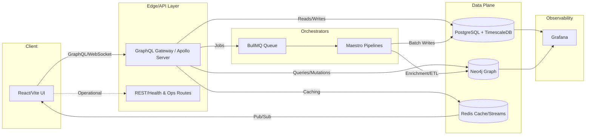

[](docs/Copilot-Playbook.md)
[](https://coderabbit.ai)
[](https://github.com/BrianCLong/summit/actions/workflows/ci-lint-and-unit.yml)
[](https://github.com/BrianCLong/summit/actions/workflows/ga-gate.yml)
[](https://github.com/BrianCLong/summit/actions/workflows/ci-golden-path.yml)
[](docs/dev/radar-dashboard.md)
[](https://github.com/BrianCLong/summit/actions/workflows/security.yml)
[](https://github.com/BrianCLong/summit/actions/workflows/release.yml)
[](https://github.com/prettier/prettier)
[](https://www.typescriptlang.org/)

## 🎉 **NEW in v2.0.0** (December 2025)

**Summit v2.0.0 is a major release** consolidating 12,000+ PRs into an enterprise-grade intelligence platform:

- ✅ **Enterprise Infrastructure**: Load balancing, multi-tier caching, telemetry
- ✅ **Advanced AI/ML**: Multimodal extraction with 8 Black Projects modules
- ✅ **Security Hardening**: Rate limiting, GraphQL complexity limits, IDOR fixes
- ✅ **Real-Time Systems**: Narrative simulation engine with REST API

**[View Release Notes](docs/archive/root-history/CHANGELOG-v2.0.0.md)** | **[Migration Guide](docs/archived/MIGRATION-v0.1-to-v2.0.md)** | **[Roadmap](docs/roadmap.md)**

---

# Summit (IntelGraph)

> **Enterprise Intelligence Platform** - Graph analytics, real-time collaboration, and AI-driven insights for high-stakes environments.

## 🚀 Quickstart (< 60 Seconds)

We follow a **"Golden Path"** philosophy. If the build breaks, we stop and fix it.

**Prerequisites:** Docker Desktop ≥ 4.x, Node.js 20.11.0 (matches `.tool-versions`), pnpm 9, Python 3.11+.

### Setup

```bash
# 1. Clone & Bootstrap
git clone https://github.com/BrianCLong/summit.git
cd summit
make bootstrap

# 2. Start the Stack (Docker)
make up

# 3. Verify (Smoke Test)
make smoke
```

### GA Gate (Pre-Flight)

Before submitting PRs or deploying, run the enforced GA Gate:

```bash
make ga
```

This runs the full readiness sequence:

1. Lint & Unit Tests
2. Clean Environment Reset
3. Deep Health Checks
4. End-to-End Smoke Tests
5. Security Scanning

### GA Readiness

Follow the **[GA Operator Handbook](docs/ga/OPERATOR_HANDBOOK.md)** for the clone→production rollout path, golden-path commands (`make bootstrap && make up && make smoke`), env/secrets, health probes, backups, and scaling knobs. Use the **[Runbooks](docs/ga/RUNBOOKS.md)** for the top operational incidents and quick fixes.

**That's it.** You now have a running stack with API, UI, Graph DB, and Relational DB.

### Service Endpoints

- **Frontend**: http://localhost:3000
- **GraphQL API**: http://localhost:4000/graphql (Apollo Playground)
- **Neo4j Browser**: http://localhost:7474 (User: `neo4j`, Pass: `devpassword`)
- **Adminer**: http://localhost:8080 (Postgres Admin)
- **Grafana**: http://localhost:3001 (Observability)

👉 **[Detailed Onboarding Guide](docs/ONBOARDING.md)**

---

## 🏗️ Architecture

Summit is built on a modern, distributed stack designed for scalability, observability, and auditability.

### System Topology



### Subsystem Map

- **APIs**: GraphQL gateway with health/ops routes; subscriptions for live investigations; WebSockets used for collaboration.
- **Data flows**: Ingest → Normalize → Persist (Neo4j + Postgres/Timescale) → Enrich (Maestro + BullMQ) → Serve (GraphQL + subscriptions) → Observe (Grafana/metrics).
- **Orchestration**: Maestro pipelines schedule enrichment, entity resolution, and policy enforcement jobs; BullMQ handles job dispatch and retry semantics.
- **Security & compliance**: ABAC/OPA checks guard mutations; audit trails land in Postgres; provenance metadata is included in graph mutations.

### Reference Material

- 👉 **[Developer Architecture Overview](docs/developer/architecture-overview.md)**
- 👉 **[Full Architecture Guide](docs/ARCHITECTURE.md)**

---

## 📦 Release Cadence

We operate on a **2-week sprint cycle** managed by our automated Release Captain, **Jules**.

- **Current Status**: Q4 2025 Strategic Sprints (Sprint 25+).
- **Process**: Merge Train -> Golden Path CI -> Automated Release.
- **Versioning**: Semantic Versioning (vX.Y.Z).

👉 **[View Release Cadence & Process](docs/RELEASE_CADENCE.md)**

---

## 📏 Known Limits & Supportability

Summit ships with explicit, evidence-backed limits covering scale, performance, and operational boundaries. Review the current declarations and update them as new validation runs complete.

👉 **[Known Limits](docs/LIMITS.md)**

---

## 🤝 Contributing

We welcome contributions from humans and AI agents alike!

- **Atomic PRs**: One feature per PR.
- **Bootstrap First**: Run `pnpm bootstrap` to ensure dependencies are installed.
- **Verify Before Commit**: Run `pnpm verify` to check GA features and structure.
- **Golden Path**: Ensure `pnpm lint && pnpm verify && pnpm build` passes before submitting.
- **Testing Conventions**: Use Jest for unit tests, node-native for verification. See [TESTING.md](TESTING.md).
- **Bots/Co-authors**: Please sign your commits and follow our [Agent Guidelines](AGENTS.md).

👉 **[Read the Contributing Guide](CONTRIBUTING.md)**

---

## ✅ CI & Quality Gates

Our CI pipeline ("Fast Lane") enforces high standards:

1.  **Lint**: Fast static analysis (ESLint + Ruff).
2.  **Verify**: Deterministic verification suite for GA features (Auth, Rate Limits, Policies, etc.). **BLOCKS CI on failure.**
3.  **Test**: Jest unit and integration tests.
4.  **Golden Path**: Full-stack integration test (`make smoke`) in a clean environment.
5.  **Security**: SAST, Dependency Scanning, Secret Detection.

**New in this release:** We've established a deterministic verification suite using node-native tests (tsx + node:assert) to avoid Jest ESM/CJS brittleness. See [TESTING.md](TESTING.md) for details.

---

## 📚 Documentation

- **[Documentation Index](docs/README.md)**: The central hub for all docs.
- **[Onboarding](docs/ONBOARDING.md)**: Detailed setup guide.
- **[API Reference](docs/api/README.md)**: GraphQL and REST API details.
- **[Security](SECURITY.md)**: Security policy and reporting.

---

## 📄 License

**Summit Enterprise Edition**: Proprietary (see [LICENSE](LICENSE)).
**Historical Open Source**: MIT (see [OSS-MIT-LICENSE](OSS-MIT-LICENSE)).

---

**Summit Platform** - Next-Generation Intelligence Analysis
