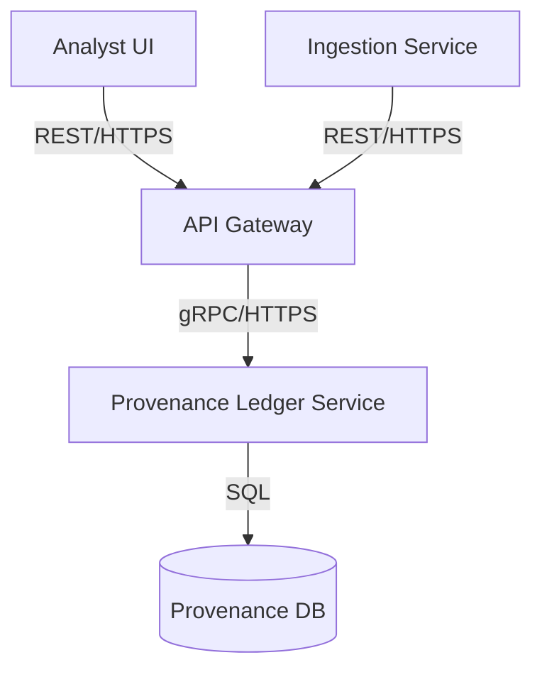

# Threat Model: Provenance Ledger Service

## 1. Context Diagram

## 2. Threat Identification
### STRIDE (System)
| Threat | Description |
| --- | --- |
| Spoofing | Unauthenticated actor sends forged ledger updates |
| Tampering | Malicious modification of ledger entries or audit trails |
| Repudiation | Actors deny submitting or reading ledger records |
| Information Disclosure | Ledger exposes sensitive attribution data |
| Denial of Service | Flooding ledger with writes/read queries |
| Elevation of Privilege | Bypass role-based checks to alter provenance |

### LINDDUN (Data)
| Threat | Description |
| --- | --- |
| Linkability | Ledger events can be correlated to identify individuals |
| Identifiability | Clear text IDs reveal contributor identities |
| Non-repudiation | Immutable logs could violate right to erasure |
| Detectability | Access patterns reveal analyst interest |
| Information Disclosure | Metadata leakage through insecure transport |
| Unawareness | Contributors unaware their data is tracked |
| Non-compliance | Ledger storage violates data-retention policies |

## 3. DREAD-lite Ranking
| Threat | Damage | Likelihood | Score |
| --- | --- | --- | --- |
| Spoofing ledger updates | 4 | 3 | 12 |
| Tampering with entries | 5 | 3 | 15 |
| Info disclosure of records | 4 | 4 | 16 |
| Denial of service | 3 | 4 | 12 |
| Linkability of users | 4 | 2 | 8 |

## 4. Mitigations & Code Tasks
| Threat | Mitigation | Code Task |
| --- | --- | --- |
| Spoofing | Mutual TLS + JWT auth | Implement JWT verification in `prov-ledger/app/auth.py` |
| Tampering | Append-only + checksums | Add hash chaining to ledger writes in `prov-ledger/app/ledger.py` |
| Info Disclosure | Encrypt data at rest + PII hashing | Integrate field-level encryption in `prov-ledger/app/models.py` |
| DoS | Rate limiting | Add middleware rate limiter in `prov-ledger/app/server.py` |
| Linkability | Pseudonymize user IDs | Replace IDs with salted hashes in `prov-ledger/app/models.py` |

## 5. Automated Checks
- **Lint rules:** enforce no plaintext secrets (`no-secret-string` ESLint rule).
- **Secret scanning:** run `gitleaks` in CI.
- **Dependency audit:** run `npm audit` and `pip-audit` for Python components.

