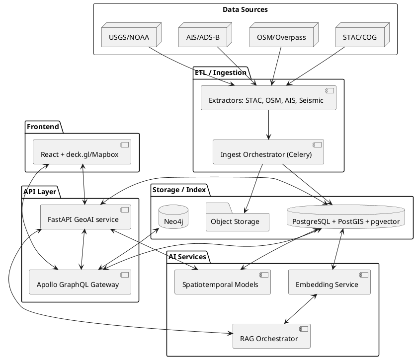

# GEOINT Spatiotemporal AI Blueprint

This document outlines the mission and high-level architecture for the GEOINT and spatiotemporal intelligence sprint. It summarizes the key objectives, data models, services, and deliverables required to build a fused geospatial, temporal, and semantic analysis stack.

## Objectives

- Ingest, normalize, and index geospatial, temporal, and textual data using open standards such as STAC, PostGIS, and GeoParquet.
- Provide natural language geospatial queries via a retrieval-augmented generation (RAG) pipeline combining spatial, temporal, and semantic filtering.
- Develop predictive models for trajectories and environmental anomalies.
- Render interactive maps with overlays, heatmaps, and AI annotations using Mapbox GL and deck.gl.

## High-Level Architecture

## Core Data Model

The system stores entities, locations, events, observations, and embeddings in PostGIS with pgvector support. Spatial geometries use SRID 4326 and are indexed with GiST. Temporal fields use timestamp with time zone and btree indexes.

## RAG-Based Spatial Query

A FastAPI endpoint `/rag/spatial` performs spatial and temporal pre-filtering in PostGIS, ranks results using pgvector cosine similarity, and returns contextual summaries for analysts.

## Predictive Modeling

Initial models include:

- **Trajectory forecasting** using a GRU network trained on movement observations.
- **Seismic anomaly detection** using statistical models such as ARIMA or IsolationForest.

Forecasts and anomalies are written back to the `events` table for downstream visualization and alerting.

## Frontend Integration

The React frontend uses Mapbox GL and deck.gl to render layers and heatmaps. Analysts can toggle overlays and review AI-generated annotations directly on the map.

## Deliverables

- Operational ingestion pipelines for multiple high-value datasets.
- RAG-based geospatial search service exposed through GraphQL.
- Predictive models for at least two event types.
- Interactive geospatial visualization module.
- Documentation and diagrams for spatial and temporal data flows.

