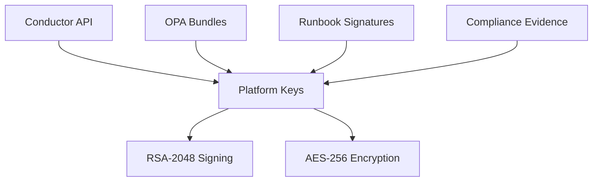
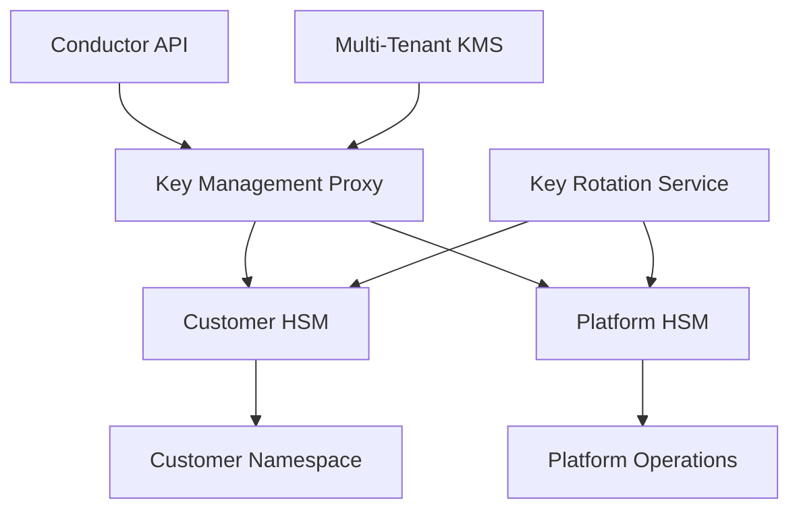
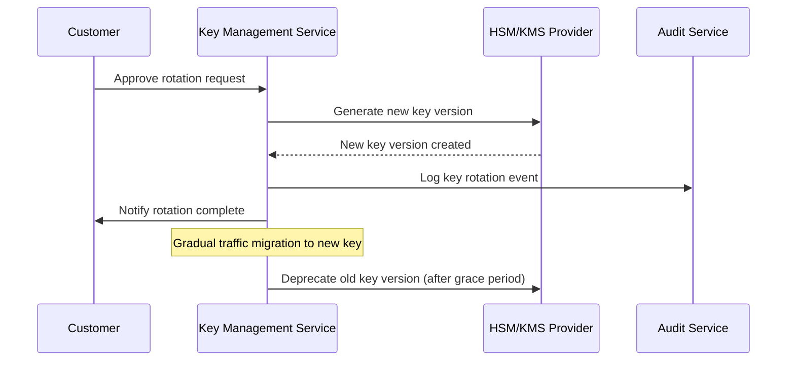

# BYOK/HSM Security Roadmap - Conductor Omniversal System

**Version**: 1.0  
**Owner**: Security Engineering + Platform  
**Effective Date**: 2025-08-31  
**Target Delivery**: H1 2026  

## Executive Summary

This roadmap defines the implementation of Bring Your Own Key (BYOK) and Hardware Security Module (HSM) capabilities for Conductor, enabling enterprise customers to maintain sovereign control over cryptographic keys while leveraging our platform's orchestration capabilities.

### Business Drivers
- **Enterprise Requirements**: F500 customers require key sovereignty for compliance
- **Regulatory Compliance**: SOC2, FedRAMP, FIPS 140-2 Level 3 requirements  
- **Competitive Advantage**: BYOK differentiates from orchestration-only competitors
- **Revenue Impact**: Unlocks $2M+ enterprise deals blocked by key management requirements

### Success Criteria
- FIPS 140-2 Level 3 certified HSM integration
- Customer-managed key rotation with <5min RPO
- Zero-knowledge architecture for tenant key isolation
- 99.99% key availability SLA with <100ms crypto operations

## Architecture Overview

### Current State (Baseline)



**Limitations:**
- Platform-managed keys only
- Single shared keyspace  
- No customer key sovereignty
- Limited to software-based crypto

### Target State (BYOK/HSM)



**Capabilities:**
- Customer-controlled key lifecycle
- HSM-backed operations (FIPS 140-2 L3)
- Tenant key isolation with cryptographic boundaries
- Automated key rotation with customer approval
- Multi-region key replication and disaster recovery

## Implementation Phases

### Phase 1: Foundation (Q4 2025) - 8 weeks

**Scope**: Core BYOK infrastructure and AWS KMS integration

**Key Components:**
1. **Key Management Service (KMS) Abstraction Layer**
   - Unified interface for multiple KMS providers
   - Tenant-aware key routing and isolation
   - Audit logging and access controls

2. **AWS KMS Integration** 
   - Customer-managed CMKs in their AWS accounts
   - Cross-account key access with least privilege
   - Automatic key rotation scheduling

3. **Crypto Operations Refactoring**
   - Replace direct crypto calls with KMS abstraction
   - Implement envelope encryption for large payloads  
   - Add crypto performance monitoring

**Acceptance Criteria:**
- [ ] Customer can create CMK in their AWS account
- [ ] Conductor routes crypto operations to customer CMK
- [ ] <200ms p95 latency for signature operations
- [ ] Audit trail captures all key usage

**Example Integration:**
```typescript
// Customer-managed key configuration
interface CustomerKeyConfig {
  tenantId: string;
  kmsProvider: 'aws' | 'azure' | 'gcp' | 'hsm';
  keyIdentifier: string; // ARN, resource ID, etc.
  crossAccountRole: string; // For AWS assumed role access
  permissions: KeyPermission[];
}

// Unified crypto interface
interface ConductorCrypto {
  sign(data: Buffer, keyId: string): Promise<Buffer>;
  verify(signature: Buffer, data: Buffer, keyId: string): Promise<boolean>;
  encrypt(plaintext: Buffer, keyId: string): Promise<EncryptResult>;
  decrypt(ciphertext: Buffer, keyId: string): Promise<Buffer>;
}
```

### Phase 2: Enterprise HSM (Q1 2026) - 12 weeks

**Scope**: Dedicated HSM integration for maximum security

**Key Components:**
1. **HSM Integration**
   - AWS CloudHSM cluster deployment
   - PKCS#11 interface implementation
   - High availability and load balancing

2. **Customer HSM Onboarding**
   - Luna Network HSM support
   - Thales payShield integration
   - Customer-premises HSM connectivity via VPN/DirectConnect

3. **Advanced Key Operations**
   - Multi-signature workflows for sensitive operations
   - Key escrow and recovery procedures
   - Cryptographic policy enforcement

**Acceptance Criteria:**
- [ ] FIPS 140-2 Level 3 compliance certification
- [ ] Customer can connect their own HSM appliances
- [ ] Multi-party authorization for key operations
- [ ] Sub-5ms p95 latency for HSM operations

**HSM Architecture:**
```yaml
# CloudHSM cluster configuration
hsm_cluster:
  availability_zones: 3
  instance_type: hsm1.medium  
  backup_retention: 90_days
  authentication: multi_factor
  
# Customer HSM connectivity
customer_hsm:
  connection_types:
    - vpn_tunnel
    - direct_connect  
    - private_link
  supported_vendors:
    - thales
    - luna_network
    - utimaco
```

### Phase 3: Key Lifecycle Management (Q2 2026) - 10 weeks

**Scope**: Automated key rotation and lifecycle operations

**Key Components:**
1. **Automated Key Rotation**
   - Customer-configurable rotation schedules
   - Zero-downtime key transitions
   - Rollback capabilities for failed rotations

2. **Key Versioning and History**
   - Immutable key version tracking
   - Historical signature verification
   - Compliance audit trails

3. **Disaster Recovery**
   - Cross-region key replication
   - Emergency key recovery procedures
   - Business continuity validation

**Acceptance Criteria:**
- [ ] 90-day default rotation with customer override
- [ ] <5min RPO for key recovery operations
- [ ] Historical signatures remain valid post-rotation
- [ ] Disaster recovery tested monthly

**Key Rotation Flow:**


### Phase 4: Multi-Cloud & Advanced Features (Q2 2026) - 8 weeks

**Scope**: Multi-cloud support and advanced cryptographic features

**Key Components:**
1. **Multi-Cloud KMS Support**
   - Azure Key Vault integration
   - Google Cloud KMS support  
   - Cross-cloud key federation

2. **Advanced Crypto Features**
   - Post-quantum cryptography readiness
   - Homomorphic encryption for confidential compute
   - Zero-knowledge proofs for compliance

3. **Regulatory Compliance Packages**
   - FedRAMP compliance toolkit
   - EU GDPR data residency controls
   - Industry-specific compliance (HIPAA, PCI, SOX)

**Acceptance Criteria:**
- [ ] Customer can use keys across AWS, Azure, GCP
- [ ] Post-quantum algorithms available for pilot customers  
- [ ] FedRAMP moderate certification achieved
- [ ] Data residency controls per jurisdiction

## Technical Implementation Details

### Key Management Architecture

```typescript
// Multi-provider key management interface
interface KeyProvider {
  readonly name: string;
  readonly capabilities: CryptoCapability[];
  
  createKey(spec: KeySpec): Promise<KeyIdentifier>;
  rotateKey(keyId: KeyIdentifier, schedule: RotationSchedule): Promise<void>;
  sign(keyId: KeyIdentifier, data: Buffer): Promise<Signature>;
  encrypt(keyId: KeyIdentifier, plaintext: Buffer): Promise<Ciphertext>;
  getKeyMetadata(keyId: KeyIdentifier): Promise<KeyMetadata>;
}

// Tenant-aware key routing
class TenantKeyManager {
  async routeKeyOperation(
    tenantId: string, 
    operation: CryptoOperation
  ): Promise<CryptoResult> {
    const keyConfig = await this.getKeyConfig(tenantId);
    const provider = this.getProvider(keyConfig.provider);
    
    // Apply tenant policies and audit logging
    await this.validateOperation(tenantId, operation);
    const result = await provider.execute(operation);
    await this.auditOperation(tenantId, operation, result);
    
    return result;
  }
}
```

### Security Controls

**Multi-Tenant Isolation:**
- Cryptographic namespace separation per tenant
- Key access policies enforced at HSM level
- Cross-tenant operation prevention via OPA policies

**Audit and Compliance:**
- Immutable audit logs for all key operations
- Real-time SIEM integration for suspicious activity
- Compliance report generation (SOC2, ISO 27001)

**Threat Model Mitigations:**
- **Key Exfiltration**: HSM-backed keys never leave secure boundary
- **Privilege Escalation**: Multi-party authorization for sensitive operations  
- **Side Channel Attacks**: FIPS 140-2 Level 3 certified HSMs
- **Quantum Threats**: Post-quantum algorithm support roadmap

### Performance & Scalability

**Latency Targets:**
- HSM Operations: <5ms p95
- Software KMS: <100ms p95  
- Key Rotation: <5min total time
- Disaster Recovery: <15min RTO

**Throughput Requirements:**
- 10,000 signature ops/sec per HSM cluster
- 1,000 simultaneous key rotation operations
- 99.99% availability SLA with geographic redundancy

**Cost Optimization:**
- Tiered pricing based on key usage and security level
- Reserved capacity discounts for enterprise customers
- Spot pricing for non-critical development workloads

## Integration Points

### Conductor Components

| Component | Integration Type | Key Usage |
|-----------|------------------|-----------|
| **Router v2** | Signature verification | Decision authenticity |
| **Runbook Registry** | Digital signing | Runbook integrity |
| **Compliance Engine** | Evidence encryption | Audit trail protection |
| **Edge Sync** | Message authentication | CRDT operation validation |
| **OPA Policies** | Bundle signing | Policy integrity |

### Customer Integration

**Onboarding Flow:**
1. Customer provisions KMS/HSM in their environment
2. Customer grants Conductor cross-account access (minimal permissions)
3. Conductor validates key access and runs integration tests
4. Customer approves production key operations via approval workflow
5. Gradual rollout with monitoring and validation checkpoints

**Ongoing Operations:**
- Weekly key health checks and compliance validation
- Monthly disaster recovery testing  
- Quarterly key rotation (customer configurable)
- Annual security assessment and penetration testing

## Risk Management

### High-Impact Risks

| Risk | Probability | Impact | Mitigation |
|------|-------------|--------|------------|
| **Customer key unavailable** | Medium | High | Multi-region replication, emergency procedures |
| **HSM hardware failure** | Low | High | HA cluster, automatic failover |
| **Compliance certification delays** | Medium | Medium | Early third-party assessment, buffer time |
| **Performance degradation** | Low | Medium | Load testing, capacity planning |
| **Security vulnerability** | Low | High | Threat modeling, security reviews |

### Contingency Plans

**Key Unavailability:**
1. Automatic failover to backup HSM/region
2. Graceful degradation to cached signatures (read-only)
3. Emergency recovery procedures with customer approval
4. Communication plan and customer notifications

**Compliance Issues:**
1. Immediate suspension of non-compliant operations
2. Customer notification within 4 hours
3. Remediation plan with timeline
4. Third-party audit validation

## Budget & Resource Planning

### Development Costs

| Phase | Engineering (FTE-months) | Infrastructure | Third-party | Total |
|-------|--------------------------|----------------|-------------|-------|
| Phase 1 | 6 | $15K | $25K | $165K |
| Phase 2 | 9 | $45K | $75K | $345K |
| Phase 3 | 8 | $25K | $35K | $260K |
| Phase 4 | 6 | $35K | $45K | $230K |
| **Total** | **29** | **$120K** | **$180K** | **$1M** |

### Operational Costs (Annual)

- **HSM Infrastructure**: $240K (AWS CloudHSM clusters)
- **Compliance/Auditing**: $120K (FedRAMP, SOC2, penetration testing)
- **Support & Maintenance**: $180K (24/7 operations, key recovery)
- **Total Annual OpEx**: $540K

### Revenue Projections

- **Target Customers**: 25 enterprise accounts by end of H1 2026
- **Average Deal Size**: $500K annually (20% premium for BYOK/HSM)
- **Revenue Impact**: $12.5M annual recurring revenue
- **ROI**: 8.5x over 3 years

## Success Metrics & KPIs

### Technical Metrics
- **Key Operation Latency**: <100ms p95 for all operations
- **System Availability**: 99.99% uptime for key services
- **Security Incidents**: Zero key compromise or unauthorized access
- **Compliance Score**: 100% control coverage for SOC2/FedRAMP

### Business Metrics  
- **Customer Adoption**: 25 enterprise customers using BYOK/HSM
- **Deal Velocity**: 30% faster enterprise sales cycle
- **Customer Satisfaction**: >90% CSAT for security/compliance
- **Competitive Wins**: 50% win rate vs. key management requirements

### Operational Metrics
- **Key Rotation Success**: 99.9% automated rotation success rate
- **Recovery Time**: <15min RTO for key service restoration  
- **Support Tickets**: <2% of operations result in support tickets
- **Cost Efficiency**: <$10 per 10K key operations

## Governance & Compliance

### Security Reviews
- **Architecture Review**: Security team approval required for each phase
- **Threat Modeling**: Updated quarterly with external security consultant
- **Penetration Testing**: Annual testing by third-party firm
- **Compliance Validation**: Quarterly SOC2 control testing

### Change Management
- **Customer Communication**: 30-day notice for breaking changes
- **Rollback Procedures**: Tested rollback plan for each release
- **Emergency Procedures**: 24/7 on-call for key service issues
- **Documentation**: Maintained customer playbooks and runbooks

### Legal & Regulatory
- **Data Processing Agreements**: Updated for BYOK key handling
- **Export Controls**: FIPS/EAR compliance for cryptographic components
- **Insurance**: Professional liability coverage for key management
- **Incident Response**: Legal notification procedures for key events

---

**Next Steps:**
1. **Executive Approval**: Present roadmap to leadership for budget approval
2. **Customer Advisory Board**: Validate requirements with pilot customers  
3. **Vendor Selection**: RFP process for HSM partners and compliance auditors
4. **Team Formation**: Hire crypto engineering talent and security specialists
5. **Phase 1 Kickoff**: Begin AWS KMS integration development

**Document Control:**
- **Next Review**: 2025-11-30
- **Distribution**: Security Engineering, Platform, Product, Sales, Legal
- **Approval**: [CISO], [VP Engineering], [VP Product]