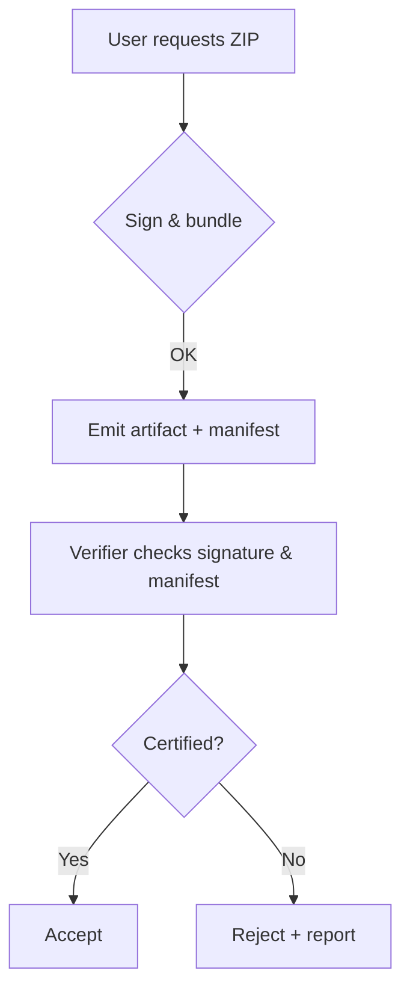

## Overview

## Verification Process

```mermaid
flowchart TD
  A[User requests ZIP] --> B{Sign & bundle}
  B -->|OK| C[Emit artifact + manifest]
  C --> D[Verifier checks signature & manifest]
  D --> E{Certified?}
  E -->|Yes| F[Accept]
  E -->|No| G[Reject + report]
```
