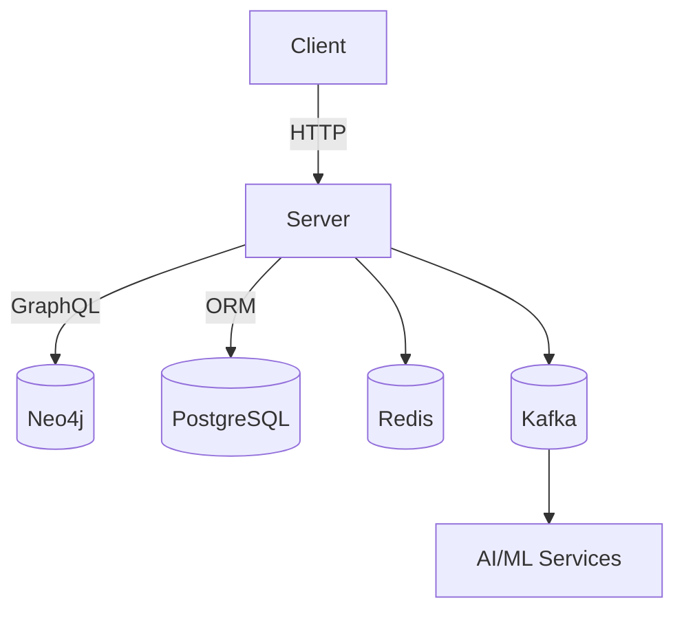
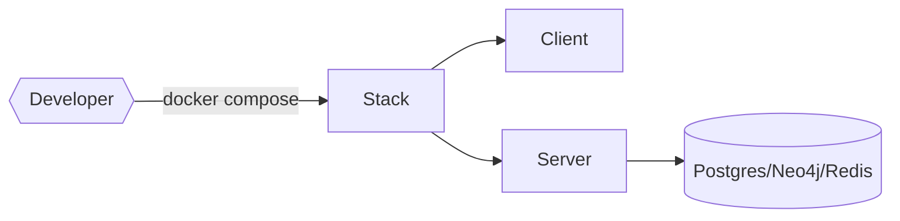

# Architecture

## System Overview

```mermaid
graph TD
  UI[Client] -->|HTTP| Server
  Server -->|GraphQL| Neo4j[(Neo4j)]
  Server -->|ORM| Postgres[(PostgreSQL)]
  Server --> Redis[(Redis)]
  Server --> Kafka[(Kafka)]
  Kafka --> AI[AI/ML Services]
```

## Deployment Flow

```mermaid
flowchart LR
  Dev{{Developer}} -->|docker compose| Stack
  Stack --> Client
  Stack --> Server
  Server --> Databases[(Postgres/Neo4j/Redis)]
```
