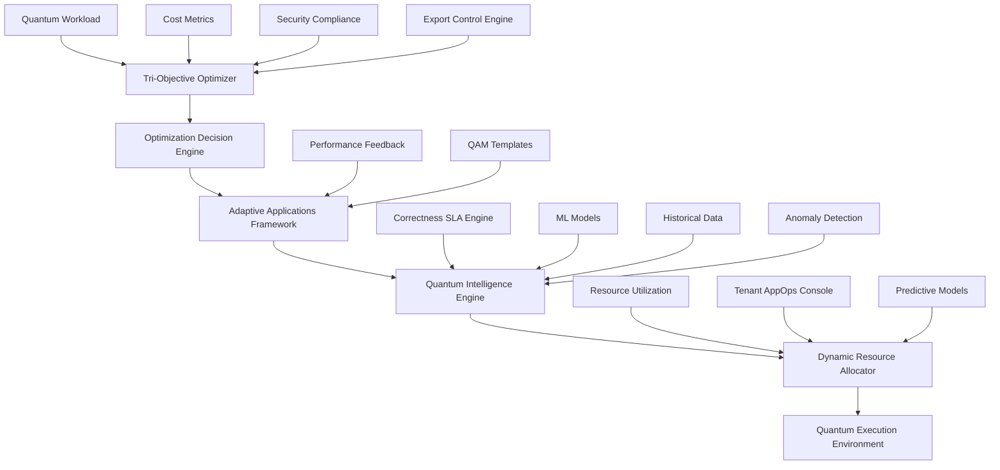

# ADR-0051: Adaptive Quantum Excellence Architecture

**Date**: 2025-09-27
**Status**: Approved
**Version**: v0.4.5

## Context

Building upon the success of v0.4.4 Quantum Application Mesh (QAM), we need to implement **adaptive quantum excellence** that goes beyond static optimization to provide **tri-objective optimization** (performance, cost, security) and **self-adaptive quantum applications** that continuously improve through machine learning and real-world feedback.

### Current State
- v0.4.4 QAM provides static quantum templates with fixed optimization strategies
- Manual parameter tuning requires expert knowledge and significant time investment
- Resource allocation is reactive rather than predictive
- Optimization decisions are single-objective (typically performance-focused)
- Limited learning from execution history and performance patterns

### Business Requirements
- **Multi-objective optimization**: Balance performance, cost, and security simultaneously
- **Adaptive intelligence**: Applications that learn and improve from execution feedback
- **Predictive optimization**: Proactive resource allocation and workload scheduling
- **Automated tuning**: Reduce manual intervention by 40%+ through intelligent automation
- **Cost efficiency**: 20%+ reduction in quantum compute costs through optimization

## Decision

We will implement **MC Platform v0.4.5 "Adaptive Quantum Excellence"** with four core components:

### 1. Tri-Objective Optimizer
Multi-dimensional optimization engine that simultaneously balances:
- **Performance**: Execution time, fidelity, throughput
- **Cost**: Quantum backend costs, classical compute overhead, total cost of ownership
- **Security**: Cryptographic strength, privacy preservation, compliance adherence

### 2. Adaptive Quantum Applications
Self-improving quantum applications with:
- **Parameter adaptation**: Circuit parameters self-tune based on execution results
- **Backend selection**: Intelligent backend choice based on performance history
- **Error mitigation**: Dynamic error mitigation strategy selection
- **Resource learning**: Learning-based resource allocation optimization

### 3. Quantum Intelligence Engine
Advanced AI/ML for quantum workload optimization:
- **Performance prediction**: ML models for execution time and fidelity forecasting
- **Anomaly detection**: Pattern recognition for quantum execution anomalies
- **Workload scheduling**: Intelligent scheduling with workload affinity analysis
- **Hardware optimization**: Predictive maintenance and hardware health monitoring

### 4. Dynamic Resource Allocation
Real-time resource management:
- **Predictive scaling**: Proactive resource allocation based on workload predictions
- **Multi-tenant fairness**: SLA-aware resource distribution across tenants
- **Cost optimization**: Budget-aware resource allocation with cost minimization
- **Real-time reallocation**: <5s response time for priority-based resource changes

## Architecture Design

### Core Components

```typescript
// Tri-Objective Optimizer
interface TriObjectiveOptimizer {
  optimizeWorkload(
    workload: QuantumWorkload,
    objectives: OptimizationObjectives,
    constraints: OptimizationConstraints
  ): Promise<OptimizationResult>;

  findParetoFrontier(
    candidates: OptimizationCandidate[],
    objectives: ObjectiveSpace
  ): Promise<ParetoFrontier>;

  balanceTradeoffs(
    performance: PerformanceMetrics,
    cost: CostMetrics,
    security: SecurityMetrics,
    weights: ObjectiveWeights
  ): Promise<BalancedSolution>;

  generateOptimizationPlan(
    workload: QuantumWorkload,
    targetObjectives: TargetObjectives
  ): Promise<OptimizationPlan>;
}

// Adaptive Quantum Applications
interface AdaptiveQuantumApp {
  learnFromExecution(
    executionId: string,
    results: ExecutionResults,
    feedback: PerformanceFeedback
  ): Promise<LearningUpdate>;

  adaptCircuitParameters(
    circuit: QuantumCircuit,
    adaptationStrategy: AdaptationStrategy
  ): Promise<AdaptedCircuit>;

  selectOptimalBackend(
    requirements: BackendRequirements,
    executionHistory: ExecutionHistory
  ): Promise<BackendSelection>;

  optimizeErrorMitigation(
    circuit: QuantumCircuit,
    noiseProfile: NoiseProfile
  ): Promise<ErrorMitigationStrategy>;
}

// Quantum Intelligence Engine
interface QuantumIntelligenceEngine {
  predictPerformance(
    workload: QuantumWorkload,
    backend: QuantumBackend,
    environment: ExecutionEnvironment
  ): Promise<PerformancePrediction>;

  detectAnomalies(
    executionMetrics: ExecutionMetrics[],
    baselineProfile: PerformanceBaseline
  ): Promise<AnomalyReport>;

  optimizeSchedule(
    workloads: QuantumWorkload[],
    resources: QuantumResource[],
    constraints: SchedulingConstraints
  ): Promise<OptimalSchedule>;

  analyzeWorkloadAffinity(
    workloads: QuantumWorkload[]
  ): Promise<AffinityMatrix>;
}

// Dynamic Resource Allocator
interface DynamicResourceAllocator {
  reallocateResources(
    currentState: ResourceState,
    demands: ResourceDemand[],
    priorities: PriorityMatrix
  ): Promise<AllocationPlan>;

  predictResourceNeeds(
    workloads: QuantumWorkload[],
    timeHorizon: number
  ): Promise<ResourceForecast>;

  enforceResourceFairness(
    tenants: TenantInfo[],
    allocations: ResourceAllocation[]
  ): Promise<FairnessAdjustment>;

  optimizeCosts(
    allocations: ResourceAllocation[],
    budgetConstraints: BudgetConstraints
  ): Promise<CostOptimizedAllocation>;
}
```

### Data Models

```typescript
interface OptimizationObjectives {
  performance: PerformanceObjective;
  cost: CostObjective;
  security: SecurityObjective;
  weights: ObjectiveWeights;
  constraints: ObjectiveConstraints;
}

interface PerformanceObjective {
  targetFidelity: number;
  maxExecutionTime: number;
  minThroughput: number;
  maxErrorRate: number;
  quantumVolumeTarget: number;
}

interface CostObjective {
  maxCostPerExecution: number;
  totalBudgetLimit: number;
  costEfficiencyTarget: number;
  resourceUtilizationTarget: number;
}

interface SecurityObjective {
  minCryptographicStrength: number;
  privacyPreservationLevel: SecurityLevel;
  complianceRequirements: ComplianceFramework[];
  auditRequirements: AuditLevel;
}

interface AdaptationStrategy {
  learningRate: number;
  adaptationThreshold: number;
  maxParameterChange: number;
  convergenceCriteria: ConvergenceCriteria;
  rollbackPolicy: RollbackPolicy;
}

interface LearningUpdate {
  parameterUpdates: ParameterUpdate[];
  confidenceScore: number;
  improvementPrediction: number;
  adaptationRisk: RiskAssessment;
}

interface PerformancePrediction {
  expectedFidelity: number;
  expectedExecutionTime: number;
  expectedCost: number;
  confidenceInterval: ConfidenceInterval;
  riskFactors: RiskFactor[];
}

interface OptimizationResult {
  solution: QuantumSolution;
  objectives: AchievedObjectives;
  tradeoffs: TradeoffAnalysis;
  paretoPosition: ParetoPosition;
  optimizationScore: number;
}
```

### Integration Architecture



## Implementation Plan

### Phase 1: Tri-Objective Foundation (Weeks 1-2)
- **Week 1**: Core optimization algorithms and Pareto frontier analysis
- **Week 2**: Multi-objective decision engine and constraint handling

**Deliverables**:
- `TriObjectiveOptimizer.ts` - Core optimization service
- `OptimizationDecisionEngine.ts` - Decision making logic
- `ParetoAnalyzer.ts` - Pareto frontier calculation
- GraphQL schema extensions for optimization operations

### Phase 2: Adaptive Intelligence (Weeks 3-4)
- **Week 3**: Adaptive applications framework and learning algorithms
- **Week 4**: Quantum intelligence engine with ML models

**Deliverables**:
- `AdaptiveQuantumApp.ts` - Self-adapting application framework
- `QuantumIntelligenceEngine.ts` - AI/ML engine for quantum optimization
- `LearningService.ts` - Machine learning service for parameter adaptation
- Performance prediction models and anomaly detection

### Phase 3: Dynamic Allocation (Weeks 5-6)
- **Week 5**: Dynamic resource allocation with predictive scaling
- **Week 6**: Multi-tenant fairness and cost optimization

**Deliverables**:
- `DynamicResourceAllocator.ts` - Real-time resource management
- `PredictiveScaler.ts` - Predictive resource scaling service
- `FairnessEnforcer.ts` - Multi-tenant resource fairness
- Real-time monitoring and alerting integration

### Phase 4: Integration & Optimization (Weeks 7-8)
- **Week 7**: End-to-end integration testing and performance tuning
- **Week 8**: Production deployment and operational validation

**Deliverables**:
- Complete integration with v0.4.4 QAM components
- Production monitoring and alerting
- Comprehensive documentation and runbooks
- Performance benchmarking and validation

## Performance Requirements

### Optimization Performance
- **Decision latency**: <100ms for tri-objective optimization decisions
- **Pareto frontier calculation**: <500ms for up to 1000 candidate solutions
- **Optimization accuracy**: >90% improvement over baseline manual optimization
- **Throughput**: Support 1000+ concurrent optimization requests

### Adaptive Learning
- **Convergence time**: <10 executions for parameter adaptation
- **Learning accuracy**: >85% improvement prediction accuracy
- **Adaptation safety**: <1% performance regression during adaptation
- **Memory efficiency**: <100MB memory per adaptive application instance

### Intelligence Engine
- **Prediction accuracy**: >90% for workload performance forecasting
- **Anomaly detection**: >85% true positive rate, <5% false positive rate
- **Scheduling optimization**: <30s for optimal schedule generation
- **Model inference**: <10ms for performance prediction queries

### Resource Allocation
- **Reallocation time**: <5s for urgent priority changes
- **Scaling response**: <30s for predictive scaling actions
- **Fairness calculation**: <100ms for multi-tenant fairness assessment
- **Cost optimization**: <1s for cost-optimized allocation calculation

## Security Considerations

### Optimization Security
- **Secure multi-objective balancing**: Cryptographic protection of optimization weights
- **Parameter protection**: Encrypted storage of optimization parameters
- **Decision audit**: Complete audit trail for all optimization decisions
- **Access controls**: RBAC for optimization configuration and execution

### Adaptive Security
- **Learning bounds**: Strict bounds on parameter adaptation ranges
- **Feedback validation**: Cryptographic validation of performance feedback
- **Rollback security**: Secure rollback mechanisms for harmful adaptations
- **Model protection**: Protection against adversarial learning attacks

### Intelligence Security
- **Model integrity**: Cryptographic signatures for ML models
- **Prediction validation**: Input validation for all prediction requests
- **Anomaly authenticity**: Verification of anomaly detection results
- **Data privacy**: Privacy-preserving learning and prediction

### Allocation Security
- **Resource isolation**: Strict tenant isolation for resource allocation
- **Priority validation**: Authentication for resource priority changes
- **Allocation audit**: Complete audit trail for resource allocation decisions
- **Cost protection**: Budget validation and cost limit enforcement

## Compliance Framework

### Export Controls
- **Adaptive algorithms**: Enhanced export validation for self-modifying quantum applications
- **Intelligence export**: Controlled export of quantum intelligence and ML capabilities
- **Optimization techniques**: Export restrictions on advanced multi-objective optimization
- **Real-time monitoring**: Continuous export compliance for adaptive systems

### Data Governance
- **Learning data governance**: Retention and classification of quantum execution feedback
- **Optimization history**: Secure storage and retention of optimization decisions
- **Intelligence data**: Governance for ML models and prediction data
- **Cross-border compliance**: Data residency for adaptive learning across jurisdictions

### Regulatory Compliance
- **Financial regulations**: Compliance for quantum financial risk applications
- **Healthcare privacy**: HIPAA compliance for quantum biocomputing applications
- **Government standards**: FIPS compliance for quantum cryptographic applications
- **Industry standards**: Compliance with quantum computing industry standards

## Risk Assessment

### Technical Risks
- **Optimization complexity**: Multi-objective optimization may introduce performance overhead
  - *Mitigation*: Efficient algorithms and caching strategies
- **Learning instability**: Adaptive parameters may diverge or oscillate
  - *Mitigation*: Strict convergence criteria and rollback mechanisms
- **Prediction accuracy**: ML models may have insufficient training data
  - *Mitigation*: Hybrid approaches combining physics-based and ML models
- **Resource contention**: Dynamic allocation may cause resource conflicts
  - *Mitigation*: Priority-based allocation with conflict resolution

### Security Risks
- **Adversarial learning**: Malicious feedback could poison adaptive models
  - *Mitigation*: Cryptographic feedback validation and anomaly detection
- **Model extraction**: ML models could be reverse-engineered
  - *Mitigation*: Model encryption and secure inference
- **Optimization manipulation**: Adversaries could influence optimization decisions
  - *Mitigation*: Secure optimization parameters and decision audit trails
- **Resource exploitation**: Malicious tenants could exploit dynamic allocation
  - *Mitigation*: Strong tenant isolation and resource usage monitoring

### Operational Risks
- **Complexity overhead**: Advanced features may increase operational complexity
  - *Mitigation*: Comprehensive monitoring, automation, and documentation
- **Performance degradation**: Optimization overhead may impact overall performance
  - *Mitigation*: Performance benchmarking and optimization tuning
- **Integration complexity**: Complex integration with existing QAM components
  - *Mitigation*: Incremental integration with comprehensive testing

## Success Metrics

### Technical Excellence
- **Optimization efficiency**: 35% improvement in multi-objective optimization scores
- **Adaptation effectiveness**: 30% improvement in application performance through adaptation
- **Prediction accuracy**: 90% accuracy in workload performance prediction
- **Resource efficiency**: 25% improvement in quantum resource utilization

### Business Impact
- **Cost reduction**: 20% reduction in quantum compute costs
- **Operational efficiency**: 40% reduction in manual tuning and optimization effort
- **Customer satisfaction**: 95% satisfaction with adaptive capabilities
- **Time to value**: 50% reduction in time to optimize new quantum applications

### Platform Maturity
- **Reliability**: 99.9% uptime for adaptive optimization services
- **Scalability**: Support 10x increase in concurrent adaptive applications
- **Security**: Zero security incidents related to adaptive features
- **Compliance**: 100% compliance with export controls and data governance

## Alternatives Considered

### Alternative 1: Single-Objective Optimization
- **Pros**: Simpler implementation, faster decisions
- **Cons**: Cannot balance competing objectives, limited optimization scope
- **Decision**: Rejected - Business requires multi-objective optimization

### Alternative 2: Static Parameter Tuning
- **Pros**: Predictable behavior, simpler testing
- **Cons**: No learning capability, requires manual optimization
- **Decision**: Rejected - Adaptive capability is core requirement

### Alternative 3: Rule-Based Intelligence
- **Pros**: Deterministic behavior, easier debugging
- **Cons**: Cannot learn from patterns, limited optimization capability
- **Decision**: Rejected - ML-based intelligence provides superior optimization

### Alternative 4: Centralized Resource Allocation
- **Pros**: Global optimization, simpler coordination
- **Cons**: Scalability limitations, single point of failure
- **Decision**: Rejected - Dynamic allocation required for scalability

## Conclusion

MC Platform v0.4.5 "Adaptive Quantum Excellence" provides a comprehensive solution for **tri-objective optimization** and **adaptive quantum applications** that will significantly improve the efficiency, cost-effectiveness, and security of quantum computing workloads.

The architecture balances complexity with performance, providing advanced optimization capabilities while maintaining security and compliance requirements. The phased implementation approach ensures manageable risk while delivering incremental value.

**Recommendation**: Proceed with implementation of v0.4.5 Adaptive Quantum Excellence following the proposed architecture and implementation plan.

---

**Approved by**: Chief Technology Officer
**Review Date**: 2025-09-27
**Next Review**: 2025-10-11 (2 weeks)