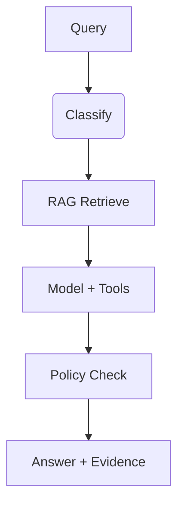

# Enterprise Doc & Graph Copilot Blueprint

This blueprint answers questions over internal documents and knowledge graphs with provenance and policy-aware guardrails.

## Architecture
- Graph-based flow: classify → retrieve (docs + graph) → model with tools → policy checks → response + evidence.
- Governance: tenant/region/sensitivity enforced via `PolicyContext`.
- Telemetry: RAG, model, tool, and policy spans emitted via `TraceEmitter`.

## Usage
- Configure policies in `config/policy.yaml`.
- Configure telemetry sinks in `config/telemetry.yaml`.
- Run the reference flow locally: `bash scripts/demo.sh "How do we handle SOC 2 evidence?"`.

