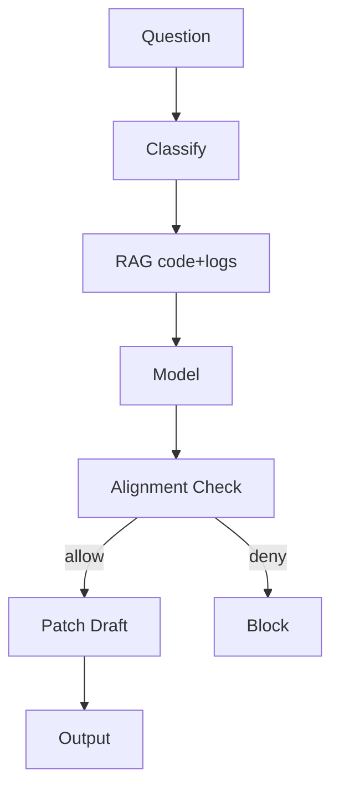

# Developer Console Assistant Blueprint

Answers questions over code, CI/CD logs, and configs; optionally proposes patches with policy-aware safeguards.

## Architecture
- Intent classifier → RAG over code/logs → model → alignment checks → optional patch tool → response with trace.
- Governance: secret/license/safety checks embedded via `PolicyContext` and alignment step.
- Telemetry: patch proposals fingerprinted and logged to DX dashboard sinks.

## Usage
- Configure guardrails in `config/policy.yaml`.
- Demo: `bash scripts/demo.sh "Summarize failing tests"`.

