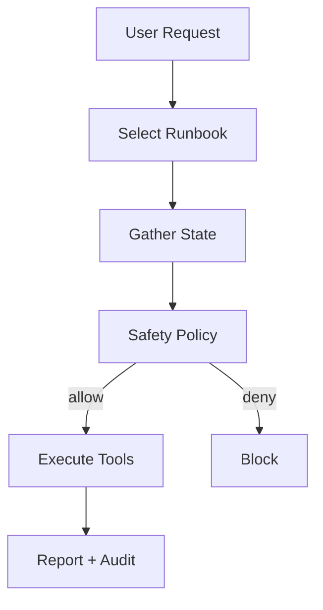

# Tool-Native Operations Agent Blueprint

Executes operational runbooks with typed tools, safety checks, and telemetry suitable for SRE and governance.

## Architecture
- Intent classification → runbook selection → state gathering → safety policy → execution → audit summary.
- Governance: blast-radius and change-window checks enforced before write operations.
- Telemetry: each tool span tagged with runbook ID, tenant, and risk level.

## Usage
- Update allowed tools/policies in `config/policy.yaml`.
- Run `bash scripts/demo.sh "restart search service"` to see the mock flow.

