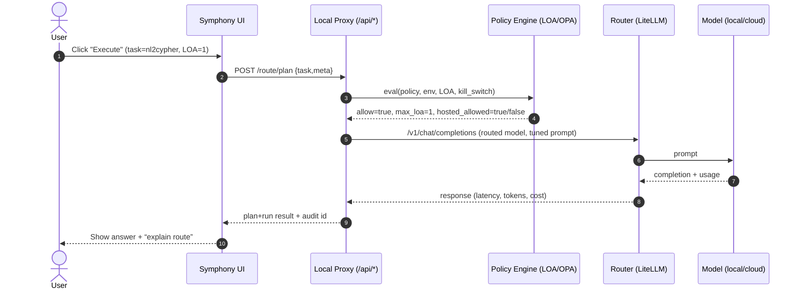
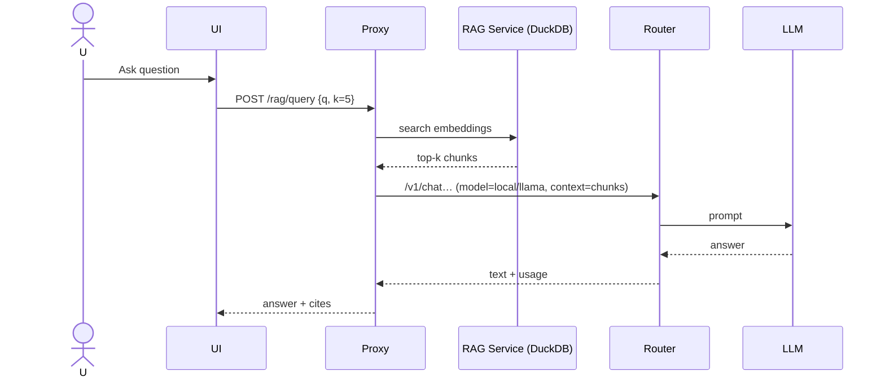
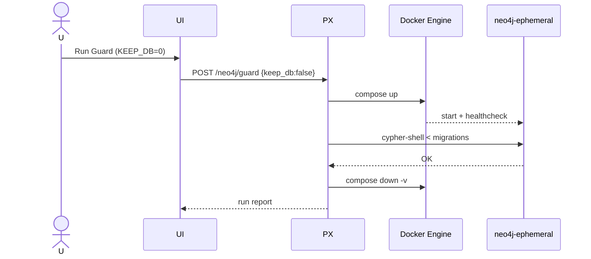
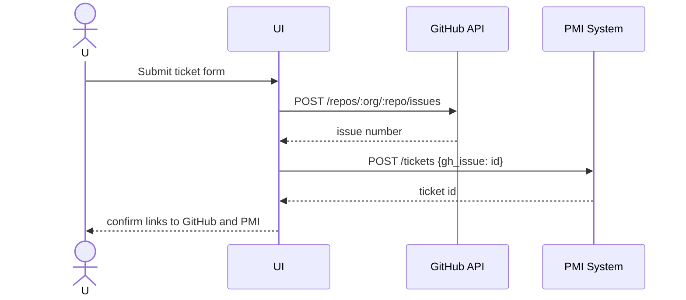
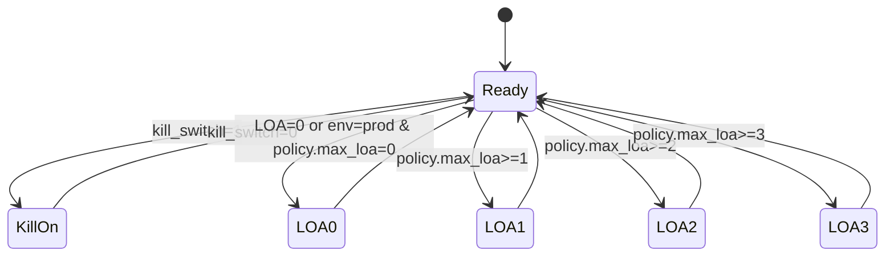
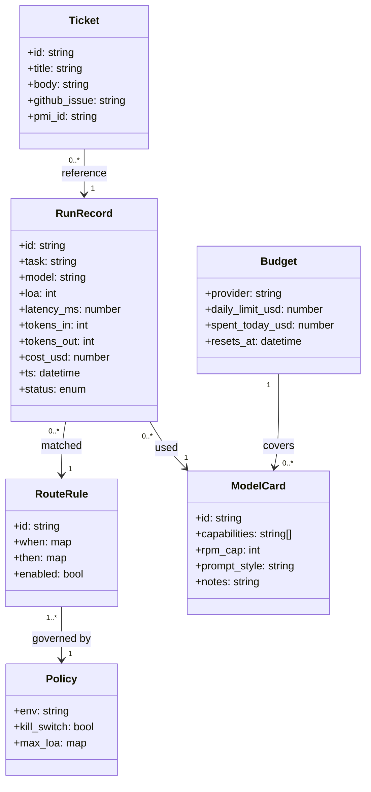
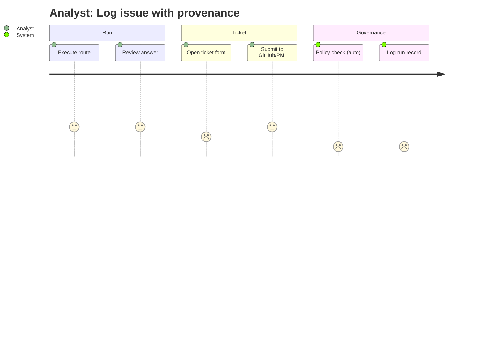

# Symphony UI Wireframe and UML Pack

This document captures a tool-agnostic blueprint for the Symphony Orchestrator UI. It mirrors the current feature set and adds integration notes for premium model controls, GitHub connectivity, and ticketing into the PMI system.

---

## IA / Sitemap

```mermaid
flowchart TB
    A[Landing / Dashboard] --> B[Routing Studio]
    A --> C[RAG Console]
    A --> D[Neo4j Guard]
    A --> E[Budgets & Burndown]
    A --> F[Policies & LOA]
    A --> G[Observability / Logs]
    A --> H[CI & Chaos]
    A --> I[Docs & Runbooks]
    A --> J[GitHub & Tickets]

    B --> B1[Models & Aliases]
    B --> B2[Rule Tests / Dry-Run]
    B --> B3[Execution / Plan → Run]
    C --> C1[Query]
    C --> C2[Context View]
    C --> C3[Sources]
    D --> D1[Migrations]
    D --> D2[Run Disposable DB]
    D --> D3[Inspect / Shell]
    E --> E1[Minute]
    E --> E2[Hour]
    E --> E3[Daily]
    F --> F1[Policy Editor]
    F --> F2[LOA Guardrails]
    F --> F3[Kill-Switch]
    G --> G1[Live Stream]
    G --> G2[Search/Filters]
    G --> G3[Latency & Error Rates]
    H --> H1[Config Validate]
    H --> H2[Smoke Test]
    H --> H3[Chaos Drills]
    I --> I1[Onboarding]
    I --> I2[Incident Playbooks]
    I --> I3[Release Checklist]
    J --> J1[Create Ticket]
    J --> J2[Repo Browser]
    J --> J3[PMI Sync]
```



---

## Low-fi Wireframes (ASCII)

### 1) Dashboard

```
┌───────────────────────────────────────────────────────────────────────────────┐
│  SYMPHONY  ▸ Dashboard          ENV: dev  LOA:1  Kill:OFF  Time: 12:34:56Z   │
│  Models: 7  | Ollama: UP | LiteLLM: UP | Neo4j: UP | Federation: READY       │
├───────────────────────────────────────────────────────────────────────────────┤
│  [Health: GREEN]  p50: 120ms  p95: 480ms   RPS: 1.2   RAG Fresh: 7m          │
│  [Budgets] OpenRouter: $0 / $10 (0%)  reset 00:12:32                         │
├───────────────┬────────────────────────────────────────┬──────────────────────┤
│ Quick Actions │ Burndown (last 60s / 1h / daily)      │ Queue / Errors       │
│ [Run Smoke]   │ [██████▏   ] rpm cap…  reset m:00     │ Queue: 12            │
│ [Chaos Drill] │ model: local/llama  req:14 p50 90ms   │ Errors(15m): 0       │
│ [ValidateCfg] │ model: …-cpu     req:10 p50 180ms     │ DLQ: 0               │
├───────────────┴────────────────────┬───────────────────┴──────────────────────┤
│ Recent Routes (10)                 │ Recent Logs (tail)                        │
│ task  model         LOA  cost tok  │ 12:34 model=local/llama p95=…             │
│ nl2cy …/llama       1    0.000     │ 12:34 route plan ok                       │
│ rag    …/qwen-coder 1    0.000     │ 12:33 neo4j guard applied 001…            │
└───────────────────────────────────────────────────────────────────────────────┘
```

### 2) Routing Studio (with premium model controls)

```
┌───────────────────────────────────────────────────────────────────────────────┐
│ Routing Studio                          [Run Dry-Run]  [Execute Now]         │
├───────────────────────────────────────────────────────────────────────────────┤
│ Task Meta                                                                    │
│ Task: [nl2cypher ▼]  LOA:[1 ▼]  Tenant:[default ▼]  Cost Cap:[$0.00]         │
│ Premium: [Enable Hosted Models ▢]  Budget Cap:[$10]                          │
├───────────────────────────────┬───────────────────────────────────────────────┤
│ Rule Preview                  │ Prompt Preview                                │
│ when env=prod → hosted:off   │ [system] You are Orion…                        │
│ when task=nl2cypher → model… │ [user] Graph schema: … → produce Cypher        │
├───────────────────────────────┴───────────────────────────────────────────────┤
│ Model Candidates: local/llama (p50 90ms), …/cpu (p50 180ms), openrouter/…     │
│ Decision: local/llama  Confidence: 0.82   [Explain]                          │
└───────────────────────────────────────────────────────────────────────────────┘
```

### 3) RAG Console

```
┌───────────────────────────────────────────────────────────────────────────────┐
│ RAG Console                 Index: 4 files • Updated: 10m ago                │
├──────────────────────────┬────────────────────────────────────────────────────┤
│ Query                    │ Answer (with [1][2] cites)                         │
│ [ how do we run neo4j… ] │ "Use cypher-shell in disposable DB…"               │
│ [ Ask ] [ Settings ]     │                                                    │
├──────────────────────────┴────────────────────────────────────────────────────┤
│ Top Context Chunks [1..5]   │ Source Files                                    │
│ [1] … cypher-shell…         │ rag/corpus/neo4j_guard.txt                      │
│ [2] … migrations…           │ docs/…                                          │
└───────────────────────────────────────────────────────────────────────────────┘
```

### 4) Neo4j Guard

```
┌───────────────────────────────────────────────────────────────────────────────┐
│ Neo4j Guard                         MIG_DIR: db/migrations  KEEP_DB: [ ]     │
├──────────────────────────┬────────────────────────────────────────────────────┤
│ Migrations               │ Console                                            │
│ 001_init.cypher  ✓       │ > Run                                              │
│ 002_people.cypher        │ Applying 001…  OK                                  │
│                          │ Bolt ready at :7687                                │
└──────────────────────────┴────────────────────────────────────────────────────┘
```

### 5) Budgets & Burndown

```
┌───────────────────────────────────────────────────────────────────────────────┐
│ Burndown & Budgets                                                           │
├───────────────────────────────────────────────────────────────────────────────┤
│ Minute Window (reset 12:45:00Z)                                              │
│ local/llama      [███████▏        ] 14/60 rpm  p50 90ms                      │
│ local/llama-cpu  [█████▏          ] 10/60 rpm  p50 180ms                     │
│ Daily Budgets (reset 00:00Z)                                                 │
│ openrouter       [                    ] $0 / $10  (0%)                        │
└───────────────────────────────────────────────────────────────────────────────┘
```

### 6) GitHub & Ticketing

```
┌───────────────────────────────────────────────────────────────────────────────┐
│ GitHub & Tickets                  Repo: symphony/summit                       │
├──────────────────────────┬────────────────────────────────────────────────────┤
│ New Ticket               │ Activity                                           │
│ Title: [______________]  │ #123 fix routing rule                              │
│ Body:  [______________]  │ #122 add neo4j guard docs                          │
│ [Submit to GitHub]       │ [Sync PMI] [Refresh]                               │
└──────────────────────────┴────────────────────────────────────────────────────┘
```

---

## Key Interaction Flows (UML)

### A) Route decision + execution



### B) RAG query



### C) Neo4j guard disposable run



### D) Ticket creation to GitHub/PMI



---

## State Machine — LOA / Kill-switch



---

## Component & Deployment (UML)

```mermaid
graph LR
  subgraph Browser
    UI[Symphony UI]
  end

  subgraph LocalHost
    PX[Local Proxy (/api, CORS, allowlist)]
    LL[LiteLLM Gateway :4000]
    OL[Ollama :11434]
    RG[RAG (DuckDB + index)]
    NG[Neo4j Guard Script + Docker]
    BD[Burndown Generator]
    GH[GitHub Connector]
    PMI[PMI Ticket Bridge]
  end

  subgraph External
    OR[OpenRouter]
    HF[HuggingFace Inference]
    GitHub[GitHub]
    PMISvc[PMI]
  end

  UI <--> PX
  PX <--> LL
  LL <--> OL
  PX <--> RG
  PX <--> NG
  PX --> BD
  LL --> OR
  LL --> HF
  PX --> GH
  PX --> PMI
  GH --> GitHub
  PMI --> PMISvc
```

---

## Data Model



---

## User Journey: Analyst creates ticket from run



---

## Screen-level Components

- **Nav Sidebar**: Dashboard, Routing, RAG, Guard, Budgets, Policies, Logs, CI/Chaos, Docs, GitHub/Tickets.
- **Header badges**: `ENV`, `LOA`, `Kill`, clock; service chips including premium models.
- **Cards**: 12px radius, subtle shadow, 8/12/24 spacing.
- **Tables**: sticky header, monospace metrics.
- **Bars**: burndown progress + reset countdown.
- **Action Tray**: right-side drawer for Quick Actions or "Explain route".
- **Ticket Form**: inputs for title/body, buttons for GitHub submit and PMI sync.

Accessibility: contrast ≥4.5:1, keyboard navigation, aria-labels; live regions for auto-refresh.

---

## API Endpoints (UI contract)

- `GET /status/health.json`
- `GET /status/burndown.json`
- `POST /route/plan`
- `POST /route/execute`
- `POST /rag/query`
- `POST /neo4j/guard`
- `GET /models`
- `GET /logs?tail=...&filter=...`
- `POST /policy/validate`
- `GET /policy` / `PUT /policy`
- `POST /tickets/github` → create issue
- `POST /tickets/pmi` → sync to PMI system

---

## KPIs

- Instant: RPS, p50/p95, queue depth, error rate (15m).
- Burndown: req/min vs cap, daily budget vs spent.
- RAG freshness: last index time + file count.
- Guard: last run status + duration.
- Governance: overrides count, kill-switch status, LOA drift events.
- Ticketing: open tickets count, last sync time.

---

## Build Order

1. Dashboard: health & burndown cards.
2. Routing Studio: plan/execute, premium toggles, "Explain" modal.
3. RAG Console: query, answers, citations.
4. Neo4j Guard: run + stream.
5. Policies: YAML editor + validate.
6. Logs: tail with filters.
7. Budgets: bars + countdown.
8. CI/Chaos: proxy actions.
9. GitHub/Tickets: create issue and PMI sync.

