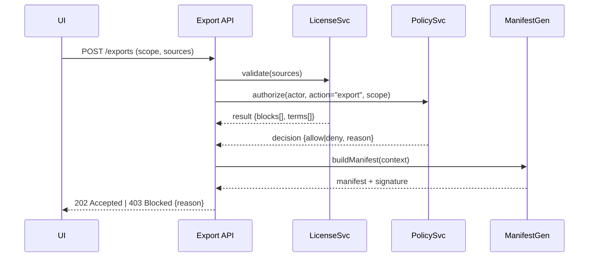

# [P0] Export Provenance & License Enforcement — Ready‑to‑Merge PR Package

> Tickets: EXP‑2010, SEC‑712 • Feature Flag: `exportProvenanceV2` • Clients: Orion, Aegis (prod + staging)

## 1) PR Title & One‑liner
**Title:** Fix/Enhancement: Exports include cryptographically bound provenance manifest and enforce source licensing & policy at request time
**One‑liner:** Every export now ships with verifiable provenance (who/what/why/when), license terms, and policy labels; UI blocks disallowed exports with clear reasons and appeal path.

## 2) Scope & Impact
- **In scope:** export request flow (UI/API), manifest generation/signing, license/policy checks, error states, telemetry, a11y, docs.
- **Out of scope:** downstream archival tooling, non‑export sharing features.
- **Risk:** High (compliance). Mitigations: feature flag, canary, server‑side allowlist, rollback.

## 3) Rollout Plan
- **Flag:** `exportProvenanceV2`
- **Canary:** `orion-staging` 10%→50%→100% over 24h; then `aegis-staging`.
- **Guardrails:** block‑rate < 5% (expected for restricted datasets); export p95 ≤ 4s for 100MB bundles.
- **Runbook:** `runbooks/export_provenance_v2.md` added below.

## 4) Problem Statement (Observed)
- Exports currently lack a machine‑readable manifest; downstream users cannot verify origin, filters, or license constraints.
- UI allows initiating exports that should be prohibited by source terms or policy (silent failure in API leading to user confusion and support tickets).

## 5) Desired Outcomes
1) **Provenance:** Bundle includes `/manifest.json` and `/README.md` capturing query hash, time range, filters, panes used, dataset/source inventory, user/role/legal basis, policy labels, and a detached signature.
2) **License/Policy Enforcement:** UI validates preflight; API revalidates. If any source forbids export or role lacks basis, block with human‑readable reason and cite clause.
3) **Transparency:** UI shows a summary of licenses included; users must acknowledge terms before download.

## 6) UX / UI Changes
### 6.1 Export Modal
- Sections:
  1. **Scope** (row count, time range, filters)
  2. **Included Sources** with license chips (e.g., CC‑BY‑4.0, Vendor‑EULA‑2024)
  3. **Policy & Terms** — checkbox: “I acknowledge the license terms and retention limits.” (disabled if any hard block)
  4. **Provenance** — note: “Bundle includes manifest + signature for audit.”
- States to implement: Default | Loading | Error (actionable) | Policy‑Blocked (reason text + appeal link) | Unauthorized | Offline.
- A11y: ARIA labels for sections; focus management; live region for status.

### 6.2 Inline Block Banner (on attempt)
- Compact banner above CTA: “Export blocked by **Vendor‑EULA‑2024 §3.2 (no redistribution)**. Request access or remove restricted sources.” [Request access]

## 7) Architecture & Contracts
### 7.1 Data Model Additions
```ts
// types/export.ts
export type ExportManifest = {
  version: '2.0';
  createdAt: string;              // ISO8601
  requestId: string;              // UUID
  query: { hash: string; range: {start: string; end: string; tz: string}; filters: Record<string, any> };
  views: { timeline: boolean; map: boolean; graph: boolean };
  actor: { userId: string; role: string; tenant: string; legalBasis?: string };
  policy: { labels: string[]; decisions: Array<{ subject: string; action: string; allowed: boolean; reason?: string }> };
  sources: Array<{ id: string; name: string; license: { id: string; name: string; url?: string; allowsExport: boolean; requiresAttribution?: boolean; retentionDays?: number } }>;
  metrics: { rowCount: number; byteSize: number };
  signature: { alg: 'ed25519'; digest: string; publicKeyId: string };
}
```

### 7.2 Server Flow


### 7.3 Signing
- Server signs `manifest.json` digest with Ed25519. Public key rotated quarterly; `publicKeyId` references JWKS endpoint.

## 8) API Changes
```http
POST /v2/exports
Body: { scope, sources[], acknowledgeTerms: boolean }
Responses:
- 202 { exportId }
- 400 { error: 'terms_ack_required' }
- 403 { error: 'policy_block', reason, policyId }
- 409 { error: 'license_block', reason, licenseId }
```

## 9) Telemetry & Observability
- **OTEL Spans:** `export.request`, `export.license.validate`, `export.policy.check`, `export.bundle.write`, `export.complete`, `export.blocked` (attrs: reason, policyId|licenseId).
- **Prom Metrics:** `export_latency_ms` histogram; `export_blocked_total{type=policy|license}`; `export_size_bytes`.
- **UI Analytics:** `ui.export_opened`, `ui.export_blocked`, `ui.export_ack_terms`, `ui.export_success`.

## 10) Security, Privacy, Governance
- Enforce ABAC/RBAC on export endpoint; require legal basis if tenant policy mandates.
- Manifest redacts sensitive field values but includes field names for reproducibility.
- README admonitions include license text excerpts and retention requirements.

## 11) Accessibility (WCAG 2.1 AA+)
- Keyboard reachable; SR‑friendly labels for license list and policy reason.
- Live region announces blocked reasons and completion.

## 12) Error Handling Patterns
- **Policy‑Blocked:** show specific policy name + link to policy detail; CTA: “Request access”.
- **License‑Blocked:** list offending sources; CTA: “Remove restricted sources” (opens source picker with pre‑filtered view).
- **Transient Error:** retry with backoff; preserve state.

## 13) Tests (Definition of Done)
### 13.1 Unit (server)
- License validator blocks when any `allowsExport=false`.
- Policy check denies without legal basis when required.
- Manifest includes all required fields and a verifiable signature.

### 13.2 Unit (client)
- Export modal renders license chips; disables CTA until terms acknowledged.
- Block banner shows reason text and correct CTAs.

### 13.3 E2E
- Happy path: user acknowledges → export completes → bundle contains manifest + README; signature verifies with JWKS.
- License block: include restricted source → UI shows block, no API job created.
- Policy block: role without basis → UI shows block with policy name; audit log entry created.

### 13.4 Accessibility
- axe‑core: no critical issues; SR reads block reason and CTAs.

### 13.5 Performance
- p95 export ≤ 4s for 100MB bundles; size and latency metrics emitted.

## 14) Release Notes (Customer‑facing)
**Exports** — Bundles now include a signed provenance manifest for audit. The UI previews licenses and blocks disallowed exports with clear reasons. Admins can request access or adjust policies as needed.

## 15) Runbook (Ops)
- **Dashboards:** OTEL `export.*`, Prom `export_latency_ms`, `export_blocked_total`.
- **Alerts:** spike in `export_blocked_total{type=license}` > baseline by 3σ in 30m; p95 latency > 4s for 2 intervals.
- **Keys:** rotate Ed25519 key quarterly; publish JWKS; validate manifests in periodic canary.
- **Rollback:** disable `exportProvenanceV2`; revert API to v1; keep UI modal but hide license section.

## 16) Acceptance Criteria (Gherkin)
- Given a user with role **Analyst** and legal basis **Incident Response**, when they request an export including only CC‑BY sources and acknowledge terms, then the export completes and the bundle contains `/manifest.json` and `/README.md` with a valid signature.
- Given a source with `allowsExport=false`, when the user attempts export, then the UI blocks with the license name and clause, and no export job is created.
- Given tenant policy **PII_RESTRICTED_EXPORT**, when the user’s legal basis is missing, then the API returns 403 with policy details and the UI shows “Policy‑Blocked” with a link to the policy.

## 17) Artifacts & Attachments
- **Figma:** Export Modal v2 (licenses + blocks) — attach link
- **Sample Manifests:** `fixtures/manifest_v2_ok.json`, `fixtures/manifest_v2_blocked_license.json`
- **JWKS:** `fixtures/jwks_dev.json`
- **E2E:** `apps/web/e2e/export-provenance-v2.spec.ts`
- **Docs:** `docs/help/export-manifest.md` (added)

