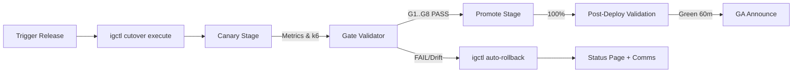

# IntelGraph GA Cutover Pack — Sprint 26 (GA: September 17, 2025)

**Owner:** Maestro Conductor (MC)  
**Scope:** GA cutover orchestration for multi‑tenant SaaS topology  
**Inputs Delivered by Eng:** Go/No‑Go Matrix (G1–G8), igctl commands, War Room dashboard, automated gate validation, cost downshift ladder, comms/status integration

---

## 1) Conductor Summary (Commit)
**Goal:** Execute GA cutover safely with automated gating, provable SLO compliance, and instant rollback readiness.  
**Non‑Goals:** Feature development, net‑new connectors, residency migration.  
**Constraints:** Org defaults (SLOs/cost guardrails), weekly release cadence, prod error‑budget ≤0.1%, budgets: infra ≤ $18k/mo, LLM ≤ $5k/mo (alert at 80%).  
**Assumptions:** Canary stages 5→25→50→100 with auto‑rollback; dashboards & alerts wired to Prometheus; SLSA‑3 evidence present for all deployable artifacts.  
**Risks:** Unexpected tenant traffic spikes, OPA policy drift, Neo4j GC pressure, k6 false positives; mitigations below.  
**Definition of Done:** All G1–G8 = PASS, evidence bundle uploaded, status page posted, post‑deploy validation green for 60 min, error budget intact, runbooks/alerts quiet.

---

## 2) Backlog & RACI (Epics → Stories → Tasks)
**E1. GA Cutover Orchestration (Owner: MC)**
- S1: Freeze window + change ticket (Ops)  
- S2: Execute canary with `igctl` (Release)  
- S3: Gate validations pipeline (QE)  
- S4: Evidence bundle + hash manifest (MC)  
- S5: Comms & status page cadence (PM / CS)

**E2. Observability & SLO Guardrails (Owner: SRE)**
- S1: Alert policies (latency, error budget burn, OPA, cost) (SRE)  
- S2: k6 perf pack run + parse (QE)  
- S3: Budget tracker & downshift ladder verification (FinOps)

**E3. Security & Provenance (Owner: SecOps)**
- S1: WebAuthn step‑up success ≥99%  
- S2: OPA policy bundle signature & latency checks  
- S3: SLSA‑3 verification per artifact

**RACI:**  
- **R:** Release Eng (igctl), SRE (alerts/runbooks), QE (k6/gates), SecOps (OPA/WebAuthn), PM/CS (comms), MC (orchestration/evidence).  
- **A:** MC.  
- **C:** Tenant Success, FinOps, Legal.  
- **I:** Exec sponsor.

---

## 3) Architecture & ADRs
**ADR‑001 Canary Strategy:** 5→25→50→100 with health‑based hold points.  
**ADR‑002 Gate Source of Truth:** `tools/igctl/go-no-go-matrix.yaml` + validator script as single truth; War Room mirrors read‑only.  
**ADR‑003 Rollback First Principle:** Rollback must be strictly faster than forward‑fix.  
**ADR‑004 Provenance:** SLSA‑3 attestations required to pass G3.



---

## 4) Data & Policy
**Canonical Entities:** tenant, user, role, policy, service, release, artifact, evidence, budget, incident.  
**PII Retention:** `short-30d` unless `legal-hold`.  
**Purpose Tags:** `investigation`, `threat-intel`, `t&s`, `benchmarking`, `demo`.

---

## 5) Go/No‑Go Gates (G1–G8)
**Source:** `tools/igctl/go-no-go-matrix.yaml` (real‑time).  
**Execution:** `igctl cutover go-no-go --validate-all` or per‑gate.

| Gate | Name | Threshold | Method | Pass/Fail Rule |
|---|---|---|---|---|
| G1 | SLO Baseline | GraphQL p95 ≤350ms; write p95 ≤700ms; availability ≥99.9% | Prometheus range queries | All thresholds green last 60m |
| G2 | Ingest Health | Batch ≥50MB/s/worker; streaming ≥1k ev/s/pod; p95 proc ≤100ms | Prom metrics + logs | ≥95% targets for 30m |
| G3 | Supply Chain | SLSA‑3 verified; SBOM clean; signatures valid | `igctl attest verify` | All artifacts verified |
| G4 | Policy/Access | OPA p95 ≤25ms; policy bundle signature valid | OPA metrics + signature check | 0 invalid/expired bundles |
| G5 | Perf & Load | k6 p95 meets API/graph targets; error ≤0.1% | `k6 run` + parser | All scenarios pass |
| G6 | Cost Guardrails | Burn < 80% budget; unit costs ≤ targets | FinOps exporter | No constraint breached |
| G7 | DR Readiness | `igctl drill rehearse` RPO ≤5m; RTO ≤60m | Drill report | Targets achieved |
| G8 | Support & Comms | Templates staged; on‑call ack; stakeholder approvals | Manual + tracker | All approvals recorded |

---

## 6) igctl Command Plan (Authoritative)
```bash
# Canary execute with auto‑rollback
igctl cutover execute \
  --strategy canary \
  --stages 5,25,50,100 \
  --auto-rollback

# Emergency rollback to last stable
igctl cutover rollback --to last-stable --confirm

# DR rehearsal (prod)
igctl drill rehearse --env prod --rpo-target 5m --rto-target 60m

# Validate all gates
igctl cutover go-no-go --validate-all
```

---

## 7) Observability & SLOs (Dashboards & Alerts)
**Primary KPIs:** GraphQL p95/p99, error rate, availability; Neo4j 1‑hop p95 ≤300ms; OPA decision p95 ≤25ms; cost budget %; WebAuthn success ≥99%.  
**Auto‑Rollback Triggers:**  
- Error budget burn >6%/h for ≥10m  
- Latency degradation >30% for ≥15m  
- Security policy failure or cost spike >3×  
**PromQL Snippets (examples):**
```promql
# Error budget burn (SLO 99.9%) over 10m
(1 - sum(rate(http_requests_total{code!~"2.."}[10m])) / sum(rate(http_requests_total[10m]))) < 0.999

# GraphQL p95
histogram_quantile(0.95, sum by (le)(rate(graphql_latency_bucket[5m])))

# OPA decision p95
histogram_quantile(0.95, sum by (le)(rate(opa_decision_duration_seconds_bucket[5m])))
```

---

## 8) Cost Guardrails & Downshift Ladder
**Budgets:** Infra ≤ $18k/mo (alert at 80%); LLM ≤ $5k/mo.  
**Unit costs:** ≤ $0.10 / 1k ingested events; ≤ $2 / 1M GraphQL calls.

**Tiers:**
1. **Observe:** enable adaptive sampling; freeze non‑critical batch jobs.  
2. **Throttle:** rate‑limit non‑P0 APIs; reduce LLM context lengths.  
3. **Shed:** pause background enrichers; cache‑only for heavy reads.  
4. **Degrade:** disable advanced analytics; reduce graph depth >2 hops.  
5. **Protect:** block new tenants; priority traffic only.  
6. **Emergency:** essential endpoints only; scale down expensive services.

Verification: synthetic requests confirm core flows remain green at each tier.

---

## 9) Security & Privacy
- WebAuthn step‑up with ≥99% success (monitor retry tails).  
- OPA ABAC via signed bundles; mTLS everywhere; field‑level encryption for sensitive attributes.  
- Provenance ledger immutable; export signing + hash manifests.

**Threat Model (STRIDE):**  
- Spoofing: enforce OIDC + WebAuthn; device binding.  
- Tampering: image signature verify, SLSA‑3.  
- Repudiation: append‑only provenance ledger.  
- Info disclosure: least privilege policies; per‑tenant scopes.  
- DoS: rate limits + downshift ladder.  
- Elevation: policy simulation gates + code‑review SBOM gates.

---

## 10) Evidence Bundle (What to Collect & Attach)
- Gate validator outputs (JSON) for G1–G8  
- k6 reports + parsed summaries  
- Prometheus snapshots (SLOs, budgets)  
- SLSA attestations; SBOMs; signature verify logs  
- DR rehearsal report (RPO/RTO)  
- War Room dashboard export (PNG + JSON)  
- Comms approval log + status page timestamps  
- Release tag `vX.Y.Z` + change ticket + hash manifest

**Export Manifest Schema (excerpt):**
```json
{
  "releaseTag": "vX.Y.Z",
  "artifacts": [{"name":"api","digest":"sha256:...","slsaLevel":"3"}],
  "gates": [{"id":"G1","status":"PASS","evidence":"..."}],
  "snapshots": ["prom://...","k6://..."],
  "signatures": [{"issuer":"ci","sig":"base64..."}]
}
```

---

## 11) GA‑Day Timeline & Runbook
**T‑60m:** Change freeze; snapshot dashboards; run `go-no-go --validate-all`.  
**T‑45m:** DR rehearsal quick‑check; verify RPO/RTO data freshness.  
**T‑30m:** Stage 5% canary; hold 10m; monitor gates auto‑loop.  
**T‑20m:** If green → 25%; hold 10m.  
**T‑10m:** If green → 50%; hold 10m.  
**T‑0:** Promote to 100%; start 60m post‑deploy validation.  
**T+15/30/45/60m:** Status updates posted; if any trigger fires, **immediate rollback**.

**Pager/Escalation:** P0 page to On‑Call SRE → Release Lead → SecOps → Exec. Ack within 5m.

**Rollback Plan:** `igctl cutover rollback --to last-stable --confirm` then lock deploys; status page major incident; root‑cause and re‑attempt only after G1–G8 re‑PASS.

---

## 12) Post‑Deploy Validation (Acceptance)
- 60m green across SLOs; zero policy errors; budgets steady.  
- Synthetic user journeys (login → query → write → graph traverse 2‑hop).  
- Tenants sampled across shards/regions.  
- Evidence bundle archived; release notes posted; change ticket resolved.

---

## 13) Risk Register & Mitigations
- **Traffic Spike:** autoscale + tiered downshift; pre‑warm caches.  
- **OPA Drift:** canary policy bundles; revert on signature mismatch.  
- **Neo4j GC:** tuned heap/page cache; circuit breaker for 3+ hop queries during cutover.  
- **k6 Noise:** require two consecutive failing windows to trip G5; human confirm.  
- **Cost Exporter Lag:** dual‑write exporter; alert on staleness >10m.

---

## 14) Acceptance Criteria & Verification Steps
1. G1–G8 PASS with evidence (automated + manual for G8).  
2. All auto‑rollback triggers armed; tested in staging.  
3. DR drill passes (RPO≤5m, RTO≤60m).  
4. Post‑deploy 60m green; error budget ≥99.9% availability maintained.  
5. Comms executed per timeline; status page reflects states with timestamps.  
6. Cost burn < 80% monthly; unit costs within targets.

---

## 15) Appendix — Query & Command References
**PromQL Library:** latency p95/p99, error rate, OPA p95, cost burn, WebAuthn success.  
**k6 Scenarios:** GraphQL reads/writes, Neo4j 1‑hop, OPA decision checks, mixed tenant traffic.  
**igctl:** execute, rollback, rehearse, go‑no‑go, attest verify.

