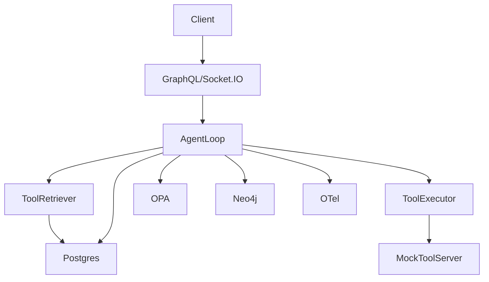

# DeepAgent-MVP

This project is a minimal, IntelGraph-compatible "DeepAgent-style" service that keeps thinking, tool discovery, and tool execution in a single reasoning loop, adds memory folding (episodic/working/tool memories), and logs provenance—all behind our GraphQL gateway and org guardrails.

## New: Governed Strategy Engine

DeepAgent now includes a **Governed Strategy Engine** that continuously scores execution strategies during each run.

- Produces explainable candidate strategies with confidence scores.
- Emits `strategy-update` events on every loop step for real-time observability.
- Powers deterministic planner fallback when LLM output is malformed.
- Exposes strategy inspection through GraphQL (`runStrategy`).

## Quickstart

1.  **Start the services:**
    ```bash
    docker-compose up -d
    ```

2.  **Start the development server:**
    ```bash
    npm run dev
    ```

    The GraphQL API will be available at `http://localhost:8080/graphql` and Socket.IO at `http://localhost:8080`.

## Architecture


```mermaid
graph TD
    Client --> GraphQL/Socket.IO
    GraphQL/Socket.IO --> AgentLoop
    AgentLoop --> ToolRetriever
    AgentLoop --> ToolExecutor
    AgentLoop --> OPA
    ToolRetriever --> Postgres
    ToolExecutor --> MockToolServer
    AgentLoop --> Postgres
    AgentLoop --> Neo4j
    AgentLoop --> OTel
```

## Example Usage

### Start a run (Mutation)

```graphql
mutation StartRun {
  startRun(input: {
    tenantId: "tenant-a",
    actor: "admin",
    task: "do something",
  }) {
    id
    status
  }
}
```

### Subscribe to run events

```graphql
subscription RunEvents {
  runEvents(runId: "your-run-id") {
    ts
    type
    data
  }
}
```

### Inspect strategy for a run

```graphql
query RunStrategy {
  runStrategy(
    runId: "your-run-id",
    task: "Investigate suspicious traffic",
    goalHints: ["prioritize high confidence evidence"]
  ) {
    generatedAt
    recommended {
      id
      label
      confidence
      nextAction
      rationale
    }
    candidates {
      id
      confidence
    }
  }
}
```

## Helm Values

### SaaS

```yaml
# values.yaml
namespace: "saas"
dataPlane: "shared"
```

### ST-DED

```yaml
# values.yaml
namespace: "customer-a"
dataPlane: "dedicated"
```
