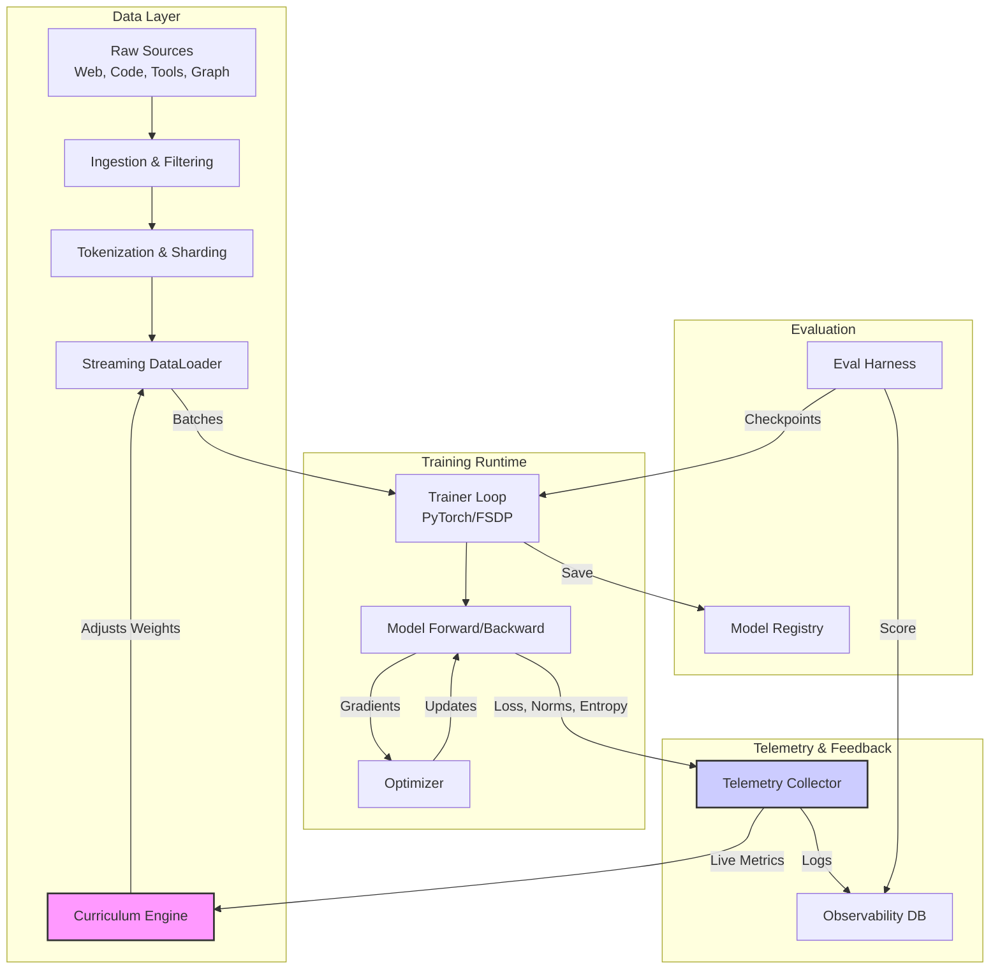

# Frontier Training Stack Architecture

## Description
The stack is designed with a closed feedback loop. Unlike traditional pipelines where the dataset is fixed, the **Curriculum Engine** dynamically adjusts the sampling weights of the **Streaming DataLoader** based on real-time signals from the **Telemetry Collector**.

- **Data Layer:** Ingests diverse sources. The key innovation is the `Curriculum Engine` which modulates the mix.
- **Training Runtime:** Standard PyTorch FSDP loop, but instrumented to emit granular internal metrics.
- **Telemetry & Feedback:** Captures not just loss, but "uncertainty" (entropy) and stability signals to drive the curriculum.
- **Evaluation:** Periodic checks to ensure the curriculum isn't overfitting or degrading general capabilities.
