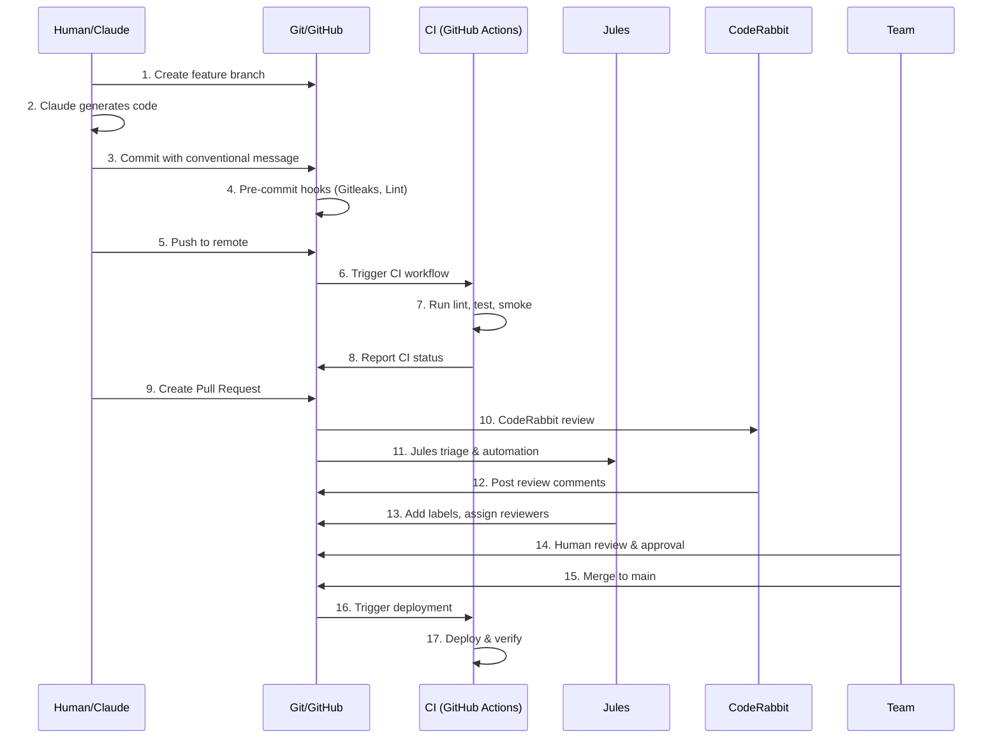

# Multi-Agent AI Workflow for Summit

> **Last Updated:** 2025-11-20
> **Purpose:** Document how multiple AI agents (Jules, Claude, Codex, GitHub Actions) collaborate on the Summit codebase.

## Table of Contents

1. [Overview](#overview)
2. [AI Agent Ecosystem](#ai-agent-ecosystem)
3. [Multi-Agent Workflow](#multi-agent-workflow)
4. [Agent-Specific Guidelines](#agent-specific-guidelines)
5. [Coordination Patterns](#coordination-patterns)
6. [Best Practices](#best-practices)
7. [Troubleshooting](#troubleshooting)

---

## Overview

Summit leverages a multi-agent AI ecosystem to accelerate development while maintaining code quality, security, and the golden path workflow. This document describes how different AI agents collaborate with each other and with human developers.

### Core Principles

1. **Golden Path First** - All agents must respect: Investigation → Entities → Relationships → Copilot → Results
2. **Human-in-the-Loop** - Critical decisions require human review and approval
3. **Incremental Validation** - Each agent validates their work before handoff
4. **Audit Trail** - All agent actions are logged and traceable
5. **Security by Default** - No agent can bypass security checks or commit secrets

---

## AI Agent Ecosystem

### 1. Claude (Anthropic)

**Role:** Primary code generation, refactoring, architecture, and documentation

**Capabilities:**
- Complex code generation and refactoring
- Architecture design and review
- Documentation writing and updates
- Test generation
- Debugging and problem-solving
- Multi-file code modifications

**Access Pattern:**
- Via Claude Code CLI or API
- Branch naming: `claude/<session-id>`
- Context window: 200K tokens
- Can read entire codebase context via CLAUDE.md

**Typical Tasks:**
```bash
# Example Claude workflow
claude code "Add authentication middleware to GraphQL API"
claude code "Refactor entity service to use repository pattern"
claude code "Generate integration tests for copilot service"
```

### 2. Jules (GitHub)

**Role:** Pull request automation, issue triage, workflow orchestration

**Capabilities:**
- Automated PR reviews and feedback
- Issue labeling and prioritization
- Workflow automation
- Code quality checks
- Security vulnerability scanning
- Dependency updates

**Access Pattern:**
- Automatically triggered on PR creation
- Branch naming: `jules/<session-id>` or any branch
- Integrates with GitHub Actions

**Typical Tasks:**
- Review PRs for code quality
- Suggest improvements and best practices
- Flag security issues
- Automate routine tasks (labeling, assignment)
- Generate PR summaries

### 3. GitHub Copilot / Codex

**Role:** In-editor code completions and suggestions

**Capabilities:**
- Real-time code suggestions
- Function and test generation
- Code explanation
- Inline documentation
- Quick fixes

**Access Pattern:**
- IDE integration (VS Code, IntelliJ, etc.)
- Context-aware suggestions based on current file
- No direct git operations

**Typical Tasks:**
- Autocomplete function implementations
- Generate boilerplate code
- Suggest test cases
- Write inline documentation

### 4. GitHub Actions (Automated CI/CD)

**Role:** Automated testing, builds, and deployments

**Capabilities:**
- Run test suites (unit, integration, E2E)
- Execute smoke tests
- Build Docker images
- Security scanning (Trivy, CodeQL, Gitleaks)
- Deploy to staging/production
- Generate SBOM and provenance

**Access Pattern:**
- Automatically triggered on push, PR, or schedule
- Configured in `.github/workflows/`

**Typical Tasks:**
- Validate golden path on every commit
- Run security scans
- Build and push container images
- Deploy to environments
- Update documentation

### 5. CodeRabbit

**Role:** Automated PR reviews with AI-powered insights

**Capabilities:**
- Deep code analysis
- Performance recommendations
- Security vulnerability detection
- Best practice enforcement
- Code complexity analysis

**Access Pattern:**
- Automatically reviews all PRs
- Provides inline comments and suggestions

---

## Multi-Agent Workflow

### Standard Development Flow



### Detailed Workflow Steps

#### Phase 1: Planning & Setup

1. **Human/Claude:** Define task scope and requirements
2. **Claude:** Review CLAUDE.md for codebase context
3. **Claude:** Create feature branch: `git checkout -b claude/<session-id>`
4. **Claude:** Plan implementation approach

#### Phase 2: Implementation

5. **Claude/Copilot:** Generate code following existing patterns
6. **Claude:** Write tests (unit, integration, E2E)
7. **Claude:** Update documentation (README, API docs, inline comments)
8. **Claude:** Run local validation:
   ```bash
   make typecheck  # Type checking
   make lint       # Linting
   make test       # Unit tests
   make smoke      # Golden path validation
   ```

#### Phase 3: Commit & Push

9. **Claude:** Stage changes: `git add <files>`
10. **Pre-commit Hooks:** Run automatically:
    - Gitleaks (secret scanning)
    - ESLint (linting)
    - Prettier (formatting)
    - Ruff/Black (Python)
11. **Claude:** Commit with conventional message:
    ```bash
    git commit -m "feat(api): add entity search endpoint

    - Implement full-text search across entity types
    - Add pagination support
    - Include relevance scoring
    - Add integration tests"
    ```
12. **Claude:** Push to remote: `git push -u origin claude/<session-id>`

#### Phase 4: Continuous Integration

13. **GitHub Actions:** Trigger CI workflow (`.github/workflows/ci.yml`):
    - Install dependencies (cached)
    - Run `make bootstrap`
    - Start services: `make up`
    - Execute smoke tests: `make smoke`
    - Run unit tests: `pnpm test`
    - Run E2E tests: `pnpm e2e`
    - Security scans: Trivy, CodeQL, Gitleaks
    - Build Docker images
    - Generate SBOM

#### Phase 5: Pull Request Review

14. **Claude/Human:** Create Pull Request with description:
    ```markdown
    ## Summary
    Adds entity search endpoint with full-text search, pagination, and relevance scoring.

    ## Changes
    - Added `searchEntities` GraphQL query
    - Implemented Neo4j full-text index
    - Added pagination with cursor-based approach
    - Included relevance scoring algorithm
    - Added integration tests with 85% coverage

    ## Testing
    - [x] Unit tests pass locally
    - [x] Integration tests pass locally
    - [x] Smoke tests pass locally
    - [x] Manual testing completed
    - [x] Documentation updated

    ## Checklist
    - [x] Code follows TypeScript conventions
    - [x] Tests included and passing
    - [x] Documentation updated
    - [x] No security vulnerabilities
    - [x] Golden path validated
    ```

15. **CodeRabbit:** Automated PR review:
    - Analyze code changes
    - Check for best practices
    - Identify potential issues
    - Suggest improvements
    - Post inline comments

16. **Jules:** Automated triage:
    - Add labels (e.g., `feature`, `api`, `needs-review`)
    - Assign reviewers based on CODEOWNERS
    - Check for merge conflicts
    - Validate PR description
    - Link related issues

17. **Human Team:** Review process:
    - Review code changes
    - Test functionality locally
    - Verify golden path
    - Approve or request changes

#### Phase 6: Merge & Deploy

18. **Human:** Approve and merge PR
19. **GitHub Actions:** Trigger release workflow:
    - Run full test suite
    - Build production images
    - Tag release
    - Deploy to staging
    - Run smoke tests on staging
    - Deploy to production
    - Update documentation

---

## Agent-Specific Guidelines

### Claude Guidelines

#### Before Starting
```bash
# 1. Pull latest changes
git checkout main
git pull origin main

# 2. Create feature branch
git checkout -b claude/<session-id>

# 3. Read context
cat CLAUDE.md  # Understand codebase structure and conventions
```

#### During Development
- Follow patterns in CLAUDE.md
- Use TypeScript types, no `any`
- Write tests for all new code
- Document complex logic
- Validate incrementally

#### Before Committing
```bash
# Run full validation suite
make typecheck
make lint
make test
make smoke

# If all pass, commit
git add .
git commit -m "feat(scope): description"
git push -u origin claude/<session-id>
```

### Jules Guidelines

Jules operates automatically but can be configured via:

**Configuration File:** `.github/jules.yml`
```yaml
version: 1
automation:
  pr_labeling: true
  issue_triage: true
  reviewer_assignment: true
  merge_queue: true

rules:
  - name: "API Changes"
    files: ["server/src/graphql/**/*.ts"]
    labels: ["api", "needs-review"]
    reviewers: ["@api-team"]

  - name: "Frontend Changes"
    files: ["client/src/**/*.tsx"]
    labels: ["frontend", "needs-review"]
    reviewers: ["@frontend-team"]
```

### GitHub Actions Guidelines

**CI Workflow:** `.github/workflows/ci.yml`
```yaml
name: CI

on:
  push:
    branches: [main]
  pull_request:
    branches: [main]

jobs:
  validate-golden-path:
    runs-on: ubuntu-latest
    steps:
      - uses: actions/checkout@v4
      - uses: actions/setup-node@v4
        with:
          node-version: 20
          cache: 'pnpm'

      - name: Bootstrap environment
        run: make bootstrap

      - name: Start services
        run: make up

      - name: Run smoke tests
        run: make smoke

      - name: Run unit tests
        run: pnpm test

      - name: Security scan
        uses: aquasecurity/trivy-action@master
```

---

## Coordination Patterns

### Pattern 1: Claude → Jules → Human

**Scenario:** Feature development with automated review

```bash
# Claude generates code
claude code "Add entity search feature"

# Claude commits and pushes
git add .
git commit -m "feat(api): add entity search"
git push

# Create PR
gh pr create --title "Add entity search" --body "..."

# Jules automatically:
# - Labels PR as "feature", "api"
# - Assigns reviewers
# - Checks for conflicts

# CodeRabbit reviews code quality

# Human reviews and merges
```

### Pattern 2: Human → Claude → CI

**Scenario:** Bug fix with validation

```bash
# Human identifies bug
gh issue create --title "Entity search returns duplicates"

# Human asks Claude to fix
claude code "Fix entity search duplicate issue in server/src/services/EntityService.ts"

# Claude fixes and tests
make test
make smoke

# Claude commits
git add .
git commit -m "fix(api): prevent duplicate entities in search results"
git push

# CI validates
# - Runs tests
# - Verifies golden path
# - Security scans
```

### Pattern 3: Copilot → Claude → CI

**Scenario:** Rapid prototyping with refinement

```bash
# Developer uses Copilot for quick implementation
# Copilot suggests code in IDE

# Developer asks Claude to refine
claude code "Refactor entity search to follow repository pattern"

# Claude improves architecture
# Claude adds tests
# Claude updates docs

# Push and validate
git push
# CI runs full validation
```

### Pattern 4: Multi-Agent Collaboration

**Scenario:** Large feature with multiple agents

```bash
# Phase 1: Planning (Human + Claude)
# Human defines requirements
# Claude designs architecture

# Phase 2: Implementation (Claude + Copilot)
# Claude generates core logic
# Copilot assists with boilerplate
# Claude writes tests

# Phase 3: Review (CodeRabbit + Jules + Human)
# CodeRabbit analyzes code quality
# Jules automates workflow
# Human makes final decision

# Phase 4: Deployment (GitHub Actions)
# CI validates changes
# Automated deployment to staging
# Smoke tests on staging
# Production deployment
```

---

## Best Practices

### For All Agents

1. **Validate Incrementally**
   - Test each change before moving forward
   - Don't batch too many changes
   - Commit frequently with clear messages

2. **Respect the Golden Path**
   - Never break Investigation → Entities → Relationships → Copilot → Results
   - Always run `make smoke` before claiming completion
   - Test against seeded data in `data/golden-path/`

3. **Maintain Security**
   - Never commit secrets or credentials
   - Run security scans before pushing
   - Use environment variables for configuration
   - Follow OWASP best practices

4. **Document Changes**
   - Update README, ONBOARDING, API docs
   - Write clear commit messages
   - Add inline comments for complex logic
   - Update CLAUDE.md if conventions change

5. **Coordinate with Other Agents**
   - Check for related PRs and issues
   - Reference related work in commit messages
   - Leave clear TODO comments for handoffs
   - Use conventional commit format

### For Claude Specifically

```typescript
// DO ✅
// 1. Use explicit types
interface SearchParams {
  query: string;
  limit: number;
  offset: number;
}

async function searchEntities(params: SearchParams): Promise<Entity[]> {
  // Implementation
}

// 2. Handle errors gracefully
try {
  const results = await searchEntities(params);
  return results;
} catch (error) {
  logger.error('Search failed', { params, error });
  throw new SearchError('Entity search failed', { cause: error });
}

// 3. Write comprehensive tests
describe('searchEntities', () => {
  it('should return entities matching query', async () => {
    // Test implementation
  });

  it('should handle pagination correctly', async () => {
    // Test implementation
  });

  it('should throw error for invalid query', async () => {
    // Test implementation
  });
});

// DON'T ❌
// 1. Don't use 'any'
async function searchEntities(params: any) {
  // Bad: No type safety
}

// 2. Don't swallow errors
try {
  const results = await searchEntities(params);
} catch (error) {
  // Bad: Silent failure
}

// 3. Don't skip tests
// Bad: No test coverage
```

---

## Troubleshooting

### Issue: CI Fails After Push

**Symptoms:** GitHub Actions CI workflow fails

**Diagnosis:**
```bash
# Check CI logs in GitHub Actions UI
# Common failures:
# - Lint errors
# - Test failures
# - Smoke test failures
# - Security scan issues
```

**Resolution:**
```bash
# 1. Pull latest changes
git pull origin main

# 2. Run validation locally
make lint      # Fix linting issues
make test      # Fix test failures
make smoke     # Fix golden path issues

# 3. Fix issues and recommit
git add .
git commit --amend --no-edit
git push --force-with-lease
```

### Issue: Merge Conflicts

**Symptoms:** Git reports conflicts when pulling or merging

**Diagnosis:**
```bash
# Check conflict files
git status

# View conflicts
git diff
```

**Resolution:**
```bash
# 1. Fetch latest changes
git fetch origin main

# 2. Rebase on main
git rebase origin/main

# 3. Resolve conflicts manually
# Edit conflicting files
# Remove conflict markers (<<<<, ====, >>>>)

# 4. Continue rebase
git add .
git rebase --continue

# 5. Force push (if already pushed)
git push --force-with-lease
```

### Issue: Pre-commit Hooks Fail

**Symptoms:** Commit rejected by pre-commit hooks

**Diagnosis:**
```bash
# Hooks run automatically:
# - Gitleaks (secrets)
# - ESLint (linting)
# - Prettier (formatting)
```

**Resolution:**
```bash
# 1. Fix linting issues
pnpm lint:fix

# 2. Format code
pnpm format

# 3. Remove any secrets
# Check for API keys, passwords, tokens

# 4. Retry commit
git add .
git commit -m "your message"
```

### Issue: Smoke Tests Fail

**Symptoms:** `make smoke` fails

**Diagnosis:**
```bash
# Check logs
make logs

# Test individual services
curl http://localhost:4000/health
curl http://localhost:3000
```

**Resolution:**
```bash
# 1. Restart services
make down
make up

# 2. Wait for services to be ready
./scripts/wait-for-stack.sh

# 3. Run smoke tests
make smoke

# 4. If still failing, check specific service logs
docker-compose logs api
docker-compose logs postgres
docker-compose logs neo4j
```

### Issue: Multiple Agents Conflicting

**Symptoms:** Two agents working on same code create conflicts

**Resolution:**
1. **Designate lead agent** - One agent owns the feature
2. **Use branch isolation** - Each agent on separate branch
3. **Coordinate timing** - Sequential rather than parallel work
4. **Human arbitration** - Human decides on conflicts
5. **Clear handoff** - Document state in commit messages

---

## Additional Resources

### Documentation
- [CLAUDE.md](../CLAUDE.md) - Complete codebase guide for AI assistants
- [CONTRIBUTING.md](../CONTRIBUTING.md) - Contribution guidelines with AI agent section
- [ONBOARDING.md](ONBOARDING.md) - 30-minute developer quickstart
- [Multi-Agent LLM Innovation Roadmap](ai/multi-agent-llm-innovation-roadmap.md) - Strategic architecture
- [Multi-Agent Frameworks 2025](multi-agent-frameworks-2025.md) - Framework comparison

### External References
- [Conventional Commits](https://www.conventionalcommits.org/)
- [GitHub Actions Documentation](https://docs.github.com/en/actions)
- [Claude Code Documentation](https://docs.anthropic.com/claude/docs)
- [GitHub Copilot Documentation](https://docs.github.com/en/copilot)

### Getting Help
- **Slack:** #summit-dev, #ai-agents
- **GitHub Discussions:** https://github.com/BrianCLong/summit/discussions
- **Documentation:** [docs/README.md](README.md)

---

> **Remember:** Multi-agent collaboration is powerful but requires discipline. Always validate, always document, always respect the golden path.
