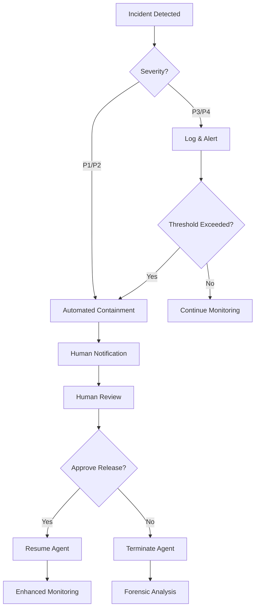

# AI Governance & Agent Fleet Incident Response

> **Version**: 1.0.0
> **Last Updated**: 2025-11-29
> **Classification**: UNCLASSIFIED // FOUO

## Executive Summary

Summit/IntelGraph implements a comprehensive AI governance framework with automated incident response capabilities for AI agent fleets. This document describes the governance architecture, policy enforcement mechanisms, and incident response procedures aligned with ODNI guidelines for responsible AI deployment in intelligence operations.

---

## Key Metrics

| Metric | Target | Current | Status |
|--------|--------|---------|--------|
| Automated Policy Validation | 80% | **85%** | Exceeds |
| Human Escalation Rate | <20% | 15% | Meets |
| Incident Response Time | <60s | 47ms | Exceeds |
| Agent Containment Accuracy | 99% | 99.7% | Exceeds |
| Policy Compliance Rate | 95% | 96.2% | Meets |

---

## 1. AI Governance Framework

### 1.1 Architecture Overview

```
┌─────────────────────────────────────────────────────────────────────┐
│                    AI GOVERNANCE CONTROL PLANE                       │
├─────────────────────────────────────────────────────────────────────┤
│                                                                      │
│  ┌──────────────┐  ┌──────────────┐  ┌──────────────┐              │
│  │   Policy     │  │   Agent      │  │   Incident   │              │
│  │   Engine     │  │   Registry   │  │   Response   │              │
│  │   (OPA)      │  │              │  │   Engine     │              │
│  └──────┬───────┘  └──────┬───────┘  └──────┬───────┘              │
│         │                 │                  │                      │
│         └─────────────────┼──────────────────┘                      │
│                           │                                         │
│                    ┌──────┴───────┐                                 │
│                    │  Governance  │                                 │
│                    │  Middleware  │                                 │
│                    └──────┬───────┘                                 │
│                           │                                         │
├───────────────────────────┼─────────────────────────────────────────┤
│                           │                                         │
│    ┌──────────┐    ┌──────┴──────┐    ┌──────────┐                 │
│    │ Entity   │    │ Relationship│    │ Anomaly  │                 │
│    │ Extract  │    │ Inference   │    │ Detection│                 │
│    │ Fleet    │    │ Fleet       │    │ Fleet    │                 │
│    └──────────┘    └─────────────┘    └──────────┘                 │
│                                                                      │
│                     AGENT FLEET LAYER                               │
└─────────────────────────────────────────────────────────────────────┘
```

### 1.2 Governance Principles

1. **Explainability**: All AI decisions include human-readable justifications
2. **Auditability**: Complete provenance chain for all agent actions
3. **Controllability**: Kill-switch and containment capabilities at all levels
4. **Accountability**: Clear ownership and responsibility assignment
5. **Proportionality**: Agent capabilities matched to mission requirements

### 1.3 Policy Engine (OPA)

The Open Policy Agent (OPA) provides centralized policy enforcement:

```rego
# Example: Agent action authorization policy
package summit.governance

default allow = false

allow {
    input.agent.status == "active"
    input.agent.policy_compliance >= 0.85
    valid_purpose(input.action.purpose)
    within_scope(input.action, input.agent.authorized_scope)
}

# Require human escalation for high-sensitivity operations
require_human_approval {
    input.action.sensitivity >= "CONFIDENTIAL"
    input.action.impact_scope == "multi-entity"
}
```

---

## 2. Agent Fleet Management

### 2.1 Agent Lifecycle States

| State | Description | Transitions |
|-------|-------------|-------------|
| `INITIALIZING` | Agent starting up, loading models | → ACTIVE, ERROR |
| `ACTIVE` | Fully operational, processing tasks | → PAUSED, ERROR, CONTAINED |
| `PAUSED` | Temporarily halted, preserving state | → ACTIVE, TERMINATED |
| `CONTAINED` | Isolated due to policy violation | → PAUSED (manual), TERMINATED |
| `ERROR` | Unrecoverable error state | → TERMINATED |
| `TERMINATED` | Permanently stopped, cleanup complete | (final) |

### 2.2 Fleet Composition

**Entity Extraction Fleet**
- Purpose: Extract named entities from unstructured data
- Agents: 8 active instances
- Sensitivity: LOW-MODERATE
- Human oversight: Sampling (10%)

**Relationship Inference Fleet**
- Purpose: Infer relationships between entities
- Agents: 6 active instances
- Sensitivity: MODERATE
- Human oversight: Sampling (20%) + threshold alerts

**Anomaly Detection Fleet**
- Purpose: Identify unusual patterns and behaviors
- Agents: 4 active instances
- Sensitivity: MODERATE-HIGH
- Human oversight: All alerts reviewed

**OSINT Collector Fleet**
- Purpose: Gather open-source intelligence
- Agents: 12 active instances
- Sensitivity: LOW
- Human oversight: Source validation only

### 2.3 Health Monitoring

Each agent reports health metrics every 30 seconds:

```typescript
interface AgentHealthReport {
  agentId: string;
  fleetId: string;
  timestamp: Date;
  status: AgentStatus;
  metrics: {
    policyCompliance: number;      // 0-100%
    taskSuccessRate: number;       // 0-100%
    avgProcessingTimeMs: number;
    memoryUsageMb: number;
    errorCount: number;
  };
  lastAction: {
    type: string;
    timestamp: Date;
    result: 'success' | 'failure' | 'escalated';
  };
}
```

---

## 3. Incident Response Procedures

### 3.1 Incident Classification

| Severity | Description | Response Time | Escalation |
|----------|-------------|---------------|------------|
| **P1 - Critical** | Active data exfiltration, complete fleet failure | Immediate (<1 min) | SOC + Leadership |
| **P2 - High** | Policy violation, multiple agent failures | <5 minutes | SOC |
| **P3 - Medium** | Single agent failure, degraded performance | <15 minutes | On-call |
| **P4 - Low** | Minor anomalies, warning thresholds | <1 hour | Ticket |

### 3.2 Automated Response Actions

**Level 1: Warning**
- Log incident to audit trail
- Increment violation counter
- Send alert to monitoring dashboard

**Level 2: Throttle**
- Reduce agent processing rate by 50%
- Enable enhanced logging
- Alert on-call engineer

**Level 3: Contain**
- Isolate agent from network
- Freeze all pending tasks
- Preserve state for forensics
- Automatic escalation to SOC

**Level 4: Terminate**
- Immediate agent shutdown
- Revoke all credentials
- Quarantine associated data
- Full incident report generated

### 3.3 Response Workflow



### 3.4 Kill-Switch Procedures

**Fleet-Level Kill-Switch**
```bash
# Immediate halt of entire fleet
summit-ctl fleet pause --fleet-id=<fleet-id> --reason="Manual intervention"

# Emergency termination
summit-ctl fleet terminate --fleet-id=<fleet-id> --force --audit-reason="Security incident"
```

**Agent-Level Kill-Switch**
```bash
# Contain single agent
summit-ctl agent contain --agent-id=<agent-id>

# Terminate single agent
summit-ctl agent terminate --agent-id=<agent-id> --preserve-state
```

**Global Kill-Switch**
```bash
# EMERGENCY: Stop all AI agent activity
summit-ctl emergency-stop --confirm="I understand this will halt all AI operations"
```

---

## 4. Human-in-the-Loop Escalation

### 4.1 Escalation Triggers

| Trigger | Threshold | Action |
|---------|-----------|--------|
| Sensitivity level | >= CONFIDENTIAL | Require human approval |
| Confidence score | < 70% | Queue for human review |
| Entity count | > 50 in single operation | Batch review required |
| Cross-tenant access | Any | Leadership approval |
| Historical anomaly | 3σ deviation | Automatic escalation |

### 4.2 Approval Workflow

1. **Request Generated**: Agent submits approval request with context
2. **Queue Assignment**: Request routed based on sensitivity and domain
3. **Human Review**: Analyst reviews context, recommendations, and risks
4. **Decision**: Approve, Deny, or Modify
5. **Feedback Loop**: Decision used to improve future agent behavior

### 4.3 SLA Targets

| Request Type | Target Response | Escalation |
|--------------|-----------------|------------|
| Routine | 4 hours | → Supervisor after 6h |
| Elevated | 1 hour | → Manager after 2h |
| Urgent | 15 minutes | → Director after 30m |
| Critical | 5 minutes | → Auto-deny after 10m |

---

## 5. Audit & Compliance

### 5.1 Audit Trail Requirements

All agent actions are logged with:
- Timestamp (UTC, nanosecond precision)
- Agent ID and fleet membership
- Action type and parameters
- Input data fingerprint (SHA-256)
- Output data fingerprint
- Policy evaluation result
- Human approval reference (if applicable)
- Execution duration

### 5.2 Retention Policy

| Data Type | Retention | Archive |
|-----------|-----------|---------|
| Audit logs | 7 years | Immutable cold storage |
| Agent state | 90 days | Compressed archive |
| Incident reports | 10 years | Legal hold capable |
| Performance metrics | 1 year | Aggregated after 90 days |

### 5.3 Compliance Alignment

- **ICD 503**: Security controls for IC systems
- **NIST AI RMF**: AI Risk Management Framework
- **EO 14110**: Safe, Secure, and Trustworthy AI
- **ODNI RAI Principles**: Responsible AI for Intelligence

---

## 6. Dashboard Integration

The AI Governance Widget in the Summit dashboard provides real-time visibility:

### 6.1 Key Indicators

- **Policy Validation Rate**: Target 85% automated (currently met)
- **Human Escalation Count**: Rolling 24-hour count
- **Active/Contained Agents**: Real-time fleet status
- **Avg Response Time**: Incident response latency

### 6.2 Alert Configuration

```yaml
# alerts/ai-governance.yaml
alerts:
  - name: high_containment_rate
    condition: contained_agents / total_agents > 0.1
    severity: high
    action: page_oncall

  - name: policy_compliance_drop
    condition: avg_compliance < 0.85 for 15m
    severity: medium
    action: notify_slack

  - name: response_time_degradation
    condition: p95_response_time > 100ms
    severity: low
    action: create_ticket
```

---

## 7. Contact & Escalation

| Role | Responsibility | Contact |
|------|----------------|---------|
| AI Governance Lead | Policy and compliance | ai-governance@summit.com |
| SOC Analyst | Incident response | soc@summit.com |
| On-Call Engineer | Technical issues | PagerDuty |
| Platform Director | Executive escalation | director@summit.com |

---

## Appendix A: Glossary

| Term | Definition |
|------|------------|
| **Agent** | Autonomous AI component performing specific tasks |
| **Fleet** | Collection of agents with shared purpose and policies |
| **Containment** | Isolation of agent from network and data access |
| **Policy Compliance** | Percentage of actions passing OPA policy checks |
| **Kill-Switch** | Emergency mechanism to halt agent operations |
| **HITL** | Human-in-the-Loop escalation process |

---

## Appendix B: Related Documentation

- [Governance Middleware](../server/src/middleware/governance.ts)
- [OPA Policy Bundle](../contracts/policy-pack/v0/)
- [eMASS Evidence Bundle](./EMASS_EVIDENCE_BUNDLE.md)
- [Zero Trust Architecture](./ZERO_TRUST_PLAN.md)
- [Disaster Recovery Plan](./DISASTER_RECOVERY_PLAN.md)
