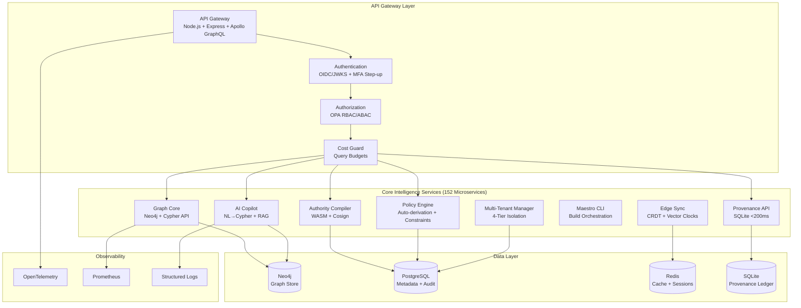

# Summit IntelGraph Architecture

Summit IntelGraph is a production-grade, provenance-first intelligence platform built on 152 specialized microservices. The architecture is optimized for graph-first intelligence work that meets enterprise governance, provenance, and federation requirements while scaling to millions of nodes/edges with sub-second query performance.

## Recommended Stack (TL;DR)

| Layer                  | Technology                                                | Rationale                                                                    |
| ---------------------- | --------------------------------------------------------- | ---------------------------------------------------------------------------- |
| **API**                | Node.js 18+, Express, Apollo Server (GraphQL federation)  | GraphQL contracts, schema stitching, generated types, query budgets          |
| **Graph store**        | Neo4j 5.x with official JS driver                         | Temporal/geo patterns, path/community analytics, policy labels               |
| **Relational sidecar** | PostgreSQL 15+                                            | Case metadata, audit rollups, feature snapshots, reporting views             |
| **Streaming & cache**  | Kafka/Redpanda, Redis                                     | High-volume ingest, runbook events, pub/sub, idempotency, rate limits        |
| **Policy & auth**      | OIDC/JWKS SSO, SCIM, RBAC+ABAC via Open Policy Agent      | Centralized policy bundles, reason-for-access, license/authority enforcement |
| **Observability**      | OpenTelemetry traces, Prometheus metrics, structured logs | Golden SLO dashboards, slow-query guardrails                                 |
| **Operations**         | Docker → Kubernetes (Helm), Terraform, canaries, PITR     | GitOps-friendly, resilient rollouts, cross-region replicas                   |
| **Governance**         | Provenance/claim ledger, export manifolds with hashes     | Chain-of-custody, auditable disclosures                                      |

## High-Level Topology



This architecture delivers:
- **<200ms provenance lookups** via optimized SQLite storage
- **<500ms Maestro queries** for dependency graph operations
- **<1s graph queries** with policy enforcement
- **Zero-downtime deployments** with canary rollouts
- **Offline-first edge** with automatic CRDT conflict resolution

## Core Service Responsibilities

### 1. Provenance API (`/services/provenance/`)
**Purpose:** High-performance provenance tracking with <200ms response times

**Capabilities:**
- SQLite-based provenance storage for fast local queries
- Immutable audit trails with cryptographic hashing
- Build metadata tracking with reproducibility guarantees
- Policy derivation from provenance data
- Full chain-of-custody for court-ready evidence

**Performance:** <200ms API response time, supports 10K+ lookups/sec

### 2. Authority Compiler - Conductor (`/packages/conductor/`)
**Purpose:** Plugin-based build orchestration with cryptographic verification

**Capabilities:**
- WASM runtime for sandboxed plugin execution (Wasmtime)
- Cosign signature verification for all plugins
- Schema compilation, intent validation, acceptance criteria
- SBOM ingestion and OCI image validation
- Provenance ledger integration with hash trees
- Plugin registry with dependency resolution

**Security:** All plugins cryptographically signed, WASM sandboxing prevents malicious code

### 3. AI Copilot (`/services/copilot/`)
**Purpose:** Natural language to Cypher translation with policy guardrails

**Capabilities:**
- FastAPI service translating NL queries to Cypher
- RAG (Retrieval Augmented Generation) with document embedding
- Policy-based guardrails preventing delete/export operations
- Citation tracking for all AI-generated responses
- Sandbox execution with 2-second timeout enforcement
- Query validation and read-only enforcement

**Use Cases:** "Show me all entities connected to John Doe" → Cypher query + visualization

### 4. Multi-Tenant Architecture (`/services/tenant-manager/`)
**Purpose:** Enterprise-grade tenant isolation with 4-tier resource management

**Tiers:**
- **Starter:** 5 users, 10K nodes, 100MB storage, 1K API calls/day
- **Professional:** 25 users, 100K nodes, 1GB storage, 10K API calls/day, analytics
- **Enterprise:** 100 users, 1M nodes, 10GB storage, 100K API calls/day, AI, SSO, MFA
- **Government:** Unlimited, dedicated infrastructure, air-gap support, compliance features

**Isolation:** Per-tenant databases, encryption, IP whitelisting, audit levels, feature flags

### 5. Edge Deployment & CRDT Sync (`/services/edge-sync/`)
**Purpose:** Offline-first edge nodes with automatic conflict resolution

**Capabilities:**
- CRDT (Conflict-free Replicated Data Types) for distributed sync
- Vector clocks and Lamport clocks for causality tracking
- Automatic conflict resolution with node capability advertisement
- Delta sync for bandwidth efficiency
- REST endpoints for state reconciliation
- Works fully offline with eventual consistency

**Use Cases:** Field operations, air-gapped environments, disconnected intelligence gathering

### 6. Maestro CLI (`/packages/maestro/`)
**Purpose:** Golden path workflows for build orchestration and dependency management

**Commands:**
- `maestro-init` — Repository migration wizard with shadow build validation
- `maestro-explain` — Build performance analysis with critical path identification
- `maestro-query` — Dependency graph queries (<500ms target)
- `maestro-doctor` — Environment diagnostics with health scoring

**Performance:** <500ms for dependency graph queries on 10K+ node build graphs

### 7. Graph Core (Neo4j)
- Owns entity/relationship models, policy labels, temporal validity windows
- Supports k-hop traversals, community detection, and time-sliced neighborhoods
- Exposes Cypher resolvers behind GraphQL with query budget enforcement
- Graph explainability (XAI) service for transparent AI reasoning
- Entity resolution with ML-based duplicate detection

### 8. Policy Engine (OPA + Custom)
- RBAC + ABAC evaluation with policy tags and purpose limits
- Automatic policy derivation from build metadata
- Read-only enforcement for unprivileged users
- Query constraint validation and rewriting
- Human-readable denial reasons and appeal paths
- MFA step-up authentication for sensitive operations

### 9. Case Metadata (Postgres)
- Tracks cases, tasks, SLAs, disclosure packs, and feature snapshots
- Provides reporting views and aggregates for leadership dashboards
- Data lineage tracking and quality metrics
- Immutable audit logs for compliance (DSAR/RTBF workflows)

### 10. Ingestion & Enrichment (Kafka, Redis)
- Normalizes inbound evidence, enriches metadata (GeoIP, OCR, STT)
- Deduplicates via Redis, streams events to Neo4j workers
- Supports STIX/TAXII/MISP interoperability
- High-volume ingest with backpressure handling

## API Gateway Blueprint

The API is GraphQL-first with Node.js and Apollo Server. Requests pass through
OpenTelemetry tracing, rate-limiters, OIDC verification, and OPA authorization
before resolvers execute domain logic.

```ts
import express from 'express';
import { ApolloServer } from '@apollo/server';
import { expressMiddleware } from '@apollo/server/express4';
import { buildSubgraphSchema } from '@apollo/subgraph';

// ...imports omitted

const server = new ApolloServer({
  schema: buildSubgraphSchema([{ typeDefs, resolvers }]),
  introspection: process.env.NODE_ENV !== 'production',
});

app.use(
  '/graphql',
  express.json(),
  authMiddleware,
  expressMiddleware(server, {
    context: async ({ req }) => ({
      user: req.user,
      authorize: (action) => opaAuthorize(req.user, action),
    }),
  }),
);
```

This gateway centralizes authentication, authorization, and query budgeting while
leaving business logic to federated services.

## Data Management & Analytics

- **Neo4j** is the system of record for graph relationships, using temporal labels
  (`validFrom`, `validTo`) and provenance metadata. It supports subgraph exports,
  similarity, and community analytics.
- **PostgreSQL** stores strongly-consistent metadata, including case hierarchies,
  audit rollups, and feature snapshots for downstream analytics.
- **Object storage** maintains binary evidence, disclosure bundles, and parquet
  exports for external sharing.
- **Redis** backs hot entity caches, idempotency keys, and cost guard budgets.

## Security, Governance, and Compliance

- **AuthN/AuthZ**: OIDC/JWKS SSO for identity, SCIM for provisioning, and OPA for
  RBAC + ABAC enforcement with policy bundles. Every denial includes reason and appeal.
- **License & Authority Compiler**: Queries are tagged with legal basis and purpose
  limits; unsafe operations are blocked at compile time.
- **Provenance**: Each transform emits to the claim ledger, enabling tamper-evident
  exports with manifest hashes.
- **Multi-tenant isolation**: Policy tags, namespace prefixes, and optional enclave
  compute protect sensitive tenants.

## Observability & Cost Control

- **OpenTelemetry** traces every request and worker span, feeding Tempo/Jaeger.
- **Prometheus** tracks p95 latency, queue depth, Neo4j resource usage, and SLA timers.
- **Structured logging** routes to ELK/OpenSearch with correlation IDs.
- **Query budgets and slow-query killers** prevent runaway traversals and enforce SLOs.

## Deployment & Operations

1. Package services with Docker and deploy via Helm charts in Kubernetes.
2. Manage infrastructure via Terraform, including databases, Kafka, Redis, and object storage.
3. Use canary deployments with automatic rollback on SLO or policy regression.
4. Enable point-in-time recovery (PITR) and cross-region replicas for Neo4j and Postgres.
5. Provide degraded/offline kits for edge operations when connectivity is limited.

## Next Steps

1. Stand up gateway, graph-core, and case-metadata services in the cluster with OIDC and OPA wired.
2. Load a golden sample dataset and validate sub-1.5s p95 latency for three-hop queries.
3. Wire provenance manifests into export workflows and verify the external validator.
4. Bring Kafka ingestion online with GeoIP and OCR enrichers plus Redis-backed dedupe caches.
5. Publish golden dashboards (OTel + Prometheus) and codify cost guard policies.

## Open Questions

1. Target cloud regions and residency constraints for initial rollout.
2. Managed versus self-hosted Kafka/Redpanda preferences.
3. Offline/edge kit priority for MVP versus later phases.
4. Additional tenant or data localization rules beyond Wishbook guidance.
