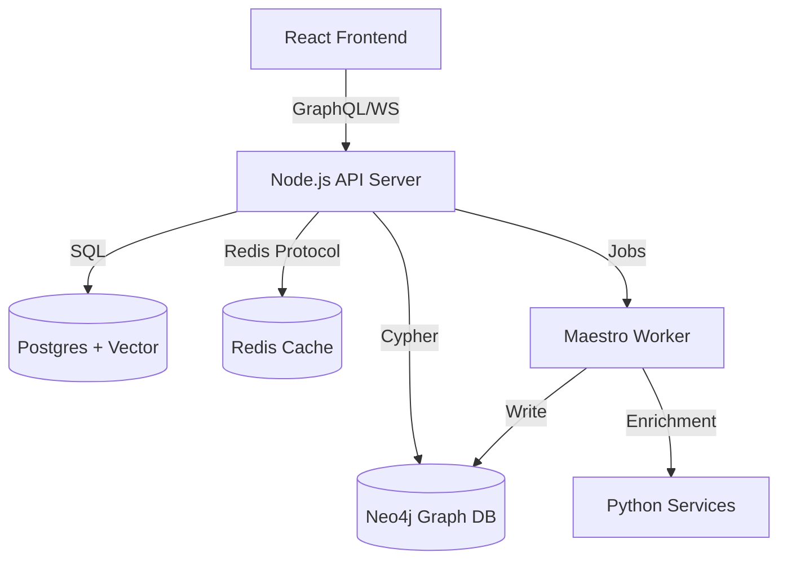

# IntelGraph Architecture

Summit (IntelGraph) is an enterprise-grade intelligence platform designed for high-stakes environments. It combines graph analytics, real-time collaboration, and AI-driven insights into a unified operating picture.

## High-Level Overview

The platform follows a modern, distributed architecture:

- **Frontend**: Single Page Application (SPA) built with React, Vite, and Material-UI.
- **Backend**: Node.js/Express monolith with modular service architecture and GraphQL API.
- **Data Layer**: Polyglot persistence using Neo4j, PostgreSQL, TimescaleDB, and Redis.
- **Orchestration**: Background job processing via BullMQ and Maestro.

## Core Components

### 1. The Application Layer (`apps/web`, `server/`)

- **GraphQL API**: The primary interface for the frontend. It uses Apollo Server and supports federation-ready schemas.
- **Real-Time Engine**: Socket.io handles live updates for collaborative investigations (e.g., cursor tracking, graph updates).
- **Maestro Orchestrator**: Manages long-running tasks like data ingestion, AI enrichment, and report generation.

### 2. The Data Layer

We use the right tool for each job:

- **Neo4j (Graph Database)**: The source of truth for entities (People, Organizations, Events) and their relationships.
- **PostgreSQL (Relational)**: Stores user accounts, audit logs, structured case metadata, and vector embeddings (via `pgvector`).
- **TimescaleDB (Time-Series)**: Handles high-velocity metrics and telemetry data.
- **Redis (Cache & Pub/Sub)**: Manages sessions, API rate limiting, and real-time event broadcasting.

### 3. Intelligence Services (`server/src/services/`)

- **Copilot**: An AI assistant that executes RAG (Retrieval-Augmented Generation) queries against the graph and vector stores.
- **Ingestion Hooks**: A pipeline for processing incoming data, including PII detection and entity resolution.
- **Narrative Simulation Engine**: A specialized module for "what-if" scenario modeling and threat forecasting.

### 4. Infrastructure & Security

- **Authentication**: Stateless JWTs with strict refresh token rotation.
- **Authorization**: Fine-grained ABAC (Attribute-Based Access Control) using OPA (Open Policy Agent) concepts.
- **Deployment**: Docker Compose for local development ("Golden Path") and Kubernetes (Helm) for production.

## Data Flow: The "Golden Path"

1.  **Ingest**: Data enters via API, Webhooks, or Connectors.
2.  **Process**: The `IngestionService` normalizes data, detects PII, and resolves entities.
3.  **Persist**: Entities are stored in Neo4j; metadata in Postgres.
4.  **Enrich**: Maestro triggers AI jobs to generate embeddings or infer new links.
5.  **Serve**: The GraphQL API serves the enriched graph to the React client.

## Diagram

## Key Constraints

- **Deployable-First**: The `main` branch is always stable.
- **Golden Path**: The core loop (Ingest -> Graph -> Analyze) must always work.
- **Provable Provenance**: All AI-generated insights must be traceable to their source evidence.
