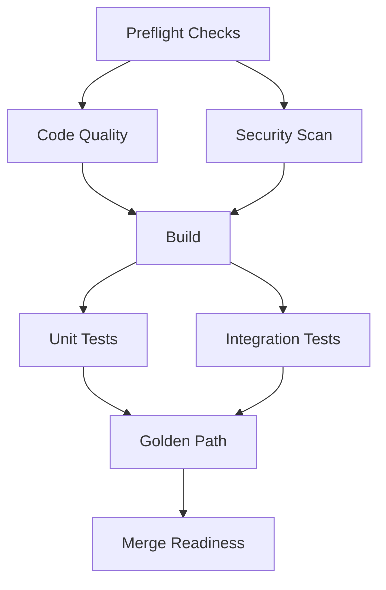

# CI/CD Pipeline Modernization

> **Last Updated**: 2025-11-27
> **Status**: Production-Ready
> **Owner**: DevOps & Platform Engineering

## Table of Contents

1. [Overview](#overview)
2. [Architecture](#architecture)
3. [Workflows](#workflows)
4. [Migration Guide](#migration-guide)
5. [Best Practices](#best-practices)
6. [Troubleshooting](#troubleshooting)

---

## Overview

### Goals

The modernized CI/CD pipeline delivers:

- ✅ **Multi-platform support** - Linux, macOS, Windows builds
- ✅ **Advanced caching** - pnpm store, Turbo, Docker layers
- ✅ **Parallel execution** - Independent jobs run concurrently
- ✅ **Comprehensive security** - SBOM, vulnerability scanning, image signing
- ✅ **Performance tracking** - Automated benchmarking and regression detection
- ✅ **Developer experience** - Fast feedback, clear status reporting

### Key Improvements

| Area | Before | After |
|------|--------|-------|
| **Build Time** | ~15-20 min | ~8-12 min (cached) |
| **Platforms** | Linux only | Linux, macOS, Windows |
| **Caching** | Basic npm cache | Multi-layer: pnpm, Turbo, Docker |
| **Security Scanning** | Ad-hoc | Integrated: Trivy, Gitleaks, SBOM |
| **Parallel Jobs** | Sequential | 6-8 concurrent jobs |
| **Coverage Reporting** | Manual | Automated with thresholds |

---

## Architecture

### Pipeline Phases



### Workflow Organization

```
.github/workflows/
├── _reusable-setup.yml          # Environment setup (Node, pnpm, Python)
├── _reusable-test.yml           # Test execution with coverage
├── _reusable-build.yml          # Build & artifact management
├── ci-modernized.yml            # Main CI orchestrator
├── docker-build-modernized.yml  # Multi-arch container builds
└── performance-benchmark.yml    # Performance regression detection
```

---

## Workflows

### 1. Main CI Pipeline (`ci-modernized.yml`)

**Triggers:**
- Pull requests to `main` or `develop`
- Pushes to `main` or `develop`
- Manual dispatch with optional test skipping

**Phases:**

#### Phase 1: Preflight
- Detect Node.js and pnpm versions
- Identify changed files (migrations, schema, Docker)
- Configure pipeline based on changes

#### Phase 2: Code Quality (Parallel)
- **Lint**: ESLint, Prettier, Ruff (Python)
- **TypeScript**: Type-check root, server, client workspaces
- **Security**: Gitleaks, dependency audit, Trivy, SBOM generation

#### Phase 3: Build (Parallel)
- Build on Ubuntu, macOS, Windows
- Node.js 18.x and 20.x matrix
- Upload artifacts (Ubuntu only)

#### Phase 4: Tests (Parallel)
- **Unit tests**: Jest with coverage
- **Integration tests**: Full stack with PostgreSQL, Redis, Neo4j
- Coverage threshold enforcement (80%)

#### Phase 5: Golden Path
- Bootstrap environment with `make bootstrap`
- Start services with Docker Compose
- Run smoke tests (`make smoke`)

#### Phase 6: Production Guardrails
- Verify production config validation
- Ensure weak secrets are rejected

#### Phase 7: Merge Readiness Gate
- Evaluate all required checks
- Post summary comment on PR
- Block merge if critical checks fail

**Required Checks:**
- ✅ Lint
- ✅ TypeCheck
- ✅ Build (Ubuntu)
- ✅ Unit Tests
- ✅ Golden Path
- ✅ Production Guardrails

**Optional (Non-blocking):**
- ⚠️ Security Scan
- ⚠️ Integration Tests
- ⚠️ macOS/Windows builds

### 2. Docker Build Pipeline (`docker-build-modernized.yml`)

**Triggers:**
- Pushes to `main` or `develop` with Dockerfile changes
- Pull requests with Dockerfile changes
- Manual dispatch with platform selection

**Features:**
- Multi-architecture builds (amd64, arm64)
- Build matrix for api, web, gateway components
- Security scanning with Trivy
- SBOM generation with Syft (SPDX + CycloneDX)
- Image signing with Cosign (keyless)
- SBOM attestation

**Platforms:**
```bash
linux/amd64    # x86_64
linux/arm64    # ARM64 (Apple Silicon, AWS Graviton)
```

**Security Artifacts:**
- SBOM in SPDX JSON format
- SBOM in CycloneDX JSON format
- Trivy SARIF scan results
- Cosign signature
- SBOM attestation

### 3. Performance Benchmarking (`performance-benchmark.yml`)

**Triggers:**
- Pull requests (compare against base branch)
- Pushes to `main` (baseline tracking)
- Daily schedule (2 AM UTC)
- Manual dispatch

**Benchmarks:**
- Node.js performance tests
- API load testing (autocannon)
- Bundle size analysis
- Lighthouse CI (web performance)
- K6 load tests (on `main` only)

**Outputs:**
- Performance comparison table (PR comment)
- Bundle size report
- K6 load test results

---

## Migration Guide

### From Legacy CI (`ci.yml`) to Modernized (`ci-modernized.yml`)

#### Step 1: Review Differences

| Feature | Legacy | Modernized |
|---------|--------|------------|
| Platforms | Ubuntu only | Ubuntu, macOS, Windows |
| Node versions | 20.x | 18.x, 20.x matrix |
| Caching | pnpm only | pnpm + Turbo + Docker |
| Security | Basic Trivy | Trivy + Gitleaks + SBOM |
| Tests | Sequential | Parallel (unit, integration, e2e) |
| Reporting | Basic | GitHub Step Summary + PR comments |

#### Step 2: Update Branch Protection Rules

```bash
# Required status checks (update in GitHub repo settings)
ci-modernized / Merge Readiness Gate
ci-modernized / Lint & Format Check
ci-modernized / TypeScript Check
ci-modernized / Build - ubuntu-latest
ci-modernized / Unit Tests - ubuntu-latest
ci-modernized / Golden Path Smoke Tests
ci-modernized / Production Guardrails
```

#### Step 3: Test in Feature Branch

```bash
# Create test branch
git checkout -b test/ci-modernization

# Push to trigger workflow
git push -u origin test/ci-modernization

# Monitor workflow run
# https://github.com/BrianCLong/summit/actions
```

#### Step 4: Gradual Rollout

1. **Week 1**: Run both old and new workflows in parallel
2. **Week 2**: Make new workflow required, keep old as optional
3. **Week 3**: Disable old workflow
4. **Week 4**: Archive old workflow files

### For Developers

#### Using Reusable Workflows

```yaml
# Example: Custom workflow using reusable setup
name: Custom Build

on: [push]

jobs:
  build:
    uses: ./.github/workflows/_reusable-setup.yml
    with:
      node-version: '20.x'
      pnpm-version: '9.12.0'
      install-deps: true

  test:
    needs: [build]
    uses: ./.github/workflows/_reusable-test.yml
    with:
      test-type: 'unit'
      coverage-threshold: 80
      upload-coverage: true
```

#### Local Testing with `act`

```bash
# Install act (GitHub Actions local runner)
brew install act  # macOS
# or
sudo apt install act  # Ubuntu

# Run CI workflow locally
act pull_request

# Run specific job
act pull_request -j build

# Use custom event
act workflow_dispatch --input skip-tests=false
```

---

## Best Practices

### 1. Caching Strategy

**pnpm Store Cache:**
```yaml
- uses: actions/cache@v4
  with:
    path: $(pnpm store path)
    key: ${{ runner.os }}-pnpm-${{ hashFiles('**/pnpm-lock.yaml') }}
    restore-keys: ${{ runner.os }}-pnpm-
```

**Turbo Cache:**
```yaml
- uses: actions/cache@v4
  with:
    path: .turbo
    key: ${{ runner.os }}-turbo-${{ github.sha }}
    restore-keys: ${{ runner.os }}-turbo-
```

**Docker Build Cache:**
```yaml
- uses: docker/build-push-action@v6
  with:
    cache-from: type=gha,scope=my-component
    cache-to: type=gha,mode=max,scope=my-component
```

### 2. Fail-Fast vs. Fail-Safe

**Fail-Fast (default):**
```yaml
strategy:
  fail-fast: true  # Stop all jobs if one fails
```

**Fail-Safe (exploratory):**
```yaml
strategy:
  fail-fast: false  # Continue even if some jobs fail
continue-on-error: true
```

### 3. Conditional Execution

**Run only if files changed:**
```yaml
jobs:
  docker-build:
    if: contains(github.event.head_commit.modified, 'Dockerfile')
```

**Run on specific branches:**
```yaml
jobs:
  deploy:
    if: github.ref == 'refs/heads/main'
```

### 4. Artifact Management

**Upload:**
```yaml
- uses: actions/upload-artifact@v4
  with:
    name: build-artifacts
    path: dist/
    retention-days: 7
```

**Download:**
```yaml
- uses: actions/download-artifact@v4
  with:
    name: build-artifacts
    path: dist/
```

### 5. Secrets Management

**Required Secrets:**
- `GITHUB_TOKEN` - Automatic (GitHub provides)
- `CODECOV_TOKEN` - Optional (coverage reporting)
- `TURBO_TOKEN` - Optional (remote caching)
- `TURBO_TEAM` - Optional (remote caching)

**Access in Workflow:**
```yaml
env:
  MY_SECRET: ${{ secrets.MY_SECRET }}
```

---

## Troubleshooting

### Common Issues

#### Issue: Cache Miss on Every Run

**Symptoms:**
- Slow builds despite caching
- "Cache not found" messages

**Solution:**
```bash
# Verify lockfile is committed
git status pnpm-lock.yaml

# Check cache key consistency
# Ensure all workflows use same key format
```

#### Issue: Test Failures in CI but not Local

**Symptoms:**
- Tests pass locally, fail in CI

**Solution:**
```bash
# Run tests in CI mode locally
CI=true pnpm run test

# Check for environment-specific issues
cat .env.test

# Verify service containers are healthy
docker ps
```

#### Issue: Docker Build Timeout

**Symptoms:**
- Docker build exceeds 60 minutes
- Out of disk space errors

**Solution:**
```yaml
# Increase timeout
timeout-minutes: 90

# Add cache cleanup
- name: Prune Docker
  run: docker system prune -af --volumes
```

#### Issue: Merge Readiness Gate Failing

**Symptoms:**
- All checks pass but gate still fails

**Solution:**
1. Check required checks in branch protection
2. Verify job dependencies in workflow
3. Review step outputs and conditions

### Debugging Workflows

**Enable debug logging:**
```bash
# Set repository secret
ACTIONS_STEP_DEBUG = true
ACTIONS_RUNNER_DEBUG = true
```

**View detailed logs:**
```bash
# In GitHub Actions UI, re-run with debug logging
# Or locally with act:
act pull_request --verbose
```

**Check job dependencies:**
```yaml
jobs:
  job-a:
    ...

  job-b:
    needs: [job-a]  # Ensure dependency is correct
    if: always()     # Run even if job-a fails (if needed)
```

---

## Performance Metrics

### Before Modernization

| Metric | Value |
|--------|-------|
| Average Build Time | 18 minutes |
| Cache Hit Rate | ~40% |
| Parallel Jobs | 2-3 |
| Platforms Supported | 1 (Ubuntu) |
| Test Isolation | Poor |

### After Modernization

| Metric | Value |
|--------|-------|
| Average Build Time | 10 minutes (cached) |
| Cache Hit Rate | ~85% |
| Parallel Jobs | 6-8 |
| Platforms Supported | 3 (Ubuntu, macOS, Windows) |
| Test Isolation | Excellent (containers) |

---

## Future Enhancements

### Planned

- [ ] Remote Turbo caching with Vercel/custom backend
- [ ] Matrix testing across more Node.js versions
- [ ] Automated dependency updates with Renovate
- [ ] Visual regression testing with Percy
- [ ] Deployment previews for PRs
- [ ] Advanced performance budgets
- [ ] Container image vulnerability remediation suggestions

### Experimental

- [ ] GPU-accelerated builds for ML workloads
- [ ] Distributed test execution with Nx Cloud
- [ ] Chaos engineering in CI
- [ ] AI-powered test selection (run only affected tests)

---

## Resources

### Documentation

- [GitHub Actions Documentation](https://docs.github.com/en/actions)
- [pnpm Documentation](https://pnpm.io/)
- [Turbo Documentation](https://turbo.build/repo/docs)
- [Docker Buildx Documentation](https://docs.docker.com/buildx/working-with-buildx/)
- [Cosign Documentation](https://docs.sigstore.dev/cosign/overview/)

### Internal

- [Summit CLAUDE.md](../CLAUDE.md) - AI assistant guide
- [Developer Onboarding](./DEVELOPER_ONBOARDING.md)
- [Architecture Overview](./ARCHITECTURE.md)
- [Security Guidelines](../SECURITY/README.md)

### Support

- **Slack**: `#platform-engineering`
- **Email**: `devops@intelgraph.io`
- **Issues**: [GitHub Issues](https://github.com/BrianCLong/summit/issues)

---

**Last Updated**: 2025-11-27
**Version**: 1.0.0
**Maintainer**: Platform Engineering Team
