# Contribution Workflows - Summit/IntelGraph

> **Purpose**: Visual guides for common development workflows
> **Last Updated**: 2025-11-20

This document provides visual workflow diagrams for contributing to the Summit/IntelGraph platform.

## Table of Contents

- [Overall Contribution Workflow](#overall-contribution-workflow)
- [Development Setup Flow](#development-setup-flow)
- [Feature Development Workflow](#feature-development-workflow)
- [Pull Request Review Process](#pull-request-review-process)
- [CI/CD Pipeline](#cicd-pipeline)
- [Git Branching Strategy](#git-branching-strategy)
- [Hotfix Workflow](#hotfix-workflow)
- [Database Migration Workflow](#database-migration-workflow)

---

## Overall Contribution Workflow

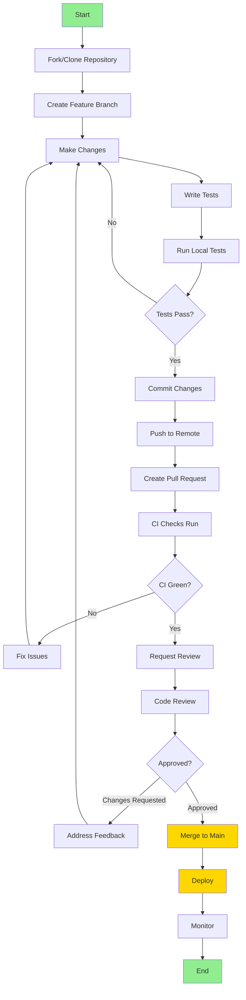

---

## Development Setup Flow

```mermaid
graph LR
    A[Clone Repo] --> B[Check Prerequisites]
    B --> C{Node 18+?}
    C -->|No| D[Install Node]
    D --> E
    C -->|Yes| E[Check pnpm]
    E --> F{pnpm 9+?}
    F -->|No| G[Install pnpm]
    G --> H
    F -->|Yes| H[Check Docker]
    H --> I{Docker Running?}
    I -->|No| J[Start Docker]
    J --> K
    I -->|Yes| K[Run make bootstrap]
    K --> L[pnpm install]
    L --> M[Copy .env]
    M --> N[Setup Husky]
    N --> O[Run make up]
    O --> P[Start Services]
    P --> Q[Wait for Health]
    Q --> R{All Healthy?}
    R -->|No| S[Check Logs]
    S --> T[Troubleshoot]
    T --> O
    R -->|Yes| U[Run make smoke]
    U --> V{Tests Pass?}
    V -->|No| S
    V -->|Yes| W[Ready to Code!]
    
    style W fill:#90EE90
    style T fill:#FFB6C1
```

---

## Feature Development Workflow

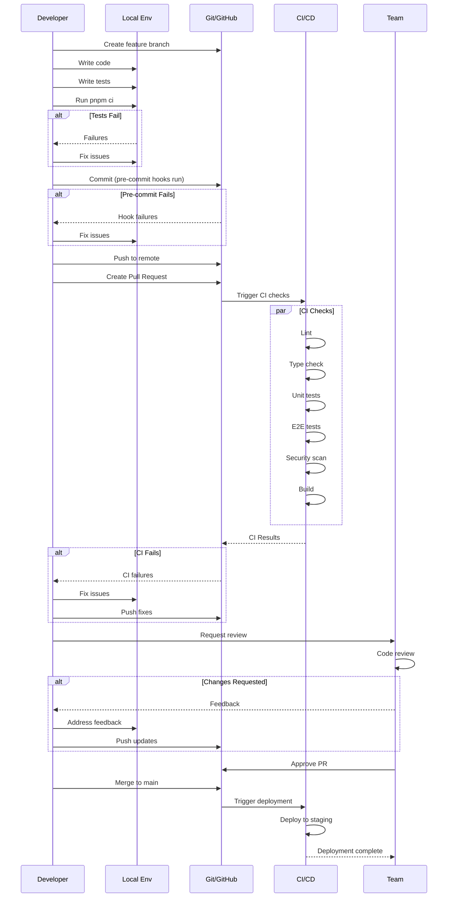

---

## Pull Request Review Process

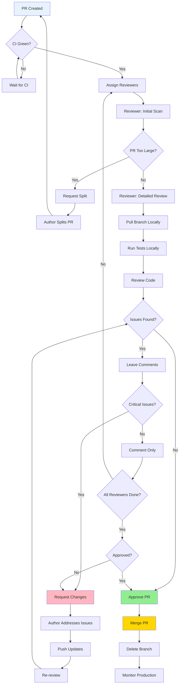

---

## CI/CD Pipeline

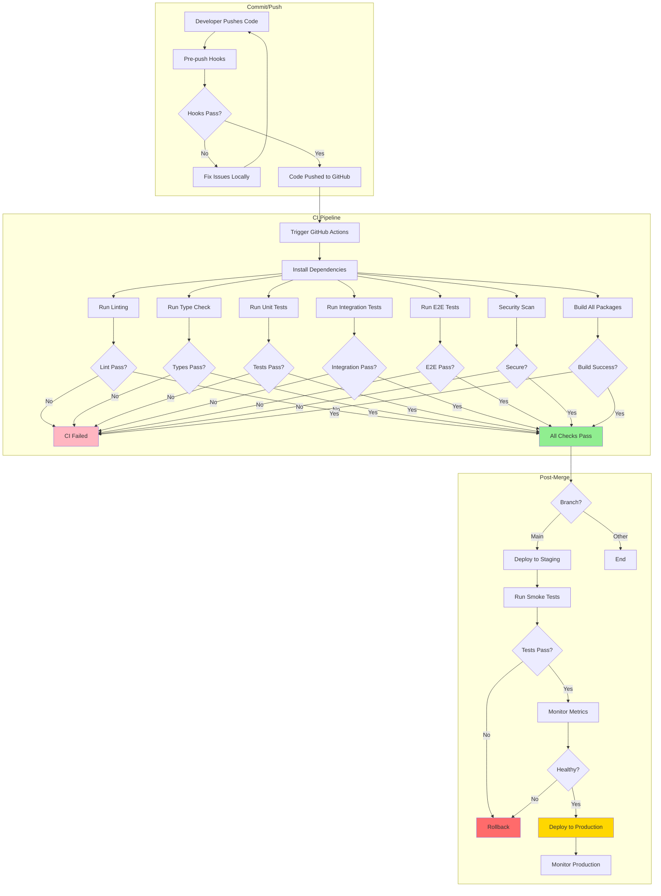

---

## Git Branching Strategy

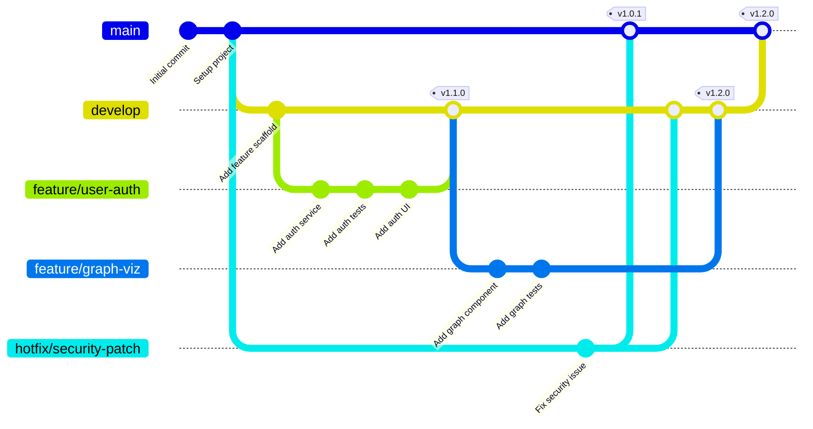

### Branch Types

- **`main`**: Production-ready code, always deployable
- **`develop`**: Integration branch for features (if using Gitflow)
- **`feature/*`**: New features or enhancements
- **`fix/*`**: Bug fixes
- **`hotfix/*`**: Urgent production fixes
- **`release/*`**: Release preparation
- **`claude/*`**: AI assistant branches

---

## Hotfix Workflow

```mermaid
flowchart LR
    A[Production Issue Detected] --> B[Create Hotfix Branch from Main]
    B --> C[Fix Issue]
    C --> D[Write Test]
    D --> E[Run Tests Locally]
    E --> F{Tests Pass?}
    F -->|No| C
    F -->|Yes| G[Create PR]
    G --> H[Expedited Review]
    H --> I[CI Checks]
    I --> J{CI Green?}
    J -->|No| C
    J -->|Yes| K[Approve PR]
    K --> L[Merge to Main]
    L --> M[Deploy to Staging]
    M --> N[Smoke Tests]
    N --> O{Tests Pass?}
    O -->|No| P[Rollback]
    P --> C
    O -->|Yes| Q[Deploy to Production]
    Q --> R[Monitor Closely]
    R --> S{Issue Resolved?}
    S -->|No| T[Additional Fix]
    T --> C
    S -->|Yes| U[Merge to Develop]
    U --> V[Update Changelog]
    V --> W[Post-Mortem]
    W --> X[End]
    
    style A fill:#FF6B6B
    style Q fill:#FFD700
    style W fill:#E6E6FA
    style X fill:#90EE90
```

---

## Database Migration Workflow

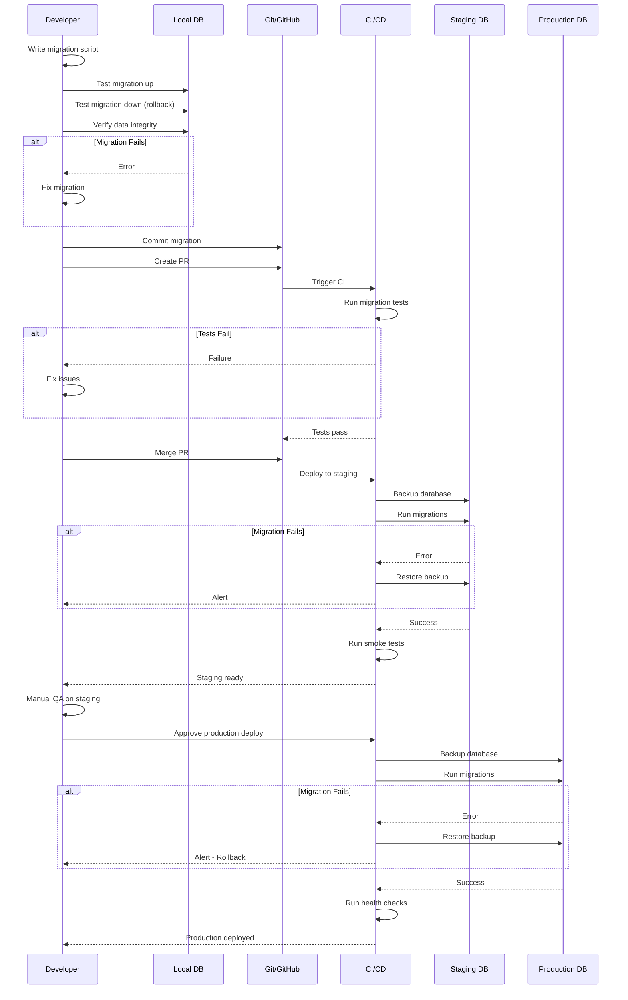

---

## Release Workflow

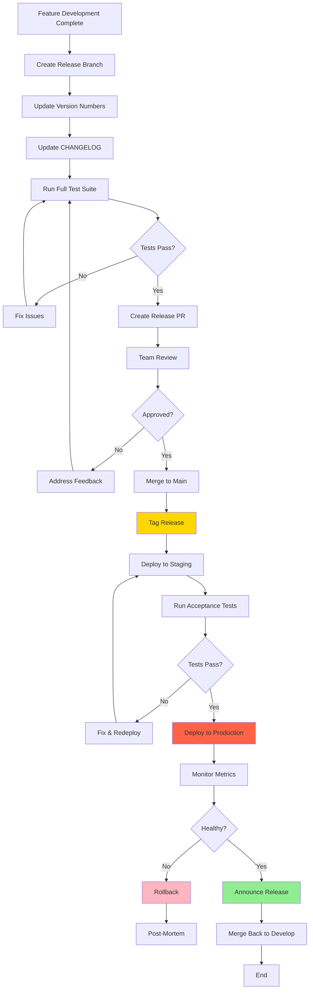

---

## Testing Pyramid

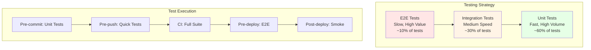

---

## Golden Path Verification

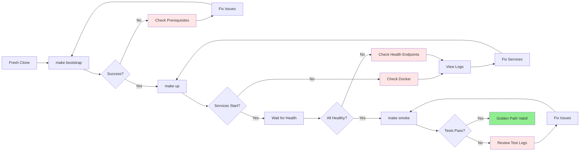

---

## Quick Reference

### Common Commands

```bash
# Setup
make bootstrap          # Initial setup
make up                # Start services
make smoke             # Golden path test

# Development
pnpm dev               # Start dev servers
pnpm test              # Run tests
pnpm lint              # Lint code
pnpm typecheck         # Type check

# Git
git checkout -b feature/my-feature
git add .
git commit -m "feat: add my feature"
git push -u origin feature/my-feature

# CI/CD
pnpm ci                # Run full CI suite locally
```

### Decision Tree: When to Create a PR?

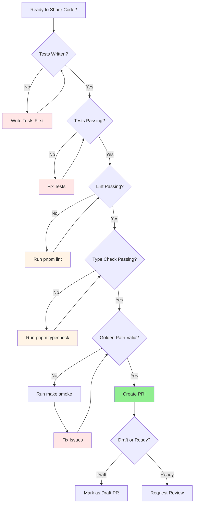

---

## Summary

These workflows ensure:
1. ✅ **Quality**: Multiple checkpoints before production
2. ✅ **Consistency**: Standard processes for all changes
3. ✅ **Visibility**: Clear progress tracking
4. ✅ **Safety**: Rollback procedures at each stage
5. ✅ **Efficiency**: Automated where possible

For more details, see:
- [CLAUDE.md](../CLAUDE.md) - Complete development guide
- [CODE_REVIEW_GUIDELINES.md](./CODE_REVIEW_GUIDELINES.md) - Review standards
- [CONTRIBUTING.md](../CONTRIBUTING.md) - Contribution guide
- [TROUBLESHOOTING.md](./TROUBLESHOOTING.md) - Common issues

---

**Questions?** Check our documentation or reach out in #engineering!
