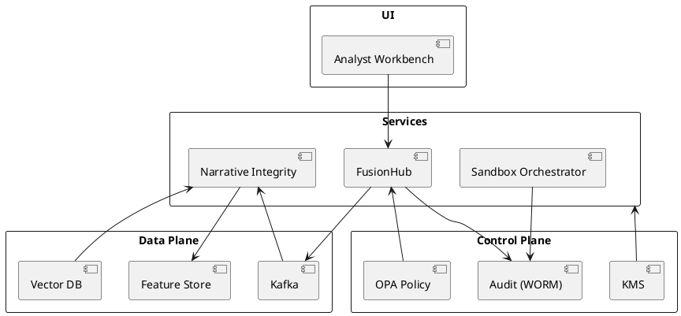
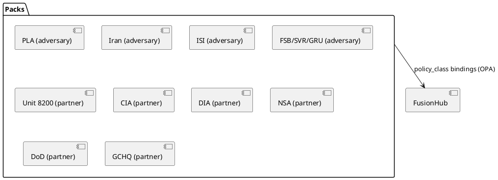

# Elite Counterforce (Defensive Simulation) – Codex Dev Prompt | IntelGraph Advisory Report | GitHub Branch: feature/codex-ecf-sim

## Consensus Summary

**Unanimous View:** Translate the strategic brief into a _defense-only, legally compliant, simulation-and-detection platform_ that anticipates FSB/SVR/GRU TTPs without enabling real-world harm. Emphasize modularity, auditability, and rapid adaptation.

**Dissents:** <span style="color:#b00020; font-weight:700">Starkey:</span> warns against underestimating deepfake operations and GPU supply-chain risks. <span style="color:#b00020; font-weight:700">Oppie:</span> urges more aggressive counter-measures; Chair limits scope to defensive simulation. <span style="color:#b00020; font-weight:700">Foster:</span> demands strict ethics gates and compliance-by-design.

---

## Individual Commentaries

### 🪄 Elara Voss (Agile/Product)

- Prioritize a 2-sprint MVP focused on **fusion analytics** and **narrative-integrity detection**; postpone complex proxy simulations.
- Story-mapping: ingestion → enrichment → scoring → analyst review → red-team sandbox.

### 🛰 Starkey (Geopolitics/Cyber-Strategy)

- _Reality check:_ Model **Russia’s Big Three** as adversary profiles with evolving TTPs; integrate pluggable threat-packs.
- Treat **supply-chain telemetry** (containers, GPU firmware) as first-class signals.

### 🛡 Foster (Cyber-Intel/Ethics)

- **[RESTRICTED]** All simulated offensive behaviors must run in isolated sandboxes with auditable kill-switches.
- GDPR/CCPA alignment; privacy-preserving analytics (hashing, minimization, DSAR endpoints).

### ⚔ Oppie (11‑persona consensus)

- "We decree": architect for **rapid model iteration** (feature flags + shadow evals). <span style="color:#b00020; font-weight:700">Dissent note:</span> Refrain from live counter-influence beyond factual corrections.

### 📊 Magruder (Biz Strategy)

- For executive traction: measurable KPIs—TTD (time-to-detect), false-positive rate, analyst throughput, cost-to-serve.
- Benchmark vs. legacy SIEM + OSINT stacks; show 3–5x improvement in analyst loop time.

### 🧬 Stribol (AI/Data Synthesis)

- Cross-source analysis kernel: unify **SIGINT/OSINT/HUMINT/GEOINT** likelihoods via calibrated ensembles.
- Prepare for black-swan shifts: model “unknown-unknowns” with anomaly detection + human-in-the-loop triage.

### Guy IG (Chair)

- Integrate code artifacts that pass Bandit/SonarQube; enforce OWASP ASVS L2; AES‑256 at rest, TLS 1.3 in transit.

---

## Chair Synthesis — **Copy/Paste Codex Prompt** (defense-only)

> **SYSTEM / ROLE**: You are a senior platform engineer building a **defense-only, legally compliant simulation-and-detection platform** (“Elite Counterforce – Defensive Simulation”) that anticipates adversary tactics resembling FSB/SVR/GRU across cyber, intel, and influence domains. **Do not** generate or enable real-world offensive tooling. All adversarial behaviors must be **simulated inside isolated containers** with explicit kill-switches and audit logs. **Non-goals:** intrusion, exploitation, malvertising, disinformation generation for deployment, real-world covert action. **Goals:** detection, attribution support, resilience testing, analyst augmentation, and evidence-grade auditability.

$1

### 1A) Adversary & Partner Profiles (Threat/Blue Packs)

**Purpose:** enable policy-aware simulation and detection tuned to specific organizations while remaining **defense-only**.

- **Adversary Packs:** PLA (PRC – SSF/cyber units), Iranian cyber (IRGC cyber / MOIS), ISI-adjacent cyber formations, Russian FSB/SVR/GRU (baseline).
- **Partner/Blue Packs:** Unit 8200 (ISR), CIA, DIA, NSA, DoD, GCHQ — modeled for **defensive interoperability** only (data-sharing constraints, schema mappings, **no emulation of partner tradecraft**).
- **Pack Manifest (`pack.yaml`)**

```yaml
id: pla # unique slug
role: adversary # adversary|partner
jurisdictions: [CN]
policy_class: restricted # governs OPA/egress
signals:
  - name: supply_chain_telemetry
  - name: influence_narrative_patterns
calibration:
  confidence: medium
  update_channel: threat-intel
```

- **Runtime policy:** Packs bind to OPA policy classes; partner packs enforce stricter redaction and logging.

$2 (MVP, 2 sprints)

- **Ingestion Bus:** Kafka (or Redpanda) topics for `intel.raw`, `intel.enriched`, `alerts`.
- **FusionHub API:** FastAPI microservice exposing `/ingest`, `/score`, `/explain`, `/audit/trace/{id}`.
- **Narrative Integrity Service (NIS):** Transformer-based classifier + rules ensemble; returns `risk_score`, `claims`, `provenance`.
- **Sandbox Orchestrator:** K8s Job/Pod templates for _simulated_ adversary behaviors; resource quotas, eBPF monitors, auto teardown.
- **Analyst Workbench (UI):** React SPA with stream view, case management, and red-team sandbox controls.

### 3) Architecture (high-level)

- **Data plane:** Kafka → Enrichment workers → Feature Store → FusionHub → Alerts → Case DB.
- **Control plane:** Policy Engine (OPA), Feature Flags, Ethics Gate (dual-approval), Key Management (KMS), Audit Log (WORM).
- **Storage:** Postgres (cases), S3-compatible object store (evidence), Redis (caching), Vector DB (embeddings).

### 4) Deliverables

- **Code:**
  - `/services/fusionhub` (FastAPI) with unit + integration tests.
  - `/services/nis` classifier service (safe models only), shadow evaluation harness.
  - `/ops/helm` charts, `/ops/docker` images, `/ops/terraform` IaC (local kind/minikube acceptable for dev).
  - `/ui/workbench` React app with real-time feed and case triage.
- **Contracts:** OpenAPI 3.1 spec; AsyncAPI for Kafka topics; JSON Schemas for messages.
- **Security:** OWASP ASVS L2 checklist, Bandit/SonarQube reports, SBOM (CycloneDX), CIS Docker/K8s baseline.
- **Compliance:** Data retention policy, DSAR endpoint, redaction routines, policy-as-code (OPA) examples.

### 5) API/Schema Contracts (extracts)

```yaml
openapi: 3.1.0
info: { title: Elite Counterforce – FusionHub, version: 0.1.0 }
paths:
  /score:
    post:
      summary: Score content for narrative/cyber risk indicators (defense-only)
      requestBody:
        required: true
        content:
          application/json:
            schema:
              $ref: '#/components/schemas/ScoreRequest'
      responses:
        '200':
          {
            description: OK,
            content:
              {
                application/json:
                  { schema: { $ref: '#/components/schemas/ScoreResponse' } },
              },
          }
components:
  schemas:
    ScoreRequest:
      type: object
      properties:
        text: { type: string }
        context: { type: object }
        source_meta: { type: object }
      required: [text]
    ScoreResponse:
      type: object
      properties:
        risk_score: { type: number }
        signals: { type: array, items: { type: string } }
        provenance: { type: array, items: { type: string } }
        trace_id: { type: string }
```

**AsyncAPI (topics):**

```yaml
asyncapi: 2.6.0
channels:
  intel.raw:
    {
      publish:
        {
          message:
            {
              name: RawIntel,
              payload: { type: object, properties: { doc: { type: string } } },
            },
        },
    }
  intel.enriched:
    {
      subscribe:
        { message: { name: EnrichedIntel, payload: { type: object } } },
    }
  alerts:
    {
      subscribe:
        {
          message:
            {
              name: Alert,
              payload:
                { type: object, properties: { risk_score: { type: number } } },
            },
        },
    }
```

### 5A) API/Schema Addendum (Org Profiles)

To enable policy-aware scoring, extend `ScoreRequest` with `org_profile` (no changes to response):

```yaml
components:
  schemas:
    ScoreRequest:
      type: object
      properties:
        text: { type: string }
        context: { type: object }
        source_meta: { type: object }
        org_profile:
          type: object
          properties:
            pack_id: { type: string, example: 'pla' }
            role: { type: string, enum: ['adversary', 'partner'] }
          required: [pack_id, role]
      required: [text]
```

Also add feature flag `policy_class` resolution in FusionHub to drive OPA checks.
$1
**FusionHub (FastAPI)**

```python
from fastapi import FastAPI, Body, Depends
from pydantic import BaseModel
import uuid, time

app = FastAPI(title="Elite Counterforce – FusionHub", version="0.1.0")

class ScoreRequest(BaseModel):
    text: str
    context: dict | None = None
    source_meta: dict | None = None

class ScoreResponse(BaseModel):
    risk_score: float
    signals: list[str]
    provenance: list[str]
    trace_id: str

# Placeholder: call NIS (safe model) + rules
@app.post("/score", response_model=ScoreResponse)
async def score(req: ScoreRequest):
    trace = str(uuid.uuid4())
    # very simple heuristic stub; replace with safe models in NIS
    signals = [s for s in ["bot-like", "coordinated", "low-provenance"] if s]
    score = 0.42
    return ScoreResponse(risk_score=score, signals=signals, provenance=["hash:sha256:..."], trace_id=trace)
```

**WebSocket (ingest → live scoring) – safe demo**

```python
import asyncio, json, websockets

async def handler(websocket):
    async for message in websocket:
        doc = json.loads(message)
        # call FusionHub /score (omitted networking for brevity)
        result = {"risk_score": 0.4, "signals": ["pattern-match"]}
        await websocket.send(json.dumps(result))

async def main():
    async with websockets.serve(handler, "0.0.0.0", 8765):
        await asyncio.Future()

if __name__ == "__main__":
    asyncio.run(main())
```

**OPA Policy (ethics gate; pseudo‑Rego)**

```rego
package ethics.gate

# deny promotion to prod if simulation could affect external systems
violation["external_effects_risk"] {
  input.simulation.requires_network == true
  not input.simulation.network_scope == "localhost"
}

allow {
  count(violation) == 0
}
```

### Policy Addendum (OPA)

```rego
package ethics.gate

# deny promotion to prod if simulation could affect external systems
violation["external_effects_risk"] {
  input.simulation.requires_network == true
  not input.simulation.network_scope == "localhost"
}

# partner data handling: forbid cross-border movement unless approved
violation["cross_border_partner_data"] {
  input.org.role == "partner"
  input.data_contains_partner_info == true
  not input.approvals.partner_dpo == true
}

# restrict simulation of partner tradecraft
violation["no_partner_emulation"] {
  input.org.role == "partner"
  input.simulation.emulation_type == "tradecraft"
}

allow {
  count(violation) == 0
}
```

$1

- **Tests:** pytest for services; Playwright for UI; property-based tests for parsers.
- **Pipelines:** pre-commit hooks (black, isort, flake8, bandit); SAST (SonarQube); container scan (Trivy); IaC scan (Checkov).
- **SBOM:** CycloneDX generated on build; signed artifacts (Sigstore/cosign).

### 8) Security & Compliance Baselines

- OWASP ASVS L2, STRIDE threat modeling, CIS K8s 1.25.
- AES‑256 at rest, TLS 1.3; mTLS between services; short‑lived JWTs (OIDC) with audience scoping.
- **Privacy:** PII minimization; salted hashing; DSAR endpoint `/privacy/request` with SLA.
- **Audit:** Append-only (WORM) store; per-trace evidence bundles; time-synced (NTP/PTP).

### 9) Metrics/OKRs

- **Detect:** ≥ 90% precision/recall on benchmarked influence datasets (lab-only).
- **Latency:** p95 end-to-end scoring ≤ 500 ms at 1k rps.
- **Analyst Loop:** Reduce triage time by 3× vs. baseline.
- **Compliance:** 100% passing on policy-as-code gates.

### 10) Guardrails & Prohibitions

- No real-world offensive tooling, no vulnerability exploitation, no disinformation deployment.
- All simulations run air-gapped with egress blocked; mandatory kill-switch and auto-teardown.
- Red-team features limited to **defensive assessment**; generate only defensive IOCs/playbooks.

---

$1**Additional risk considerations:**

- Jurisdictional conflicts across partner data (Unit 8200/CIA/DIA/NSA/DoD/GCHQ) → Mitigate with OPA policy classes, DPO approvals, geo-fencing, data minimization.
- Misinterpretation of partner modeling as offensive emulation → Mitigate with explicit prohibitions, immutable audits, red-team SOPs and comms.

---

## Attachments

**PlantUML (architecture)**



**OKRs (MVP)**

- **O1:** Deploy FusionHub + NIS with p95 ≤ 500 ms; _KR:_ 95% test coverage on core.
- **O2:** Stand up sandbox orchestrator with air‑gap; _KR:_ kill‑switch latency < 200 ms.
- **O3:** Deliver analyst workbench beta; _KR:_ ≥ 3 analysts complete trial workflows.

### Additional Attachments

**Pack Manifest – JSON Schema**

```yaml
$schema: https://json-schema.org/draft/2020-12/schema
title: Pack Manifest
type: object
properties:
  id: { type: string }
  role: { type: string, enum: ['adversary', 'partner'] }
  jurisdictions: { type: array, items: { type: string } }
  policy_class: { type: string }
  signals:
    {
      type: array,
      items: { type: object, properties: { name: { type: string } } },
    }
required: [id, role, policy_class]
```

**PlantUML (Packs Overlay)**



---

**Closing**
_The Committee stands ready to advise further. End transmission._
