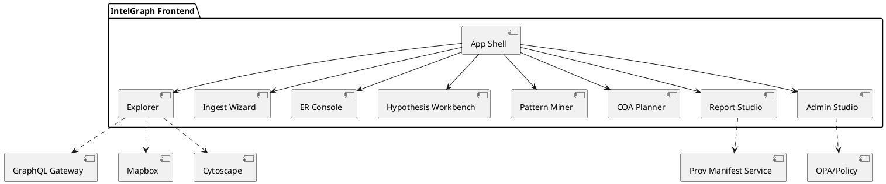
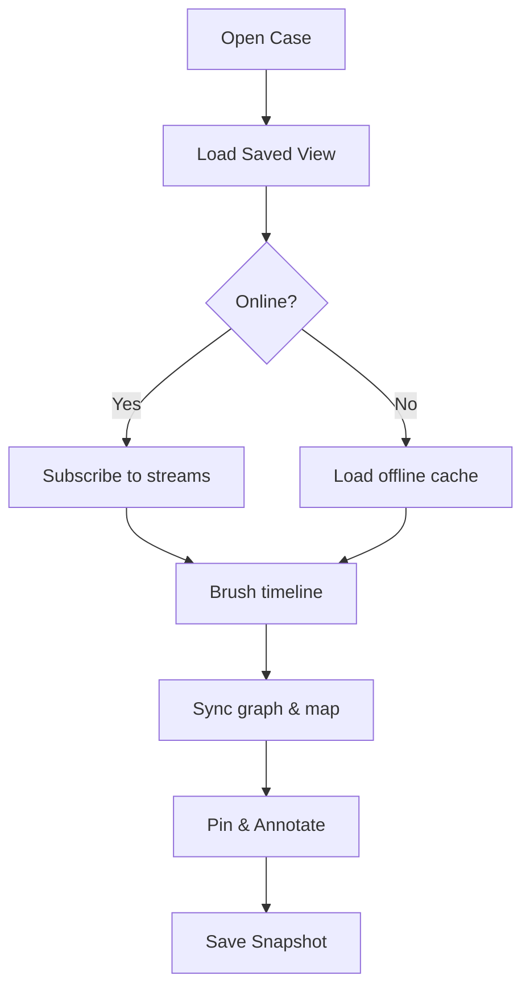

# Full Front-End Specs for IntelGraph | IntelGraph Advisory Report | GitHub Branch: feature/frontend-specs-v1

## Consensus Summary

Unanimous: Rebuild the IntelGraph front end as a modular, security-first, analyst-centric React+TypeScript application with tri-pane (Graph/Timeline/Map) at its core, full ABAC/OPA enforcement, and a robust extension model. Deliver GA with every listed feature usable, then extend via a roadmap-aligned plugin architecture. Dissents: **None.**

---

## Individual Commentaries

### 🪄 Elara Voss

- _“By the runes of Scrum, lock scope for the GA shell + tri-pane. Ship weekly increments behind flags; maintain a living acceptance-catalog per feature.”_
- Establish design tokens and Storybook first; each feature ships with fixtures, golden screenshots, and axe checks.

### 🛰 Starkey

- _“Reality check: policy overlays and provenance must render even when data is degraded; deepfake/synthetic flags are non-negotiable.”_
- Disable risky visualizations by default in contested environments; provide offline kit with signed sync logs.

### 🛡 Foster

- _“Operational vectors indicate ethics-by-design is UI-visible: reason-for-access prompts, warrant registry, redaction flows, and export manifests must be one click away.”_
- _[RESTRICTED]_: Dual-control deletes, ombuds review queues, and misuse detection banners are mandatory in the GA shell.

### ⚔ Oppie (11‑persona consensus)

- _“We decree unanimously: tri-pane synchronization, hypothesis workbench, and disclosure packager form the MVP spine.”_
- Dissent note archived: Beria argued for expanding surveillance motifs—**purged**; ethics gate stands.

### 📊 Magruder

- _“For executive traction, pin time-to-first-insight and false-positive reduction as top UX KPIs. Competitive edge = explainability overlays + cost guard UI.”_

### 🧬 Stribol

- _“Cross-source analysis reveals a plugin substrate (connectors, analytics, renderers) lets us scale features without regressions. Guard with type-safe contracts and versioned schemas.”_

---

## Chair Synthesis (Guy IG)

**Objective:** Deliver a production-grade, extensible IntelGraph front end that fully implements the Wishbook capabilities (tri-pane analytics, provenance/XAI overlays, governance, runbooks) with strict acceptance criteria. Ship GA with all core functions usable; enable iterative maturity via plugins and feature flags.

### A) Architecture Overview

- **Stack:** React 18 + TypeScript, Next.js 14 (App Router) for SSR/ISR; Vite for isolated component builds and Storybook. Styling via Tailwind CSS + shadcn/ui. Icons: lucide-react. Charts: Recharts/visx. Graph: Cytoscape.js (+ dagre/cola layouts). Map: Mapbox GL JS. Timeline: visx (time scale) with virtualization.
- **Data Layer:** GraphQL Gateway (Apollo/urql) with persisted queries; GraphQL Subscriptions over WebSockets; REST fallbacks for streaming ETL status. TanStack Query for server state; Zustand for client domain state; URL-state serialization for sharable views.
- **Policy & Auth:** OIDC (OpenID Connect) + PKCE; step-up WebAuthn/FIDO2; ABAC//OPA policy decisions enforced client-side via signed policy hints and server-side via resolvers. Reason-for-access prompts rendered inline.
- **Extension Model:** Three plug-in lanes: (1) **Connector plugins** (ingest UIs), (2) **Analytic plugins** (detectors/miners with XAI panels), (3) **Renderer plugins** (graph/timeline/map layers). All plugins are versioned, sandboxed (dynamic import), and capability-declared.
- **Offline/Edge:** PWA enabled; IndexedDB (Dexie) for caches and offline cases; CRDT-backed annotations; deterministic resync with signed divergence reports.
- **Observability:** OpenTelemetry Web SDK → OTLP; structured logs; feature-usage analytics (privacy-preserving). Error monitoring: Sentry-compatible provider with PII scrubbing.
- **Security Hardening:** CSP w/ Trusted Types, sandboxed iframes for untrusted renders, strict MIME, code-splitting + integrity, DOMPurify for any HTML, redaction-first previews.

### B) Global UX Shell

- **Navigation:** App-shell with left rail (Cases, Ingest, Explorer, Triage, Runbooks, Reports, Admin), top command palette (⌘K), breadcrumbs, and environment/tenant badge.
- **Command Palette:** fuzzy actions (open case, run query, toggle layers), recent entities, saved views; keyboard-first.
- **Notifications & Jobs:** background job tray (ingest, ER merges, exports) with progressive disclosure and provenance links.
- **Explain This View:** contextual XAI pane: shows data provenance, policy reasons, model rationales, and estimated query cost.

### C) Core Workspaces & Specifications

For each workspace: **Purpose → User Stories → UI Composition → Interactions → Error States → A11y → Telemetry → Acceptance**.

#### 1) Explorer (Tri‑Pane: Graph • Timeline • Map)

- **Purpose:** Synchronized exploration by time/space/topology with evidence-first overlays.
- **User Stories:**
  - As an analyst, brush a time window and see graph & map filter live.
  - As a reviewer, hover any node/edge to inspect provenance, license, and confidence.
  - As a lead, save/pin a subgraph view and share as a signed snapshot.
- **UI Composition:** SplitPane (resizable) with tabs per pane; Layer/Filter Drawer; Pinboard; Provenance Tooltip; Selection Inspector.
- **Interactions:** Lasso select; right-click context menu (pivot, shortest path, add to case, open CH link); layer toggles (policy/clearance, sensor health, anomaly heat). Timeline brush syncs range to map bounds + graph query; map uses quad-tree tiling; graph uses WebGL renderer with LOD.
- **Error States:** degraded data badges, missing-license overlays, offline cache banners; retry policies with backoff.
- **A11y:** complete keyboard traversals (graph focus ring, node list proxy), ARIA live regions for updates, motion-reduction option.
- **Telemetry:** pane interaction metrics, latency heatmaps, query budget usage, policy denials.
- **Acceptance:** p95 brush-to-update < 250ms on cached 50k-node neighborhood; 60 fps pan/zoom at LOD ≥ 3; provenance tooltip < 100ms from hover; saved view restores within 1s.

#### 2) Ingest Wizard & Connectors

- **Purpose:** Zero-to-graph in minutes with license & PII governance.
- **Stories:** map CSV/JSON → entities; configure feeds (RSS, STIX/TAXII, MISP, S3); preview PII flags; DPIA checklist; license/TOS guardrails.
- **UI:** Stepper (Source → Mapping → Enrichers → Policy → Preview → Launch); schema mapper with AI suggestions; redaction presets; sample previews; rate-limit & cost estimate panel.
- **Acceptance:** user maps a dataset ≤10 min; blocked fields show human-readable license reasons; lineage recorded; job status visible with retry/rollback.

#### 3) Entity Resolution Console

- **Purpose:** Adjudicate merge/split with explainability and reversibility.
- **UI:** Candidate queue, pairwise diff view, feature scorecards, merge rationale editor, override log; conflict graph mini-map.
- **Acceptance:** explain panel shows features and weights; merges reversible; queue filters by risk/confidence; audit trail immutable.

#### 4) Hypothesis Workbench (CH Table)

- **Purpose:** Competing hypotheses with evidence weights and missing-evidence prompts.
- **UI:** CH matrix, evidence tray (drag from tri-pane), confidence sliders, dissent annex notes; auto-Bayes update preview.
- **Acceptance:** export embeds citations; missing evidence prompts surfaced; report includes residual unknowns.

#### 5) Pattern Miner & Anomaly Triage

- **Purpose:** Run templates (co-travel, structuring, cadence) and triage anomalies with XAI.
- **UI:** Template library with parameter forms; result lists with sparkline tiles; XAI pane (feature importances, counterfactuals); triage queues with workflow states.
- **Acceptance:** templates save/share with parameters; ROC/AUC panels visible; action buttons (add watchlist, open COA) gated by policy.

#### 6) COA Planner & What‑If Simulation

- **Purpose:** Build COAs (DAG), simulate likelihood/impact, run sensitivity.
- **UI:** DAG canvas (draggable nodes), resource and dependency sidebars; Monte Carlo controls; result bands with confidence intervals.
- **Acceptance:** assumptions logged; runs reproducible; diff between COAs exportable.

#### 7) Report Studio & Disclosure Packager

- **Purpose:** Assemble narrative briefs with timeline/map/graph figures and export a verifiable bundle.
- **UI:** Document canvas with components (Timeline Figure, Map Layer, Subgraph Snapshot, Evidence Table); redaction tools; right-to-reply fields; export wizard produces manifest (hashes, license, transforms).
- **Acceptance:** exports validate with local verifier; redactions logged; ombuds review path available.

#### 8) Admin Studio & Governance

- **Purpose:** Schema registry, connector health, job control, audit search, warrant registry, policy simulator.
- **UI:** Tabs: Schema, Connectors, Jobs, Policies, Audit, Users/Groups; simulation runner that replays historical queries under candidate policy.
- **Acceptance:** policy changes show impact diffs; step-up auth enforced; dual-control deletes.

### D) Design System & Components

- **Design Tokens:** color (light/dark/HC), spacing, typography, radii, elevation, motion; exported via CSS variables and TS types.
- **Core Components (shadcn/ui based):** Button, Input, Select, MultiSelect, Tabs, Dialog, Drawer, Tooltip, Popover, Dropdown, Toast, Badge, Tag, Avatar, Breadcrumbs, Card, DataTable (virtualized), Tree, SplitPane, Resizable Panels, CodeBlock, EmptyState, Skeleton.
- **Analyst Components:** GraphExplorer, TimelineBrush, MapLayerControl, ProvenanceTooltip, PolicyBadge, CostMeter, EvidenceTray, ERDiffView, CHMatrix, DAGEditor, XAIInspector, ExportWizard.
- **Contracts:** each component exposes typed props, events, and telemetry hooks; examples included in Storybook with fixtures.

### E) Data Contracts & API Integration

- **GraphQL:** persisted queries with cost hints; fragments for Entity, Evidence, Claim, PolicyLabel; subscription channels for jobs/anomalies.
- **Types:** strict TypeScript models for canonical entities (Person, Org, Event, Document, Claim, Narrative, Campaign, Indicator, Case). Zod schemas for runtime validation.
- **Versioning:** semver for GraphQL schema; deprecations surfaced in DevTools panel; feature flags tied to capabilities.

### F) Security, Privacy, and Compliance (UI)

- **Policy Surfaces:** reason-for-access prompts (blocking if absent), policy badges on every view, license/TOS banners, jurisdiction and retention chips.
- **Export Controls:** manifest preview, license scan report, dual-approval flow, data minimization toggles.
- **Misuse Detection:** UI banners for anomalous query patterns; self-serve ombuds channel.
- **Hardening:** CSP, Trusted Types, strict sanitization, clipboard guards, download warnings.

### G) Performance & Reliability Budgets

- **Budgets:** TTFI < 2.5s (cold), TTI < 3.5s, CLS < 0.1; p95 pane update < 250ms; graph render 60 fps at LOD; cache hit ≥ 80% on nav.
- **Techniques:** virtualization, WebGL graph renderer, workerized layouts, incremental hydration, code-splitting, prefetch on hover, client cache invalidation via tags.
- **Resilience:** optimistic UI with sagas for rollback; retry with jitter; offline queues.

### H) Accessibility & Internationalization

- **A11y:** WCAG 2.2 AAA targets; keyboard-first navigation; screen reader labels; focus trapping; motion-reduction and high-contrast themes; automated axe-core scans in CI.
- **i18n/l10n:** ICU message format; RTL support; locale-aware dates/units; transliteration helpers.

### I) Analytics & FinOps UI

- **Cost Guard:** query budget meter, slow-query killer prompts, archived tier hints.
- **Usage:** feature usage heatmaps (privacy-preserving), success metrics dashboards (time-to-insight, triage throughput).

### J) Testing & QA Strategy

- **Unit:** Vitest/Jest with React Testing Library; model and util coverage ≥ 90%.
- **E2E:** Playwright flows for critical paths (ingest→explore→report); visual regression via Storybook/Chromatic.
- **Accessibility:** axe-core CI gate; manual audits.
- **Performance:** k6 browser + Lighthouse CI; budget gates.

### K) Build & Deployment

- **CI/CD:** GitHub Actions; typecheck, lint, test, build, Storybook, a11y, Lighthouse. Preview env per PR.
- **Runtime Config:** environment-bound via runtime manifest; feature flags (Unleash/LaunchDarkly-compatible).
- **Packages:** monorepo with `apps/web`, `packages/ui`, `packages/analytics`, `packages/plugins/*`.

### L) Roadmap to Mature

- **GA (Q3–Q4 2025):** Shell, tri-pane explorer, ingest wizard v1, ER console v1, CH workbench v1, report studio v1, admin v1, policy overlays, export manifests, PWA offline basics, 10+ connectors.
- **Post-GA (Q1–Q2 2026):** XAI everywhere, predictive overlays, DFIR adapters, federated search prototype, deeper SIEM bridges, offline expedition kit v2.
- **Longer-term (H2 2026 → 2027):** multi-graph federation, advanced simulations, crisis cell UI, marketplace for plugins.

---

## Detailed Feature Specifications & Acceptance Criteria

> Each item lists **Actors**, **Flows**, **Edge Cases**, **Telemetry**, **Acceptance**.

### 1) Tri‑Pane Explorer

- **Actors:** Analyst, Reviewer.
- **Primary Flow:**
  1. Load saved view or default case scope.
  2. Timeline brush updates map bounds & graph subquery.
  3. Hover → provenance tooltip (source, license, confidence, transform chain).
  4. Right-click pivot → generated Cypher preview → “Explain” cost + policy reasons → execute.
  5. Pin subgraph to pinboard → annotate → save signed snapshot.
- **Edge Cases:** No-geo entities; conflicting timestamps; license-blocked edges; offline with stale caches; large graphs (LOD auto).
- **Telemetry:** query latency, cache hit/miss, FPS, denial reasons.
- **Acceptance:**
  - Generated Cypher valid ≥ 95% against test prompts; preview diffs vs. manual queries available.
  - Map/graph stay synchronized within 100ms wall-clock skew.
  - Policy overlays never allow viewing beyond clearance; redaction masks applied at render-time.

### 2) Ingest Wizard

- **Actors:** Data Steward, Analyst.
- **Flows:** select source → map schema (AI suggestions, human confirm) → choose enrichers (OCR/STT/GeoIP/etc.) → set policy labels & license → preview sample → launch job.
- **Edge Cases:** schema drift, poison samples, rate limits, PII spikes.
- **Acceptance:** DPIA checklist completed; blocked fields show license clause; job status observable; lineage recorded per field.

### 3) ER Console

- **Actors:** ER Adjudicator.
- **Flows:** candidate queue → pairwise diff (feature importances) → merge or split → rationale required → override log signed.
- **Acceptance:** merges reversible; similarity scorecards visible; conflicts flagged to hypothesis workbench.

### 4) Hypothesis Workbench

- **Actors:** Analyst, Reviewer.
- **Flows:** add hypotheses → attach evidence → set priors → auto-update posteriors → dissent notes.
- **Acceptance:** export brief includes competing hypotheses, weights, residual unknowns; missing-evidence prompts shown.

### 5) Pattern Miner & Triage

- **Actors:** CTI/DFIR Analyst.
- **Flows:** choose template → parameterize → run → review XAI → assign triage state.
- **Acceptance:** templates save/clone; AUC panels; actions gated by policy.

### 6) COA Planner

- **Actors:** Lead Analyst, Policy Advisor.
- **Flows:** build DAG → simulate → compare COAs → export diffs.
- **Acceptance:** reproducible runs; assumptions log; sensitivity sliders persist.

### 7) Report Studio & Disclosure Packager

- **Actors:** Analyst, Ombuds.
- **Flows:** drag figures (timeline/map/graph) → caption assistant → redaction map → export signed bundle.
- **Acceptance:** external verifier passes manifest; right-to-reply fields present; dual-control delete enforced.

### 8) Admin & Governance

- **Actors:** Admin, Ombuds.
- **Flows:** explore schema registry → monitor connector health → run policy simulation → search audit → manage users/groups.
- **Acceptance:** policy impact diffs; audit trails immutable; step-up auth on high-risk actions.

---

## Type & API Examples (Selected)

```ts
// Canonical Entity (excerpt)
export interface EntityBase {
  id: string;
  type: EntityType;
  labels: PolicyLabel[];
  confidence?: number;
}
export interface Evidence {
  id: string;
  checksum: string;
  license: LicenseRef;
  transforms: Transform[];
  sourceUri?: string;
}
export interface Claim {
  id: string;
  text: string;
  evidenceIds: string[];
  contradicts?: string[];
  supports?: string[];
}
```

```graphql
# GraphQL fragments
fragment EntityCore on Entity {
  id
  type
  name
  labels {
    sensitivity
    legalBasis
    license
    purpose
    retention
  }
  confidence
}
fragment EvidenceCore on Evidence {
  id
  checksum
  license
  transforms {
    kind
    params
  }
}

subscription OnJobUpdate($caseId: ID!) {
  jobUpdates(caseId: $caseId) {
    id
    status
    progress
    kind
    startedAt
    finishedAt
  }
}
```

```tsx
// Example: Explainable NL→Cypher execution hook
export function useExplainAndRun(nlQuery: string) {
  const { data: preview, isLoading: explaining } = useQuery(
    ['explain', nlQuery],
    () => api.explain(nlQuery),
  );
  const run = useMutation(() => api.run(preview.cypher), {
    onSuccess: cache.invalidateQueries(['view']),
  });
  return { preview, explaining, run };
}
```

---

## Risk Matrix

| Risk                                         | Likelihood |   Impact | Mitigation                                                          |
| -------------------------------------------- | ---------: | -------: | ------------------------------------------------------------------- |
| Graph performance regressions on large cases |     Medium |     High | WebGL renderer, LOD, workerized layouts, budget gates               |
| Policy leak via client cache                 |        Low | Critical | field-level authz, encrypted caches, cache scoping by tenant/case   |
| Plugin API drift                             |     Medium |   Medium | versioned contracts, compatibility tests, canary releases           |
| A11y regressions                             |     Medium |     High | axe CI gates, manual audits, component templates with a11y baked in |
| Offline conflict complexity                  |     Medium |   Medium | CRDT libraries, conflict UI, signed resync logs                     |

---

## Attachments

### A) OKRs (Front-End FY25–FY26)

- **KR1:** Reduce time-to-first-insight by 40% vs. baseline.
- **KR2:** ≥ 95% user tasks pass a11y automated checks; 100% critical flows manually audited.
- **KR3:** p95 pane sync < 250ms on 50k-node neighborhood.
- **KR4:** 25 connectors GA with manifests and golden tests.

### B) PlantUML — High-Level Module Diagram



### C) Sample User Flows (Mermaid)



---

## Closing

The Committee stands ready to advise further. End transmission.
