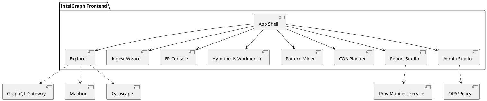
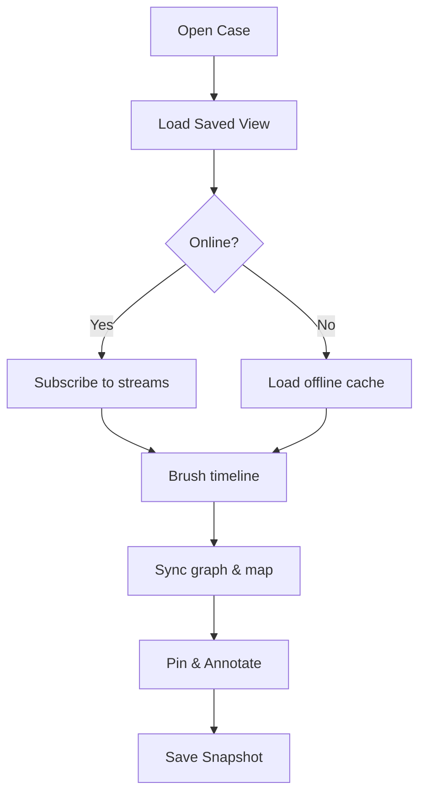

# IntelGraph Frontend — GA→Maturity Spec (v1.0)

**GitHub Branch:** `feature/frontend-specs-v1`  
**Date:** Aug 24, 2025 (America/Denver)  
**Audience:** Front‑end engineers, design systems, QA, SRE, Security & Governance, Product/UX  
**Purpose:** Synthesize and reconcile all prior IntelGraph front‑end proposals into a single, implementation‑ready specification to rebuild the web client _and_ extend it to maturity. Every feature and function must be usable at GA, with clear acceptance criteria, guardrails, and a plugin architecture for growth.

---

## 0) Executive Consensus & Advisory Report

### Consensus Summary

**Unanimous:** Rebuild the IntelGraph front end as a modular, security‑first, analyst‑centric **React + TypeScript** app. The **tri‑pane core (Graph / Timeline / Map)** is the anchor. Enforce **ABAC/OPA** throughout. Ship **GA with all listed core features usable**, then extend via a roadmap‑aligned **plugin architecture** (connectors, analytics, renderers). **Dissents:** None.

### Individual Commentaries → Design Requirements

- **🪄 Elara Voss**
  - Lock scope for the GA shell + tri‑pane; ship weekly behind flags; maintain a _living acceptance catalog_ per feature.
  - Establish **design tokens** and **Storybook** first; each feature ships with fixtures, golden screenshots, and **axe** checks.
- **🛰 Starkey**
  - Policy overlays & provenance must render even when data is degraded; **deepfake/synthetic flags** are non‑negotiable.
  - Disable risky visualizations by default in contested environments; provide **offline kit** with signed sync logs.
- **🛡 Foster**
  - Ethically‑visible UI: **reason‑for‑access prompts**, **warrant registry**, **redaction flows**, **export manifests** → 1‑click.
  - **[RESTRICTED]** Dual‑control deletes, **ombuds** review queues, misuse detection banners are mandatory in GA shell.
- **⚔ Oppie (11‑persona consensus)**
  - MVP spine: **tri‑pane synchronization, hypothesis workbench, disclosure packager**. Beria’s surveillance push **rejected**; ethics gate stands.
- **📊 Magruder**
  - UX KPIs: **time‑to‑first‑insight**; **false‑positive reduction**. Competitive edge: **explainability overlays + cost guard UI**.
- **🧬 Stribol**
  - Scale via a 3‑lane plugin substrate (connectors, analytics, renderers) with **type‑safe contracts** & **versioned schemas**.

---

## 1) Contradiction Resolution (Final Decisions)

This section resolves inconsistencies across prior drafts and sets the canonical direction.

| Topic              | Options Seen                                   | **Final**                                                            | Rationale & Notes                                                                                                             |
| ------------------ | ---------------------------------------------- | -------------------------------------------------------------------- | ----------------------------------------------------------------------------------------------------------------------------- |
| **Framework**      | React 18 (unanimous)                           | **React 18 + TypeScript 5**                                          | Standardize TS strict; functional components only.                                                                            |
| **App Platform**   | Next.js App Router vs. Plain Vite/React Router | **Next.js 14 (App Router) for app**, **Vite** for Storybook/packages | SSR/ISR for docs, SEO, signed previews; keep Vite for fast component/dev ergonomics.                                          |
| **Design System**  | Tailwind + shadcn/ui vs. MUI‑first             | **Tailwind CSS + shadcn/ui (Radix)**                                 | Accessibility, headless primitives, theming via tokens. **MUI‑compat layer** provided for legacy pages; sunset by GA+1 minor. |
| **State (server)** | Apollo vs. urql; RTK Query                     | **Apollo Client + TanStack Query**                                   | Apollo for GraphQL (persisted queries, policy errors); TanStack Query for REST/subsystems.                                    |
| **State (client)** | Zustand vs. Redux Toolkit                      | **Zustand**                                                          | Simple, fast, composable feature stores; RTK not required.                                                                    |
| **Routing**        | Next App Router vs React Router                | **Next App Router**                                                  | Deep links via search params; route guards per tenant/case.                                                                   |
| **Graph Engine**   | Cytoscape.js; D3/Sigma                         | **Cytoscape.js (WebGL)** + dagre/fcose                               | Mature ecosystem; workerized layouts; LOD rendering.                                                                          |
| **Timeline**       | vis‑timeline vs. visx                          | **visx**                                                             | Lightweight, TS‑friendly, virtualizable, unified d3 scale.                                                                    |
| **Map**            | Mapbox GL vs. MapLibre                         | **Mapbox GL** default; **MapLibre** fallback for air‑gapped/offline  | Adapter interface keeps parity.                                                                                               |
| **Auth**           | OIDC/PKCE, WebAuthn                            | **OIDC + PKCE; WebAuthn step‑up**                                    | With reason‑for‑access prompts & ABAC/OPA.                                                                                    |
| **Design Tokens**  | CSS vars vs. theme objects                     | **CSS variables + TS tokens**                                        | Theming (light/dark/high‑contrast); exported to Storybook.                                                                    |

> **Deprecation/Migration:** Any legacy MUI pages/components remain behind `compat.mui.*` wrappers and are tracked with a **sunset milestone** in the migration checklist. React Router remnants are proxied via Next route adapters until removed.

---

## 2) Architecture Overview

- **Stack:** React 18 + TS5, **Next.js 14 App Router**; shared packages built with **Vite**.
- **Styling:** **Tailwind CSS** + **shadcn/ui** (Radix) + **lucide‑react** icons.
- **Viz:** **Cytoscape.js** (graph) with WebGL + workerized layouts; **Mapbox GL JS** (map) with vector tiles; **visx** (timeline).
- **Data:** GraphQL via **Apollo Client** with **persisted queries**, cost hints, and **GraphQL Subscriptions** (WebSockets). REST fallbacks via **TanStack Query**.
- **State:** TanStack Query (server state) + **Zustand** feature stores (client state); **URL** encodes shareable views.
- **Auth & Policy:** **OIDC (PKCE)** + **WebAuthn/FIDO2** step‑up; **ABAC/OPA** enforced server‑side with **signed client hints**; in‑UI **reason‑for‑access**.
- **Extension Model:** 3 lanes — **Connectors**, **Analytics**, **Renderers**. Loaded via **dynamic import**, **capability manifests**, and **versioned contracts**.
- **Offline/Edge:** PWA; **IndexedDB (Dexie)** caches; **CRDT** annotations; deterministic resync with **signed divergence reports**.
- **Observability:** **OpenTelemetry Web SDK** → OTLP; error capture (Sentry‑compatible); privacy‑preserving feature analytics.
- **Security Hardening:** **CSP + Trusted Types**, sandboxed iframes for untrusted renders, **DOMPurify** for HTML, **SRI**, strict MIME, redaction‑first previews.

---

## 3) Global UX Shell

- **Navigation:** Left rail (Cases, Ingest, Explorer, Triage, Runbooks, Reports, Admin); **Top command palette** (⌘K); breadcrumbs; environment/tenant badge.
- **Command Palette:** Fuzzy actions (open case, run query, toggle layers), recent entities, saved views; keyboard‑first.
- **Notifications & Jobs:** Background job tray (ingest, ER merges, exports) with provenance links.
- **Explain This View:** Contextual XAI pane with **provenance, policy reasons, model rationales, and cost estimate**.

---

## 4) Core Workspaces (Purpose → Composition → Interactions → Acceptance)

### 4.1 Explorer (Tri‑Pane: Graph • Timeline • Map)

- **Purpose:** Synchronized exploration by time/space/topology with evidence‑first overlays.
- **Composition:** `TriPaneLayout` + `GraphView` + `TimelineView` + `MapView`; Layer/Filter Drawer; Pinboard; Provenance Tooltip; Selection Inspector.
- **Key Interactions:**
  - Brush timeline → filters **graph** & **map** live; lasso select; right‑click context (pivot, shortest path, add to case, open CH link).
  - Layer toggles: **policy/clearance**, **sensor health**, **anomaly heat**.
  - Map uses tile/quad‑tree; graph uses WebGL LOD; provenance tooltip <100 ms.
- **A11y:** Full keyboard traversals (graph focus ring + proxy list), ARIA live regions; motion‑reduction.
- **Telemetry:** Pane interaction metrics, latency heatmaps, query budget usage, policy denials.
- **Acceptance:** p95 brush‑to‑update < **250 ms** (cached 50k‑node neighborhood); **60 fps** pan/zoom at LOD ≥ 3; saved view restores ≤ **1 s**.

### 4.2 Ingest Wizard & Connectors

- **Purpose:** Zero‑to‑graph in minutes with license & PII governance.
- **Composition:** Stepper (Source → Mapping → Enrichers → Policy → Preview → Launch); schema mapper (AI suggestions); redaction presets; DPIA checklist; sample previews.
- **Acceptance:** Map CSV/JSON→entities in **≤10 min**; blocked fields show **human‑readable license reasons**; lineage recorded; job status visible with retry/rollback.

### 4.3 Entity Resolution (ER) Console

- **Purpose:** Adjudicate merge/split with explainability and reversibility.
- **Composition:** Candidate queue, pairwise diff, feature scorecards, merge rationale editor, override log; conflict mini‑map.
- **Acceptance:** Merges reversible; scorecards & weights visible; queue filters by risk/confidence; immutable audit trail.

### 4.4 Hypothesis Workbench (CH Table)

- **Purpose:** Competing hypotheses with evidence weights and missing‑evidence prompts.
- **Acceptance:** Export includes citations; missing evidence prompts; residual unknowns enumerated.

### 4.5 Pattern Miner & Anomaly Triage

- **Purpose:** Templates (co‑travel, structuring, cadence) and triage with **XAI**.
- **Acceptance:** Templates save/share with params; **ROC/AUC** panels; actions gated by policy.

### 4.6 COA Planner & What‑If Simulation

- **Purpose:** Build COAs (DAG), simulate likelihood/impact, run sensitivity.
- **Acceptance:** Assumptions logged; runs reproducible; diffs exportable.

### 4.7 Report Studio & Disclosure Packager

- **Purpose:** Assemble narrative briefs with timeline/map/graph figures; export verifiable bundle.
- **Acceptance:** Exports validate with **local verifier**; redactions logged; **ombuds** review path.

### 4.8 Admin Studio & Governance

- **Purpose:** Schema registry, connector health, job control, **policy simulator**, warrant registry, audit search.
- **Acceptance:** Policy changes show **impact diffs**; step‑up auth; **dual‑control deletes**.

---

## 5) Design System & Component Library

- **Design Tokens:** Color (light/dark/HC), spacing, typography, radii, elevation, motion → CSS variables + TS types.
- **Core (shadcn/ui based):** Button, Input, Select, MultiSelect, Tabs, Dialog, Drawer, Tooltip, Popover, Dropdown, Toast, Badge, Tag, Avatar, Breadcrumbs, Card, **Virtualized DataTable**, Tree, SplitPane, Resizable Panels, CodeBlock, EmptyState, Skeleton.
- **Analyst Components:** `GraphView`, `TimelineBrush`, `MapLayerControl`, `ProvenanceTooltip`, `PolicyBadge`, `CostMeter`, `EvidenceTray`, `ERDiffView`, `CHMatrix`, `DAGEditor`, `XAIInspector`, `ExportWizard`.
- **Contracts:** Typed props/events/telemetry hooks; **Storybook** fixtures + golden screenshots; **axe** checks.

---

## 6) Data Contracts & API Integration

- **GraphQL:** Persisted queries with **cost hints**; canonical fragments for `Entity`, `Evidence`, `Claim`, `PolicyLabel`; subscriptions for jobs/anomalies.
- **Types:** Strict TypeScript models for `Person`, `Org`, `Event`, `Document`, `Claim`, `Narrative`, `Campaign`, `Indicator`, `Case` with **Zod** runtime validation.
- **Versioning:** GraphQL semver; deprecations surfaced in **DevTools**; feature flags tied to capabilities.

**Selected Fragments & Ops (excerpt)**

```ts
export interface EntityBase {
  id: string;
  type: EntityType;
  labels: PolicyLabel[];
  confidence?: number;
}
export interface Evidence {
  id: string;
  checksum: string;
  license: LicenseRef;
  transforms: Transform[];
  sourceUri?: string;
}
export interface Claim {
  id: string;
  text: string;
  evidenceIds: string[];
  contradicts?: string[];
  supports?: string[];
}
```

```graphql
fragment EntityCore on Entity {
  id
  type
  name
  labels {
    sensitivity
    legalBasis
    license
    purpose
    retention
  }
  confidence
}
fragment EvidenceCore on Evidence {
  id
  checksum
  license
  transforms {
    kind
    params
  }
}
subscription OnJobUpdate($caseId: ID!) {
  jobUpdates(caseId: $caseId) {
    id
    status
    progress
    kind
    startedAt
    finishedAt
  }
}
```

---

## 7) Security, Privacy, Compliance (UI Duties)

- **Policy Surfaces:** Reason‑for‑access prompts (blocking if absent), policy badges on every view, license/TOS banners, jurisdiction & retention chips.
- **Export Controls:** Manifest preview, license scan report, dual‑approval flow, data minimization toggles.
- **Misuse Detection:** UI banners for anomalous query patterns; self‑serve **ombuds** channel.
- **Hardening:** CSP, Trusted Types, strict sanitization, clipboard guards, download watermarks.

---

## 8) Performance, Reliability & Quality Budgets

- **Budgets:** TTFI < **2.5 s** (cold), TTI < **3.5 s**, CLS < **0.1**; p95 pane update < **250 ms**; graph render **60 fps** at LOD.
- **Techniques:** Virtualization, WebGL renderer, workerized layouts, incremental hydration, code‑splitting, prefetch on hover, cache invalidation by tags.
- **Resilience:** Optimistic UI with rollbacks; retry with jitter; offline queues.

---

## 9) Accessibility & Internationalization

- **A11y:** Target **WCAG 2.2 AAA**; keyboard‑first; screen reader labels; focus trapping; motion‑reduction & high‑contrast themes; automated **axe‑core** in CI.
- **i18n/l10n:** ICU messages; RTL; locale‑aware dates/units; transliteration helpers.

---

## 10) Analytics & FinOps UI

- **Cost Guard:** Query budget meter, slow‑query killer prompts, archived tier hints.
- **Usage:** Feature heatmaps (privacy‑preserving); success dashboards (time‑to‑insight, triage throughput).

---

## 11) Testing & QA Strategy

- **Unit:** Vitest/Jest + RTL; model/util coverage ≥ **90%**.
- **E2E:** Playwright on critical paths (ingest → explore → report); **visual regression** via Storybook/Chromatic.
- **A11y:** axe CI gate; manual audits.
- **Performance:** Lighthouse CI + k6 browser; **budget gates**.

**Gherkin Samples**

```gherkin
Feature: Copilot NL→Cypher preview
  Scenario: Analyst previews and safely executes a generated query
    Given I am in a Case Space with Copilot enabled
    When I ask the graph "show paths from A to B excluding classified edges"
    Then I see a Cypher preview with cost and row estimates
    And the Execute button is disabled until I confirm the preview
    And if policy denies execution, I see a reason with an appeal path
```

---

## 12) Build & Deployment

- **CI/CD:** GitHub Actions; typecheck, lint, test, build, Storybook, a11y, Lighthouse; preview env per PR.
- **Runtime Config:** Environment‑bound via runtime manifest; feature flags (Unleash/LaunchDarkly‑compatible).
- **Monorepo Packages:** `apps/web`, `packages/ui`, `packages/analytics`, `packages/plugins/*`, `packages/graph-kit`, `packages/map-kit`, `packages/timeline-kit`.

---

## 13) Plugin & Extension Model (Developer Guide)

- **Lanes:**
  1. **Connector plugins** (ingest UIs)
  2. **Analytic plugins** (detectors/miners with XAI panels)
  3. **Renderer plugins** (graph/timeline/map layers)
- **Contracts:** Capability manifest (`capabilities`, `schemaVersion`, `requiredPermits`), sandbox via dynamic import, typed bridges; semver per lane; compatibility tests and canary releases.
- **Security:** Plugin sandboxed iframe when untrusted; message bus with policy filters; no DOM escape.

---

## 14) Roadmap

- **GA (Q3–Q4 2025):** Shell, tri‑pane explorer, ingest v1, ER v1, CH v1, report v1, admin v1, policy overlays, export manifests, PWA offline basics, **10+ connectors**.
- **Post‑GA (Q1–Q2 2026):** XAI everywhere, predictive overlays, DFIR adapters, federated search prototype, deeper SIEM bridges, **Offline Kit v2**.
- **Longer‑term (H2 2026 → 2027):** Multi‑graph federation, advanced simulations, crisis cell, **plugin marketplace**.

---

## 15) Risk Matrix (Top)

| Risk                         | Likelihood |   Impact | Mitigation                                                        |
| ---------------------------- | ---------: | -------: | ----------------------------------------------------------------- |
| Graph perf on large cases    |     Medium |     High | WebGL + LOD + workerized layouts; perf budgets as gates           |
| Policy leak via client cache |        Low | Critical | Field‑level authz; encrypted caches; cache scoping by tenant/case |
| Plugin API drift             |     Medium |   Medium | Versioned contracts; compat tests; canary releases                |
| A11y regressions             |     Medium |     High | **axe** CI gates; templates with a11y baked in                    |
| Offline conflict complexity  |     Medium |   Medium | CRDT libs; conflict UI; signed resync logs                        |

---

## 16) OKRs (Front‑End FY25–FY26)

- **KR1:** Time‑to‑first‑insight ↓ **40%** vs baseline.
- **KR2:** ≥ **95%** user tasks pass automated a11y; **100%** critical flows manually audited.
- **KR3:** p95 pane sync < **250 ms** on 50k‑node neighborhood.
- **KR4:** **25 connectors** GA with manifests and golden tests.

---

## 17) Routes & Deep Links

```
/ (home)
/cases/:caseId
  /graph  (tri‑pane default) ?t=ISO..ISO&sel=node:123,edge:456&view=map|timeline|graph
  /entities/:entityId
  /hypotheses
  /coa
  /reports
/ingest
  /catalog
  /wizard/new
  /jobs/:jobId
/analytics
/runbooks
/admin (policies, schema, connectors, audit, users)
/settings
```

---

## 18) Keyboard Shortcuts (Initial)

- ⌘/Ctrl+K → Command palette
- **g, g** → Graph • **g, t** → Timeline • **g, m** → Map
- ⌘/Ctrl+E → Export disclosure pack
- `?` → Shortcuts overlay

---

## 19) Telemetry & Instrumentation (Front‑End)

- **OTEL:** auto‑instrumentation; traceId/spanId propagated to server.
- **Event Spec:** `graph.select`, `timeline.brush`, `copilot.preview`, `export.blocked`, `policy.simulate.run`.
- **Perf Marks:** `case.mount`, `graph.firstPaint`, `map.layerReady`, `report.export.start/finish`.

---

## 20) Error Handling & Empty States

- **Typed errors:** `PolicyDenied`, `LicenseBlocked`, `RedactionRequired`, `NotAuthorized`, `NotFound`, `ServerBusy`.
- **UX:** Explain cause + next action; link to policy/warrant/license; appeal path. Empty states guide to next step.

---

## 21) Delivery Milestones & Definition of Done

**Near‑Term (this branch):**

1. App Shell + Tri‑Pane skeleton + Command Palette + Explain Panel.
2. Ingest Wizard v1 (CSV/JSON) + Job Console.
3. ER Console v1 (queue, diff, scorecards, reversible merges).
4. Copilot v1 (NL→Cypher preview + sandbox, citations panel).
5. Report Studio v1 + Disclosure Packager (hash manifest validation).
6. Admin Studio MVP (schema registry, policy simulator, connector health).

**Definition of Done (per feature):** Storybook coverage with fixtures and axe checks; Playwright E2E for happy path; p95 perf within budgets; OTEL spans present; policy denials and appeal paths rendered; a11y keyboard path verified; docs & examples included.

---

## 22) Appendices

### A) PlantUML – High‑Level Module Diagram



### B) Mermaid – Sample User Flow



### C) Example Type & Hook

```ts
// Example: Explainable NL→Cypher execution hook
export function useExplainAndRun(nlQuery: string) {
  const { data: preview, isLoading: explaining } = useQuery(
    ['explain', nlQuery],
    () => api.explain(nlQuery),
  );
  const run = useMutation(() => api.run(preview.cypher), {
    onSuccess: cache.invalidateQueries(['view']),
  });
  return { preview, explaining, run };
}
```

### D) State Machines (Condensed)

- **Export:** Idle → Validating → Blocked | Ready → Signing → Done | Error
- **Copilot:** Idle → Generating → Preview → (Blocked | Ready) → Executing → Done | Error
- **Ingest Job:** Draft → Running → (Needs‑Mapping | Needs‑Consent) → Completed | Failed

### E) Glossary (UI)

- **Claim:** Structured assertion with provenance and confidence.
- **Policy Label:** Sensitivity / legal basis / purpose tags controlling visibility & actions.
- **Disclosure Bundle:** Export + manifest (hashes, license terms) for verifiable sharing.

---

## 23) Migration Notes (Legacy → Final)

- **MUI → shadcn/ui:** Provide `compat.mui.*` wrappers for EntityDrawer/SuggestedConnectionsPanel; re‑skin via tokens; remove by GA+1.
- **React Router → Next App Router:** Route adapter shim with deprecation warnings; migrate deep links to query params.
- **MapLibre‑only environments:** Use adapter to swap Mapbox provider; package vector tiles locally for offline.

---

## 24) Governance, Ethics & Ombuds Surfaces (from Advisory Report)

- **Ethics‑by‑Design:** Reason‑for‑access prompts; warrant registry; redaction flows; export manifests 1‑click.
- **Dual‑Control & Ombuds:** Deletes/exports require second approver; visible ombuds review queues; misuse detection banners.
- **Operate Degraded:** Offline kit; deterministic resync; signed divergence reports. **Deepfake/synthetic flags** always visible.

---

## 25) Acceptance Pack Index (Per Module)

Each module ships with: fixtures, golden screenshots, axe pass, E2E path, perf marks, policy denial cases, empty states, error taxonomy. Track in `/docs/acceptance/`.

**End of v1.0 Spec**
