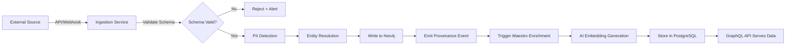
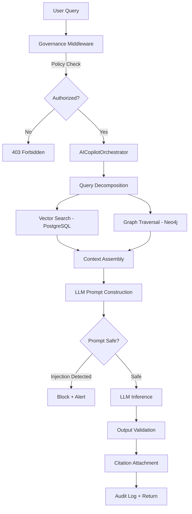
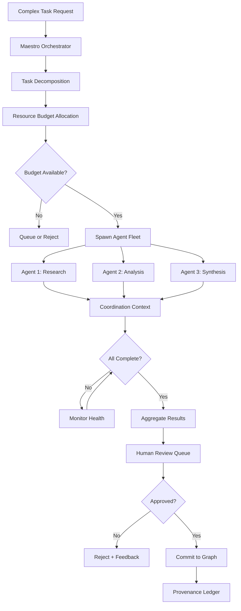

# Summit GA Architecture Documentation

**Version:** 1.0.0 GA
**Status:** Authoritative
**Last Updated:** 2025-12-27
**Classification:** UNCLASSIFIED // DISTRIBUTION UNLIMITED
**SOC 2 Controls:** CC2.1, CC2.2, CC5.3

---

## Executive Summary

Summit (IntelGraph) is an enterprise-grade intelligence platform architected for GA readiness with comprehensive governance, security, and operational excellence. This document provides the authoritative architectural description for external stakeholders, auditors, and enterprise customers.

**Key GA Capabilities:**

- **Governance-First Design**: OPA-based policy enforcement at every layer
- **Zero-Trust Architecture**: Defense-in-depth with multiple security boundaries
- **Audit-Ready**: Immutable provenance ledger with cryptographic verification
- **Production-Hardened**: SLA-driven observability, incident response, and disaster recovery
- **AI Safety**: Multi-layered agent governance with human-in-the-loop controls

---

## 1. System Overview

### 1.1 High-Level Architecture

Summit is a distributed, polyglot intelligence platform consisting of:

```
┌─────────────────────────────────────────────────────────────────────┐
│                         SUMMIT PLATFORM                             │
├─────────────────────────────────────────────────────────────────────┤
│                                                                      │
│  ┌──────────────────────┐         ┌──────────────────────┐          │
│  │   React Web Client   │◄───────►│   API Gateway        │          │
│  │   (SPA + Material UI)│  HTTPS  │   (Rate Limit + WAF) │          │
│  └──────────────────────┘         └──────────┬───────────┘          │
│                                              │                       │
│  ┌───────────────────────────────────────────┼───────────────────┐  │
│  │          APPLICATION TIER                 │                   │  │
│  │  ┌────────────────────┐    ┌──────────────▼─────────────┐     │  │
│  │  │  GraphQL API       │    │  Governance Middleware     │     │  │
│  │  │  (Apollo Server)   │◄───┤  (OPA Policy Enforcement)  │     │  │
│  │  └────────┬───────────┘    └────────────────────────────┘     │  │
│  │           │                                                    │  │
│  │  ┌────────▼───────────┐    ┌───────────────────────┐          │  │
│  │  │  Business Logic    │◄──►│  Maestro Orchestrator │          │  │
│  │  │  (Services Layer)  │    │  (Agent Coordination) │          │  │
│  │  └────────┬───────────┘    └───────────┬───────────┘          │  │
│  └───────────┼────────────────────────────┼──────────────────────┘  │
│              │                            │                         │
│  ┌───────────▼────────────────────────────▼──────────────────────┐  │
│  │                     DATA TIER                                 │  │
│  │  ┌─────────────┐  ┌──────────────┐  ┌─────────┐  ┌─────────┐ │  │
│  │  │   Neo4j     │  │  PostgreSQL  │  │  Redis  │  │TimescaleDB│ │
│  │  │   (Graph)   │  │  (Relational)│  │ (Cache) │  │(Time-Series)│ │
│  │  └─────────────┘  └──────────────┘  └─────────┘  └─────────┘ │  │
│  └───────────────────────────────────────────────────────────────┘  │
│                                                                      │
│  ┌───────────────────────────────────────────────────────────────┐  │
│  │               SECURITY & GOVERNANCE LAYER                     │  │
│  │  • OPA Policy Engine • Provenance Ledger • Audit Logger       │  │
│  │  • Secret Manager • RBAC/ABAC • Threat Detection              │  │
│  └───────────────────────────────────────────────────────────────┘  │
│                                                                      │
└─────────────────────────────────────────────────────────────────────┘
```

### 1.2 Trust Boundaries

Summit implements defense-in-depth with five critical trust boundaries:

1. **External → Edge**: Internet to API Gateway (WAF, DDoS protection, TLS termination)
2. **Edge → Application**: Gateway to internal services (JWT validation, rate limiting)
3. **Application → Data**: Services to persistence layer (connection pooling, encryption at rest)
4. **Application → AI Agents**: Orchestrator to autonomous agents (sandbox isolation, policy gates)
5. **Control Plane → Data Plane**: Management operations vs. user data flows (separate networks)

---

## 2. Core Subsystems

### 2.1 Frontend Layer (`apps/web`)

**Technology Stack:**

- React 18+ with TypeScript
- Vite build system
- Material-UI component library
- Apollo Client for GraphQL

**Security Features:**

- Content Security Policy (CSP) headers
- Subresource Integrity (SRI) for CDN assets
- XSS protection via automatic escaping
- CSRF tokens for state-changing operations

**Key Components:**

- **Intelligence Graph Viewer**: Interactive Neo4j graph visualization
- **Investigation Workspace**: Collaborative real-time analysis environment
- **Admin Panel**: System configuration and user management
- **AI Governance Dashboard**: Real-time agent monitoring and control

### 2.2 API Gateway & GraphQL Layer

**API Gateway Responsibilities:**

- TLS 1.3 termination
- Rate limiting (token bucket + adaptive algorithms)
- Request validation and sanitization
- WAF rule enforcement
- API versioning (v1, v2 namespaces)

**GraphQL API (Apollo Server):**

- Federation-ready schema design
- Field-level authorization via OPA
- Query complexity analysis (depth/breadth limits)
- DataLoader batching for N+1 prevention
- Automatic persisted queries (APQ)

**Governance Integration:**
All GraphQL resolvers pass through the Governance Middleware:

```typescript
// Conceptual flow - see server/src/middleware/governance.ts
interface GovernanceMiddleware {
  // Pre-execution policy check
  beforeResolve(context: RequestContext): Promise<PolicyDecision>;

  // Post-execution audit logging
  afterResolve(result: any, context: RequestContext): Promise<void>;
}
```

### 2.3 Business Logic Services

The services layer (`server/src/services/`) implements domain logic with strict separation of concerns:

**Core Services:**

| Service                   | Purpose                       | Governance Controls                 |
| ------------------------- | ----------------------------- | ----------------------------------- |
| **AccessControl**         | RBAC/ABAC enforcement         | OPA policy evaluation               |
| **ActionPolicyService**   | Agent action authorization    | Kill-switch, containment            |
| **AnalyticsService**      | Business intelligence queries | PII redaction, field-level security |
| **AICopilotOrchestrator** | RAG query coordination        | Prompt injection protection         |
| **Provenance Ledger**     | Immutable audit trail         | Cryptographic chaining              |
| **SecurityService**       | Threat detection              | Anomaly scoring, SIEM integration   |

**Service Communication:**

- Internal services use direct function calls (monolithic deployment)
- Future: Service mesh with mTLS for microservices migration (Sprint N+11)

### 2.4 Maestro Orchestrator & Agent Fleet

**Maestro** is the multi-agent coordination engine responsible for:

- Task decomposition and delegation
- Agent lifecycle management (spawn, monitor, terminate)
- Resource budgeting (token limits, time budgets, memory caps)
- Coordination context tracking

**Agent Fleet Composition:**

```
┌─────────────────────────────────────────────────────────────────┐
│                    AI AGENT FLEET                               │
├─────────────────────────────────────────────────────────────────┤
│  ┌──────────────────┐  ┌──────────────────┐  ┌──────────────┐  │
│  │ Entity Extract   │  │ Relationship     │  │  Anomaly     │  │
│  │ Fleet (8 agents) │  │ Inference Fleet  │  │  Detection   │  │
│  │                  │  │ (6 agents)       │  │  Fleet       │  │
│  │ Sensitivity: LOW │  │ Sensitivity: MED │  │  (4 agents)  │  │
│  └──────────────────┘  └──────────────────┘  └──────────────┘  │
│                                                                 │
│  ┌──────────────────┐  ┌──────────────────┐  ┌──────────────┐  │
│  │ OSINT Collector  │  │ Report Generator │  │ Strategic    │  │
│  │ Fleet (12)       │  │ Fleet (3)        │  │ Planner (2)  │  │
│  │ Sensitivity: LOW │  │ Sensitivity: MED │  │ Sens: HIGH   │  │
│  └──────────────────┘  └──────────────────┘  └──────────────┘  │
└─────────────────────────────────────────────────────────────────┘
```

**Agent Governance (Multi-Layered):**

1. **Pre-Execution Gate**: OPA policy check before agent spawn
2. **Runtime Monitoring**: Health metrics every 30s
3. **Output Validation**: Content scanning for PII, secrets, jailbreak attempts
4. **Human-in-the-Loop**: Automatic escalation for CONFIDENTIAL+ operations
5. **Kill-Switch**: Fleet-level and global emergency stop

### 2.5 Data Layer (Polyglot Persistence)

**Neo4j (Primary Graph Database):**

- **Purpose**: Entity-relationship graph (People, Organizations, Events)
- **Security**: Role-based access control, field-level encryption for PII
- **Backup**: Continuous replication to standby, daily snapshots
- **Governance**: All writes require signed provenance

**PostgreSQL (Relational + Vector Store):**

- **Purpose**: User accounts, audit logs, case metadata, embeddings (pgvector)
- **Security**: Row-level security (RLS), encryption at rest (LUKS)
- **Governance**: Audit logs are append-only with `INSERT` privileges only

**Redis (Cache & Pub/Sub):**

- **Purpose**: Session storage, API rate limiting, real-time event bus
- **Security**: TLS in-transit, password authentication
- **Data Retention**: Ephemeral (TTL-based), no persistent PII

**TimescaleDB (Time-Series Metrics):**

- **Purpose**: Observability metrics, agent telemetry
- **Retention**: 90 days rolling window, aggregated to 1-year summaries
- **Governance**: Metrics do not contain PII

---

## 3. Data Flow Diagrams

### 3.1 Intelligence Ingestion Pipeline ("Golden Path")



**Governance Checkpoints:**

- **Schema Validation**: Enforced via JSON Schema at ingestion
- **PII Detection**: Automated redaction with audit trail
- **Provenance**: Every write creates immutable ledger entry
- **Enrichment Authorization**: OPA policy check before AI processing

### 3.2 AI Copilot Query Flow (RAG)



**Safety Gates:**

1. **Input Validation**: Prompt injection detection
2. **Context Limitation**: Max 10,000 tokens from knowledge base
3. **Output Scanning**: PII redaction, bias detection
4. **Citation Requirement**: All claims linked to source evidence
5. **Audit Logging**: Full request/response logged to immutable ledger

### 3.3 Agent Coordination Flow



**Coordination Safeguards:**

- **Shared Budget Manager**: Prevents resource amplification attacks
- **Collusion Detection**: Monitors inter-agent communication patterns
- **Kill-Switch**: Immediate termination of entire coordination context
- **Audit Trail**: Full trace of task delegation and agent reasoning

---

## 4. Security Architecture

### 4.1 Authentication & Authorization

**Authentication (Multi-Factor):**

- Primary: OIDC/OAuth2 with JWT tokens (1-hour expiry)
- MFA: TOTP (time-based one-time passwords)
- API Keys: Service-to-service authentication (256-bit entropy)

**Authorization (Hybrid RBAC/ABAC):**

- **RBAC**: Role-based for coarse-grained permissions (Admin, Analyst, Viewer)
- **ABAC**: Attribute-based for fine-grained controls (data classification, entity type)
- **Policy Engine**: OPA evaluates policies at every sensitive operation

**Example OPA Policy:**

```rego
# Require MFA for CONFIDENTIAL+ data access
package summit.access

default allow = false

allow {
    input.user.mfa_verified == true
    input.resource.classification >= "CONFIDENTIAL"
    input.user.clearance_level >= input.resource.classification
}
```

### 4.2 Encryption

**Data at Rest:**

- Databases: LUKS full-disk encryption (AES-256)
- Object Storage: Server-side encryption (SSE-KMS)
- Secrets: HashiCorp Vault or AWS Secrets Manager

**Data in Transit:**

- External: TLS 1.3 with perfect forward secrecy
- Internal: Planned mTLS for service mesh (Sprint N+11)

**Key Management:**

- Rotation: Automated 90-day rotation for service keys
- Backup: Encrypted key escrow for disaster recovery
- Audit: All key access logged to provenance ledger

### 4.3 Network Security

**Perimeter Defense:**

- WAF with OWASP Top 10 rule sets
- DDoS mitigation (rate limiting + anomaly detection)
- GeoIP filtering for high-risk regions

**Internal Segmentation:**

- Network policies isolate data tier from application tier
- Redis, PostgreSQL, Neo4j not exposed to internet
- Bastion host required for administrative access

### 4.4 Supply Chain Security

**SLSA Level 2+ Compliance:**

- **Provenance**: Cryptographic build attestation with Cosign
- **SBOM**: Automated generation (CycloneDX/SPDX format)
- **Verification**: CI pipeline enforces SBOM signature checks
- **Dependency Scanning**: Automated CVE detection (Snyk, npm audit)

**Artifact Signing:**

```bash
# All container images are signed
cosign sign --key cosign.key ghcr.io/summit/app:v1.0.0

# SBOMs are attested
cosign attest --predicate sbom.spdx.json --key cosign.key \
  ghcr.io/summit/app:v1.0.0
```

---

## 5. Governance & Compliance

### 5.1 Policy-as-Code Architecture

**OPA Integration Points:**

1. **CI/CD Gate**: Policies tested in `.github/workflows/governance.yml`
2. **Runtime Middleware**: Every GraphQL request evaluated
3. **Agent Authorization**: Pre-execution checks for all AI actions
4. **SBOM Verification**: Supply chain policy enforcement

**Policy Bundles:**

- `summit.deploy`: Production deployment gate
- `summit.pr`: PR merge requirements
- `summit.access`: User/agent authorization
- `summit.sbom`: Dependency acceptance criteria
- `summit.regulatory`: Compliance-specific rules

### 5.2 Provenance Ledger

**Immutable Audit Trail:**

- Every graph mutation creates a provenance event
- Events are cryptographically chained (hash-linked)
- Schema validation enforced via JSON Schema
- 7-year retention for compliance (SOC 2, FedRAMP)

**Provenance Event Schema:**

```json
{
  "eventId": "uuid-v4",
  "timestamp": "2025-12-27T12:00:00Z",
  "actor": {
    "type": "user|agent|system",
    "id": "actor-id",
    "mfaVerified": true
  },
  "action": "CREATE|UPDATE|DELETE",
  "resource": {
    "type": "entity|relationship|case",
    "id": "resource-id"
  },
  "dataHash": "sha256-of-mutation",
  "previousEventHash": "sha256-of-prior-event",
  "signature": "cryptographic-signature"
}
```

### 5.3 SOC 2 Control Mapping

| SOC 2 Control              | Summit Implementation             | Evidence Location                                  |
| -------------------------- | --------------------------------- | -------------------------------------------------- |
| **CC2.1** (Communication)  | This GA_ARCHITECTURE.md document  | `/docs/`                                           |
| **CC2.2** (Internal Comm)  | GA_GOVERNANCE.md, runbooks        | `/docs/`, `/governance/playbooks/`                 |
| **CC5.3** (Risk ID)        | SECURITY_THREAT_MODEL.md          | `/docs/`                                           |
| **CC6.1** (Logical Access) | OPA policies, RBAC implementation | `/governance/policies/`, `/server/src/middleware/` |
| **CC7.2** (Change Mgmt)    | CI/CD governance gates            | `.github/workflows/governance.yml`                 |

---

## 6. Observability & Operations

### 6.1 Metrics & Monitoring

**Technology Stack:**

- Prometheus for metrics collection
- Grafana for dashboards
- Loki for log aggregation
- Tempo for distributed tracing

**Key SLIs (Service Level Indicators):**

| SLI                       | Target           | Measurement                  |
| ------------------------- | ---------------- | ---------------------------- |
| API Latency (p95)         | <200ms           | GraphQL resolver duration    |
| Error Rate                | <0.1%            | HTTP 5xx / total requests    |
| Agent Response Time       | <5s              | Copilot query to first token |
| Data Ingestion Throughput | >1000 events/min | Ingestion service counter    |

**SLOs (Service Level Objectives):**

- 99.9% uptime for API (monthly)
- 99.95% data durability (annual)
- <60s incident detection (P1/P2)

### 6.2 Alerting

**Alert Severity Levels:**

- **P1 (Critical)**: Service down, data breach, fleet failure → Page on-call
- **P2 (High)**: Degraded performance, policy violations → Slack + PagerDuty
- **P3 (Medium)**: Warning thresholds exceeded → Slack notification
- **P4 (Low)**: Informational, capacity planning → Ticket creation

**Example Alert:**

```yaml
# AI Governance: High containment rate
alert: HighAgentContainmentRate
expr: contained_agents / total_agents > 0.1
for: 5m
labels:
  severity: P2
annotations:
  summary: "{{ $value }}% of agents are contained"
  runbook: docs/governance/playbooks/agent-containment.md
```

### 6.3 Incident Response

**Runbook Index:**

- **IR-001**: API Gateway Failure → `/docs/runbooks/ir-001-gateway.md`
- **IR-002**: Database Failover → `/docs/runbooks/ir-002-db-failover.md`
- **IR-003**: Agent Jailbreak Detection → `/docs/runbooks/ir-003-agent-jailbreak.md`
- **IR-004**: Data Breach Response → `/docs/runbooks/ir-004-data-breach.md`

**Kill-Switch Procedures:**

- Agent Fleet: `summit-ctl fleet terminate --fleet-id=<id> --force`
- Global AI: `summit-ctl emergency-stop --confirm`
- Full Platform: Emergency shutdown via Kubernetes `kubectl drain`

---

## 7. Deployment & Infrastructure

### 7.1 Deployment Topology

**Production Environment:**

- Cloud Provider: AWS GovCloud / Azure Government / On-Premises
- Orchestration: Kubernetes (EKS/AKS) with Helm charts
- Scaling: Horizontal Pod Autoscaler (HPA) based on CPU/memory

**Environments:**

- **Development**: Docker Compose (local, "Golden Path")
- **Staging**: Kubernetes cluster (pre-production testing)
- **Production**: Multi-AZ Kubernetes with HA databases

### 7.2 High Availability

**Database HA:**

- Neo4j: Causal cluster (3-node minimum)
- PostgreSQL: Streaming replication (primary + 2 replicas)
- Redis: Sentinel mode (automatic failover)

**Application HA:**

- Min 3 replicas per service
- Anti-affinity rules (different AZs)
- Circuit breakers for downstream dependencies

### 7.3 Disaster Recovery

**RPO/RTO Targets:**

- Recovery Point Objective (RPO): 1 hour
- Recovery Time Objective (RTO): 4 hours

**Backup Strategy:**

- **Databases**: Continuous WAL archiving + daily snapshots
- **Object Storage**: Cross-region replication
- **Configuration**: Version-controlled in Git, restored via GitOps

---

## 8. AI Safety & Ethics

### 8.1 Agent Autonomy Boundaries

**Agents CANNOT:**

- Execute operations requiring CONFIDENTIAL+ classification without human approval
- Modify their own permission levels or policies
- Access internet resources outside approved domains
- Persist state across sessions without audit trail
- Delete or tamper with audit logs
- Communicate with external agents/services

**Agents CAN (with constraints):**

- Query knowledge base within authorized scope
- Generate analysis reports (subject to human review)
- Propose entity relationships (requires validation)
- Spawn sub-agents (within shared budget limits)

### 8.2 Bias Detection & Mitigation

**Cognitive Bias Mitigation System:**

- Confirmation bias detection in agent reasoning
- Framing analysis for intelligence reports
- Automatic flagging of low-confidence assertions
- Adversarial red-team testing (quarterly)

**Human Oversight Triggers:**

- Confidence score <70%
- Sentiment analysis detects strong bias
- Historical performance anomaly (3σ deviation)
- Cross-tenant data access request

### 8.3 Explainability Requirements

All AI-generated outputs MUST include:

1. **Citation**: Links to source evidence in knowledge graph
2. **Confidence Score**: Probabilistic assessment (0-100%)
3. **Reasoning Trace**: Chain-of-thought justification
4. **Model Card**: Version and parameters of LLM used

---

## 9. Performance & Scalability

### 9.1 Capacity Planning

**Current Baseline (GA):**

- 10,000 concurrent users
- 1,000 requests/second (sustained)
- 100 TB knowledge graph
- 50 concurrent AI agent tasks

**Growth Targets (Year 1):**

- 100,000 concurrent users
- 10,000 requests/second
- 1 PB knowledge graph
- 500 concurrent agent tasks

### 9.2 Optimization Strategies

**Query Optimization:**

- GraphQL query complexity analysis (max depth: 5)
- DataLoader batching for N+1 prevention
- Redis caching (TTL-based, 5-minute default)
- Database query plan analysis (EXPLAIN)

**Infrastructure:**

- CDN for static assets (CloudFront / Cloudflare)
- Database read replicas for analytics workloads
- Connection pooling (pgBouncer for PostgreSQL)

---

## 10. Future Architecture Evolution

### 10.1 Planned Enhancements (Post-GA)

**Sprint N+11 (Service Mesh):**

- mTLS for all service-to-service communication
- Service mesh (Istio/Linkerd) for observability

**Sprint N+15 (Multi-Tenancy):**

- Tenant-level data isolation
- Per-tenant policy customization
- White-label branding support

**Sprint N+20 (Federated Deployment):**

- Multi-region active-active
- GDPR-compliant data residency
- Cross-region query federation

### 10.2 Technology Radar (Evaluate/Adopt)

**Adopt:**

- OpenTelemetry for observability
- SLSA Level 3 hermetic builds

**Trial:**

- WebAssembly for edge compute
- CockroachDB for geo-distributed SQL

**Assess:**

- Federated learning for privacy-preserving AI
- Homomorphic encryption for query privacy

---

## 11. Appendices

### A. Technology Stack Reference

| Layer         | Technology    | Version | Purpose                   |
| ------------- | ------------- | ------- | ------------------------- |
| Frontend      | React         | 18.2+   | UI framework              |
| Build         | Vite          | 5.0+    | Frontend bundler          |
| API           | Apollo Server | 4.0+    | GraphQL server            |
| Runtime       | Node.js       | 20 LTS  | JavaScript runtime        |
| Graph DB      | Neo4j         | 5.x     | Entity-relationship graph |
| RDBMS         | PostgreSQL    | 15.x    | Relational data + vectors |
| Cache         | Redis         | 7.x     | Session, rate limiting    |
| Time-Series   | TimescaleDB   | 2.x     | Metrics storage           |
| Policy Engine | OPA           | 0.58+   | Governance enforcement    |
| Orchestration | Kubernetes    | 1.28+   | Container orchestration   |

### B. Glossary

- **ABAC**: Attribute-Based Access Control
- **APQ**: Automatic Persisted Queries
- **HITL**: Human-in-the-Loop
- **OPA**: Open Policy Agent
- **RAG**: Retrieval-Augmented Generation
- **RBAC**: Role-Based Access Control
- **SBOM**: Software Bill of Materials
- **SLSA**: Supply-chain Levels for Software Artifacts
- **WAF**: Web Application Firewall

### C. Related Documentation

- [GA_GOVERNANCE.md](./GA_GOVERNANCE.md) - Governance policies and non-capability statements
- [GA_RELEASE_CHECKLIST.md](./GA_RELEASE_CHECKLIST.md) - Pre-GA verification checklist
- [SECURITY_THREAT_MODEL.md](./SECURITY_THREAT_MODEL.md) - Detailed threat analysis
- [AI_GOVERNANCE_AGENT_FLEET.md](./AI_GOVERNANCE_AGENT_FLEET.md) - Agent fleet management
- [GOVERNANCE_LOOP.md](./GOVERNANCE_LOOP.md) - Policy-as-code workflow

---

**Document Control:**

- **Author**: Summit Documentation Agent
- **Reviewers**: Security Team, Platform Engineering, Compliance
- **Next Review**: 2026-06-27 (6 months)
- **Change Log**: Version 1.0.0 - Initial GA release

---

_This document satisfies SOC 2 CC2.1 (System Description) and CC5.3 (Risk Identification) requirements._
