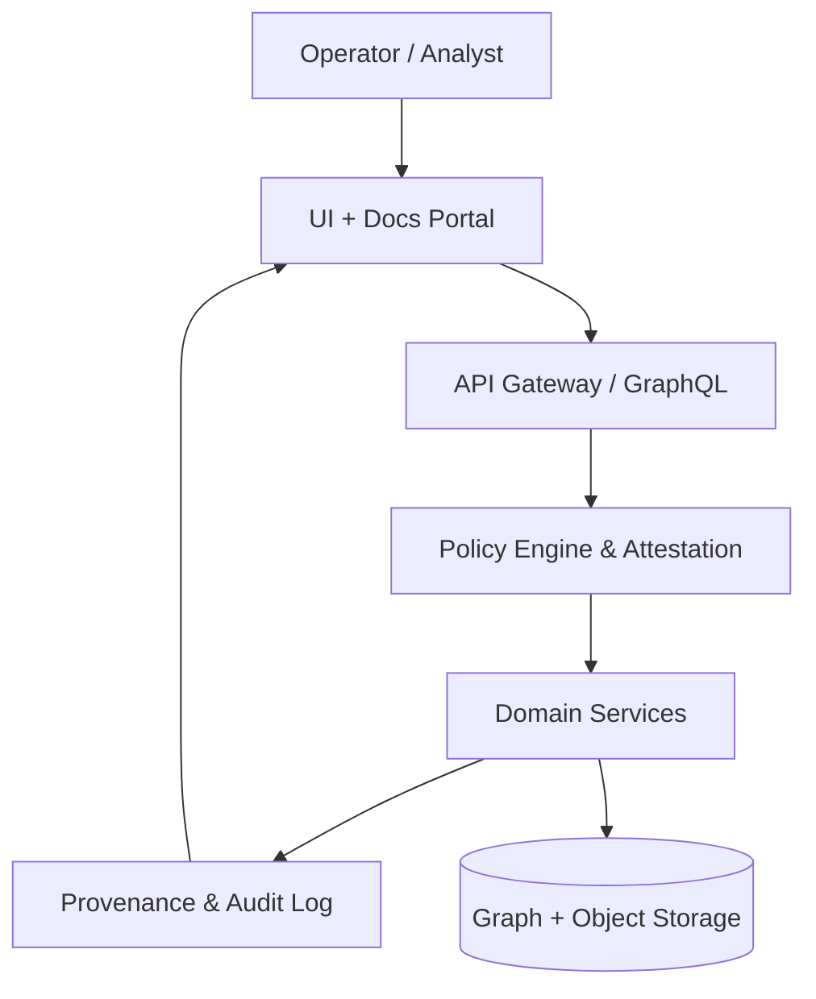

# GA-Grade Documentation Suite

## Purpose

This document captures the operationally ready documentation required for governed release: architecture narratives, data flows, governance rationale, API coverage, and explicit non-capability statements. It is designed to be auditable, versioned in Git, and aligned with the evidence bundles consumed by compliance review.

## Architecture Overview

- **Control plane**: Policy enforcement, attestation, and provenance live in `ga-graphai/packages/policy`, `ga-graphai/packages/prov-ledger`, and `SECURITY_MITIGATIONS.md`, ensuring every user action is evaluated before persistence.
- **Data plane**: Graph analytics, ingestion, and connectors operate in `server/`, `services/`, and `ai/` with streaming paths defined in `streaming/` and `adapters/`.
- **Experience plane**: The `website/` app surfaces documentation, while `client/` and `apps/web/` deliver analyst workflows using the same policy-backed APIs.
- **Shared contracts**: Schemas in `schemas/` and governance policies in `COMPLIANCE_CONTROLS.md` define the canonical interfaces and invariants across planes.

## Data Flow Diagram

## Governance Rationale

- **Policy-as-code first**: All regulatory logic must be expressed via policy packages in `ga-graphai/packages/policy` and surfaced through `agentic/` controls; undocumented pathways are prohibited by design.
- **Immutable provenance**: Every control decision is written to `ga-graphai/packages/prov-ledger` to satisfy auditability and rollback requirements.
- **Change discipline**: Architectural changes require updates to `docs/roadmap/STATUS.json` and the policy registry to maintain lineage between intent, implementation, and control proofs.

## API Reference Highlights

- **Graph & entity services**: GraphQL schemas are versioned in `docs/API_GRAPHQL_SCHEMA.graphql` with lifecycle rules in `API_VERSIONING.md` and `API_RATE_LIMITING.md`.
- **AuthN/Z**: Implementation summaries and boundaries reside in `AUTHZ_IMPLEMENTATION_SUMMARY.md`, `SECURITY.md`, and `BOUNDARIES.md` to keep tenant isolation explicit.
- **Operational APIs**: Runbook endpoints and health contracts are enumerated in `runbooks/` and `ALERT_POLICIES.yaml` to align SLOs with automated validation.

## Non-Capability Statements

- The platform **does not** bypass policy checks; emergency “god modes” are forbidden by the canonical rule in `AGENTS.md`.
- The system **does not** ingest data without provenance; unsigned payloads are rejected at ingress and logged in the ledger.
- The documentation portal **does not** expose unpublished APIs; only versioned schemas and runbooks included in this repository are rendered.

## Operational Quality Gates

- **Golden path**: `make bootstrap && make up && make smoke` must remain green before any GA documentation is promoted.
- **Evidence hooks**: CI must emit artefacts described in `COMPLIANCE_EVIDENCE_INDEX.md` and `EVIDENCE_BUNDLE.manifest.json` for every merge into main.
- **Doc generation**: `pnpm --filter @topicality/website docs:generate` rebuilds the documentation bundle from code comments, schemas, and runbooks to keep the portal in sync.
