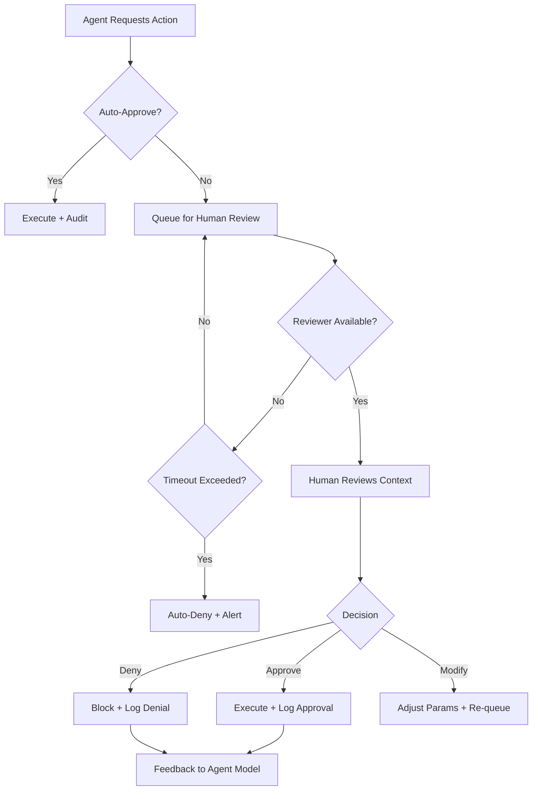

# Summit GA Governance Framework

**Version:** 1.0.0 GA
**Status:** Authoritative
**Last Updated:** 2025-12-27
**Classification:** UNCLASSIFIED // DISTRIBUTION UNLIMITED
**SOC 2 Controls:** CC2.2, CC6.1, CC7.2

---

## Executive Summary

Summit implements a comprehensive Governance-as-Code framework that enforces policy compliance, AI safety controls, and audit requirements at every layer of the platform. This document defines the authoritative governance model for GA, including the GovernanceVerdict system, policy enforcement points, human-in-the-loop escalation, and explicit non-capability statements that bound AI agent autonomy.

**Key Governance Principles:**

1. **Policy-as-Code**: All governance rules are versioned, tested, and enforced automatically
2. **Defense-in-Depth**: Multiple enforcement layers prevent single points of failure
3. **Explainability**: Every decision includes human-readable justification
4. **Auditability**: Immutable provenance ledger tracks all governance events
5. **Human Primacy**: AI agents operate under strict human oversight with kill-switch controls

---

## 1. Governance Architecture

### 1.1 System Overview

The Summit governance system operates as a control plane that intercepts and evaluates all sensitive operations:

```
┌────────────────────────────────────────────────────────────────┐
│                  GOVERNANCE CONTROL PLANE                      │
├────────────────────────────────────────────────────────────────┤
│                                                                 │
│  ┌─────────────────────────────────────────────────────────┐   │
│  │              POLICY EVALUATION ENGINE (OPA)             │   │
│  │  • Access Control Policies (summit.access)              │   │
│  │  • Deployment Gates (summit.deploy)                     │   │
│  │  • PR Merge Rules (summit.pr)                           │   │
│  │  • Agent Action Authorization (summit.agent)            │   │
│  │  • SBOM Compliance (summit.sbom)                        │   │
│  │  • Regulatory Controls (summit.regulatory)              │   │
│  └────────────────────┬────────────────────────────────────┘   │
│                       │                                         │
│  ┌────────────────────▼────────────────────────────────────┐   │
│  │           GOVERNANCE MIDDLEWARE LAYER                   │   │
│  │  • Pre-Execution Policy Checks                          │   │
│  │  • Runtime Monitoring & Validation                      │   │
│  │  • Post-Execution Audit Logging                         │   │
│  │  • Human Escalation Triggers                            │   │
│  └────────────────────┬────────────────────────────────────┘   │
│                       │                                         │
│  ┌────────────────────▼────────────────────────────────────┐   │
│  │              GOVERNANCE VERDICT SYSTEM                  │   │
│  │  Input: Request Context + Actor + Resource              │   │
│  │  Output: ALLOW | DENY | ESCALATE_HUMAN                  │   │
│  │  Audit: Every decision logged to Provenance Ledger      │   │
│  └────────────────────┬────────────────────────────────────┘   │
│                       │                                         │
└───────────────────────┼─────────────────────────────────────────┘
                        │
         ┌──────────────┼──────────────┐
         │              │              │
    ┌────▼────┐   ┌─────▼─────┐  ┌────▼────┐
    │GraphQL  │   │  Maestro  │  │   CI    │
    │   API   │   │Orchestrator│ │Pipeline │
    └─────────┘   └───────────┘  └─────────┘
```

### 1.2 Policy Enforcement Points

Summit enforces governance at six critical checkpoints:

| Enforcement Point        | Location             | Purpose                         | Enforcement Mechanism                          |
| ------------------------ | -------------------- | ------------------------------- | ---------------------------------------------- |
| **1. CI/CD Gate**        | GitHub Actions       | Block non-compliant deployments | OPA eval in `.github/workflows/governance.yml` |
| **2. API Gateway**       | HTTP middleware      | Rate limiting, authentication   | Express middleware + OPA                       |
| **3. GraphQL Resolvers** | Field/query level    | Fine-grained authorization      | Apollo Server plugins + OPA                    |
| **4. Service Layer**     | Business logic       | Action authorization            | ActionPolicyService + OPA                      |
| **5. Agent Execution**   | Maestro orchestrator | AI agent action gating          | Pre-execution OPA checks                       |
| **6. Database**          | Data persistence     | Row-level security              | PostgreSQL RLS + Neo4j RBAC                    |

---

## 2. GovernanceVerdict System

### 2.1 Verdict Model

Every governed operation produces a **GovernanceVerdict** that determines if the action proceeds:

```typescript
interface GovernanceVerdict {
  verdict: "ALLOW" | "DENY" | "ESCALATE_HUMAN";
  decisionId: string; // Unique identifier for audit trail
  timestamp: Date; // UTC timestamp (nanosecond precision)
  policy: string; // OPA policy package evaluated
  input: PolicyInput; // Context provided to policy engine
  reason: string; // Human-readable justification
  metadata: {
    policyVersion: string; // Git SHA of policy bundle
    evaluationTimeMs: number; // Performance metric
    triggeredRules: string[]; // Which policy rules matched
  };
  escalation?: HumanEscalation; // Present if verdict is ESCALATE_HUMAN
  audit: AuditReference; // Link to provenance ledger entry
}
```

### 2.2 Verdict Outcomes

**ALLOW:**

- Action proceeds immediately
- Audit log records decision
- No human intervention required

**DENY:**

- Action is blocked
- User/agent receives 403 Forbidden with reason
- Security alert generated for repeated violations
- Audit log records denial with full context

**ESCALATE_HUMAN:**

- Action is queued for human review
- Approval request routed to appropriate reviewer
- Timeout policy applies (auto-deny after threshold)
- Audit log tracks approval decision and reviewer identity

### 2.3 Policy Input Context

All policy evaluations receive comprehensive context:

```typescript
interface PolicyInput {
  // Actor information
  actor: {
    type: "user" | "agent" | "system";
    id: string;
    roles: string[]; // RBAC roles
    attributes: {
      // ABAC attributes
      clearanceLevel?: string; // e.g., "CONFIDENTIAL", "SECRET"
      mfaVerified: boolean;
      organizationId: string;
      tenantId: string;
    };
    agentMetadata?: {
      // If actor is an agent
      fleetId: string;
      policyCompliance: number; // 0-100%
      violationHistory: number; // Count of past violations
    };
  };

  // Action being requested
  action: {
    type: string; // e.g., "QUERY", "MUTATE", "DELETE"
    resource: string; // Resource identifier
    scope: string[]; // Affected entities
    sensitivity: string; // Classification level
    impactScore: number; // Estimated blast radius (0-100)
  };

  // Resource being accessed
  resource: {
    type: string; // e.g., "entity", "case", "report"
    id: string;
    classification: string; // Data classification
    owner: string; // Resource owner
    tags: string[]; // Metadata tags
  };

  // Contextual information
  context: {
    timestamp: Date;
    ipAddress: string;
    userAgent: string;
    sessionId: string;
    requestId: string; // Correlation ID
    environment: "production" | "staging" | "development";
  };
}
```

### 2.4 Example Policy Rules

**Require MFA for Sensitive Data:**

```rego
package summit.access

# Deny access to CONFIDENTIAL+ data without MFA
deny[msg] {
  input.resource.classification >= "CONFIDENTIAL"
  input.actor.attributes.mfaVerified != true
  msg := sprintf("MFA required for %s data access", [input.resource.classification])
}
```

**Agent Action Authorization:**

```rego
package summit.agent

# Require human approval for high-impact agent actions
escalate_human[msg] {
  input.actor.type == "agent"
  input.action.impactScore >= 70
  msg := sprintf("Agent action requires approval: impact score %d >= 70", [input.action.impactScore])
}

# Deny agents with low compliance scores
deny[msg] {
  input.actor.type == "agent"
  input.actor.agentMetadata.policyCompliance < 85
  msg := sprintf("Agent compliance too low: %d%% < 85%%", [input.actor.agentMetadata.policyCompliance])
}
```

**Cross-Tenant Access Control:**

```rego
package summit.access

# Always require leadership approval for cross-tenant access
escalate_human[msg] {
  input.actor.attributes.tenantId != input.resource.tenantId
  msg := "Cross-tenant access requires leadership approval"
}
```

---

## 3. AI Agent Governance

### 3.1 Agent Lifecycle Management

All AI agents progress through a governed lifecycle with mandatory checkpoints:

```
┌────────────────────────────────────────────────────────────┐
│                   AGENT LIFECYCLE                          │
│                                                            │
│  INITIALIZING ──► ACTIVE ──► PAUSED ──► TERMINATED        │
│       │             │          │                           │
│       └─────────────┼──────────┴─────► CONTAINED          │
│                     │                        │             │
│                     └────────────────────────┴─► ERROR     │
│                                                            │
└────────────────────────────────────────────────────────────┘

Governance Gates:
  • INITIALIZING → ACTIVE: Policy compliance check, resource allocation
  • ACTIVE → CONTAINED: Violation detected, automatic isolation
  • CONTAINED → PAUSED: Manual review, mitigation implemented
  • Any state → TERMINATED: Kill-switch activation
```

### 3.2 Agent Containment Triggers

Agents are automatically **CONTAINED** (isolated from network and data) upon:

| Trigger                   | Detection Method                | Response Time | Auto-Recovery                     |
| ------------------------- | ------------------------------- | ------------- | --------------------------------- |
| Policy violation          | OPA deny rule                   | Immediate     | No - requires human review        |
| Resource quota exceeded   | Budget manager threshold        | <1s           | No - capacity planning needed     |
| Output validation failure | Regex/ML scanning               | Immediate     | No - root cause analysis required |
| Health check failure      | 3 consecutive missed heartbeats | <90s          | Yes - after health restored       |
| Security anomaly          | Threat detection service        | <5s           | No - forensics required           |
| Manual escalation         | Human operator command          | Immediate     | No - explicit approval needed     |

### 3.3 Human-in-the-Loop (HITL) Escalation

**Automatic Escalation Triggers:**

1. **Classification-Based:**
   - Any operation on CONFIDENTIAL+ data
   - Cross-tenant data access
   - Bulk operations (>50 entities)

2. **Confidence-Based:**
   - AI model confidence <70%
   - Multiple competing hypotheses (ambiguity)
   - Historical pattern anomaly (3σ deviation)

3. **Risk-Based:**
   - Estimated impact score >70/100
   - Irreversible operations (DELETE, PURGE)
   - External system integration

**Escalation SLA:**

| Sensitivity | Target Response | Escalation Path           | Auto-Action         |
| ----------- | --------------- | ------------------------- | ------------------- |
| Routine     | 4 hours         | Analyst → Supervisor (6h) | None                |
| Elevated    | 1 hour          | Manager → Director (2h)   | None                |
| Urgent      | 15 minutes      | Director → VP (30m)       | None                |
| Critical    | 5 minutes       | VP → CISO (10m)           | Auto-deny after 10m |

**Approval Workflow:**



---

## 4. Non-Capability Statements

### 4.1 What AI Agents CANNOT Do

This section provides **explicit negative assertions** about AI agent capabilities, critical for compliance and customer trust.

#### 4.1.1 Access & Authorization

**Agents CANNOT:**

- ❌ Access data outside their assigned tenant/organization
- ❌ Elevate their own permission levels or modify RBAC roles
- ❌ Bypass OPA policy checks or disable governance middleware
- ❌ Impersonate human users or other agents
- ❌ Access or modify system secrets, API keys, or encryption keys
- ❌ Read or write to the provenance ledger (append-only, system-managed)
- ❌ Delete or tamper with audit logs
- ❌ Execute operations requiring CONFIDENTIAL+ classification without human approval

#### 4.1.2 Network & External Communication

**Agents CANNOT:**

- ❌ Access the internet or external networks (sandboxed environment)
- ❌ Make HTTP requests to non-whitelisted domains
- ❌ Establish outbound network connections
- ❌ Communicate with agents outside the Summit platform
- ❌ Exfiltrate data via covert channels (timing attacks, side channels)
- ❌ Send emails, SMS, or other external notifications without human approval

#### 4.1.3 System Modification

**Agents CANNOT:**

- ❌ Modify their own source code or model weights
- ❌ Deploy code to production environments
- ❌ Create, modify, or delete OPA policies
- ❌ Change database schemas or table structures
- ❌ Alter system configurations (env vars, feature flags)
- ❌ Install or update software dependencies
- ❌ Execute arbitrary shell commands on host systems
- ❌ Spawn processes outside the orchestrator sandbox

#### 4.1.4 Data Operations

**Agents CANNOT:**

- ❌ Perform bulk deletion operations (>10 entities) without human approval
- ❌ Export large datasets (>1000 records) without audit trail
- ❌ Modify data classification levels
- ❌ Override PII redaction or data masking rules
- ❌ Create permanent data retention overrides
- ❌ Disable backup or replication mechanisms

#### 4.1.5 Autonomy & Decision-Making

**Agents CANNOT:**

- ❌ Make legal commitments or sign contracts on behalf of the organization
- ❌ Approve financial transactions or purchase orders
- ❌ Hire, fire, or manage human employees
- ❌ Represent the organization in external communications
- ❌ Override human decisions or approvals
- ❌ Operate indefinitely without human check-ins (max 24h autonomous operation)

#### 4.1.6 Safety & Compliance

**Agents CANNOT:**

- ❌ Generate content designed to deceive, manipulate, or harm humans
- ❌ Produce content that violates export control regulations (ITAR, EAR)
- ❌ Disable security controls (encryption, authentication, logging)
- ❌ Bypass rate limiting or resource quotas
- ❌ Ignore or circumvent kill-switch commands
- ❌ Persist state across sessions without explicit audit trail

### 4.2 What AI Agents CAN Do (With Constraints)

This section provides **positive capability statements** that clarify permissible agent actions.

#### 4.2.1 Knowledge Base Operations

**Agents CAN:**

- ✅ Query the Neo4j graph database within authorized scope (tenant/classification)
- ✅ Perform vector similarity searches in PostgreSQL (pgvector)
- ✅ Traverse entity relationships (max 3 hops)
- ✅ Execute pre-approved Cypher query templates
- ✅ Access cached data from Redis (read-only)

**Constraints:**

- Max 10,000 entities per query
- Max 30-second query timeout
- All queries logged to audit trail

#### 4.2.2 Analysis & Inference

**Agents CAN:**

- ✅ Generate entity extraction from unstructured text
- ✅ Infer relationships between entities (confidence-scored)
- ✅ Detect anomalies and patterns in graph data
- ✅ Produce intelligence summaries and reports
- ✅ Generate embeddings for semantic search

**Constraints:**

- All outputs include confidence scores
- Low-confidence results (<70%) flagged for human review
- Maximum 5000 tokens per generated output
- Citation requirement: All claims linked to source evidence

#### 4.2.3 Collaboration & Coordination

**Agents CAN:**

- ✅ Spawn sub-agents within the same coordination context
- ✅ Delegate tasks to other agents in the fleet
- ✅ Share information within a coordination context
- ✅ Request human approval for escalated actions

**Constraints:**

- Shared budget manager enforces global resource caps
- Max 10 sub-agents per coordination context
- Max 2 levels of delegation (prevent infinite recursion)
- All inter-agent communication tracked in audit logs

#### 4.2.4 Recommendations & Suggestions

**Agents CAN:**

- ✅ Propose new entity relationships (subject to validation)
- ✅ Recommend investigation leads
- ✅ Suggest query refinements
- ✅ Highlight data quality issues
- ✅ Flag potential security threats

**Constraints:**

- All recommendations marked as "AI-generated"
- Require explicit human acceptance before execution
- Recommendation history tracked for feedback loop

---

## 5. Policy Testing & Validation

### 5.1 Policy Unit Tests

All OPA policies MUST have corresponding unit tests in `governance/tests/`:

```rego
# Example test: Require MFA for CONFIDENTIAL data
package summit.access

test_mfa_required_for_confidential {
  deny["MFA required for CONFIDENTIAL data access"]
  with input as {
    "resource": {"classification": "CONFIDENTIAL"},
    "actor": {"attributes": {"mfaVerified": false}}
  }
}

test_mfa_satisfied {
  not deny
  with input as {
    "resource": {"classification": "CONFIDENTIAL"},
    "actor": {"attributes": {"mfaVerified": true, "clearanceLevel": "CONFIDENTIAL"}}
  }
}
```

**Test Coverage Requirements:**

- Minimum 90% policy rule coverage
- All `deny` and `escalate_human` rules must have positive and negative tests
- Exception rules must document expiration dates

### 5.2 CI/CD Integration

Governance checks run on every PR and deployment:

```yaml
# .github/workflows/governance.yml
jobs:
  policy-tests:
    runs-on: ubuntu-latest
    steps:
      - name: Run OPA Tests
        run: opa test governance/policies governance/tests -v

      - name: Validate Schemas
        run: ajv compile -s governance/schemas/**/*.json

      - name: Evaluate Sample Policies
        run: |
          opa eval -d governance/policies \
            -i .ci/sample-inputs/agent-action.json \
            "data.summit.agent.deny"
```

### 5.3 Shadow Mode & Policy Migration

New policies can be deployed in **shadow mode** to evaluate impact before enforcement:

```rego
package summit.newpolicy

# Shadow mode: log violations but don't block
shadow_deny[msg] {
  input.action.type == "RISKY_OPERATION"
  msg := "Would deny: risky operation detected (shadow mode)"
}
```

**Migration Process:**

1. Deploy policy in shadow mode
2. Monitor shadow violations for 7 days
3. Analyze false positive rate
4. Adjust policy rules if needed
5. Promote to enforcement mode
6. Monitor real violations for 30 days

---

## 6. Audit & Compliance

### 6.1 Provenance Ledger Integration

Every GovernanceVerdict is recorded in the immutable provenance ledger:

```json
{
  "eventType": "GOVERNANCE_DECISION",
  "decisionId": "uuid-v4",
  "timestamp": "2025-12-27T12:00:00.000Z",
  "verdict": "ESCALATE_HUMAN",
  "policy": "summit.agent",
  "actor": {
    "type": "agent",
    "id": "agent-123",
    "fleetId": "anomaly-detection"
  },
  "action": {
    "type": "BULK_DELETE",
    "resource": "entity",
    "count": 75
  },
  "reason": "Bulk operation requires human approval (count 75 > 50)",
  "evaluationTimeMs": 12,
  "policyVersion": "abc123def456",
  "auditSignature": "sha256-hmac..."
}
```

### 6.2 Compliance Reporting

**SOC 2 Audit Queries:**

```sql
-- CC6.1: Access control effectiveness
SELECT
  verdict,
  COUNT(*) as decision_count,
  AVG(evaluation_time_ms) as avg_eval_time
FROM governance_decisions
WHERE timestamp > NOW() - INTERVAL '90 days'
GROUP BY verdict;

-- CC7.2: Change management controls
SELECT
  policy_version,
  COUNT(DISTINCT decision_id) as decisions,
  MIN(timestamp) as first_use,
  MAX(timestamp) as last_use
FROM governance_decisions
WHERE policy = 'summit.deploy'
GROUP BY policy_version
ORDER BY first_use DESC;
```

### 6.3 Retention & Archive

| Data Type            | Retention Period | Archive Medium          | Destruction Method      |
| -------------------- | ---------------- | ----------------------- | ----------------------- |
| Governance decisions | 7 years          | Immutable S3 Glacier    | Cryptographic erasure   |
| Agent audit logs     | 7 years          | Compressed cold storage | Secure deletion         |
| Policy versions      | Indefinite       | Git repository          | N/A (historical record) |
| Escalation approvals | 10 years         | Legal hold storage      | Court-ordered only      |

---

## 7. Kill-Switch & Emergency Procedures

### 7.1 Kill-Switch Hierarchy

Summit provides graduated kill-switch capabilities:

**Level 1: Agent-Level Containment**

```bash
# Isolate single agent (network + data access revoked)
summit-ctl agent contain --agent-id=<agent-id> \
  --reason="Policy violation detected"
```

**Level 2: Fleet-Level Pause**

```bash
# Pause entire fleet (agents stay alive but stop processing)
summit-ctl fleet pause --fleet-id=<fleet-id> \
  --reason="Anomaly investigation"
```

**Level 3: Fleet-Level Termination**

```bash
# Terminate all agents in fleet (data preserved for forensics)
summit-ctl fleet terminate --fleet-id=<fleet-id> \
  --force --audit-reason="Security incident"
```

**Level 4: Global AI Emergency Stop**

```bash
# EMERGENCY: Halt all AI operations platform-wide
summit-ctl emergency-stop \
  --confirm="I understand this will halt all AI operations" \
  --incident-id="INC-12345"
```

### 7.2 Kill-Switch Audit Trail

All kill-switch activations are logged with:

- Operator identity (including MFA verification status)
- Timestamp (UTC, nanosecond precision)
- Justification (free-text reason)
- Incident ID (if applicable)
- Affected agents/fleets
- Recovery actions taken

### 7.3 Recovery Procedures

**Post-Containment Checklist:**

1. ✅ Review agent audit logs for violation details
2. ✅ Perform forensic analysis of agent state snapshot
3. ✅ Identify root cause (policy gap, agent malfunction, external attack)
4. ✅ Implement corrective action (policy update, agent retraining, security patch)
5. ✅ Test fix in staging environment
6. ✅ Obtain approval from Security Lead
7. ✅ Resume agent with enhanced monitoring (30-day probation)

---

## 8. Governance Metrics & KPIs

### 8.1 Key Performance Indicators

| Metric                        | Target  | Measurement                          | Alert Threshold |
| ----------------------------- | ------- | ------------------------------------ | --------------- |
| **Policy Compliance Rate**    | >95%    | (Approved actions) / (Total actions) | <90%            |
| **Auto-Approval Rate**        | 80-85%  | (ALLOW verdicts) / (Total verdicts)  | <75% or >90%    |
| **HITL Response Time (p95)**  | <1 hour | Time from escalation to approval     | >4 hours        |
| **Policy Eval Latency (p95)** | <50ms   | OPA evaluation duration              | >100ms          |
| **Agent Containment Rate**    | <5%     | (Contained agents) / (Active agents) | >10%            |
| **False Positive Rate**       | <2%     | Human overrides of DENY verdicts     | >5%             |

### 8.2 Dashboards & Reporting

**Real-Time Dashboard:**

- Current active agents (by fleet)
- Pending HITL approvals (with SLA countdown)
- Policy violation trends (24h rolling)
- Containment events (with incident links)

**Executive Report (Monthly):**

- Policy compliance trends
- Top violation types
- HITL approval rate by reviewer
- Policy effectiveness analysis
- Recommended policy adjustments

---

## 9. Policy Evolution & Feedback Loops

### 9.1 Policy Improvement Process

```
┌────────────────────────────────────────────────────────────┐
│              GOVERNANCE FEEDBACK LOOP                      │
│                                                            │
│  ┌─────────┐      ┌──────────┐      ┌──────────┐          │
│  │ Monitor │─────►│  Analyze │─────►│  Adjust  │          │
│  │Verdicts │      │ Patterns │      │ Policies │          │
│  └────┬────┘      └──────────┘      └─────┬────┘          │
│       │                                    │               │
│       │           ┌──────────┐             │               │
│       └──────────►│   Test   │◄────────────┘               │
│                   │ in Shadow│                             │
│                   └────┬─────┘                             │
│                        │                                   │
│                   ┌────▼────┐                              │
│                   │ Deploy  │                              │
│                   │to Prod  │                              │
│                   └─────────┘                              │
└────────────────────────────────────────────────────────────┘
```

### 9.2 Community & Stakeholder Input

**Quarterly Policy Review:**

- Engineering team feedback on false positives
- Security team analysis of emerging threats
- Compliance team alignment with regulatory changes
- User feedback on friction points

**Policy Change Request Process:**

1. Submit RFC to governance repository
2. Security impact assessment
3. Shadow mode testing (7 days minimum)
4. Stakeholder review and approval
5. Versioned deployment with rollback plan

---

## 10. Regulatory & Standards Alignment

### 10.1 SOC 2 Type II Controls

| Control                       | Governance Implementation        | Evidence                   |
| ----------------------------- | -------------------------------- | -------------------------- |
| **CC6.1** - Logical Access    | OPA-based RBAC/ABAC enforcement  | Policy files, audit logs   |
| **CC6.2** - Access Approval   | HITL escalation workflow         | Approval records in ledger |
| **CC6.6** - Access Revocation | Immediate on role change         | User provisioning logs     |
| **CC7.2** - Change Tracking   | Git-versioned policies, CI gates | GitHub commit history      |
| **CC7.3** - Quality Assurance | OPA policy unit tests            | Test coverage reports      |

### 10.2 Federal Compliance (FedRAMP, NIST)

**NIST AI Risk Management Framework (AI RMF):**

- **Govern**: Policy-as-code, human oversight
- **Map**: Threat model, risk assessment
- **Measure**: Metrics dashboard, audit logs
- **Manage**: Kill-switch, incident response

**ICD 503 (Intelligence Community):**

- Least privilege: ABAC with fine-grained controls
- Need-to-know: Tenant isolation, classification-based access
- Audit: 7-year retention, tamper-evident logs

---

## 11. Appendices

### A. OPA Policy Package Index

| Package             | Purpose                    | Key Rules                        | Test Coverage |
| ------------------- | -------------------------- | -------------------------------- | ------------- |
| `summit.access`     | User/agent authorization   | `deny`, `escalate_human`         | 95%           |
| `summit.agent`      | Agent action gating        | `deny`, `require_approval`       | 92%           |
| `summit.deploy`     | Production deployment gate | `allow`, `deny`                  | 100%          |
| `summit.pr`         | PR merge requirements      | `allow_merge`                    | 98%           |
| `summit.sbom`       | Supply chain compliance    | `acceptable`, `deny`             | 90%           |
| `summit.regulatory` | Compliance-specific rules  | `export_control`, `pii_handling` | 88%           |

### B. Escalation Contact Matrix

| Escalation Type  | Primary Contact          | Backup               | SLA |
| ---------------- | ------------------------ | -------------------- | --- |
| Routine Approval | Analyst Team             | Supervisor           | 4h  |
| Elevated Risk    | Security Manager         | Director of Security | 1h  |
| Urgent/Critical  | Director of Engineering  | VP Engineering       | 15m |
| Legal/Compliance | Chief Compliance Officer | General Counsel      | 1h  |
| Executive        | VP Product               | CTO                  | 30m |

### C. Glossary

- **ABAC**: Attribute-Based Access Control
- **HITL**: Human-in-the-Loop
- **OPA**: Open Policy Agent
- **RBAC**: Role-Based Access Control
- **Rego**: OPA's policy language
- **SLA**: Service Level Agreement
- **Verdict**: Policy evaluation outcome (ALLOW/DENY/ESCALATE)

### D. Related Documentation

- [GA_ARCHITECTURE.md](./GA_ARCHITECTURE.md) - System architecture overview
- [GA_RELEASE_CHECKLIST.md](./GA_RELEASE_CHECKLIST.md) - Pre-GA verification
- [AI_GOVERNANCE_AGENT_FLEET.md](./AI_GOVERNANCE_AGENT_FLEET.md) - Agent fleet management details
- [GOVERNANCE_LOOP.md](./GOVERNANCE_LOOP.md) - Policy-as-code workflow
- [AUTONOMY_GOVERNANCE.md](./AUTONOMY_GOVERNANCE.md) - Agent autonomy boundaries

---

**Document Control:**

- **Author**: Summit Documentation Agent
- **Reviewers**: Security Team, Compliance, Legal
- **Next Review**: 2026-06-27 (6 months)
- **Change Log**: Version 1.0.0 - Initial GA release

---

_This document satisfies SOC 2 CC2.2 (Internal Communication), CC6.1 (Access Control), and CC7.2 (Change Management) requirements._
