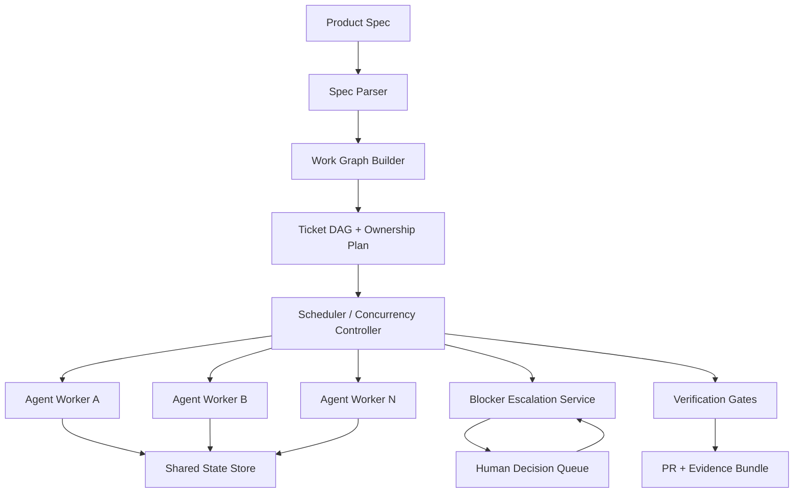

# Minimal MCP Orchestration Stack for Spec-to-Code Execution

## Summit Readiness Assertion

This architecture treats model autonomy as an execution surface, not a control plane. The control plane is an MCP orchestration layer that converts product intent into governed, verifiable, and reversible delivery artifacts.

## Problem Statement

Claims such as "the model shipped itself" are only credible when the runtime provides:

- deterministic work decomposition,
- concurrency-safe execution,
- escalation boundaries for human decisions,
- persistent shared state, and
- hard verification gates before merge/deploy.

Without those controls, common failure modes are file collisions, deadlocked blockers, credential stalls, and context drift.

## Reference Architecture (Minimal)



## Core Components

### 1) Spec Parser + Work Graph Builder

- Input: product spec + repository map + constraints.
- Output: normalized tasks (`task_id`, `scope`, `deps`, `acceptance`, `risk_class`).
- Constraint: every task must map to a bounded file set and explicit acceptance criteria.

### 2) Scheduler + Concurrency Controller

- Executes topologically sorted DAG waves.
- Allows parallel execution only for disjoint file scopes.
- Uses optimistic locking + retry with conflict backoff.
- Enforces per-task lease/heartbeat to detect stalled workers.

### 3) Shared State & Memory Hierarchy

- **Global state:** repo graph, dependency graph, policy baselines.
- **Task state:** objective, current patch, test outputs, unresolved blockers.
- **Artifact state:** commit SHAs, logs, generated evidence.
- Guarantees append-only event log for audit and rollback.

### 4) Blocker Escalation Protocol

- Worker emits typed blocker event (`missing_secret`, `policy_decision`, `ambiguous_spec`, `external_dependency`).
- Escalation service generates minimal decision request (one question, bounded options, timeout).
- After response, scheduler resumes only impacted subtree.

### 5) Guardrails & Verification

- Pre-merge gates: lint, typecheck, unit/integration tests, policy checks.
- Ownership checks: file ownership and forbidden-path enforcement.
- Provenance bundle: changed files, command transcript, test artifacts, risk classification.

## Execution Contract (Minimal Task Schema)

```json
{
  "task_id": "T-204",
  "title": "Add dependency-aware retry policy",
  "scope": ["packages/orchestrator/**"],
  "dependencies": ["T-197"],
  "acceptance": [
    "retry policy supports jitter",
    "unit tests cover retry exhaustion",
    "no regression in scheduler hot path"
  ],
  "risk_class": "minor",
  "rollback": {
    "strategy": "revert_commit",
    "trigger": "failure_rate_increase_gt_2pct"
  }
}
```

## Failure Modes and Required Controls

| Failure Mode | Required MCP Control |
| --- | --- |
| Agents overwrite each other | File-scope locks + conflict retries |
| Work halts on blockers | Typed blocker protocol + resume tokens |
| Requires human decisions | Explicit decision boundary model |
| Context drift | Shared state snapshots + per-task context budget |
| "Looks done" but is unsafe | Mandatory verification gates + evidence bundle |

## MAESTRO Alignment

- **MAESTRO Layers:** Agents, Tools, Infra, Observability, Security.
- **Threats Considered:** prompt injection via spec artifacts, tool misuse, unsafe concurrent writes, policy bypass.
- **Mitigations:** signed task contracts, capability-scoped tools, lock manager, immutable execution log, mandatory gate checks.

## Minimal Rollout Plan

1. Start with one constrained repository zone and one task taxonomy.
2. Add DAG decomposition and lock manager before increasing autonomy.
3. Add blocker escalation queue and structured decision records.
4. Require evidence bundles for every autonomous merge candidate.
5. Expand scope only after stable pass-rate and rollback metrics.

## Final Position

The durable pattern is not model-first autonomy. The durable pattern is governed orchestration: **Spec -> DAG -> Coordinated execution -> Verified artifacts -> Reversible release.**
