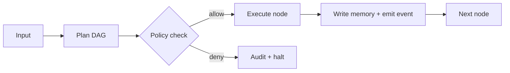

# Summit AI Agent Framework Extraction (from Shakudo "Top 9 AI Agent Frameworks", Dec 2025)

This document converts the nine-framework survey into Summit-ready product and engineering actions. Deliverables are ordered per request.

## Authority Alignment (Governed)

- **Summit Readiness Assertion** is the primary readiness gate and governs delivery criteria. See `docs/SUMMIT_READINESS_ASSERTION.md`.
- **Constitution & Meta-Governance** define the canonical vocabulary and policy constraints. See `docs/governance/CONSTITUTION.md` and `docs/governance/META_GOVERNANCE.md`.
- **Governed Exceptions**: legacy bypasses are tracked as explicit exceptions with owner, rationale, and retirement plan in policy-as-code.

## 1) Framework-to-Summit Capability Map

| Framework              | Core value proposition                                          | Best-fit use cases                                                 | Key primitives                                                          | Operational concerns                                                                        | Summit action (copy/integrate/ignore)                                                       | Suggested Summit module target     |
| ---------------------- | --------------------------------------------------------------- | ------------------------------------------------------------------ | ----------------------------------------------------------------------- | ------------------------------------------------------------------------------------------- | ------------------------------------------------------------------------------------------- | ---------------------------------- |
| LangChain              | Modular toolkit for chaining LLM calls, tools, and memory       | RAG pipelines, tool-using chatbots, agent prototypes               | Chains, tools, memory stores, retrievers, routers, agents, callbacks    | Python-heavy; callbacks for observability; RBAC external; cost scales with model/tool usage | **Copy:** modular abstractions and router pattern. **Integrate:** adapters for LC tools.    | Orchestrator, Connectors, Memory   |
| AgentFlow              | Visual DAG/graph builder for agent workflows                    | Low-code orchestration, business process automation                | Nodes/edges, triggers, human-in-loop steps, monitoring                  | Deployable as service; governance depends on host; cost tied to execution graph             | **Copy:** canvas workflow editing. **Integrate:** import/export via JSON/YAML.              | Orchestrator UI, Workflow DSL      |
| AutoGen                | Multi-agent conversation and tool use with roles                | Collaborative agents, coding copilots, negotiation loops           | Agents with roles, conversation state, function/tool calls, group chats | Python-heavy; tracing via logs; RBAC external; compute spikes with loops                    | **Copy:** role-based agent negotiation. **Integrate:** AutoGen-compatible messaging bridge. | Multi-Agent Runtime, Messaging     |
| Semantic Kernel        | Pluggable skills + planner for .NET/TS                          | Enterprise app embedding, skills catalog, planner-driven execution | Skills (functions), planners, connectors, memory abstractions           | Strong enterprise SDKs; RBAC via host; costs model-driven                                   | **Copy:** skill abstraction + planner. **Integrate:** SK skill adapter.                     | Skills/Tools layer, Planner        |
| Atomic Agents          | Minimal TypeScript agents with typed tools                      | Lightweight JS/TS agents, frontend-safe                            | Typed tools, deterministic planning, minimal runtime                    | Small dep surface; good for browser; RBAC external                                          | **Copy:** typed tool contracts, lightweight runtime.                                        | JS Agent Runtime, Tooling          |
| CrewAI                 | Crew-style multi-agent task delegation                          | Team-of-agents for research/analysis                               | Roles, tasks, delegation, shared memory                                 | Python deps; limited governance; cost scales with team size                                 | **Copy:** task delegation + reviewer pattern. **Integrate:** data exchange bridge.          | Multi-Agent Runtime                |
| RASA                   | Production conversational engine with NLU + dialogue management | Contact centers, task bots with slots and flows                    | Intent/entity NLU, stories/rules, channels, actions                     | Mature deploy story; RBAC via infra; monitoring tooling; training cost                      | **Integrate:** RASA channel/action connector. **Copy:** dialogue policy store.              | Conversation Service, Policy       |
| HF Transformers Agents | Model/tool orchestration with transformers and tool registry    | Research agents needing custom models, tool routing                | Transformers pipeline, tool registry, planner                           | GPU dependence; licensing per model; monitoring external                                    | **Copy:** model/tool registry pattern. **Integrate:** registry sync.                        | Model Orchestration, Tool Registry |
| Langflow               | Visual builder over LangChain                                   | Rapid prototyping, demos                                           | Drag/drop LC components, connectors, execution view                     | Hosted/self-hosted; governance limited; cost from backend services                          | **Copy:** visual composer UX patterns. **Integrate:** import/export to Summit DSL.          | Orchestrator UI                    |

## 2) Summit Agent Runtime Requirements v0

### 2.1 Component interfaces (TypeScript-first)

**Agent runtime**

```ts
export interface AgentContext {
  traceId: string;
  sessionId?: string;
  actor: ActorRef;
  policies: PolicyBundle;
  memory: MemoryHandle;
  tools: ToolRegistry;
  budget: BudgetProfile;
  observability: ObservabilityHandle;
}

export interface Agent {
  id: string;
  role: string;
  capabilities: string[];
  riskTier: "low" | "medium" | "high";
  plan(input: AgentInput, ctx: AgentContext): Promise<Plan>;
  act(step: PlanStep, ctx: AgentContext): Promise<ActionResult>;
}
```

**Tool/connector layer**

```ts
export interface Tool {
  name: string;
  version: string;
  schema: JsonSchema;
  permissions: PermissionSpec;
  invoke(args: unknown, ctx: ToolContext): Promise<ToolResult>;
}

export interface ToolRegistry {
  register(tool: Tool): Promise<void>;
  get(name: string, version?: string): Promise<Tool>;
  list(): Promise<Tool[]>;
}
```

**Memory layer**

```ts
export interface MemoryHandle {
  write(event: MemoryEvent): Promise<void>;
  query(query: MemoryQuery): Promise<MemoryResult[]>;
  redact(request: RedactionRequest): Promise<RedactionResult>;
}
```

**Policy & governance layer**

```ts
export interface PolicyBundle {
  evaluate(request: DecisionRequest): Promise<DecisionResponse>;
}

export interface DecisionRequest {
  action: "tool.invoke" | "memory.read" | "memory.write" | "message.send" | "model.select";
  actor: ActorRef;
  resource: ResourceRef;
  context: Record<string, unknown>;
}
```

**Communication**

```ts
export interface MessageEnvelope {
  traceId: string;
  correlationId: string;
  from: ActorRef;
  to: ActorRef | "broadcast";
  channel: string;
  ttlMs: number;
  payload: unknown;
}
```

### 2.2 Minimum viable features

- **Agent runtime**: plan+act loop, deterministic mode, interrupt/resume, run-level config (model, budget, safety profile), state checkpoints.
- **Tools**: registry CRUD, schema validation, permission checks, adapter sandboxing, connector-level rate limits.
- **Memory**: short-term context buffer, long-term retrieval (vector/graph), append-only event log with provenance and redaction.
- **Orchestration**: DAG/workflow runner, retries, human-in-loop steps, timers/event triggers, task handoffs.
- **Observability**: structured traces, token+cost meter, per-step logs, deterministic replay.

### 2.3 Non-functional requirements

- **Security**: RBAC + optional ABAC; OPA/rego policy evaluation at enforcement points; credential vault references only.
- **Audit**: append-only event log, signed run records, export to provenance ledger; immutable run history.
- **Cost**: token accounting per step, budget guardrails, provider attribution.
- **Diagnostics**: trace IDs across agents/tools; latency + token heatmaps; anomaly alerts.

### 2.4 Separation of concerns

- **Agent runtime**: plan/act loop, messaging, scratchpad, checkpointing.
- **Tool/connector layer**: typed invocations, side-effect isolation, rate limiting.
- **Memory layer**: vector/graph/event log services with schema versioning and redaction.
- **Policy & governance**: enforcement + audit middleware; no business logic inside policies.

### 2.5 Data models (v0)

```ts
export interface Plan {
  id: string;
  steps: PlanStep[];
  createdAt: string;
}

export interface PlanStep {
  id: string;
  tool?: string;
  inputs: Record<string, unknown>;
  dependsOn?: string[];
  status: "pending" | "running" | "paused" | "complete" | "failed";
}

export interface MemoryEvent {
  id: string;
  traceId: string;
  kind: "tool" | "message" | "plan" | "observation" | "audit";
  payload: Record<string, unknown>;
  createdAt: string;
  hash: string;
}
```

### 2.6 API surface (draft)

- `POST /orchestrator/runs` → create run from DAG + inputs
- `POST /orchestrator/runs/:id/pause` → human-in-loop pause
- `POST /orchestrator/runs/:id/resume` → resume with reviewer input
- `GET /orchestrator/runs/:id` → status + step history
- `POST /tools/registry` → register tool
- `GET /tools/registry` → list tools
- `POST /memory/query` → query memory across vector/graph/eventlog
- `POST /policy/evaluate` → policy decision point

## 3) Backlog: 10 high-leverage epics + 30 issues

### Epics

1. **Orchestrator DAG Runtime**
   - Problem: No unified DAG runner for agent workflows.
   - Scope: DAG execution, retries, timers, human tasks. Not in scope: UI canvas.
   - Dependencies: Event bus, policy hooks.
   - Acceptance: DAG spec in `docs/orchestrator/dag-spec.md`, runnable examples in `examples/orchestrator/`, tests in `packages/orchestrator/tests` covering retries/human-step pause/restart.
   - Paths: `packages/orchestrator/`, `docs/orchestrator/`.
2. **Agent Messaging & Crew Patterns**
   - Problem: Lacking structured multi-agent messaging and delegation.
   - Scope: Topics/channels, task handoffs, reviewer/approver pattern. Not: voice/AV channels.
   - Dependencies: Orchestrator bus, policy checks.
   - Acceptance: Messaging API (`packages/orchestrator/src/messaging.ts`), examples of crew workflow, tests for delegation routing.
   - Paths: `packages/orchestrator/`, `examples/crews/`.
3. **Typed Tool Registry**
   - Problem: Tools lack typed schemas and permissions.
   - Scope: JSON Schema validation, permission spec, registry CRUD, adapters for LangChain/SK tools. Not: marketplace UI.
   - Dependencies: Policy engine, connector vault.
   - Acceptance: `packages/tools/` module with validation tests, docs in `docs/tools/registry.md`, sample adapters.
   - Paths: `packages/tools/`, `docs/tools/`.
4. **Memory Fabric (Vector/Graph/Event Log)**
   - Problem: Fragmented memory interfaces.
   - Scope: Unified `MemoryHandle`, vector + graph + event log providers, eviction policy. Not: bespoke ML embeddings.
   - Dependencies: Storage services, authz.
   - Acceptance: Interface + implementations under `packages/memory/`, benchmarks, migration guide; docs in `docs/memory/`.
   - Paths: `packages/memory/`, `docs/memory/`.
5. **Policy & Governance Hooks**
   - Problem: Tools/agents run without consistent policy enforcement.
   - Scope: OPA enforcement points, budget guardrails, data egress rules. Not: custom regulator-specific rulesets.
   - Dependencies: Policy engine, registry metadata.
   - Acceptance: Middleware in `packages/policy/`, tests for deny/allow, audit outputs; docs in `docs/policy/`.
   - Paths: `packages/policy/`, `docs/policy/`.
6. **Observability & Replay**
   - Problem: Limited tracing and replay.
   - Scope: Trace spans per step, cost meter, run history, deterministic replay. Not: vendor-specific exporters.
   - Dependencies: Orchestrator runtime, event log memory.
   - Acceptance: `packages/observability/` with OpenTelemetry-compatible exports, replay CLI, dashboards documented.
   - Paths: `packages/observability/`, `docs/observability/`.
7. **Workflow Canvas Interop (Langflow/AgentFlow)**
   - Problem: No low-code interface.
   - Scope: Import/export Summit DAG spec to JSON, starter React canvas. Not: full SaaS studio.
   - Dependencies: DAG spec, tool registry.
   - Acceptance: Converter in `packages/orchestrator/src/interop/langflow.ts`, demo UI in `apps/orchestrator-ui/`, docs.
   - Paths: `packages/orchestrator/`, `apps/orchestrator-ui/`, `docs/orchestrator-ui/`.
8. **Enterprise Skill Adapter (Semantic Kernel)**
   - Problem: Skills/planner interop missing.
   - Scope: SK-compatible skill adapter, planner bridge. Not: SK hosting.
   - Dependencies: Tool registry, policy.
   - Acceptance: Adapter in `packages/tools/src/adapters/semantic-kernel.ts`, samples, auth tests.
   - Paths: `packages/tools/`, `examples/skills/`.
9. **Conversation Engine Integration (RASA)**
   - Problem: No production conversation policy engine.
   - Scope: RASA channel connector, action server bridge, slot/memory sync. Not: NLU training UI.
   - Dependencies: Tool registry, memory fabric.
   - Acceptance: Connector in `packages/connectors/rasa/`, end-to-end test simulating dialogue, docs in `docs/connectors/rasa.md`.
   - Paths: `packages/connectors/`, `docs/connectors/`.
10. **Model & Tool Registry (HF Agents pattern)**
    - Problem: Model/tool selection not codified.
    - Scope: Registry with versioning, capability tags, routing hints. Not: model hosting.
    - Dependencies: Tool registry core, policy hooks.
    - Acceptance: Registry service in `packages/registry/`, CLI for add/list, docs in `docs/registry/`.

### Issues (30)

Each issue is atomic-PR sized, labeled, and acceptance-tested.

1. **Spec DAG schema v0.1** — labels: `orchestrator`, `spec`; est: 3; DoD: schema file + examples; Tests: JSON schema validation.
2. **Implement DAG executor with retries** — labels: `orchestrator`; est: 5; DoD: executor supports retry/backoff; Tests: unit for success/fail/retry.
3. **Human task pause/resume API** — labels: `orchestrator`, `hirl`; est: 3; DoD: REST/TS API stub; Tests: pause/resume integration.
4. **Messaging topic router** — labels: `messaging`; est: 3; DoD: topic-based dispatch; Tests: route correctness.
5. **Crew reviewer/approver workflow example** — labels: `messaging`, `example`; est: 2; DoD: sample script; Tests: e2e script output snapshot.
6. **Tool registry JSON Schema validation** — labels: `tools`; est: 3; DoD: validation layer; Tests: invalid schema rejection.
7. **Tool permission spec + OPA hook** — labels: `tools`, `policy`; est: 3; DoD: permission model; Tests: allow/deny cases.
8. **LangChain tool adapter** — labels: `interop`; est: 3; DoD: wrap LC tool; Tests: adapter invocation matches LC output.
9. **Semantic Kernel skill adapter** — labels: `interop`; est: 3; DoD: SK bridge; Tests: sample skill round-trip.
10. **Vector memory provider skeleton** — labels: `memory`; est: 3; DoD: interface + in-memory impl; Tests: similarity search unit tests.
11. **Graph memory provider skeleton** — labels: `memory`; est: 3; DoD: interface + stub; Tests: node/edge CRUD.
12. **Event log memory + provenance fields** — labels: `memory`, `audit`; est: 3; DoD: append-only log; Tests: immutability guard.
13. **Memory adapter selection policy** — labels: `policy`, `memory`; est: 2; DoD: policy check per query; Tests: deny/allow cases.
14. **Policy middleware for tool calls** — labels: `policy`; est: 3; DoD: middleware invoked on tool call; Tests: enforced deny stops call.
15. **Budget guardrail enforcement** — labels: `policy`, `cost`; est: 2; DoD: budget thresholds with fail-fast; Tests: exceeds budget triggers stop.
16. **Trace context propagation** — labels: `observability`; est: 2; DoD: trace IDs per message; Tests: propagation unit tests.
17. **Token cost accounting** — labels: `observability`, `cost`; est: 2; DoD: token meter per step; Tests: accounting math.
18. **Run replay CLI** — labels: `observability`, `cli`; est: 3; DoD: CLI replays saved run; Tests: deterministic replay.
19. **Langflow import/export converter** — labels: `interop`, `ui`; est: 3; DoD: converter script; Tests: sample graph parity.
20. **Canvas UI starter (React)** — labels: `ui`; est: 5; DoD: DAG visualize/edit basic; Tests: Cypress smoke.
21. **AutoGen bridge for multi-agent chat** — labels: `interop`, `messaging`; est: 4; DoD: bridge adapter; Tests: message compatibility.
22. **Crew task handoff policy checks** — labels: `policy`, `messaging`; est: 2; DoD: handoff requires policy allow; Tests: deny blocks.
23. **RASA connector (channel)** — labels: `connectors`; est: 4; DoD: webhook adapter; Tests: simulated convo.
24. **RASA action server adapter** — labels: `connectors`; est: 3; DoD: action invocation; Tests: action call unit tests.
25. **Model registry CRUD API** — labels: `registry`; est: 3; DoD: HTTP/TS API; Tests: CRUD integration.
26. **Tool registry CLI** — labels: `tools`, `cli`; est: 2; DoD: CLI add/list/remove; Tests: snapshot output.
27. **Registry capability tagging** — labels: `registry`; est: 2; DoD: tags on models/tools; Tests: filter tests.
28. **Alerts for policy violations** — labels: `observability`, `policy`; est: 2; DoD: emit alerts on deny; Tests: alert emission.
29. **Connector credential vault reference** — labels: `security`, `connectors`; est: 3; DoD: use secret ref not secret value; Tests: secret not logged.
30. **Documentation pass for runtime v0** — labels: `docs`; est: 2; DoD: docs in `docs/orchestrator/`, `docs/tools/`, `docs/memory/`; Tests: linting.

## 4) Design Proposal: Summit Orchestrator

### 4.1 Execution model

- Event-driven DAG executor with state machine per node.
- Deterministic replay via seed capture and event log replay.
- Human-in-loop nodes pause with explicit resume payloads.



### 4.2 Multi-agent messaging model

- Topic/channel bus with shared task scratchpad.
- Handoffs spawn child tasks with parent trace lineage.
- Reviewer/approver pattern enforced by policy checks and audit logging.

### 4.3 Memory strategy

- Short-term context buffer per task.
- Long-term vector store for semantic recall.
- Graph store for relationships.
- Event log for provenance, replay, and audit.

### 4.4 Observability

- OpenTelemetry spans per node/tool call.
- Token/cost meter; per-run budgets enforced by policy.
- Run history stored in event log; replay CLI uses stored events + seeds.

### 4.5 Scheduling

- Cron + event triggers + long-running job leases.
- Timers stored in orchestration DB; supports external webhooks.

### 4.6 Security

- Policy enforcement points on tool calls, memory reads/writes, messaging, model selection.
- Least-privilege connectors referencing vaulted credentials.
- Audit entries are immutable and exportable to provenance ledger.

### 4.7 Failure/recovery

- Exponential backoff retries.
- Circuit breakers on failing connectors.
- Compensation hooks and idempotent node execution.
- Partial run replay with deterministic seeds.

## 5) Interop stance

| Framework        | Wrap vs reimplement                                | Rationale                                                         | Risks                                     | Summit action now                |
| ---------------- | -------------------------------------------------- | ----------------------------------------------------------------- | ----------------------------------------- | -------------------------------- |
| LangChain        | Wrap common tools/memory; reimplement core runtime | Reuse ecosystem tools while owning runtime, policy, observability | Dependency churn; adapter lag             | Build adapters + import/export   |
| AutoGen          | Wrap messaging interface                           | Capture crew patterns without adopting Python runtime             | Language boundary; dependency maintenance | Build bridge adapter             |
| Semantic Kernel  | Wrap skills/planner                                | Enterprise adoption; unlocks integration via adapters             | SDK drift                                 | Build skill adapter              |
| CrewAI           | Reimplement patterns                               | Delegation/review patterns are simple; avoid heavy deps           | Feature lag vs upstream                   | Implement native crew primitives |
| Langflow-like UI | Wrap import/export, build native UI                | Maintain compatibility while owning UX                            | Format drift                              | Build DAG spec + converter       |

**Recommendation:** Prefer adapters for ecosystem gravity (LangChain, Semantic Kernel, AutoGen) while owning core runtime, policy, and observability to avoid lock-in.

## 6) Additional notes (explicit inferences)

- **Inference:** A dedicated Orchestrator package under `packages/orchestrator/` accelerates cross-domain integration without forcing server changes.
- **Inference:** A minimal React canvas UI should live under `apps/orchestrator-ui/` to avoid coupling with `apps/web/`.
- **Inference:** Policy-as-code must remain the single source of enforcement logic; no duplicated security logic is permitted.

## 7) Immediate next PRs (green-path aligned)

1. Add DAG schema + executor skeleton under `packages/orchestrator/` with unit tests.
2. Add tool registry interfaces + JSON Schema validation under `packages/tools/`.
3. Add event log memory interface + in-memory adapter in `packages/memory/`.

These PRs are scoped for atomic merges, with CI-friendly unit tests and no cross-zone coupling.
