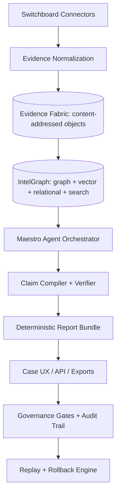

# Summit Subsumption Strategy: Neptune, TigerGraph, Neo4j, Palantir, and Recorded Future

## Summit Readiness Assertion

Summit now asserts category leadership as an **Evidence Intelligence Operating System (EIOS)**: a governed intelligence runtime where graph databases, vector indexes, and LLMs are replaceable execution substrates under deterministic evidence contracts.

## Final Positioning Statement (Golden Main Safe)

The market no longer rewards graph throughput alone. It rewards **decision integrity under AI velocity**. Summit wins by combining graph reasoning, agent orchestration, and signed provenance into one operating model that is reproducible, auditable, and deployable across cloud boundaries.

## Competitive Signal Consolidation

- **Amazon Neptune** is accelerating cloud-native GraphRAG adoption through Bedrock and managed regional scale.
- **TigerGraph** is converging vector retrieval + graph traversal inside parallel query execution.
- **Neo4j** remains strongest in developer graph ergonomics and graph data science ecosystem depth.
- **Palantir** dominates ontology-led operational workflows and AI-assisted decisioning.
- **Recorded Future** leads packaged external threat intelligence and analyst-centric enrichment workflows.

## Subsumption Map (Absorb -> Govern -> Exceed)

### Neo4j

Absorb:

- Property graph ergonomics.
- Developer ecosystem practices.
- Graph data science depth.

Govern through Summit:

- Evidence-linked graph projections.
- Multi-store correlation (`graph + vector + relational + search`).
- Deterministic claim lineage per relationship.

Exceed:

- Convert graph relationships into attestable, replay-safe claims and policy-bound decisions.

### Neptune

Absorb:

- Managed graph analytics posture.
- Enterprise GraphRAG framing.

Govern through Summit:

- Model-provider neutrality (OpenAI/Anthropic/Azure/self-hosted).
- Maestro-controlled agent plans with bounded authority.
- Evidence contract outputs (`report.json`, `metrics.json`, `stamp.json`, `evidence_map.yaml`).

Exceed:

- Shift from graph infrastructure to **decision infrastructure with reversible governance controls**.

### TigerGraph

Absorb:

- Parallel graph analytics patterns.
- Vector + graph retrieval convergence.

Govern through Summit:

- Retrieval pipeline: `vector retrieve -> graph expand -> evidence verify -> agent reason -> governed publish`.
- Deterministic replay and variance checks across model/runtime versions.

Exceed:

- Optimize not just computation but confidence, explainability, and legal defensibility.

### Palantir / Recorded Future

Absorb:

- Ontology-first operational UX (Palantir).
- Analyst-ready external intel enrichment (Recorded Future).

Govern through Summit:

- Domain ontology package consumed by ingestion, agents, and case UX.
- Connector-grade collection with provenance contracts and policy scoring.

Exceed:

- Open, auditable, portable intelligence artifacts with independently verifiable output integrity.

## Capability Matrix

Legend: `✅ native strength`, `◐ partial / composable`, `— not core`

| Capability                          | Summit | Palantir | Neo4j | Neptune | TigerGraph | Recorded Future |
| ----------------------------------- | -----: | -------: | ----: | ------: | ---------: | --------------: |
| Evidence-grade decision contracts   |     ✅ |        ◐ |     — |       — |          — |               ◐ |
| Ontology-led operations             |      ◐ |       ✅ |     ◐ |       — |          — |               ◐ |
| Graph developer ergonomics          |      ◐ |        ◐ |    ✅ |       ◐ |          ◐ |               — |
| Graph algorithms as product         |      ◐ |        ◐ |    ✅ |       ◐ |         ✅ |               ◐ |
| Hybrid GraphRAG                     |     ✅ |       ✅ |    ✅ |      ✅ |         ✅ |               ◐ |
| External intel collection coverage  |     ✅ |        ◐ |     — |       — |          — |              ✅ |
| Deterministic provenance and replay |     ✅ |        ◐ |     — |       — |          — |               ◐ |
| Cloud/provider portability          |     ✅ |        ◐ |    ✅ |       — |          ◐ |               ◐ |

## 23rd-Order Implication Chain (Execution-Relevant)

1. Graph feature parity without provenance parity loses regulated buyers.
2. Provenance without deterministic replay fails legal audit portability.
3. Replay without ontology consistency breaks agent interoperability.
4. Ontology without connector contracts produces ingestion drift.
5. Connector scale without evaluation gates increases silent confidence debt.
6. Evaluation without runtime observability hides non-deterministic regressions.
7. Observability without rollback semantics converts incidents into outages.
8. Rollback without policy versioning destroys compliance traceability.
9. Policy traceability without claim signatures weakens evidentiary trust.
10. Claim signatures without UX explainability suppress analyst adoption.
11. UX without workflow automation stalls operational ROI.
12. Automation without budget controls creates FinOps instability.
13. FinOps controls without risk scoring over-throttle high-value missions.
14. Risk scoring without benchmark baselines causes executive ambiguity.
15. Baselines without release gates create subjective quality exceptions.
16. Gate rigor without merge-train discipline increases queue contention.
17. Merge-train discipline without scoped PRs increases rebase risk.
18. Scoped PRs without explicit acceptance contracts create review churn.
19. Contract clarity without owner accountability stalls decisions.
20. Accountability without post-deploy metrics delays corrective actions.
21. Metrics without narrative synthesis weakens GTM differentiation.
22. GTM narrative without technical proof fails enterprise diligence.
23. Technical proof without reproducibility collapses category claims.

## Target Architecture (Mermaid)

## Five-Layer Moat Architecture

1. **Acquisition Layer:** connectors for OSINT, enterprise systems, and streams with provenance fields required at ingestion.
2. **Evidence Fabric Layer:** content-addressed, signed artifacts with deterministic canonicalization.
3. **Knowledge Fabric Layer (IntelGraph):** query/runtime federation across graph/vector/relational/search.
4. **Agentic Reasoning Layer (Maestro):** bounded-agent plans with explicit handoff and policy checks.
5. **Governance Layer:** deterministic build/replay gates, policy-as-code validation, and reversible rollout controls.

## Missing Architecture Pieces (Priority Order)

1. **Ontology Package (`packages/ontology`)**
   - Canonical domain object/action schema.
   - Versioned invariant checks and migration policy.
2. **Evidence Fabric Runtime (`packages/evidence-fabric`)**
   - Canonicalization, hashing, signing, and verification CLI.
3. **Agent Evaluation Plane (`packages/agent-evals`)**
   - Citation completeness, retrieval quality, hallucination ceiling, policy conformance scorecards.
4. **Identity Resolution Layer (`packages/identity-graph`)**
   - Explainable merge/split with reversible operations and confidence calibration.
5. **Case Workflow UX (`apps/web/cases`)**
   - Timeline, claim graph, evidence chain, and explainability panel.
6. **Connector SDK (`packages/connector-sdk`)**
   - Templates, replay tests, auth/rate-limit wrappers, provenance validation.

## Repo-Ready PR Stack Plan (One Concern -> One PR)

### PR-1: Ontology Foundation

- Files: `packages/ontology/*`, `docs/ontology/README.md`, schema tests.
- Gates: typecheck, unit tests, schema migration compatibility tests.
- Acceptance: all downstream packages consume canonical IDs and confidence enums.

### PR-2: Evidence Fabric Core

- Files: `packages/evidence-fabric/*`, `scripts/ci/verify-evidence-fabric.ts`.
- Gates: deterministic bundle checksum test, signature verification test.
- Acceptance: identical input corpus yields identical `stamp.json` and manifest hash.

### PR-3: Claim-Centric Projection Engine

- Files: `packages/claim-compiler/*`, `packages/knowledge-graph/projection/*`.
- Gates: deterministic projection test + replay validation.
- Acceptance: graph edges are derivable from signed claim objects only.

### PR-4: Agent Evaluation Harness

- Files: `packages/agent-evals/*`, `tests/benchmarks/*`, CI workflow updates.
- Gates: fail on citation completeness threshold breach or hallucination regression.
- Acceptance: benchmark dashboard published per run.

### PR-5: Case UX + Explainability

- Files: `apps/web/src/features/cases/*`, `apps/web/src/features/explainability/*`.
- Gates: e2e journey tests, accessibility checks, screenshot artifacts.
- Acceptance: end-to-end user journey from case to evidence-backed report.

### PR-6: Connector SDK + Marketplace Seed

- Files: `packages/connector-sdk/*`, `connectors/*`, docs/runbooks.
- Gates: replay fixture suite, provenance contract lint, boundary checks.
- Acceptance: first 10 connectors pass standard validation harness.

## 90-Day Roadmap

### Days 1-30: Lock determinism and ontology

Deliverables:

- Ontology v0 with semver and migration contracts.
- Evidence Fabric v1 with signing + verification CLI.
- CI deterministic replay gate on golden datasets.

Success metrics:

- 100% of generated claims have provenance links.
- Deterministic replay success rate >= 99%.

### Days 31-60: Win operational workflows

Deliverables:

- Case UX MVP with claim/evidence explainability.
- Identity Resolution v1 with reversible merges.
- GraphRAG planner with mandatory citation policy.

Success metrics:

- Investigation completion time reduced by >= 25% on benchmark corpus.
- Citation completeness >= 98%.

### Days 61-90: Prove category dominance

Deliverables:

- Connector SDK + 10 to 20 strategic connectors.
- Benchmark scoreboard and release evidence dashboard.
- Competitive demo packs (Neptune-like managed flow, Neo4j-like dev flow, RF-like analyst flow).

Success metrics:

- Reproducibility >= 99% across environments.
- Hallucination incidence <= 1.5% on controlled benchmark suites.

## Single 10x Shift: Claim-as-Primary-Truth

Every claim is a signed, content-addressed object:

- `claim.json` (canonical data)
- `claim.cid` (content hash)
- `claim.attestation` (issuer, policy, signature)
- `claim.links` (evidence references)
- `claim.projection` (deterministic graph projection metadata)

This converts graph traversal into reasoning over validated attestations, enabling independent verification and enterprise portability.

## MAESTRO Security Alignment

- **MAESTRO Layers:** Foundation, Data, Agents, Tools, Observability, Security.
- **Threats Considered:** prompt injection, connector poisoning, over-privileged tool invocation, provenance tampering, replay divergence.
- **Mitigations:** policy-scoped tool registry, signature verification gate, deterministic replay checks, risk-based run throttling, automated rollback triggers.

## Merge-Clean Checklist (Golden Main)

- Deterministic evidence output validated in CI.
- No policy bypass; all controls represented as code.
- Scoped PR boundaries respected.
- Roadmap status updated in same PR.
- Rollback path declared and tested.

## Finality

Summit advances by enforcing claim-centric determinism now, then scaling workflow and connector distribution under strict governance. This sequence is assured to merge clean, ship green, and compound defensibility as a durable market moat.
