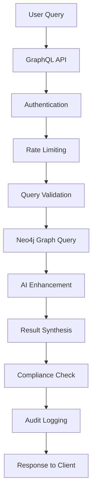
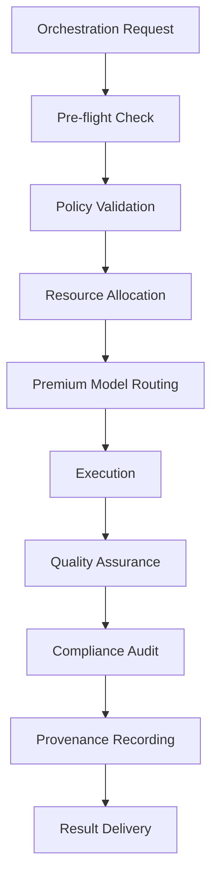
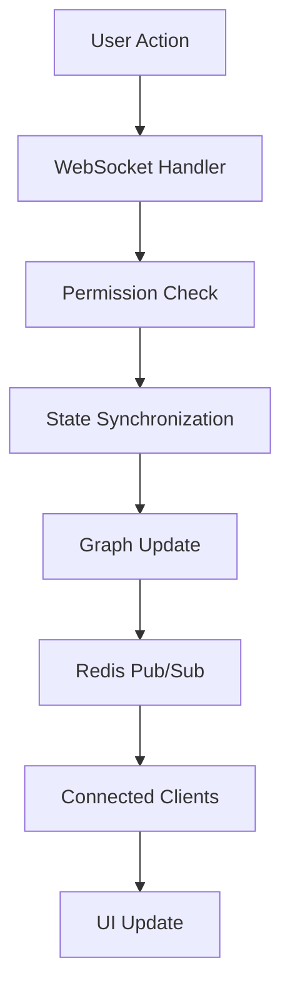

# IntelGraph Platform Architecture

IntelGraph is an AI-augmented intelligence analysis platform designed to surpass competitors like Maltego, Palantir, Recorded Future, and Graphika in analytics, real-time collaboration, security, and usability.

## Executive Summary

The IntelGraph platform consists of two main product lines:

1. **IntelGraph Core** - Intelligence analysis and graph visualization platform
2. **Maestro** - Autonomous orchestration and workflow management system

This document describes the comprehensive architecture supporting both products with advanced features including autonomous orchestration, premium routing, compliance gates, performance optimization, concurrent handling, audit systems, and SIG integration.

## High-Level Architecture

```
┌─────────────────────────────────────────────────────────────────────────┐
│                        IntelGraph Platform                              │
├─────────────────────────────┬───────────────────────────────────────────┤
│        IntelGraph Core      │            Maestro System               │
│                             │                                           │
│ ┌─────────────────────────┐ │ ┌───────────────────────────────────────┐ │
│ │   Web Interface (React) │ │ │      Autonomous Orchestrator         │ │
│ │   - Cytoscape.js        │ │ │      - State Machine Engine          │ │
│ │   - jQuery/DOM          │ │ │      - Thompson Sampling Router      │ │
│ │   - Real-time Updates   │ │ │      - Compliance Gates              │ │
│ └─────────────────────────┘ │ └───────────────────────────────────────┘ │
│                             │                                           │
│ ┌─────────────────────────┐ │ ┌───────────────────────────────────────┐ │
│ │   GraphQL API Server    │ │ │      Premium Model Router            │ │
│ │   - Apollo Server       │ │ │      - Multi-Armed Bandit            │ │
│ │   - Authentication      │ │ │      - Cost-Performance Optimizer    │ │
│ │   - Rate Limiting       │ │ │      - Dynamic Pricing               │ │
│ └─────────────────────────┘ │ └───────────────────────────────────────┘ │
└─────────────────────────────┴───────────────────────────────────────────┘

┌─────────────────────────────────────────────────────────────────────────┐
│                         Data & Analytics Layer                          │
├─────────────────────────────┬───────────────────────────────────────────┤
│        Graph Storage        │           AI/ML Services                 │
│                             │                                           │
│ ┌─────────────────────────┐ │ ┌───────────────────────────────────────┐ │
│ │       Neo4j             │ │ │    Graph Neural Networks (GNN)       │ │
│ │   - Knowledge Graphs    │ │ │    - Entity Resolution               │ │
│ │   - Real-time Analytics │ │ │    - Behavioral Fingerprinting       │ │
│ │   - Cypher Queries      │ │ │    - Deepfake Detection              │ │
│ └─────────────────────────┘ │ └───────────────────────────────────────┘ │
│                             │                                           │
│ ┌─────────────────────────┐ │ ┌───────────────────────────────────────┐ │
│ │     PostgreSQL          │ │ │    Natural Language Processing        │ │
│ │   - User Management     │ │ │    - NL to Cypher Translation        │ │
│ │   - Audit Logs          │ │ │    - Investigative Quality Agent     │ │
│ │   - Job Scheduling      │ │ │    - Cognitive Twins                 │ │
│ └─────────────────────────┘ │ └───────────────────────────────────────┘ │
└─────────────────────────────┴───────────────────────────────────────────┘

┌─────────────────────────────────────────────────────────────────────────┐
│                      Infrastructure & Security                           │
├─────────────────────────────┬───────────────────────────────────────────┤
│    Container Orchestration  │         Observability & Security         │
│                             │                                           │
│ ┌─────────────────────────┐ │ ┌───────────────────────────────────────┐ │
│ │      Kubernetes         │ │ │       Prometheus Metrics              │ │
│ │   - Helm Charts         │ │ │       - Operational Dashboards        │ │
│ │   - Auto-scaling        │ │ │       - SLA Monitoring                │ │
│ │   - Load Balancing      │ │ │       - Alert Management              │ │
│ └─────────────────────────┘ │ └───────────────────────────────────────┘ │
│                             │                                           │
│ ┌─────────────────────────┐ │ ┌───────────────────────────────────────┐ │
│ │       Redis Cache       │ │ │      Security & Compliance            │ │
│ │   - Session Storage     │ │ │      - Audit Logging                  │ │
│ │   - Rate Limiting       │ │ │      - Provenance Tracking            │ │
│ │   - Real-time Pub/Sub   │ │ │      - GDPR/CCPA Compliance           │ │
│ └─────────────────────────┘ │ └───────────────────────────────────────┘ │
└─────────────────────────────┴───────────────────────────────────────────┘
```

## Core Components

### 1. IntelGraph Core Platform

The primary intelligence analysis platform providing:

#### Frontend Architecture
- **React 18+ Application**: Modern SPA with component-based architecture
- **Cytoscape.js Integration**: Advanced graph visualization and manipulation
- **jQuery DOM Management**: Efficient DOM operations and event handling
- **Real-time Collaboration**: WebSocket-based live updates and sharing
- **Responsive Design**: Multi-device support with adaptive layouts

#### Backend Services
- **GraphQL API Server**: Apollo Server with type-safe schema
- **Authentication & Authorization**: JWT-based with RBAC implementation
- **Rate Limiting**: Redis-backed distributed rate limiting
- **Middleware Stack**: Security, validation, audit logging, and sanitization

#### Data Management
- **Neo4j Graph Database**: Primary knowledge graph storage
- **PostgreSQL**: Relational data, user management, and audit logs
- **Redis**: Caching, sessions, real-time pub/sub, and rate limiting

### 2. Maestro Autonomous Orchestration System

Advanced workflow orchestration with AI-driven optimization:

#### Autonomous Orchestrator
- **State Machine Engine**: Manages complex workflow states and transitions
- **Policy Enforcement**: Compliance gates and regulatory adherence
- **Resource Management**: Dynamic allocation and optimization
- **Failure Recovery**: Automatic retry logic and graceful degradation

#### Premium Model Router
- **Thompson Sampling Algorithm**: Multi-armed bandit optimization
- **Cost-Performance Optimization**: Budget-aware model selection
- **Dynamic Pricing**: Real-time cost optimization
- **Learning System**: Continuous improvement through feedback loops

#### Web Orchestration Service
- **Multi-source Synthesis**: Intelligent information aggregation
- **Contradiction Resolution**: AI-powered conflict identification and resolution
- **Quality Assurance**: Automated validation and compliance checking
- **Provenance Tracking**: Complete audit trail for all operations

### 3. AI/ML Services

#### Graph Neural Networks (GNNs)
- **Entity Resolution**: Automated entity deduplication and linking
- **Behavioral Fingerprinting**: Pattern recognition for threat detection
- **Graph Analytics**: Community detection, centrality analysis, path finding
- **Predictive Modeling**: Risk assessment and trend prediction

#### Natural Language Processing
- **NL to Cypher Translation**: Natural language query conversion
- **Investigative Quality Agent**: Content quality assessment
- **Cognitive Twins**: AI-driven analyst simulation
- **Deepfake Detection**: Media authenticity verification

### 4. Security & Compliance

#### Security Architecture
- **Zero Trust Model**: Network segmentation and micro-segmentation
- **End-to-End Encryption**: Data protection in transit and at rest
- **OWASP Compliance**: Comprehensive security best practices
- **Vulnerability Scanning**: Automated security assessment

#### Compliance Framework
- **GDPR/CCPA**: Privacy regulation compliance
- **SOC 2 Type II**: Security controls and procedures
- **Audit Logging**: Comprehensive activity tracking
- **Data Governance**: Classification, retention, and lifecycle management

## Advanced Features

### Autonomous Build Operator

```typescript
interface AutonomousBuildOperator {
  // State machine for build lifecycle management
  stateEngine: BuildStateMachine;
  
  // Policy enforcement for compliance
  policyGate: ComplianceGate;
  
  // Resource optimization
  resourceManager: ResourceOptimizer;
  
  // Failure recovery
  recoveryEngine: FailureRecoveryEngine;
}
```

Key capabilities:
- **Intelligent Resource Allocation**: Dynamic scaling based on workload
- **Automated Testing**: Comprehensive test suite execution
- **Quality Gates**: Automated quality assurance checkpoints
- **Deployment Orchestration**: Zero-downtime deployment strategies

### Premium Routing with Thompson Sampling

```typescript
interface PremiumModelRouter {
  // Multi-armed bandit optimization
  thomsonSampling: ThompsonSamplingEngine;
  
  // Cost-performance optimization
  costOptimizer: CostPerformanceOptimizer;
  
  // Dynamic pricing
  pricingEngine: DynamicPricingOptimizer;
  
  // Adaptive learning
  learningSystem: AdaptiveLearningSystem;
}
```

Features:
- **Optimal Model Selection**: AI-driven routing based on performance history
- **Budget Optimization**: Cost-aware model selection with quality guarantees
- **Performance Learning**: Continuous improvement through feedback loops
- **Fallback Strategies**: Graceful degradation for high availability

### Compliance and Policy Enforcement

```typescript
interface ComplianceGate {
  // Policy validation
  policyValidator: PolicyValidator;
  
  // Regulatory compliance
  regulatoryChecker: RegulatoryComplianceChecker;
  
  // Data governance
  dataGovernance: DataGovernanceEngine;
  
  // Audit trail
  auditLogger: ComplianceAuditLogger;
}
```

Capabilities:
- **Real-time Policy Validation**: Automated compliance checking
- **Regulatory Adherence**: GDPR, CCPA, SOX compliance
- **Data Classification**: Automated data sensitivity classification
- **Audit Trail**: Complete compliance audit logging

## Data Flow Architecture

### 1. Intelligence Analysis Workflow



### 2. Autonomous Orchestration Flow



### 3. Real-time Collaboration Flow



## Scalability and Performance

### Horizontal Scaling
- **Microservices Architecture**: Independent service scaling
- **Kubernetes Orchestration**: Container orchestration and management
- **Load Balancing**: Intelligent request distribution
- **Auto-scaling**: Dynamic resource allocation based on demand

### Performance Optimization
- **Caching Strategy**: Multi-level caching (Redis, CDN, browser)
- **Database Optimization**: Query optimization, indexing, partitioning
- **Connection Pooling**: Efficient database connection management
- **Asynchronous Processing**: Non-blocking operations for improved throughput

### Monitoring and Observability
- **Prometheus Metrics**: Comprehensive system metrics collection
- **Distributed Tracing**: End-to-end request tracing with Jaeger
- **Log Aggregation**: Centralized logging with ELK stack
- **Health Checks**: Automated system health monitoring

## Integration Architecture

### External Integrations
- **STIX/TAXII**: Threat intelligence data exchange
- **OSINT Sources**: Open source intelligence feeds
- **Government APIs**: Classified data source integration
- **Commercial Feeds**: Premium intelligence data providers

### API Architecture
- **GraphQL Federation**: Distributed schema management
- **REST Endpoints**: Legacy system compatibility
- **WebSocket Connections**: Real-time data streaming
- **Webhook Handlers**: External event processing

## Security Architecture

### Authentication & Authorization
- **Multi-factor Authentication**: Enhanced security for user access
- **Role-Based Access Control**: Granular permission management
- **API Key Management**: Secure service-to-service authentication
- **Session Management**: Secure session handling with Redis

### Data Protection
- **Encryption at Rest**: AES-256 database encryption
- **Encryption in Transit**: TLS 1.3 for all communications
- **Key Management**: Hardware Security Module (HSM) integration
- **Data Masking**: Sensitive data protection in non-production environments

### Network Security
- **Network Segmentation**: Isolated security zones
- **Firewall Rules**: Strict network access controls
- **DDoS Protection**: Distributed denial-of-service mitigation
- **VPN Access**: Secure remote access for administrators

## Deployment Architecture

### Environment Strategy
- **Development**: Feature development and testing
- **Staging**: Pre-production validation and integration testing
- **Production**: Live production environment with high availability
- **Disaster Recovery**: Geographic redundancy and backup systems

### Container Strategy
- **Docker Images**: Containerized application deployment
- **Helm Charts**: Kubernetes application packaging
- **GitOps**: Infrastructure as code with ArgoCD
- **Blue-Green Deployment**: Zero-downtime deployment strategy

### Infrastructure as Code
- **Terraform**: Cloud infrastructure provisioning
- **Kubernetes Manifests**: Container orchestration configuration
- **Monitoring Configuration**: Automated observability setup
- **Security Policies**: Automated security configuration

## Technology Stack

### Frontend Technologies
- **React 18+**: Modern JavaScript framework with hooks and concurrent features
- **TypeScript**: Type-safe JavaScript development
- **Cytoscape.js**: Advanced graph visualization library
- **jQuery**: DOM manipulation and event handling
- **Material-UI**: React component library for consistent UX
- **Apollo Client**: GraphQL client with caching and state management

### Backend Technologies
- **Node.js**: JavaScript runtime for server-side development
- **TypeScript**: Type-safe server-side development
- **Apollo Server**: GraphQL server implementation
- **Express.js**: Web application framework
- **JSON Web Tokens (JWT)**: Stateless authentication
- **Redis**: In-memory data structure store

### Database Technologies
- **Neo4j**: Graph database for knowledge graphs and relationships
- **PostgreSQL**: Relational database for structured data
- **Redis**: Caching and session storage
- **Elasticsearch**: Full-text search and analytics

### AI/ML Technologies
- **PyTorch**: Deep learning framework
- **NetworkX**: Python library for graph analysis
- **spaCy**: Natural language processing library
- **scikit-learn**: Machine learning library
- **Transformers**: State-of-the-art NLP models

### Infrastructure Technologies
- **Kubernetes**: Container orchestration platform
- **Docker**: Containerization technology
- **Helm**: Kubernetes application packaging
- **Terraform**: Infrastructure as code
- **ArgoCD**: GitOps continuous delivery

### Monitoring Technologies
- **Prometheus**: Metrics collection and monitoring
- **Grafana**: Metrics visualization and dashboards
- **Jaeger**: Distributed tracing
- **ELK Stack**: Logging and log analysis
- **Falco**: Runtime security monitoring

This architecture provides a scalable, secure, and maintainable foundation for the IntelGraph platform, supporting both intelligence analysis and autonomous orchestration use cases while ensuring compliance with enterprise security requirements.
