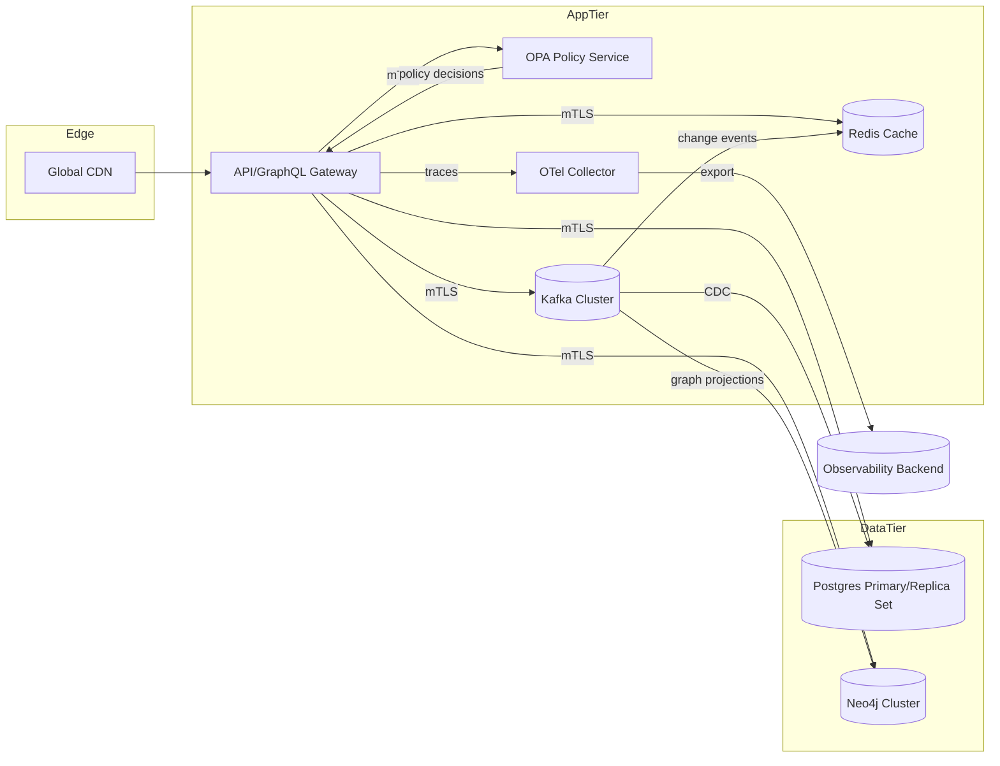

# Summit Day-1 Architecture Overview

## System Topology

## Day-1 Deployment Topology
- **Tenancy**: SaaS multi-tenant control plane with logical separation at the data layer and OPA-enforced ABAC policies. Regulated customers can graduate to **ST-DED pods** (single-tenant dedicated) in the same control plane via namespace isolation.
- **Network**: All service-to-service communication is mutually authenticated TLS using SPIFFE identities. Private subnets host stateful services; stateless gateways scale in an autoscaled front tier.
- **Data Stores**:
  - **Postgres** for transactional metadata and compliance records with read replicas per region.
  - **Neo4j** for relationship intelligence enriched from Kafka streams.
  - **Redis** for query caching, policy memoization, and rate-limit counters.
  - **Kafka** as the primary event backbone shared by control plane and data plane workloads.
- **Control Services**: OPA enforces ABAC policies for GraphQL resolvers, Kafka consumers, and administrative APIs. OpenTelemetry collectors export traces, logs, and metrics to the observability backend with tenant-aware attributes.

## Failure Domains and Resiliency
- **Front Door**: API/GraphQL gateway replicas distribute across at least two availability zones per region. Failures isolate to AZ; global DNS failover provides cross-region continuity for critical workloads.
- **Stateful Stores**: Postgres uses primary + synchronous replica in-zone with asynchronous cross-region replicas. Neo4j cluster members distribute across AZs with raft leader pinning for locality. Redis deploys with active-primary and read replicas; auto-failover is controlled to avoid split-brain.
- **Event Mesh**: Kafka brokers span AZs with rack-awareness. Kafka Connect and stream processors run in dedicated node groups, limiting blast radius to event ingestion if they fail.
- **Policy Plane**: OPA instances are stateless, horizontal pods behind the gateway. Policy bundles are served from signed artifacts; failure to fetch triggers deny-by-default for privileged mutations.
- **Observability**: OTel collectors batch tenant-tagged telemetry and buffer locally when exporters degrade. Backpressure thresholds and circuit breakers prevent telemetry issues from cascading to request path.

## Offline and Air-Gapped Viability
- Deployment bundles include container images, OPA policies, and schema migrations that can be mirrored into a disconnected registry. Kafka brokers and Postgres/Neo4j nodes support snapshot export/import for air-gapped sites. CI pipelines provide manifest checksums for integrity verification.

## Rollback & Recovery Alignment
- **Runtime**: Canary rollouts with automated health gates (HTTP SLO <200 ms p95, GraphQL error rate <1%) determine promotion. Failure triggers rollback automation (see `runbooks/rollback.md`).
- **Schema/Data**: Migrations use forward-only scripts with reversible companions; Kafka topics retain 72 hours of change events for replay. Redis caches can be flushed and rebuilt from Postgres/Neo4j without data loss.
- **Policy**: Policy bundles are versioned and signed; previous bundle kept hot for immediate revert if new policies breach access SLOs or violate regulatory guardrails.
