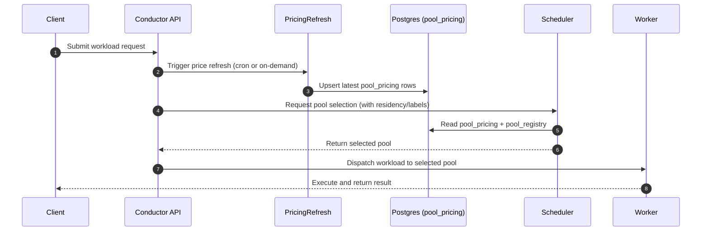

# ADR-051: Price-Aware Orchestration

**Status:** Accepted

## Context

As our cloud infrastructure and LLM usage scale, optimizing costs becomes critical. We need a system that can dynamically route workloads to the cheapest available resources based on real-time pricing and pre-negotiated capacity.

## Decision Drivers

- **Cost guardrails:** Keep effective cost per task within budget envelopes while honoring SLAs.
- **Predictable selection:** Deterministic pool choice using cached pricing + residency/label filters to avoid noisy flapping.
- **Tenancy/residency constraints:** Ensure regional affinity and tenant isolation are preserved when applying price inputs.

## Decision

We will implement a Price-Aware Orchestration layer that leverages real-time price signals and a concept of "Capacity Futures" (pre-reserved, often cheaper, compute slots).

1. **Price Signal Ingestion:** A dedicated service will continuously ingest real-time pricing data for various cloud resources (compute, storage, LLM tokens) from external APIs.
2. **Capacity Futures:** We will develop a mechanism to reserve off-peak or discounted compute capacity in advance. This capacity will be tracked and prioritized by the router.
3. **Price-Aware Router:** The core orchestration logic will be enhanced to consider real-time pricing and available capacity futures when making resource allocation decisions. It will aim to minimize the "effective cost" of executing a workload.

## Implementation Mapping (current + planned)

- **Pricing refresh pipeline:** Implemented as the price signal ingestor (`server/orchestration/price-signal-ingestor.ts`) feeding cached values for selector use; expected to be scheduled via Conductor cron to persist into Postgres.
- **Pool pricing tables:** Backed by `db/migrations/V10__pool_registry_pricing.sql` with seed data in `db/seeds/pool_pricing_v1.sql`, surfaced through `server/src/conductor/scheduling/pools.ts::currentPricing()`.
- **Selector integration:** Scheduler pool choice uses `server/src/conductor/scheduling/pools.ts::pickCheapestEligible()` with residency/label filters and pricing map; router logic is extended in `server/orchestration/price-aware-router.ts` for cost-aware selection.
- **Capacity futures endpoints/store:** Capacity reservations will be tracked alongside pool pricing in Postgres (planned `capacity_reservations` table) and exposed via Conductor API endpoints (planned `/api/pools/capacity/reserve|release|status`). Until the table lands, mocks align with the in-memory reservation ledger used by premium routing flows under `server/src/conductor/premium-routing/`.
- **Scheduler integration points:** Selection output feeds into worker dispatch via `server/src/conductor/scheduling/pools.ts::listPools()` and worker launch paths that already consume pool IDs.

## Latency, Reliability, and Fallbacks

- **Caching:** Price signals cached in-memory with TTL aligned to refresh interval (default 5m) to avoid per-request external calls. Selector falls back to last-good cache.
- **Refresh intervals:** Cron-driven refresh every 5m (burst to 1m allowed during incidents) with jitter to avoid API throttling.
- **Failure modes:**
  - External API/auth failures → retain last-good pricing; emit `pao_pricing_refresh_errors_total` metric and log with correlation ID.
  - DB write failures → retry with backoff; if still failing, selector uses cache-only mode and marks pricing as stale for alerts.
  - Missing pool pricing rows → selector skips pool and increments `pao_unknown_pool_selections_total`.
- **Fallback behavior:** If pricing unavailable or residency filter yields no pools, revert to baseline selection (least-loaded) while surfacing alert `PricingRefreshStale` and toggling feature flag (see Rollback).

## Security and ABAC

- **Who can trigger refresh/reservations:** Conductor service account (`svc-conductor`) and ops break-glass roles only; exposed via authenticated internal endpoints (planned `POST /api/pools/pricing/refresh`, `POST /api/pools/capacity/reserve`, `POST /api/pools/capacity/release`).
- **Audit expectations:** Every refresh/reservation writes an audit row with tenant, actor, pool, and correlation ID; align with existing audit pipeline under `server/src/conductor/router/policy-explainer.ts`.
- **Policy enforcement:** ABAC guards enforce residency/tenant affinity before selection; OPA policy hooks mirror checks for capacity reservations.

## Rollback and Disablement

- **Feature flag:** `PAO_ENABLED` (env/feature toggle) disables price-aware weighting; selector reverts to baseline pool pickers while continuing to collect metrics.
- **Disable refresh:** Stop the refresh cron and freeze pricing at seed values (`db/seeds/pool_pricing_v1.sql`); clear cached entries to force baseline mode.
- **Database rollback:** If schema issues arise, revert to `V10__pool_registry_pricing.sql` baseline and truncate `pool_pricing` rows to seeds; capacity reservation tables can be dropped without affecting pool registry.
- **Operational steps:** Toggle flag → restart Conductor API → verify baseline selections via metrics (unknown pool alerts cleared, selection distribution stable).

## Sequence (pricing-refresh to execution)

## Consequences

- **Pros:** Significant cost savings, improved resource utilization, ability to leverage spot markets and off-peak pricing; auditable routing aligned to residency.
- **Cons:** Increased complexity in orchestration logic, reliance on external pricing APIs, potential for increased latency if price lookups are slow; requires new operational runbooks and alerts.
