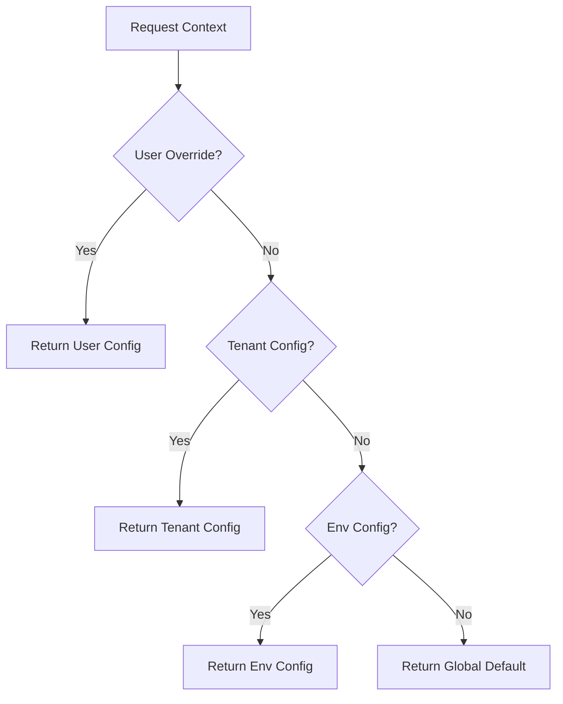

# Configuration, Feature Flags & Change Management Architecture

**Mission:** Create the unified configuration and change management system: feature flags, runtime configuration, change approvals, and audit so that every behavior change is deliberate, traceable, and reversible.

## 1. Configuration Model

We define a hierarchical configuration model to ensure safe defaults, granular control, and clear precedence.

### Scopes (In Order of Precedence)

Configuration resolution follows a "winner-takes-all" approach from specific to general:

1.  **User / Session**: Ephemeral overrides for a specific user session (e.g., A/B test assignment, debug mode).
2.  **Tenant (Organization)**: Settings specific to a customer account (e.g., Enterprise tier limits, enabled modules).
3.  **Environment**: Deployment-target specifics (e.g., `production`, `staging`, `dev`).
4.  **Global (Default)**: Baseline defaults hardcoded or defined in the base configuration.

### Types

| Type               | Characteristics                                              | Source of Truth                                   | Example                                             |
| :----------------- | :----------------------------------------------------------- | :------------------------------------------------ | :-------------------------------------------------- |
| **Static Config**  | Immutable at boot time. Requires restart/redeploy to change. | Environment Variables (`.env`), `config/index.ts` | Database URL, JWT Secret, Port                      |
| **Dynamic Config** | Changeable at runtime. Cached with TTL.                      | Redis / DB / Config Service                       | Rate Limits, Cache TTLs, Circuit Breaker Thresholds |
| **Secrets**        | Encrypted, sensitive. Never committed.                       | Vault / K8s Secrets / `.env` (local)              | API Keys, Private Keys, DB Passwords                |
| **Feature Flags**  | Boolean or Multivariate toggles for code paths.              | Feature Flag Service (DB + Cache)                 | `enable_new_dashboard`, `graph_search_algo_v2`      |

### Precedence Rules



## 2. Feature Flagging & Rollout

We adopt a "Flag First" development culture. Every non-trivial change must be guarded.

### Taxonomy

1.  **Release Flags**: Short-lived. Used to merge code early and toggle it on when ready.
    - _Default_: `false`
    - _Lifecycle_: Days/Weeks. Remove after GA.
2.  **Ops Flags (Circuit Breakers)**: Long-lived. Used to degrade functionality under load.
    - _Default_: `true`
    - _Lifecycle_: Permanent.
    - _Example_: `enable_heavy_graph_queries`
3.  **Permission Flags**: Long-lived. Control access to premium features or admin tools.
    - _Default_: Based on tier.
    - _Lifecycle_: Permanent.
    - _Example_: `advanced_export_capabilities`
4.  **Experiment Flags**: Short-lived. Multivariate A/B testing.
    - _Default_: Control group.
    - _Lifecycle_: Weeks. Remove after significance reached.

### Rollout Patterns

- **Dark Launch**: Deploy code with flag `off`. Verify in production with internal users via header overrides.
- **Canary / Gradual Rollout**:
  - 1% -> 5% -> 25% -> 50% -> 100%.
  - Automatic "bake time" between stages (e.g., 4 hours).
- **Tenant Cohorts**: Enable for "Beta Testers" group first, then "Standard", then "Enterprise".
- **Kill Switch**: Instant rollback. Disables the feature globally or per tenant.

### Guardrails

- **Mandatory Metadata**: Owner, Expiry Date (for release flags), Description.
- **Performance Gates**: Flag automatically disables if:
  - Error rate > X%
  - P95 Latency > Y ms
- **Stale Flag Alert**: CI/CD warns if temporary flags exist > 90 days.

## 3. Change Management Workflows

### Roles (RBAC)

| Role             | Scope       | Can Change                                  | Approval Required?        |
| :--------------- | :---------- | :------------------------------------------ | :------------------------ |
| **System**       | Automated   | Circuit Breakers (Open/Close)               | No (Automated)            |
| **Developer**    | Dev/Staging | All Flags in Dev/Staging                    | No                        |
| **Product Mgr**  | Production  | Experiment Flags, Feature Release (Gradual) | No (if within guardrails) |
| **Operator/SRE** | Production  | Ops Flags, Global Config, Secrets           | **YES (4-Eyes)**          |
| **Admin**        | Tenant      | Tenant Settings                             | No                        |

### Approval Flows

1.  **Standard Change**: (e.g., Increasing rollout 10% -> 25%)
    - _Flow_: User initiates -> System verifies guardrails -> Applied immediately.
    - _Audit_: Logged.
2.  **Risky Change**: (e.g., Global Config change, 0% -> 100% jump)
    - _Flow_: User initiates -> **Peer Review Request** -> Second approver confirms -> Applied.
    - _Justification_: Required text field.
3.  **Emergency**:
    - _Flow_: User initiates "Break Glass" -> Applied immediately.
    - _Post-Condition_: Incident ticket automatically created. Review required within 24h.

### Audit & History

All configuration changes must be recorded in the `audit_log` table and emitted to the observability platform.

- **Who**: Actor ID (User or Service Account)
- **What**: Diff (Old Value -> New Value)
- **Where**: Environment / Tenant / Scope
- **Why**: Linked Jira Ticket or Justification
- **When**: Timestamp

## 4. Artifacts

### Example Config Object (Pseudo-JSON)

```json
{
  "key": "graph_search.v2.enable",
  "type": "feature_flag",
  "description": "Enables the new rust-based graph traversal engine",
  "owner": "team-core-graph",
  "expiry": "2025-12-31T00:00:00Z",
  "default": false,
  "variations": [
    { "id": "legacy", "value": false },
    { "id": "rust_engine", "value": true }
  ],
  "rules": [
    {
      "priority": 1,
      "condition": { "user.email": { "endsWith": "@companyos.io" } },
      "action": { "serve": "rust_engine" },
      "comment": "Internal dogfooding"
    },
    {
      "priority": 2,
      "condition": { "tenant.tier": { "eq": "enterprise" } },
      "action": { "serve": "legacy" },
      "comment": "Keep enterprise on stable for now"
    },
    {
      "priority": 3,
      "condition": { "env": { "eq": "production" } },
      "action": { "rollout": { "rust_engine": 25, "legacy": 75 } },
      "comment": "25% rollout in production"
    }
  ],
  "guardrails": {
    "auto_disable": {
      "metric": "graph_search_error_rate",
      "threshold": 0.01,
      "window": "5m"
    }
  }
}
```

### Production Readiness Checklist

A configuration or feature flag is **Production Ready** if:

- [ ] **Default Safe**: The default value is safe (usually `false` or legacy behavior).
- [ ] **Typed**: The config value is strongly typed (Boolean, Enum, Int), not raw JSON.
- [ ] **Owner Assigned**: A valid team or individual is listed as owner.
- [ ] **Description**: Clear description of what the flag controls.
- [ ] **Cleanup Plan**: For temporary flags, a Jira ticket exists to remove the code path.
- [ ] **Observability**: Metrics exist to compare behavior between flag states (e.g., `graph_search_duration_seconds{engine="v1"}` vs `v2`).
- [ ] **Guardrails**: Auto-rollback thresholds are defined (if applicable).
- [ ] **Tested**: Both `on` and `off` states have been verified in staging.

## 5. Implementation Roadmap

1.  **Phase 1: Standardization**:
    - Formalize the JSON schema for config objects.
    - Migrate `scripts/feature-flag-manager.js` logic to a proper backend service or library.
    - Replace hardcoded client `useFlag` with API-driven (cached) flag evaluation.

2.  **Phase 2: Unified Service**:
    - Deploy `ConfigurationService` (or enhance `FeatureFlagManager.ts`).
    - Implement Redis caching layer for dynamic config.

3.  **Phase 3: Governance**:
    - Implement the "4-Eyes" approval workflow in the Admin UI.
    - Connect Audit Logs to the Provenance Ledger.
