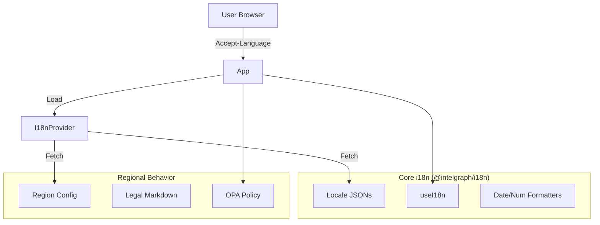

# CompanyOS i18n & L10n Architecture v0

**Status**: Draft / v0
**Owner**: Localization, Internationalization & Regional Behavior Team

## 1. i18n Foundation

### Strategy

We utilize the `@intelgraph/i18n` package as the core foundation, built on top of `i18next` and `react-i18next`.

- **Source of Truth**: English (US) `en-US` in `packages/i18n/locales/en-US`.
- **Format**: JSON files using ICU Message Format for pluralization and interpolation.
- **Namespacing**: Strict namespacing by domain (e.g., `common`, `auth`, `dashboard`, `legal`).
- **Key Convention**: `camelCase` keys nested by feature/context.
  - Example: `dashboard.widgets.activeUsers.title`
- **Fallbacks**: `en-US` is the ultimate fallback for any missing key.

### Text Handling

- **Pluralization**: Handled via `i18next-icu` (supports complex rules for Arabic, Slavic languages).
- **Formatting**:
  - **Dates/Times**: Use `Intl.DateTimeFormat` (via `useI18n` helpers).
  - **Numbers/Currencies**: Use `Intl.NumberFormat`.
- **RTL Support**:
  - `packages/i18n` provides `isRTL` flag and `direction` ('ltr' | 'rtl').
  - CSS logical properties (`margin-inline-start` instead of `margin-left`) must be used in all UI components.

### Workflow

1.  **Development**: Developers add keys to `en-US` JSONs.
2.  **Extraction**: `pnpm extract` (in `packages/i18n`) scans code for `t()` calls and warns of missing keys.
3.  **Translation**: JSON files are exchanged with translators (or AI translation pipeline).
4.  **Validation**: `pnpm validate` ensures all keys in `en-US` exist in target locales.

## 2. Regional Behavior Controls

This layer sits above the text translation to handle functional differences between regions.

### Region Context & Configuration

- **Region Profile**: A JSON configuration per region (e.g., `US`, `DE`, `SA`) defining:
  - `workWeek`: `['mon', 'tue', 'wed', 'thu', 'fri']` (vs `['sun'...'thu']` for some MENA regions).
  - `currency`: Default currency code.
  - `firstDayOfWeek`: `0` (Sun) or `1` (Mon).
  - `addressFormat`: Template for address input/display.

### Legal Content Variants

- **Terms & Privacy**: Content is versioned per region.
- **Implementation**:
  - Legal text is **not** stored in standard translation JSONs due to length and formatting requirements.
  - Stored as Markdown files: `docs/legal/{region}/{doc_type}.md`.
  - Loaded dynamically based on `user.region`.

### Feature Flags (Regional)

- Some features are restricted by local policy (e.g., "Facial Recognition" might be disabled in `EU`).
- Integration with OPA (Open Policy Agent):
  - Policy: `allow_feature { input.feature == "facial_recognition"; input.region != "EU" }`
  - The UI checks these flags to hide/disable components.

## 3. Tooling & Quality

### Developer Workflow

- **Linting**: `eslint-plugin-i18next` enforces `t()` usage and prohibits hardcoded strings in JSX.
- **VS Code**: Recommended extension `i18n-ally` configured to see translations inline.

### Automated Checks (CI/CD)

- **Translation Coverage**: Build fails if `en-US` has keys missing in Tier 1 languages (ES, FR, DE).
- **Layout Testing**:
  - **Pseudo-localization**: A CI job runs with `en-XA` (pseudo-loc) which expands text by 30% and uses accents (e.g., `[!!! Àççôùñţ !!!]`) to test for overflow and hardcoded strings.
  - **RTL Snapshotting**: Playwright tests run in `ar-SA` locale to verify layout mirroring.

### Metrics

- **Usage**: Track `locale` and `region` in telemetry to prioritize translation efforts.
- **Missing Keys**: Log warnings in production (sampled) when a key fallback occurs.

## 4. Architecture Diagram (Conceptual)

