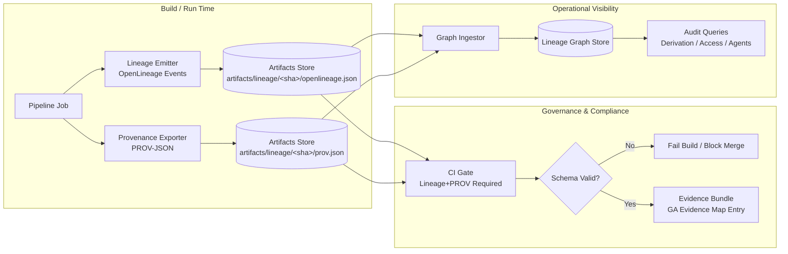
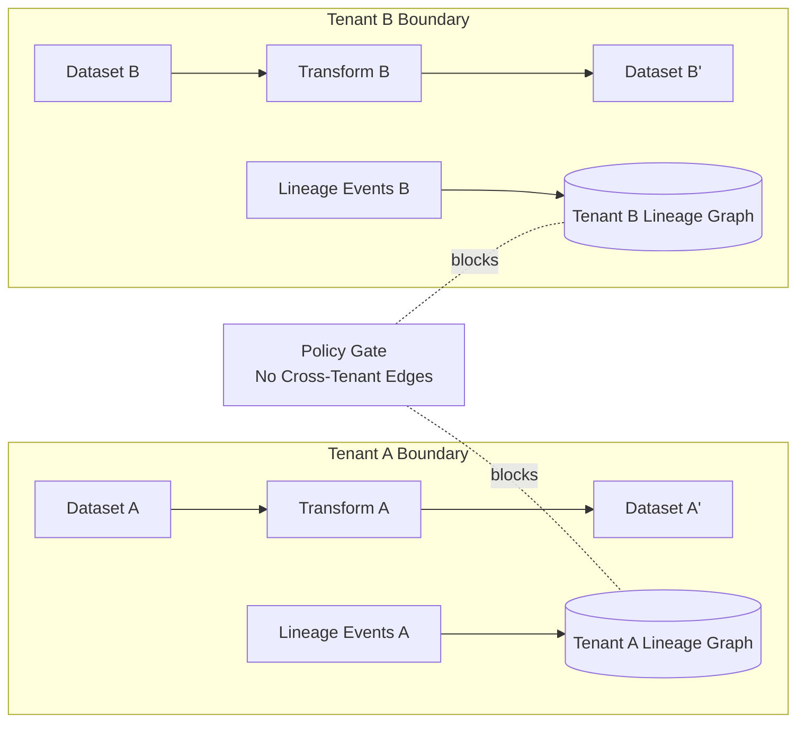

# Lineage and Provenance Standards

**Status:** Draft / Adopted
**Owner:** Engineering & Governance
**Standards:** OpenLineage, W3C PROV

## Overview

This document establishes the architectural standards for lineage tracking and provenance generation within the Summit platform. We mandate the adoption of open standards—**OpenLineage** for operational lineage and **W3C PROV** for compliance provenance—to ensure interoperability, auditability, and trust.

## Core Principles

1.  **Standards Lock:** We land standards and schemas before implementation to prevent drift.
2.  **Atomic Implementation:** Each change must be atomic, auditable, and revertable.
3.  **Enforcement Strategy:** Introduce enforcement in "warn mode" only if necessary; prefer hard fails once artifacts are proven to exist.
4.  **Trustable Answers:** Every insight includes a provenance receipt.
5.  **Audit-Ready:** Lineage and provenance are captured at execution time, not reconstructed.

## Standards Adoption

### OpenLineage (Operational Visibility)

We adopt the **OpenLineage** standard for capturing the "what, when, and where" of data transformations. This provides:
*   Pipeline observability.
*   Dataset-to-dataset lineage.
*   Operational health metrics (runtime, status).

### W3C PROV (Compliance & Governance)

We adopt the **W3C PROV** standard (specifically PROV-JSON) for capturing the "who, why, and how" of decision making. This provides:
*   Immutable evidence chains.
*   Agent accountability (human or system).
*   Policy evaluation traces.
*   Derivation history for auditors.

## Architecture

### End-to-End Lineage + Provenance Flow

## Cross-Tenant Lineage Isolation

To ensure strict multi-tenancy, we enforce isolation boundaries at the lineage level.

### Goal

Prevent any possibility of cross-tenant leakage via lineage/provenance data, including indirect leakage (edge existence, dataset names, agent IDs, evidence IDs).

### Isolation Diagram

### Core Requirements

1.  **Tenant-scoped identifiers**: All lineage/prov events MUST carry `tenant_id` and derive stable IDs using `SHA256(tenant_id + ":" + natural_key)`.
2.  **Hard partitioning at storage**: Separate graph partitions or mandatory tenant predicates.
3.  **Edge creation policy**: Disallow edges where `tenant_id(source) != tenant_id(target)` unless via explicit shared asset mechanism.
4.  **Shared asset mechanism**: Explicit `scope: shared` required for cross-tenant edges.
5.  **Query enforcement**: All queries must apply tenant filters at the lowest layer.

## Customer-Visible Narratives

### Narrative 1 — “Trustable answers”
When Summit produces an insight, it also produces a provenance receipt: what data was used, what transformations were applied, and which policies were evaluated. This means every output can be traced back to inputs and governed decisions—so leaders can trust not only what the system says, but why it says it.

### Narrative 2 — “Instant impact analysis”
Summit’s lineage graph shows how a change in one dataset propagates to downstream products, dashboards, and decisions. When something changes, you can immediately see what’s affected, who owns it, and what to validate—reducing outages and accelerating releases.

### Narrative 3 — “Audit-ready by default”
Audits typically require reconstructing events after the fact. Summit captures lineage and provenance at execution time, exports in open standards (OpenLineage + PROV), and stores immutable artifacts tied to build/run IDs. That makes compliance reports reproducible, explainable, and verifiable.

### Narrative 4 — “Interoperable, not locked in”
Summit doesn’t invent a proprietary lineage format. It emits OpenLineage and PROV so you can integrate with your existing ecosystem (schedulers, warehouses, catalogs, governance tooling) while keeping Summit as your operational intelligence layer.
