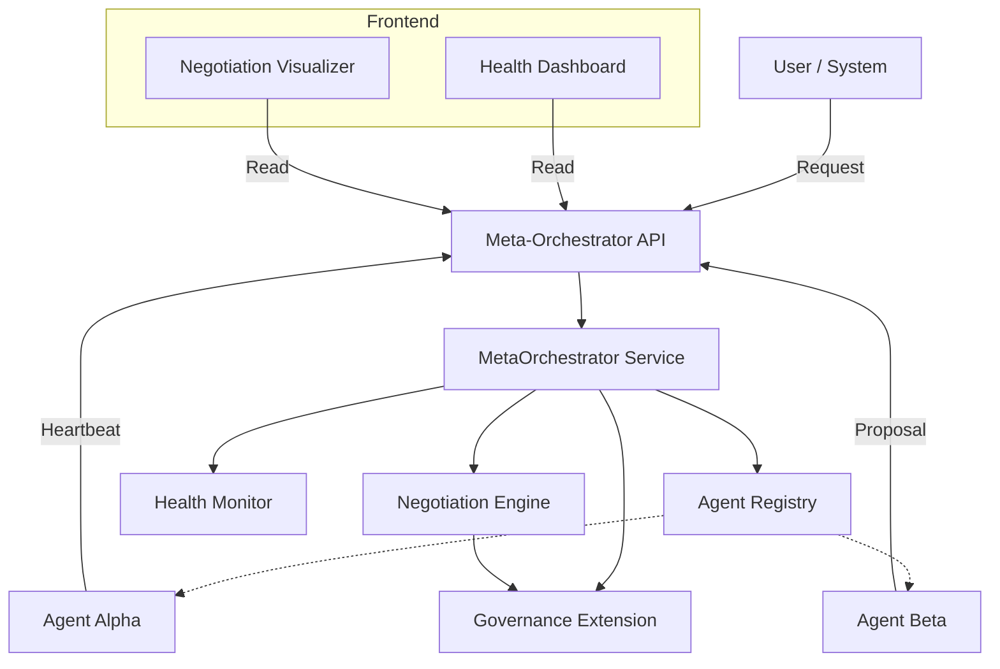

# Meta-Orchestration Architecture

## Overview

The Meta-Orchestrator is a higher-order system designed to coordinate multiple autonomous AI agents. Unlike standard orchestration (e.g., Maestro) which executes predefined pipelines, the Meta-Orchestrator manages _negotiation_, _delegation_, and _lifecycle_ of autonomous agents that may have conflicting goals or require consensus.

## Core Components

### 1. Agent Registry

Maintain a live directory of all active agents, their capabilities (`Role`), and current `Status` (IDLE, BUSY, OFFLINE).

### 2. Health Monitor

Actively tracks agent heartbeats and resource consumption. It can detect dead agents and trigger alerts or restart procedures (if integrated with a container orchestrator).

### 3. Negotiation Engine

The heart of the system. It manages "Negotiation" sessions where agents propose, counter-propose, and reach consensus.

- **Rounds**: Negotiations happen in rounds.
- **Proposals**: Agents submit structured proposals.
- **Consensus**: The engine (or a judge agent) determines when consensus is reached.

### 4. Governance Extension

A security layer that intercepts all critical actions (negotiation initiation, proposal submission) and validates them against the Policy Engine (OPA/Rego). It ensures agents do not exceed their authorized scope or access sensitive data without clearance.

## Architecture Diagram

## Data Model

- **Agent**: `{ id, role, capabilities, status, health }`
- **Negotiation**: `{ id, topic, participants[], rounds[], status }`
- **Proposal**: `{ agentId, content, timestamp }`

## Integration

The system exposes a REST API at `/api/meta-orchestrator`.
Frontend components are available in `apps/web/src/features/meta-orchestrator`.
