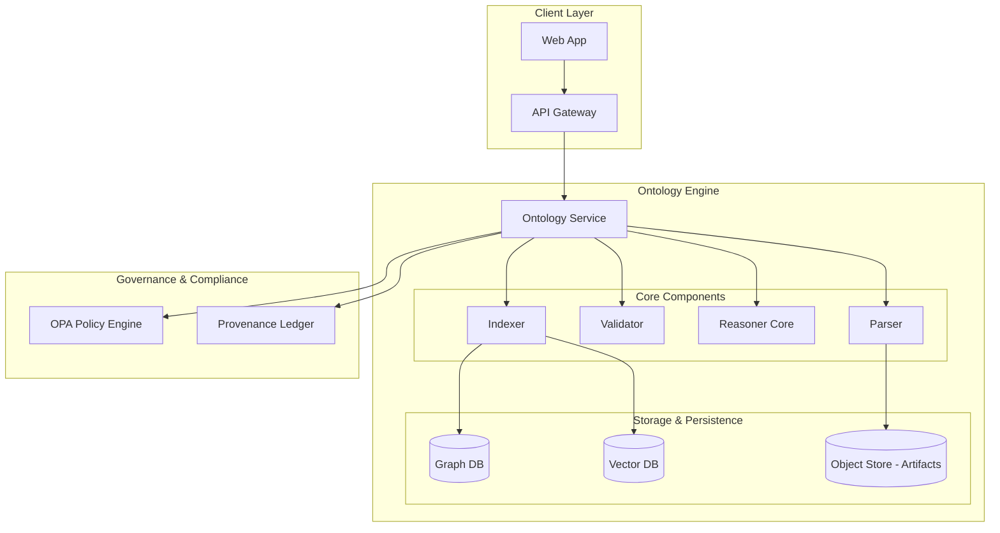

# Ontology Engine Reference Architecture

## 1. Overview

The **Summit Ontology Engine** provides production-grade semantics, governance, reasoning, and integration capabilities for the Summit platform. It enables the definition, validation, and execution of ontologies to drive intelligence analysis, compliance, and automated reasoning.

## 2. Architecture Diagram

## 3. Components

### 3.1 Ontology Service (API Layer)

Exposes REST (OpenAPI) and gRPC endpoints for ontology management and reasoning.

- **Responsibilities**:
  - CRUD operations for ontology artifacts.
  - Invocation of reasoning jobs.
  - Query execution.

### 3.2 Parser

Parses ontology definitions (Turtle, RDF/XML, JSON-LD) into internal representations.

- **Supported Formats**: RIF, Turtle, OWL.

### 3.3 Validator

Enforces structural and semantic validity of ontologies against defined schemas and governance rules.

- **Checks**:
  - Syntax validation.
  - SHACL/SHEX shape constraints.
  - OPA policy compliance.

### 3.4 Reasoner Core

The execution engine for inferencing.

- **Modes**:
  - **Rule-based**: RIF/Turtle/SPARQL rules.
  - **Description Logic**: OWL 2 RL / SHACL constraints.
- **Pluggability**: Designed to support multiple reasoning backends (e.g., Apache Jena, RDF4J).

### 3.5 Indexer

Manages the projection of ontology data into optimizing storage formats.

- **Targets**:
  - Neo4j (Graph) for structural queries.
  - Vector Store for semantic search.

## 4. Data Model

The data model is based on standard W3C semantic web standards but adapted for the Summit ecosystem.

- **Concepts (Classes)**: Core entities defined in the domain (e.g., `ThreatActor`, `Incident`).
- **Relations (Properties)**: Relationships between concepts (e.g., `targets`, `affiliatedWith`).
- **Restrictions (Axioms)**: Rules defining logical constraints (e.g., `DisjointClasses`, `Domain/Range`).

## 5. Integration

### 5.1 Summit Runtime

The engine is embedded as a module within the Summit Server `server/src/ontology`.

### 5.2 Governance

Integrated with OPA for policy enforcement at the API and Artifact level.

### 5.3 Provenance

All ontology modifications and reasoning executions emit PROV-O compliant events to the Summit Provenance Ledger.

## 6. Governance

### 6.1 Policy Enforcement

- **Approval**: New ontologies require multi-stakeholder approval via OPA gates.
- **Access Control**: Role-based access to sensitive ontology subsets.

### 6.2 SBOM & Lineage

- **SBOM**: Software Bill of Materials generated for each ontology version.
- **Lineage**: Full history of changes tracked in the Provenance Ledger.
