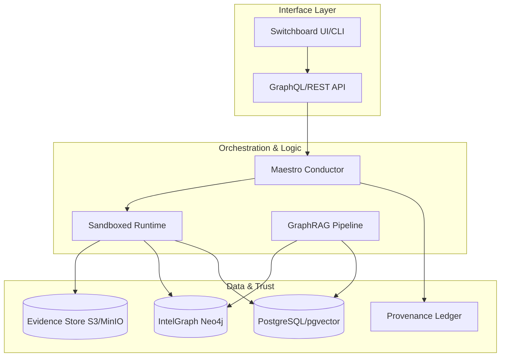
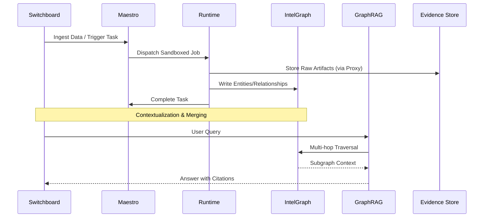
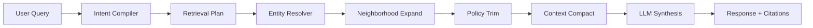
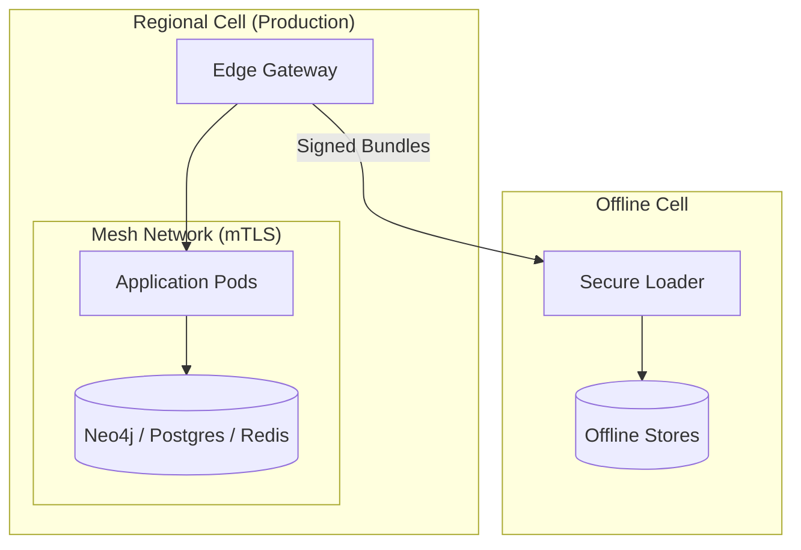

# Summit System Architecture

## Introduction & System Philosophy

Summit is a next-generation intelligence analysis platform designed as an **Intelligence OS**. It is built on the core thesis of **"coverage + actionability + trust"** with an **evidence-first** wedge.

The system is designed to provide GA-ready, audit-grade intelligence by combining graph-first identity resolution, continuous monitoring, and deterministic, signed evidence bundles.

### Core Principles
- **Evidence-First**: Every claim, entity, and relationship must be grounded in immutable evidence.
- **Graph-Centric**: Relationships are first-class citizens, enabling multi-hop reasoning and complex correlation.
- **Deterministic**: Pipelines are designed for reproducibility, with captured artifacts allowing for offline replay and audit.
- **Governed by Design**: Policy enforcement (via OPA) and provenance tracking are integrated at every layer.

---

## Component Architecture

The Summit architecture is composed of several specialized functional engines and services:

### 1. Switchboard (Ingestion & Command Center)
Switchboard serves as the entry point for both data and human interaction. It manages ingestion pipelines, normalizing external inputs (CSV, S3, REST APIs) and routing them to the appropriate processing layers. It also provides a local-first, zero-trust command center for analysts.

### 2. Maestro Conductor (Orchestration)
Maestro is the central orchestration engine. It manages the task lifecycle, dispatches jobs to runners, and enforces governance policies before any execution. It maintains the state of runs in PostgreSQL and ensures that evidence and claims are synchronized to IntelGraph.

### 3. IntelGraph (Semantic Backbone)
IntelGraph is the semantic core of the system, powered by Neo4j. It stores entities and relationships, providing a unified view of system state and history. It enables multi-hop traversals and complex graph analytics.

### 4. GraphRAG Pipeline (Synthesis)
The GraphRAG pipeline performs graph-first retrieval-augmented generation. It decomposes user queries into graph traversals, retrieves relevant subgraphs, and optionally augments them with vector-based results. The final answer is synthesized with direct citations to Evidence IDs.

### 5. Provenance Ledger (Trust & Audit)
The Provenance Ledger ensures the integrity of the system. It records immutable evidence and claim chains using content-addressed storage and Merkle-root signatures. It supports tenant isolation and emits events to Kafka for downstream consumption.

---

## Data Flow: Ingestion to Response

1.  **Ingestion**: Data enters via Switchboard. It is parsed, normalized (e.g., geo-temporal normalization), and indexed.
2.  **Orchestration**: Switchboard triggers tasks in Maestro. Maestro validates the request against OPA policies and dispatches work to the Runtime.
3.  **Capture & Persistence**: The Runtime executes modules. Outbound requests are intercepted by the Capture Proxy, storing raw responses in the Evidence Store. Findings are written to IntelGraph and the Relational Store.
4.  **Contextualization**: Entities are resolved and merged in IntelGraph, with provenance edges linking them back to their source evidence.
5.  **Query & Retrieval**: A user query is processed by the GraphRAG pipeline. It identifies entities, performs multi-hop traversals in Neo4j, and gathers structured context.
6.  **Synthesis**: The LLM reasoning engine processes the gathered context and generates a response, citing specific Evidence IDs from the graph.

---

## GraphRAG Pipeline Deep Dive

Summit GraphRAG goes beyond standard RAG by grounding AI reasoning in the Knowledge Graph.

### Pipeline Stages
1.  **Intent Compilation**: User queries are compiled into a Retrieval Plan IR, avoiding direct non-deterministic queries.
2.  **Entity Binding**: Tokens are mapped to graph entities using Neo4j full-text indices and entity resolvers.
3.  **Neighborhood Expansion**: A 1-2 hop subgraph is fetched around the bound entities to provide relational context.
4.  **Policy Trimming**: OPA evaluates the subgraph nodes/edges, removing any that violate the active policy or tenant scope.
5.  **Context Compaction**: The trimmed subgraph is summarized to fit token budgets while preserving keyword salience and relationship strength.
6.  **Answer Synthesis**: The reasoning engine uses the compacted context to generate the final response with verifiable citations.

---

## API Layer Design

The primary interface for Summit is a **GraphQL API**, supported by REST endpoints for specific ingestion and orchestration tasks.

-   **GraphQL/Apollo**: Handles queries, mutations, and real-time subscriptions (via WebSockets/Socket.IO).
-   **Policy Enforcement**: Every request passes through an OPA-backed adapter that evaluates authorization based on JWT claims and tenant-specific rules.
-   **Observability**: Telemetry hooks are integrated into the API layer, emitting OpenTelemetry metrics and traces to Prometheus/Jaeger.

---

## Storage Strategy

Summit utilizes a multi-modal storage strategy to optimize for different data access patterns:

-   **Neo4j (Graph DB)**: The primary store for the Knowledge Graph, handling entities, relationships, and multi-hop analytics.
-   **PostgreSQL with pgvector (Relational/Vector)**: Stores metadata, audit logs, case information, and high-dimensional embeddings for semantic search.
-   **Redis (Cache/Queue)**: Used for session management, rate limiting, and as the backend for BullMQ job queues.
-   **Evidence Store (Object Storage)**: S3-compatible storage (MinIO for local/air-gapped) for immutable, content-addressed evidence bundles and raw artifacts.

---

## Deployment Topology

Summit is designed for both cloud-scale multi-region deployments and air-gapped mission environments.

### Multi-Region Cells
The platform is sharded into regional **Cells**, providing blast radius isolation. Each cell contains its own control plane and data plane.
-   **Security Architecture**: Service-to-service communication is secured via **mTLS** with identities issued by a **Mesh CA (SPIFFE/SPIRE)**.
-   **Global Control Plane**: Coordinates regional cells and manages global tenant policies.

### Offline / Air-Gapped Operations
For sensitive missions, Summit supports an **Offline Path**.
-   **Signed Bundles**: Daily exports of Kafka topics, Postgres dumps, and Neo4j subgraphs are signed and staged.
-   **Hardware Attestation**: Bundles are transferred via hardware tokens and rehydrated in the offline cell using a checksum-verified loader.

---

## System Design Decisions (ADR Summary)

| ID | Decision | Rationale |
| :--- | :--- | :--- |
| **ADR-001** | **Neo4j for Graph Store** | Robust Cypher support for multi-hop tracing and proven entity resolution. |
| **ADR-002** | **Sandboxed Runtime** | Modules execute in WASM/Container environments with strict policy-controlled egress for security. |
| **ADR-003** | **S3-Compatible Evidence Store** | Ubiquitous API support; MinIO enables parity between local, cloud, and air-gapped environments. |
| **ADR-006** | **mTLS via SPIFFE/SPIRE** | Standardized workload identity and automatic certificate rotation for zero-trust networking. |
| **ADR-050** | **Knowledge-OS Data Model** | Unifies agent capabilities, task dependencies, and enterprise data into a single navigable graph. |
