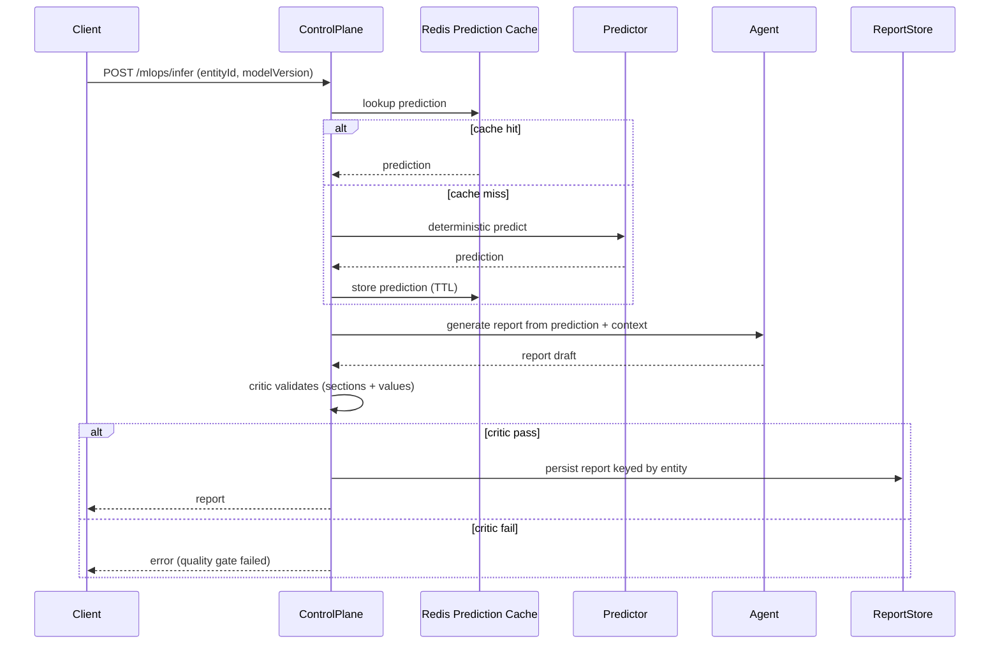

# Agentic MLOps Control Plane (Summit)

## Summit Readiness Assertion

This slice aligns with the Summit readiness bar and cites the authoritative reference in
`docs/SUMMIT_READINESS_ASSERTION.md`.

## Purpose

Summit’s agent platform adopts production-grade MLOps patterns that separate deterministic
modeling from agentic synthesis. This document maps the architectural patterns from the
referenced writeup into Summit’s control-plane primitives and the minimal vertical slice
implemented in the server.

## Model Layer vs Agent Layer

**Model layer (deterministic predictors / non-LLM pipelines)**

- Scope: deterministic scoring, ranking, enrichment, or classical ML inference.
- Examples: entity risk scoring, graph heuristics, statistical anomaly baselines.
- Non-goal: temporal forecasting or market prediction.

**Agent layer (summarize / enrich / critique / report)**

- Scope: explain results, assemble multi-source context, critique outputs, and format reports.
- Uses the control plane outputs as inputs, not as sources of truth for numbers.
- Enforces deterministic formatting and critic validation.

## Control-Plane Responsibilities

- Orchestration across deterministic predictor and agent synthesis.
- Cache-first flow with Redis for prediction outputs and an entity-keyed report store.
- Versioning: base model vs derived model lineage.
- Evaluation: report critic validates required sections and numeric consistency.
- Drift hooks: compare feature summaries over time and emit metrics.
- Observability: Prometheus counters for cache hits/misses, train/infer requests, report
  generation success/failure, and drift detection.

## API Boundaries

- **Training (base):** `POST /mlops/train/base`
- **Training (derived):** `POST /mlops/train/derived`
- **Inference:** `POST /mlops/infer`
- **Report retrieval:** `GET /mlops/report/:entityId`
- **Admin cache flush (OPA-gated):** `DELETE /mlops/admin/flush`

Training endpoints are rate-limited more strictly than inference endpoints. Base vs derived
semantics model parent/child lineages (even when the “model” is a workflow/toolchain).

## Data Flow (Cache-First Sequence)

## Caching & Persistence

- **Prediction cache:** Redis, keyed by `entityId + modelVersion`, TTL via env.
- **Report store:** entity-keyed persistence adapter. Current slice uses an in-memory
  adapter with a TODO to bind to vector DB (pgvector/Qdrant) keyed by entity, not semantic
  similarity.

## Observability & Evaluation

- Prometheus counters:
  - `mlops_cache_hits_total`, `mlops_cache_misses_total`
  - `mlops_train_base_requests_total`, `mlops_train_derived_requests_total`
  - `mlops_infer_requests_total`
  - `mlops_agent_report_generation_total{status=success|failure}`
  - `mlops_drift_detected_total`
- Drift hook compares feature summaries across inference calls.
- Report critic fails closed when required sections or numeric consistency checks fail.

## Non-Goals

- No trading logic or stock forecasting.
- No time-series prediction in the agent layer.
- This slice is platform plumbing for Summit’s agent platform, not a finance app.

## Source Pattern Mapping

- Deterministic predictors produce numeric outputs; agents synthesize and critique reports.
- Separation of base vs derived training endpoints.
- Microservice-style decomposition (control plane boundaries + explicit adapters).
- Cache-first inference flow with Redis and entity-keyed report persistence.
- Separate rate limits for training vs inference.
- Observability with metrics + drift hooks + evaluation gates.
- Dual UI concept: end-user UI plus ops/ML monitoring UI (future wiring).
