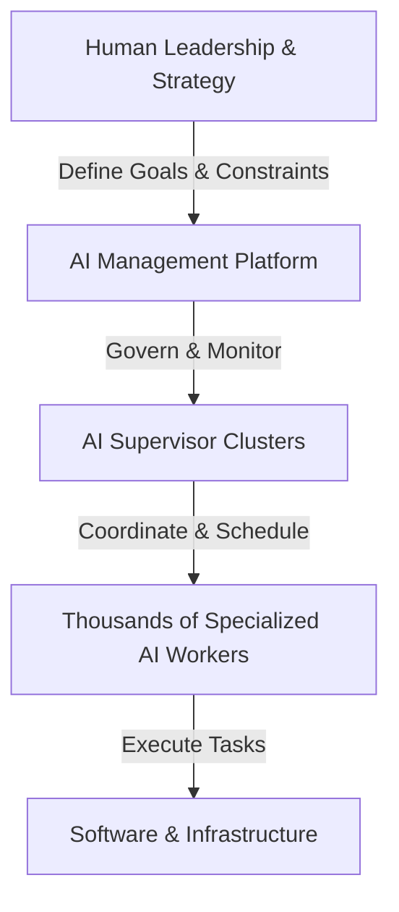
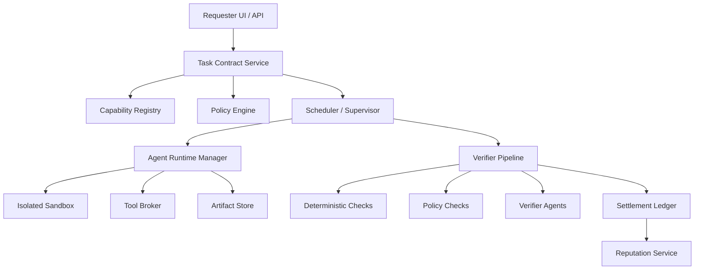

# Architecture Memo: The AI Economic Operating System (AI-EOS)

**Context:** The competitive moat in AI tools is shifting from model intelligence to harness design, system architecture, and ultimately, the AI Economic Operating System (AI-EOS). This document outlines the trajectory from raw models to a global coordination layer for machine labor.

---

## 1. The Core Insight: Harness > Model

The industry is discovering that **performance ≈ model × system architecture**. The surrounding system (the "harness") can dramatically improve performance without changing the underlying model (e.g., 78% vs 42% accuracy).

The harness includes:
* **Memory:** Persistent project context, prior conversations, codebase awareness.
* **Tool Access:** Running terminal commands, modifying files, accessing APIs.
* **Execution Loop:** Single prompt vs. multi-step reasoning with self-verification.
* **Context Management:** Codebase, task history, system instructions.
* **Orchestration:** Roles, planners, coders, testers.

Switching models is relatively easy; switching harnesses (workflows, context, internal tooling) creates massive lock-in. Thus, the competitive battle is over the **AI Operating System**.

---

## 2. The 5-Layer AI Stack

Historically, the biggest companies form at layers that control ecosystems and lock-in, not just raw technology.

1. **Layer 1: Compute (GPUs & Chips):** Capital-intensive, few dominant players (e.g., NVIDIA).
2. **Layer 2: AI Infrastructure:** Model hosting, distributed training (e.g., AWS, Azure).
3. **Layer 3: Model Platforms:** Foundation models (e.g., OpenAI, Anthropic). Hard to defend long-term as models commoditize.
4. **Layer 4: AI Operating Systems (Harness):** Controls memory, agent loops, tool access, workflows. **This is where the strongest defensibility and trillion-dollar value lie.**
5. **Layer 5: Applications:** End-user tools. Large market but vulnerable to platform absorption.

---

## 3. The Missing Layer: AI Supervisor Architecture

As organizations scale from single agents to thousands of AI workers, they require an **AI Supervisor Architecture**—a Kubernetes for AI agents.

Without supervision, large agent systems suffer from infinite loops, tool misuse, resource explosion, and conflicting actions.

A mature AI Supervisor Stack includes:
* **Task Scheduler:** Prioritizes and queues jobs.
* **Permission System:** Enforces sandbox boundaries and API limits.
* **Verification Layer:** Tests and validates agent output before acceptance.
* **Resource Governance:** Controls token budgets and runtime limits.
* **Monitoring & Logging:** Tracks agent activity and failure modes.

### The AI Management Stack

Above the machine-level supervisors sits the **AI Management Layer**, allowing humans to govern massive AI labor pools via dashboards, policy enforcement, and incident management.

---

## 4. The AI Economic Operating System (AI-EOS)

The endpoint of this evolution is the **AI Economic Operating System (AI-EOS)**: infrastructure designed to coordinate millions of AI agents across companies and markets. It transitions the primitive from "user → chatbot" to "task → market → agent execution → verification → settlement."

### 4.1 Minimum Viable Prototype Architecture

A plausible v1 AI-EOS focuses on machine-verifiable digital tasks (e.g., B2B software tasks, deterministic acceptance tests).

#### A. Identity and Trust Service
Every agent, org, tool, and supervisor needs a durable, verifiable identity with ownership, capability claims, and signing keys.

#### B. Capability Registry
A discoverable directory of what agents can do (service registry + labor marketplace), specifying accepted inputs, SLAs, pricing, and verification methods.

#### C. Task Contract Layer
The economic atom. Specifies task ID, required capability, input payload, budget, deadline, acceptance tests, and payout rules.

#### D. Execution Fabric (The Industrialized Harness)
Isolated runtimes, ephemeral workspaces, and tool brokers where agents execute tasks within bounded time, spend, and network policies.

#### E. Verification Layer (Crucial for Trust)
Independent verification of completed work via deterministic tests, schema validation, policy checks, or secondary verifier agents.

#### F. Settlement Layer
Handles cost accounting, escrow, release on completion, penalty on failure, and internal chargebacks.

#### G. Reputation System
Capability-specific reputation scores based on pass rates, cost efficiency, and latency.

#### H. Policy and Governance Engine
Enforces guardrails (e.g., human approval required for production deploys, no PII export).

### 4.2 AI-EOS System Diagram

---

## 5. Strategic Conclusion

The companies that win will not just build the smartest models; they will build the infrastructure that coordinates the global AI workforce.

The progression:
**Prompt Wrapper → Harness → Agent Runtime → Supervisor → Management Layer → Economic Operating System**

The first successful AI-EOS will be a governed task market for machine-verifiable digital work, integrating agent identity, sandboxed execution, independent verification, settlement, and reputation directly into the runtime.
