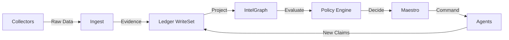
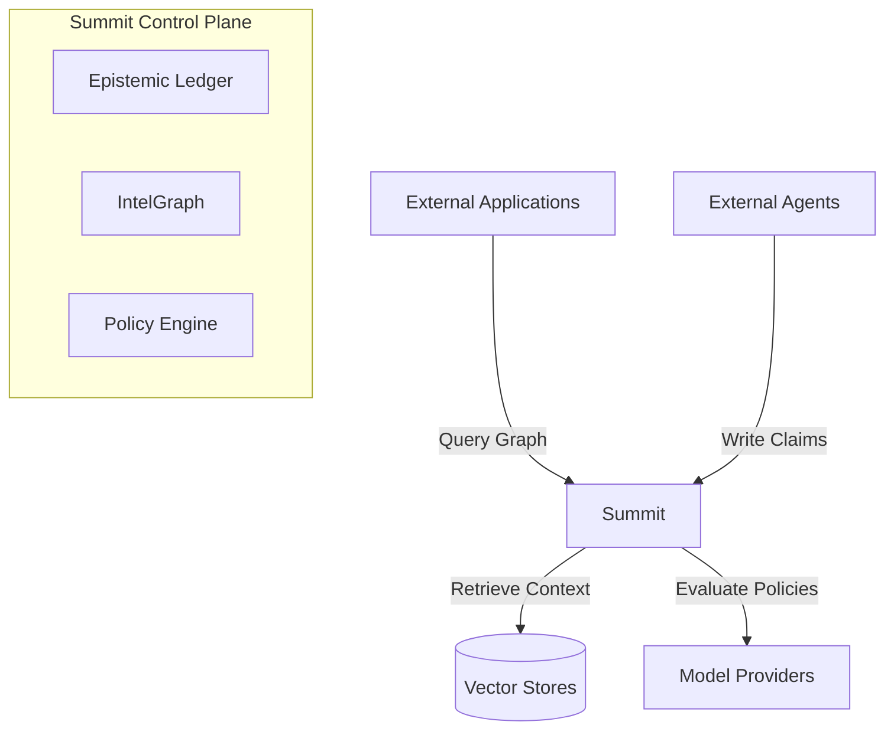
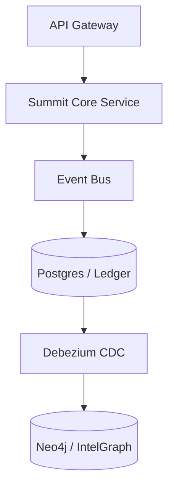

# AI Infrastructure Stack Map

This document explains the modern AI infrastructure stack and shows where Summit fits within it.

Understanding this stack clarifies Summit’s strategic position: **Summit is not another model platform or agent framework — it is the control and epistemic governance layer for AI systems.**

## 1. The Missing Layer in AI Systems

Modern AI stacks have strong capabilities for:

- Model inference
- Retrieval (RAG, Vector DBs)
- Agent orchestration

However, they lack infrastructure for:

- Knowledge provenance
- Policy-governed reasoning
- Deterministic decision history
- Cross-agent governance

Summit provides this missing layer. It records and governs the lifecycle of machine reasoning.

## 2. The AI Infrastructure Stack

Modern AI platforms consist of roughly 20 conceptual layers, grouped into four bands:

### Foundation Layers (Compute & Infrastructure)

1. **Physical Compute** — GPUs, CPUs, networking, storage, edge hardware.
2. **Cloud / Cluster Substrate** — AWS, GCP, Azure, Kubernetes clusters, bare metal fleets.
3. **Runtime / Container Orchestration** — Kubernetes, schedulers, job runtimes, serverless execution.
4. **Data Transport / Streaming** — Kafka, queues, event buses, CDC, pub/sub.
5. **Raw Data Storage** — Object stores, blobs, filesystems, archival storage.

### Data and Model Layers

1. **Structured Data / OLTP-OLAP** — Postgres, DuckDB, warehouses, lakehouse systems.
2. **Feature / Embedding Generation** — Feature pipelines, embedding jobs, transforms.
3. **Vector / Retrieval Storage** — Qdrant, Pinecone, pgvector, hybrid retrieval stores.
4. **Model Training / Fine-Tuning** — Training pipelines, tuning, eval harnesses.
5. **Model Serving / Inference Gateway** — Hosted model APIs, open-model serving, routing, batching.

### Agentic and Application Layers

1. **Prompt / Context Assembly** — Prompt building, context packing, tool selection prep.
2. **Memory Systems** — Short-term memory, long-term memory, session state, episodic memory.
3. **Tool / Action Execution** — Tool calling, browser use, APIs, workflow actions.
4. **Agent Runtime / Orchestration** — Single-agent and multi-agent loops, planners, task routing.
5. **Application UX / Workflow Layer** — Dashboards, copilots, investigation UIs, analyst workflows.

### Governance and Intelligence Layers

1. **Observability / Telemetry** — Tracing, metrics, logs, model monitoring, agent activity monitoring.
2. **Provenance / Citation Layer** — Source traceability, evidence chains, claim lineage, attribution.
3. **Policy / Authorization Layer** — Who can act, what tools can run, what knowledge can be promoted.
4. **Knowledge State / Truth Maintenance** — Contradiction handling, temporal truth, belief vs narrative vs reality state.
5. **Decision Ledger / Replay / Governance Control Plane** — Append-only decisions, deterministic reconstruction, audit, replay, promotion history.

---

## 3. Summit Control Plane Boundary

Summit operates as a control plane **above** heterogeneous AI infrastructure.

**It governs:**

- Knowledge state
- Provenance
- Policy enforcement
- Decision history

**It does not replace:**

- Model providers (e.g., OpenAI, Anthropic)
- Vector databases (e.g., Pinecone, Qdrant)
- Cloud infrastructure (AWS, GCP, K8s)
- Agent frameworks (LangChain, AutoGen)

By remaining model-agnostic and runtime-agnostic, Summit avoids stack capture creep.

---

## 4. Architecture Principles

Summit follows several strict architectural principles:

1. **Append-only knowledge history** — reasoning events are never deleted.
2. **Deterministic replay** — the system can reconstruct knowledge state at any time.
3. **Policy-first governance** — agent actions must pass policy evaluation.
4. **Model-agnostic design** — Summit integrates with multiple model providers.
5. **Extensible architecture** — collectors, agents, and modules can be added without modifying core systems.

---

## 5. System Invariants

Summit enforces core system guarantees that must never break:

1. **Append-only decision history** — The ledger is an immutable bitemporal WriteSet.
2. **Deterministic replay of system state** — Graph state is a deterministic projection of the ledger.
3. **Provenance attached to all claims** — No claim exists without a trace to its origin and evidence.
4. **Policy-governed promotion of knowledge** — Claims cannot move to a trusted state without satisfying doctrine.
5. **Explicit contradiction handling** — Conflicting claims are recorded, quantified, and resolved explicitly rather than overwritten.

---

## 6. Core Domain Objects

- **Claim**: A statement about the world supported by evidence.
- **Evidence**: Source material supporting a claim.
- **Provenance**: Traceable lineage of evidence and transformations.
- **Decision**: An action taken by an agent or policy engine.
- **WriteSet**: The atomic bundle of state transitions written to the ledger.

---

## 7. Data Flow



---

## 8. Knowledge Lifecycle

Claims move through several states (lanes):

`candidate` → `observed` → `trusted` → `promoted`

Policies and evidence determine promotion between states. Unverified or conflicting claims may move to `quarantined` or `revoked`.

---

## 9. System Context



---

## 10. Key Interfaces

Summit exposes the following core interfaces:

- `POST /ledger/events` — Append reasoning events (claims, actions, evidence).
- `POST /claims/query` — Query the knowledge graph.
- `POST /policy/evaluate` — Run policy decision engine.
- `POST /replay/session` — Reconstruct historical state for audit/investigation.

### Minimal Event Example

```json
{
  "event_type": "claim.created",
  "claim_id": "c-92813",
  "timestamp": "2026-03-07T21:05:00Z",
  "source": "news.collector",
  "evidence": [
    {
      "type": "article",
      "url": "https://example.com/news/123",
      "confidence": 0.82
    }
  ],
  "provenance": {
    "collector": "rss",
    "pipeline": "news_ingest_v2"
  }
}
```

---

## 11. Minimal Deployment Architecture



---

## 12. Security Model

Summit enforces:

- **Signed event ingestion** — using `cosign` and cryptographic signatures.
- **Provenance validation** — requiring continuous proof of origin.
- **Role-based policy evaluation** — utilizing OPA gateway integrations.
- **Immutable ledger history** — preventing retroactive tampering of the decision log.

---

## 13. Extension Model

Summit is designed to be extended through four extension types:

- **Collectors**: External data ingestion modules (e.g., `summit-collector-financial-filings`).
- **Agents**: Autonomous or semi-autonomous reasoning systems (e.g., `summit-agent-verification`).
- **Policies**: Governance rules applied to claims and decisions (e.g., `summit-policy-contradiction-resolution`).
- **Modules**: Higher-level analytical capabilities built on the graph (e.g., `coggeo`, `doctrine`).

---

## 14. Failure Model

Summit assumes the following failure scenarios:

- Collector failures or network partitions.
- Incomplete evidence ingestion.
- Contradictory claims from overlapping agents.
- Policy conflicts or loops.
- Agent execution errors.

The system resolves these through:

- **Contradiction tracking** (maintaining multiple competing belief states).
- **Claim confidence weighting** (decaying unsupported claims).
- **Quarantine promotion lanes** (gating unverified actions).
- **Deterministic replay** (recovering corrupted state by replaying the ledger).

---

## 15. Compatibility Policy

Summit follows semantic versioning for:

- Ledger schemas.
- Policy evaluation interfaces.
- Graph query APIs.

Backward compatibility is maintained for at least one major version cycle. Ledger structures are explicitly versioned (e.g., `ledger_format_version: 1.0`).

---

## 16. What Summit Owns vs Integrates

| Component | Role | Examples |
| :--- | :--- | :--- |
| **Epistemic Ledger** | **Owns** | Append-only record of claims, decisions, and evidence. |
| **Provenance Engine** | **Owns** | Evidence chains and source lineage validation. |
| **Policy Engine** | **Owns** | Authorization and action constraints (via OPA). |
| **Knowledge State** | **Owns** | Truth maintenance across Reality, Belief, and Narrative graphs. |
| **Replay Engine** | **Owns** | Deterministic reconstruction of graph state. |
| **Agent Governance** | **Owns** | Centralized control of agent actions and promotions. |
| Model Serving | Integrates | OpenAI, Anthropic, open-model hosts. |
| Vector Databases | Integrates | Qdrant, Pinecone, pgvector. |
| Data Pipelines | Integrates | Airflow, Dagster, Kafka/Debezium. |
| Observability | Integrates | OpenTelemetry, Prometheus. |
| Agent Runtimes | Integrates | LangGraph, AutoGen. |
| Cloud Platforms | Integrates | AWS, GCP, Azure, K8s. |

---

## 17. Glossary

- **Claim**: A verifiable statement supported by evidence.
- **Evidence**: The raw or derived source material supporting a claim.
- **Provenance**: The traceable, cryptographically verifiable lineage of evidence.
- **WriteSet**: The atomic bundle of state transitions written to the bitemporal ledger.
- **Promotion**: The structured movement of knowledge (e.g., from `candidate` to `trusted`).
- **Maestro**: Summit's orchestration and agent control engine.
- **IntelGraph**: The derived, tri-graph projection (Reality, Belief, Narrative) of the ledger.
