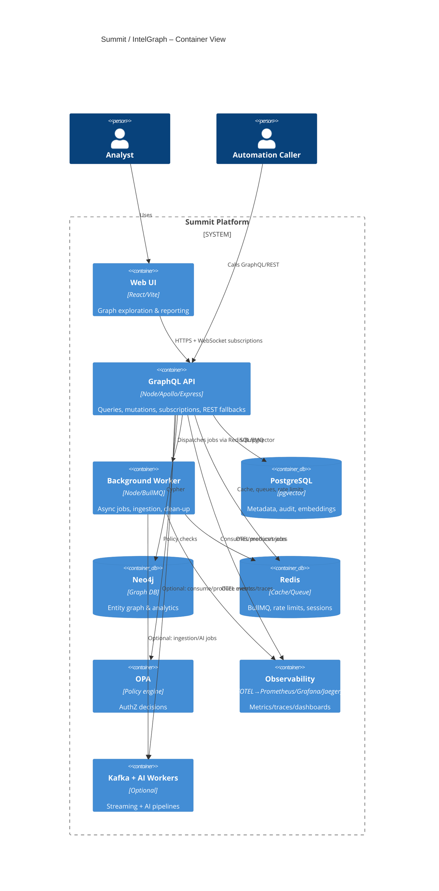
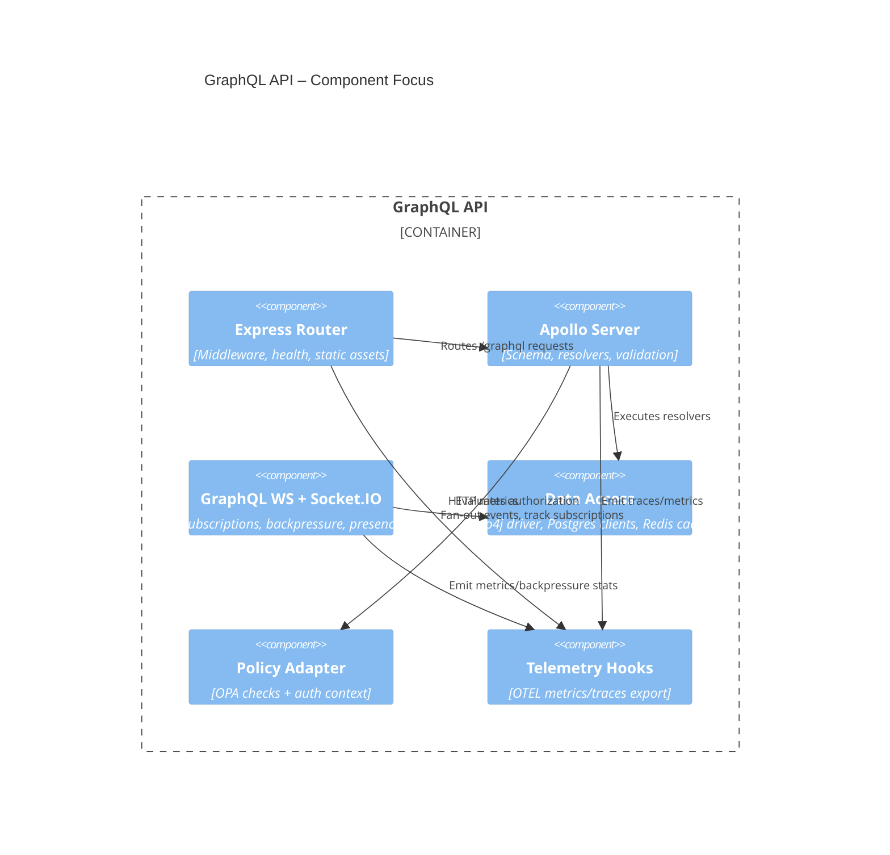

# C4 Container Diagram — Summit / IntelGraph

## Container inventory

- **Web UI (React/Vite)** — browser SPA served by Vite/Node, communicates with the API via HTTPS and WebSocket subscriptions.【F:ARCHITECTURE_MAP.generated.yaml†L82-L115】
- **GraphQL API (Node/Apollo/Express)** — primary boundary for queries, mutations, subscriptions, and REST fallbacks; integrates Neo4j, PostgreSQL, Redis, Socket.IO, and OPA.【F:ARCHITECTURE_MAP.generated.yaml†L40-L80】【F:server/src/index.ts†L1-L160】
- **Background Worker (BullMQ)** — executes queued jobs, scheduled tasks, and ingestion workloads using Redis queues.【F:ARCHITECTURE_MAP.generated.yaml†L116-L142】
- **Data Stores** — Neo4j for graph analytics, PostgreSQL with pgvector for structured data and embeddings, Redis for cache/queues.【F:ARCHITECTURE_MAP.generated.yaml†L147-L199】
- **Policy Engine** — Open Policy Agent (OPA) serving authorization decisions consumed by the API layer.【F:ARCHITECTURE_MAP.generated.yaml†L284-L299】
- **Observability Stack** — OpenTelemetry Collector exporting to Prometheus (metrics) and Jaeger (traces) with Grafana dashboards.【F:ARCHITECTURE_MAP.generated.yaml†L211-L278】
- **Optional AI & Streaming** — Kafka, Zookeeper, ingestion service, NLP and reliability services, and AI worker for multimodal processing under compose profiles.【F:ARCHITECTURE_MAP.generated.yaml†L341-L440】

## Container relationships (Level 2)

## API component spotlight (Level 3 excerpt)

## Operational notes

- The API and worker initialize OpenTelemetry and Prometheus exporters for metrics and tracing to the observability stack.【F:ARCHITECTURE_MAP.generated.yaml†L62-L78】【F:ARCHITECTURE_MAP.generated.yaml†L211-L278】
- Production mode serves the built client from the API process to simplify deployment when CDN hosting is not required.【F:server/src/index.ts†L136-L145】
- Compose profiles `ai` and `kafka` keep optional services opt-in while preserving the golden-path developer experience.【F:ARCHITECTURE_MAP.generated.yaml†L341-L440】
