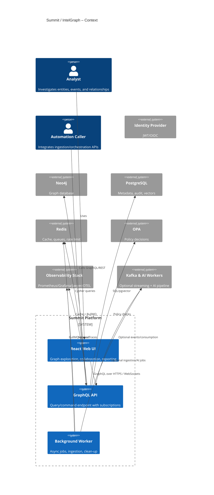

# C4 Context Diagram — Summit / IntelGraph

## Purpose

This document captures the system-of-systems view so newcomers can see how Summit/IntelGraph interacts with users and external platforms before diving into container or component details.

## System scope

Summit is a deployable-first intelligence analysis platform delivered as a monorepo with a GraphQL API, React web client, background workers, and supporting data/observability services. Core runtime services (API, web, worker, Postgres, Redis, Neo4j, OPA, Prometheus, Grafana, Jaeger, OTEL collector) are composed together via Docker Compose, with optional AI/Kafka profiles for extended pipelines.【F:ARCHITECTURE_MAP.generated.yaml†L40-L340】【F:ARCHITECTURE_MAP.generated.yaml†L720-L740】

## Primary actors

- **Intelligence analysts** use the web client to run graph searches, simulations, and reporting.
- **Automation callers** (external apps/bots) invoke GraphQL/REST endpoints for ingestion and orchestration tasks.
- **Identity providers** issue JWTs/OIDC claims that the API and OPA engine enforce.
- **Telemetry consumers** (SRE/observability stack) scrape metrics and traces for availability and performance.

## External systems

- **Identity Provider**: Supplies JWT/OIDC tokens; enforced via API middleware and OPA policy decisions.
- **OpenTelemetry/Prometheus/Grafana/Jaeger**: Collect and visualize metrics/traces from API, worker, and optional services.【F:ARCHITECTURE_MAP.generated.yaml†L211-L278】
- **Optional AI/Kafka fabric**: Kafka, Zookeeper, AI workers, ingestion, NLP, and reliability services extend the pipeline when enabled.【F:ARCHITECTURE_MAP.generated.yaml†L341-L440】

## Context diagram (Level 1)

## Key responsibilities and value exchange

- Analysts receive interactive graph insights, reports, and alerts through the web UI backed by the API and data stores.
- Automation callers orchestrate ingestion and enrichment jobs via GraphQL/REST and receive completion signals or job IDs.
- Identity providers assert user claims; OPA enforces policies to deliver least-privilege access.
- Observability consumers harvest metrics/traces to maintain SLOs and detect regressions early.

## Integration notes

- Docker Compose is the default integration surface for local and CI environments; K8s manifests live under `kubernetes/` for cluster deployments.【F:ARCHITECTURE_MAP.generated.yaml†L720-L734】
- Optional AI/Kafka profile services remain gated behind compose profiles to avoid surprising dependencies for core paths.【F:ARCHITECTURE_MAP.generated.yaml†L341-L440】
