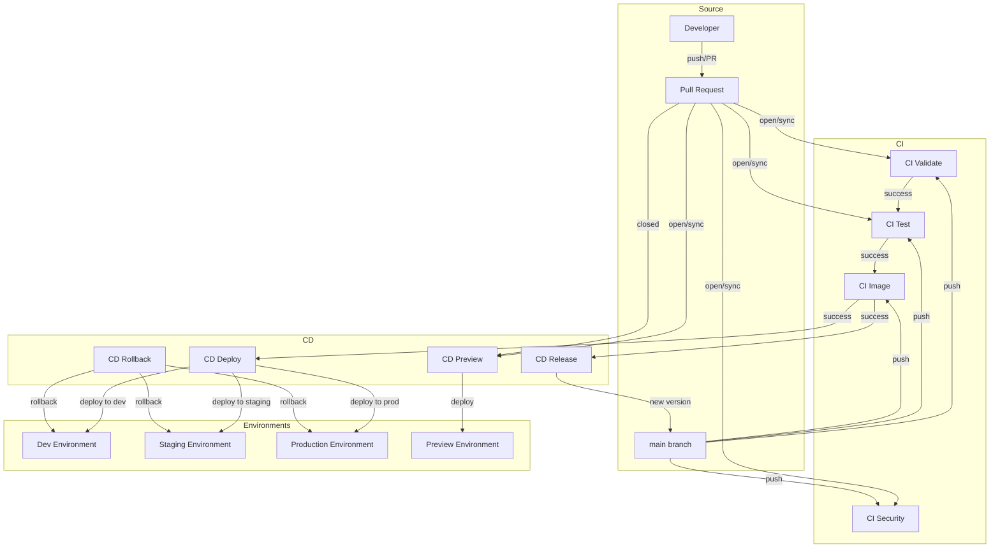

# CI/CD Architecture Diagram

```mermaid
graph TD
    subgraph Source
        DEV[Developer]
        PR[Pull Request]
        MAIN[main branch]
    end

    subgraph CI
        CI_VALIDATE[CI Validate]
        CI_TEST[CI Test]
        CI_IMAGE[CI Image]
        CI_SECURITY[CI Security]
    end

    subgraph CD
        CD_DEPLOY[CD Deploy]
        CD_PREVIEW[CD Preview]
        CD_ROLLBACK[CD Rollback]
        CD_RELEASE[CD Release]
    end

    subgraph Environments
        DEV_ENV[Dev Environment]
        STAGING_ENV[Staging Environment]
        PROD_ENV[Production Environment]
        PREVIEW_ENV[Preview Environment]
    end

    DEV -- push/PR --> PR
    PR -- open/sync --> CI_VALIDATE
    PR -- open/sync --> CI_TEST
    PR -- open/sync --> CI_SECURITY

    CI_VALIDATE -- success --> CI_TEST
    CI_TEST -- success --> CI_IMAGE
    CI_IMAGE -- success --> CD_DEPLOY
    CI_IMAGE -- success --> CD_RELEASE

    CD_DEPLOY -- deploy to dev --> DEV_ENV
    CD_DEPLOY -- deploy to staging --> STAGING_ENV
    CD_DEPLOY -- deploy to prod --> PROD_ENV

    PR -- open/sync --> CD_PREVIEW
    CD_PREVIEW -- deploy --> PREVIEW_ENV
    PR -- closed --> CD_PREVIEW

    CD_ROLLBACK -- rollback --> DEV_ENV
    CD_ROLLBACK -- rollback --> STAGING_ENV
    CD_ROLLBACK -- rollback --> PROD_ENV

    MAIN -- push --> CI_VALIDATE
    MAIN -- push --> CI_TEST
    MAIN -- push --> CI_IMAGE
    MAIN -- push --> CI_SECURITY

    CD_RELEASE -- new version --> MAIN

```
