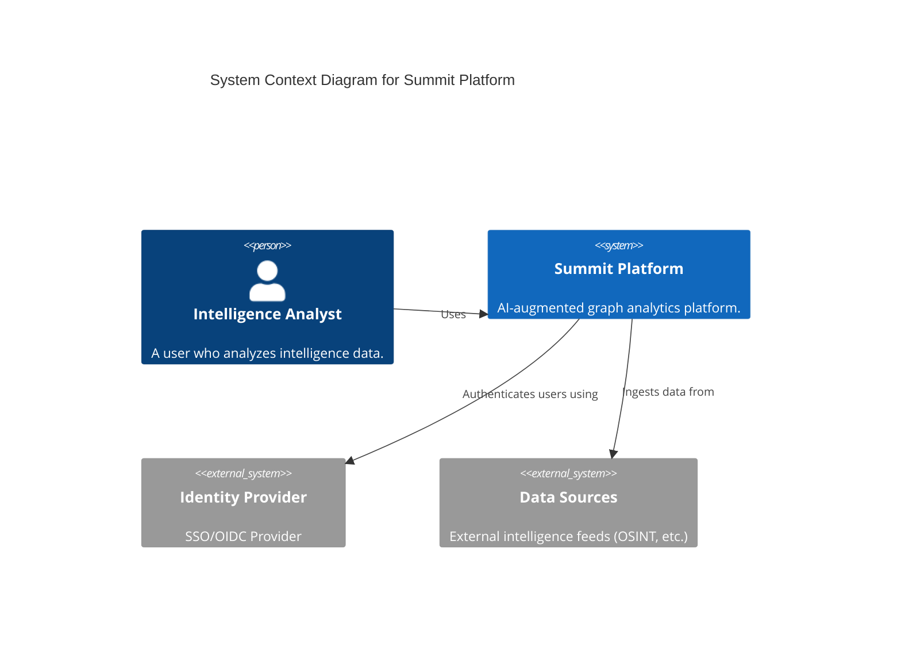
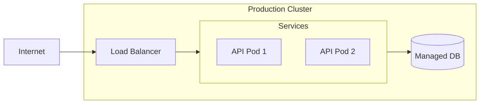

# Architecture Diagrams

This section contains C4 model diagrams and other architectural views of the Summit platform.

## Context Diagram (C4)



## Container Diagram (Simplified)

```mermaid
graph TD
    Client[Web Client (React)] -->|GraphQL| API[API Gateway (Node.js)]
    API -->|Auth| OPA[OPA Policy Engine]
    API -->|Read/Write| Neo4j[(Neo4j Graph DB)]
    API -->|Read/Write| Postgres[(PostgreSQL DB)]
    API -->|Job Queue| Redis[(Redis)]
    Redis --> Worker[Background Worker]
    Worker -->|Ingest| Neo4j
```

## Deployment View


