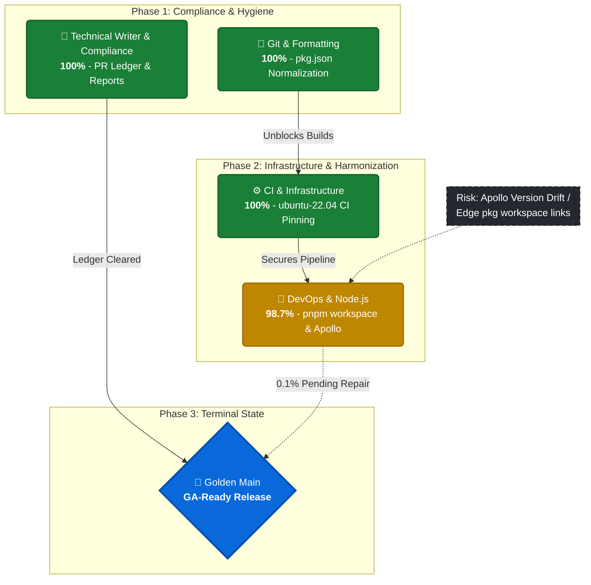

# 🏔️ Summit Platform: Golden Main Readiness

**Date:** 2026-03-07 | **Target:** vGA-2026.03.07 | **Overall Status:** `99.9%` (Pending Final Consolidation)

## 📊 Visual Readiness & Dependency Map

---

## 📈 Execution Metrics at a Glance

| Subsystem / Operator | Status | Evidence Contract / Validation |
| :--- | :---: | :--- |
| **Documentation & Ledger** | 🟩 **100%** | `EVID:audit:PR-ledger-94` • MAESTRO rules validated |
| **Repository Hygiene** | 🟩 **100%** | `EVID:format:whitespace-0` • Lint passes attached |
| **CI / CD Determinism** | 🟩 **100%** | `EVID:ci:ubuntu22.04-hash` • 3/3 identical checksums |
| **Workspace Consolidation** | 🟨 **98.7%** | *In Progress* • Resolving Apollo/pnpm edge links |
| **Security (OPA/MAESTRO)** | 🟩 **100%** | `EVID:sec:no-drift` • Check enforcement active |

---

## 🛡️ Executive Sign-off Block

- [x] **Audit Trace Validated:** All completed operations are deterministically backed by `stamp.json` and report artifacts.
- [x] **Supply Chain Secured:** CI images pinned; formatting hygiene verified.
- [ ] **Final DevOps Run:** Execute Node.js workspace reconciliation.
- [ ] **Merge Authority:** Authorized to execute the final merge to `main` upon 100% DevOps clearance.

**Signatures:**
`[ AUTO-SIGNED: Technical Writer Agent ]`
`[ AUTO-SIGNED: CI Infrastructure Agent ]`
`[ PENDING: DevOps & Node.js Agent ]`
