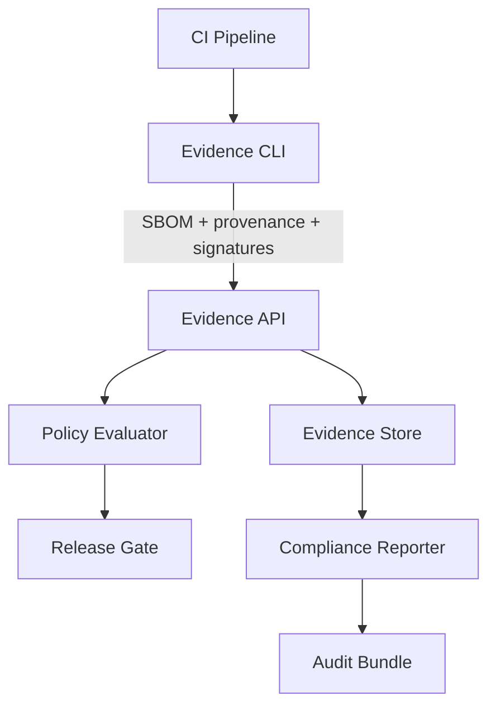

# Evidence-Gated Supply Chain Releases

## Summit Readiness Assertion
Refer to `docs/SUMMIT_READINESS_ASSERTION.md` as the governing readiness baseline for this design.

## Component Diagram



## Data Flows

1. CI uses the Evidence CLI to collect SBOMs, provenance, test reports, and signatures.
2. Evidence CLI uploads a content-addressed bundle to the Evidence API with a deterministic
   Evidence ID.
3. Evidence API validates schemas, enforces tenant isolation, and persists blobs + metadata.
4. Policy Evaluator executes deterministic policies against the bundle and emits a decision.
5. Release Gate requires a passing decision plus integrity verification.
6. Compliance Reporter materializes audit bundles mapped to SSDF controls.

## Repository Layout & Boundaries

- `cmd/summit-evidence/` — Evidence CLI (collect, sign, verify-local, upload).
- `services/evidence-api/` — Ingestion and query API, tenant authZ, schema validation.
- `services/policy-evaluator/` — Policy evaluation runtime (rego or policy WASM).
- `pkg/evidence/` — Canonicalization, schema types, stamp, evidence ID.
- `policies/` — Policy bundles and contracts.

## API Contracts (OpenAPI-style)

### Ingest Bundle

`POST /v1/tenants/{tenantId}/evidence/bundles`

Request body (JSON):

```json
{
  "evidenceId": "EVID-SC-<artifact_digest>-<policy_bundle_digest>",
  "subject": {
    "digest": "sha256:<artifact_digest>",
    "type": "oci-image",
    "name": "registry.example.com/app"
  },
  "artifacts": [
    {
      "type": "sbom",
      "format": "spdx-2.3",
      "uri": "blob://<sha256>"
    },
    {
      "type": "sbom",
      "format": "cyclonedx-1.7",
      "uri": "blob://<sha256>"
    },
    {
      "type": "provenance",
      "format": "in-toto",
      "predicateType": "https://slsa.dev/provenance/v1",
      "uri": "blob://<sha256>"
    }
  ],
  "signatures": [
    {
      "type": "cosign",
      "uri": "blob://<sha256>"
    }
  ],
  "metadata": {
    "policyBundleDigest": "sha256:<policy_bundle_digest>",
    "buildId": "<ci-build-id>",
    "createdAt": "<rfc3339>"
  }
}
```

Response:

```json
{
  "evidenceId": "EVID-SC-<artifact_digest>-<policy_bundle_digest>",
  "status": "accepted",
  "policyDecision": "allow",
  "reportUri": "blob://<sha256>"
}
```

### Query Bundle

`GET /v1/tenants/{tenantId}/evidence/bundles/{evidenceId}`

Response:

```json
{
  "evidenceId": "EVID-SC-<artifact_digest>-<policy_bundle_digest>",
  "subject": {
    "digest": "sha256:<artifact_digest>",
    "type": "oci-image",
    "name": "registry.example.com/app"
  },
  "artifacts": [
    {
      "type": "sbom",
      "format": "spdx-2.3",
      "uri": "blob://<sha256>"
    }
  ],
  "policyDecision": "allow",
  "reportUri": "blob://<sha256>"
}
```

## Determinism Contract

- Canonical JSON serialization: UTF-8, newline normalization, sorted keys, stable float encoding.
- Evidence ID scheme: `EVID-SC-{artifact_digest}-{policy_bundle_digest}`.
- Policy bundle digest computed from a canonical tar of policy files in lexical order.
- Evidence outputs: `stamp.json`, `metrics.json`, `report.json` are deterministic for identical
  inputs.
- Offline verification: timestamps may exist but are not required for pass/fail evaluation.

## MAESTRO Alignment

- **MAESTRO Layers**: Foundation, Data, Tools, Infra, Observability, Security.
- **Threats Considered**: artifact substitution, provenance forgery, cross-tenant replay,
  key compromise, policy downgrade, evidence leakage.
- **Mitigations**: content-addressed storage, signer-builder allowlists, tenant scoping,
  policy digest pinning, immutable audit logs, redaction profiles.
